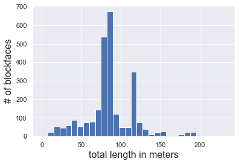
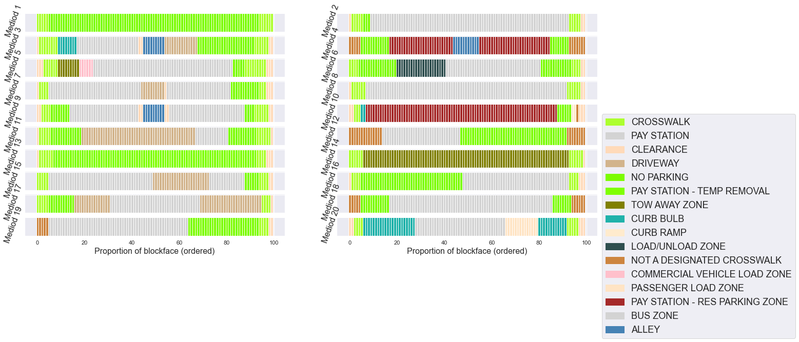
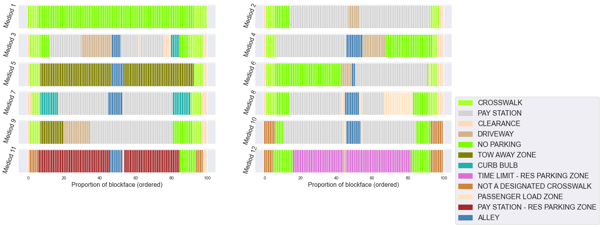
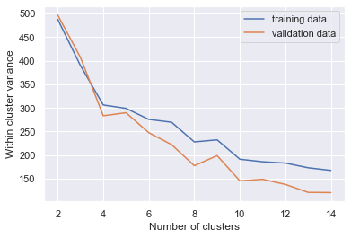
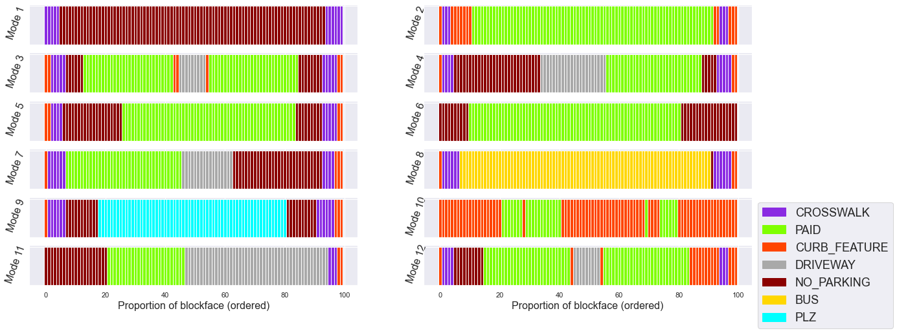
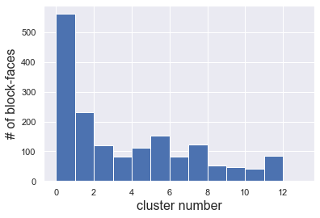

Chase P. Dowling

November 2021

Pacific Northwest National Laboratory

chase.dowling@pnnl.gov

## An Empirical Taxonomy of Common Curb Zoning Configurations in Seattle

This notebook contains relevant data and methods to reproduce results found in Dowling, Maxer, and Ranjbari (2022) "An Empirical Taxonomy of Common Curb Zoning Configurations in Seattle", computing an empirically representative set of curb configurations in Seattle, Washington, USA, using an unsupervised clustering methodology and high spatial resolution curb configuration data.


```python
#Uncomment to have cells fill entire width of the browser
#from IPython.display import display, HTML

#display(HTML(data="""
#<style>
#    div#notebook-container    { width: 95%; }
#    div#menubar-container     { width: 65%; }
#    div#maintoolbar-container { width: 99%; }
#</style>
#"""))

#Tells Jupyter to reload custom classes from scratch everytime an import cell is run, if you edit a custom class
#between imports Jupyter would otherwise need to be restarted completely. Buyer beware: old class objects in the 
#current namespace will cause errors at execution
%load_ext autoreload
%autoreload 2

#conda environment name curb_cluster
#run conda activate curb_cluster

import random
import os
import pickle
import pandas as pd
import geopandas as gpd
import numpy as np
import shapely.geometry
import matplotlib.pyplot as plt
import matplotlib.colors as mcolors
import plotly.express as px
import plotly.graph_objects as go
import sys
import utils

#after cloning repo and activating curb_cluster conda environment, call: pip install kmodes from within the repo directory, pip will automatically install the kmodes submodule in the directory (not on pypi) into the active environment
from kmodes.kmodes import KModes #Devos (2015) https://github.com/nicodv/kmodes
from kmodes.util import dissim

#switches matplotlib to show plots in the browser rather than opening a new window
%matplotlib inline

import seaborn
seaborn.set()
```

    The autoreload extension is already loaded. To reload it, use:
      %reload_ext autoreload
    

### Data Preprocessing

Here we load the data on curb zoning in Seattle for 2019. Data is available for download and described [here](https://data-seattlecitygis.opendata.arcgis.com/datasets/SeattleCityGIS::paid-area-curbspaces/about).
This data is used to populate a map of curb space use in Seattle, for reference purposes, closures, etc, viewable in map form [here](https://seattlecitygis.maps.arcgis.com/apps/MapSeries/index.html?appid=ec2bf6796118412982072feb28d35277). Also load a specially curated GIS dataset of every blockface in Seattle that lists blockface latitude and longitude locations by neighborhood, as well as names of the roads adjacent to the blockface. We use this data, available [here](https://data-seattlecitygis.opendata.arcgis.com/datasets/SeattleCityGIS::blockface/about) to seperate out only blockfaces in the core downtown for clustering experiments in the more densely populated portions of Seattle, as well as to toss out unwanted curb data on Interstate 5 and 90, and State Route 99. Please note the relevant length data is published in Imperial units of feet.


```python
#zoning data
zoning_data = pd.read_csv("data/Curbspaces_2019.csv")

#GIS data: coordinates, name of adjacent roadway
#with open("data/Blockface.geojson") as d:
#    loc_data = json.load(d)
loc_data = gpd.read_file("data/Blockface.geojson")
```


```python
space_types = list(zoning_data.SPACETYPEDESC.unique()) #get all space types
space_types.append("MISSING") #turns out there are segments where the label is missing so we add a placeholder

print("Curb zoning types used in Seattle:")
for item in space_types: print("\t" + item)
```

    Curb zoning types used in Seattle:
    	CROSSWALK
    	PAY STATION
    	CLEARANCE
    	DRIVEWAY
    	NO PARKING
    	PAY STATION - TEMP REMOVAL
    	TOW AWAY ZONE
    	CURB BULB
    	CURB RAMP
    	HYDRANT
    	SHUTTLE BUS ONLY
    	LOAD/UNLOAD ZONE
    	TIME LIMIT - RES PARKING ZONE
    	UNRESTRICTED
    	BARRIER AREA
    	NOT A DESIGNATED CROSSWALK
    	COMMERCIAL VEHICLE LOAD ZONE
    	PASSENGER LOAD ZONE
    	TIME LIMIT
    	PAY STATION - TAXI
    	BUS ZONE
    	PAY STATION - CVLZ
    	PAY STATION - BUS LAYOVER
    	ALLEY
    	DISABLED ZONE
    	PAY STATION - LOAD/UNLOAD ZONE
    	CVLZ - PLZ
    	PAY STATION - PLZ
    	BIKE ZONE
    	PAY STATION - MOTORCYCLE
    	PAY STATION - VENDOR
    	PAY STATION - BUS ZONE
    	PAY STATION - SHUTTLE BUS ONLY
    	LAW ENFORCEMENT VEHICLES ONLY
    	SEATTLE FIRE DEPT ZONE
    	TIME LIMIT - PLZ
    	PAY STATION - LEVO
    	PARKLET
    	CHARTER BUS ZONE
    	TIME LIMIT - LOAD/UNLOAD ZONE
    	CARSHARE/FLEXCAR
    	OTHER SPACE TYPE - YES PARKING
    	PAY STATION - SCHOOL
    	TRUCK LOAD/UNLOAD ZONE
    	BUS LAYOVER ZONE
    	CVLZ - TRUCK LOAD ONLY
    	TAXI ZONE
    	PAY STATION - DISABLED
    	OTHER SPACE TYPE - NO PARKING
    	CVLZ - BUS ZONE
    	PAY STATION - RES PARKING ZONE
    	PAY STATION - CARPOOL
    	PASSENGER LOAD ZONE - VENDING ZONE
    	CONSULATE ZONE
    	CVLZ - SIGN ONLY
    	TIME LIMIT - BUS LAYOVER
    	TIME LIMIT - PEAK PM
    	PAY STATION - TRUCK L/U ZONE
    	TIME LIMIT - TRUCK L/U ZONE
    	CARPOOL PARKING - FULL TIME
    	MISSING
    


```python
#map all unique space types to an integer for reference
j = 0
integer_mapping = {}
space_type_mapping = {}
for space_type in space_types:
    integer_mapping[space_type] = j
    space_type_mapping[j] = space_type
    j += 1

#ad hoc mapping of space types to a color for later plotting
max_j = np.max(list(integer_mapping.values()))
space_integer_color_map = {}
colors_ordered = list(mcolors.CSS4_COLORS.keys())
random.shuffle(colors_ordered)

for i in range(max_j+1):
    space_integer_color_map[i] = colors_ordered[i]
space_integer_color_map[max_j] = 'black' #manually map the "MISSING" label to black
```


```python
#Here we condense zone types to categories of related use. This is highly specific to the labels available in Seattle

condensed_space_types_map = {}
for item in ["CLEARANCE", "CURB BULB", "CURB RAMP", "BARRIER AREA", "PARKLET"]:
    condensed_space_types_map[item] = "CURB_FEATURE"
for item in ["DRIVEWAY", "ALLEY"]:
    condensed_space_types_map[item] = "DRIVEWAY"
for item in ["PAY STATION", "PAY STATION - TEMP REMOVAL", "PAY STATION - LOAD/UNLOAD ZONE", "PAY STATION - TAXI", "PAY STATION - CVLZ", "PAY STATION - BUS LAYOVER", "PAY STATION - PLZ", "PAY STATION - MOTORCYCLE", 
          "PAY STATION - VENDOR", "PAY STATION - BUS ZONE", "PAY STATION - SHUTTLE BUS ONLY", "PAY STATION - LEVO", "PAY STATION - SCHOOL", "PAY STATION - CARPOOL", "PAY STATION - TRUCK L/U ZONE", "PAY STATION - RES PARKING ZONE"]:
    condensed_space_types_map[item] = "PAID"
for item in ["NO PARKING", "TOW AWAY ZONE", "OTHER SPACE TYPE - NO PARKING", "NOT A DESIGNATED CROSSWALK"]:
    condensed_space_types_map[item] = "NO_PARKING"
for item in ["PAY STATION - DISABLED", "DISABLED ZONE"]:
    condensed_space_types_map[item] = "DISABLED"
for item in ["LOAD/UNLOAD ZONE", "COMMERCIAL VEHICLE LOAD ZONE", "CVLZ - PLZ", "CVLZ - TRUCK LOAD ONLY", "CVLZ - BUS ZONE", "CVLZ - SIGN ONLY", "TRUCK LOAD/UNLOAD ZONE"]:
    condensed_space_types_map[item] = "CVLZ"
for item in ["PASSENGER LOAD ZONE", "PASSENGER LOAD ZONE - VENDING ZONE", "TAXI ZONE", "CARSHARE/FLEXCAR"]:
    condensed_space_types_map[item] = "PLZ"
for item in ["SHUTTLE BUS ONLY", "BUS ZONE", "CHARTER BUS ZONE", "BUS LAYOVER ZONE"]:
    condensed_space_types_map[item] = "BUS"
for item in ["HYDRANT", "LAW ENFORCEMENT VEHICLES ONLY", "SEATTLE FIRE DEPT ZONE"]:
    condensed_space_types_map[item] = "EMERGENCY"
for item in ["TIME LIMIT - RES PARKING ZONE", "TIME LIMIT", "TIME LIMIT - PLZ", "TIME LIMIT - LOAD/UNLOAD ZONE", "TIME LIMIT - BUS LAYOVER", "TIME LIMIT - PEAK PM", "TIME LIMIT - TRUCK L/U ZONE"]:
    condensed_space_types_map[item] = "DYNAMIC/FREE"
for item in ["UNRESTRICTED", "OTHER SPACE TYPE - YES PARKING"]:
    condensed_space_types_map[item] = "UNRESTRICTED"

#map condensed types to integers
j = 0
condensed_integer_mapping = {}
for space_type in space_types:
    if space_type in condensed_space_types_map.keys():
        space_type_condensed = condensed_space_types_map[space_type]
    else:
        space_type_condensed = space_type
    if space_type_condensed not in condensed_integer_mapping.keys():
        condensed_integer_mapping[space_type_condensed] = j
        j += 1
    else:
        pass

print("These are the condensed curb zoning types")
for item in condensed_integer_mapping.keys():
    print("\t" + item)
    
#map each zoning type to a color for later plotting

condensed_color_map = {'BUS': "#FFD700",
             'MISSING': "#000000", #black
             'BIKE ZONE': "#FF7F50",
             'CROSSWALK': "#8A2BE2",
             'CURB_FEATURE': "#FF4500", #brown
             'DRIVEWAY': "#A9A9A9", #gray
             'NO_PARKING': "#8B0000", #dark red
             'EMERGENCY': "#DC143C", #light red
             'CVLZ': "#1E90FF", #light blue
             'DYNAMIC/FREE': "#006400", #dark green
             'PAID': "#7FFF00", #chartreuse
             'UNRESTRICTED': "#DEB887", #light brown
             'PLZ': "#00FFFF",
             'DISABLED': "#FFFAF0", #white
             'CONSULATE ZONE': "#FF00FF", #fuschia
             'CARPOOL PARKING - FULL TIME': "#FFE4E1"} #pink
                       
condensed_space_integer_color_map = {}
for label in condensed_color_map.keys():
    condensed_space_integer_color_map[condensed_integer_mapping[label]] = condensed_color_map[label]
                       
#for plotting later, makes the legend easier
condensed_integer_to_space_type = {}
for space_type in condensed_integer_mapping.keys():
    condensed_integer_to_space_type[condensed_integer_mapping[space_type]] = space_type
```

    These are the condensed curb zoning types
    	CROSSWALK
    	PAID
    	CURB_FEATURE
    	DRIVEWAY
    	NO_PARKING
    	EMERGENCY
    	BUS
    	CVLZ
    	DYNAMIC/FREE
    	UNRESTRICTED
    	PLZ
    	DISABLED
    	BIKE ZONE
    	CONSULATE ZONE
    	CARPOOL PARKING - FULL TIME
    	MISSING
    


```python
#check all blockface sortings by BLOCK_ST and 
#BLOCK_END if there are multiple dates accounted for in data

#If distance measurements for a zoning are repeated or misaligned we toss that blockface for the purpose of this analysis

#get all elementkeys (unique integer ID's of all blockfaces in Seattle)
ekeys = zoning_data.ELMNTKEY.unique()

bad_keys = set()
for ekey in ekeys:
    block_data = zoning_data.loc[ zoning_data['ELMNTKEY'] == ekey ]
    
    block_st = block_data.BLOCK_ST.values
    block_st_set = list(block_data.BLOCK_ST.unique())
    diff = len(block_st) - len(block_st_set)
    if diff != 0:
        bad_keys.add(ekey)
    
    block_end = block_data.BLOCK_END.values
    block_end_set = list(block_data.BLOCK_END.unique())
    diff = len(block_end) - len(block_end_set)
    if diff != 0:
        bad_keys.add(ekey)
bad_keys = list(bad_keys)

print("Misaligned blockfaces that are being tossed out")
print(bad_keys)
print(np.around((len(bad_keys)/len(ekeys))*100, 2), "% of", len(ekeys), "blockfaces total")

#performing this seperately, tossing out state route and interstate blockface data, highway_keys and bad_keys may overlap
highway_keys = set()
highways = ["I90", "I5", "SR99"]

for ekey in ekeys:
    geo_block_data = loc_data.loc[ loc_data['ELMNTKEY'] == ekey ]
    try: #some descriptions are empty
        desc = geo_block_data["UNITDESC"].iloc[0]
        if any([ highway in desc for highway in highways ]):
            highway_keys.add(ekey)
    except:
        pass
        
print("Highway blockfaces being tossed out")
print(np.around((len(highway_keys)/len(ekeys))*100, 2), "% of", len(ekeys), "blockfaces total")
```

    Misaligned blockfaces that are being tossed out
    [31490, 9465, 77318, 57861, 78853, 36105, 54541, 32910, 36493, 57901, 37433, 32469, 1589, 56085, 57269, 77369, 56318, 36126]
    0.67 % of 2697 blockfaces total
    Highway blockfaces being tossed out
    0.22 % of 2697 blockfaces total
    


```python
#Blockface lengths and constituent zones are measured to within a tenth of a foot
#Here we bin blockfaces by length, increments of 25 feet, for the purpose of clustering blockfaces of similar length
lengths = []
length_bins = [ [] for i in range(int(2000/25)) ]

for ekey in ekeys:
    if ekey in bad_keys or ekey in highway_keys:
        pass
    else:
        block_data = zoning_data.loc[zoning_data['ELMNTKEY'] == ekey]
        block_length = block_data.SHAPE_Length.sum()
        lengths.append(block_length)
        length_bin_i = int(block_length/25)
        length_bins[length_bin_i].append(ekey)
        
plt.hist(0.30*np.asarray(lengths), bins=0.30*np.arange(0,800,25))
plt.xlabel("total length in meters", fontsize=16)
plt.ylabel("# of blockfaces", fontsize=16)
plt.show()

#For reference, the largest bins are:
#676 blockfaces in [275,300) ekeys in index 11 of length_bins
#539 blockfaces in [250,275) index 10
#348 blockfaces in [375,400) index 15
```


    

    


```python
#here we compute all the length normalized blockface label sequences for every blockface elementkey, and each subsequent experiment draws on this list for various subsets of elementkeys (e.g. downtown core only, similar block lengths only)

block_allocs_norm_length = {} #will map blockface ekey to length normalized zoning of blockface
block_allocs_norm_length_condensed = {} #will map blockface ekey to length normalized condensed zoning of blockface

label_increment = 0.4 #for generating blockface label vectors that depend on the length of the blockface #0.49 is minimum positive difference between labels
normed_vector_length = 100 #for generating blockface label vectors of all equal total length
max_block_len = 0

#for element key, get all rows
for ekey in ekeys:
    if ekey in bad_keys or ekey in highway_keys:
        pass
    else:
        block_data = zoning_data.loc[zoning_data['ELMNTKEY'] == ekey]

        #need to sort sequence of BLOCK_ST to BLOCK_END
        block_data = block_data.sort_values('BLOCK_ST')
        block_st = np.min(block_data.BLOCK_ST.values) #numercial start of all zonings on block
        block_end = np.max(block_data.BLOCK_END.values) #numercial end of all zonings on block
        total_len = block_end - block_st

        #populate vector of normalized length with labels
        length_normal_label_vector = [ "" for i in range(normed_vector_length) ] #label vector thats normalized to the same length for all blockfaces
        condensed_length_normal_label_vector = [ "" for i in range(normed_vector_length) ]

        #iterate through zonings for current blockface
        for index, row in block_data.iterrows():
            curr_zone = integer_mapping[row['SPACETYPEDESC']] #get integer label
            try:
                condensed_curr_zone = condensed_integer_mapping[condensed_space_types_map[row['SPACETYPEDESC']]] #get condensed integer label
            except:
                condensed_curr_zone = condensed_integer_mapping[row['SPACETYPEDESC']]
            b_seg_st = row['BLOCK_ST'] #get the numercial start of current zoning
            b_seg_end = row['BLOCK_END'] #get the numerical end of current zoning

            #normalize and get normed_length_vector_length dependent indecies
            norm_seg_st = (b_seg_st - block_st)/(total_len) #get 0-1 position of current zoning start on current block
            norm_seg_end = (b_seg_end - block_st)/(total_len) #get 0-1 position of current zoning end on current block
            st_ind = int(norm_seg_st*normed_vector_length) #recall int() is natively a floor function, so no overlaps
            end_ind = int(norm_seg_end*normed_vector_length)
            for i in range(st_ind, end_ind+1):
                if i == normed_vector_length:
                    pass
                else:
                    length_normal_label_vector[i] = curr_zone
                    condensed_length_normal_label_vector[i] = condensed_curr_zone

        #update block zonings            
        for j, item in enumerate(length_normal_label_vector):
            if item == "":
                length_normal_label_vector[j] = integer_mapping["MISSING"]
                condensed_length_normal_label_vector[j] = condensed_integer_mapping["MISSING"]
        block_allocs_norm_length[ekey] = length_normal_label_vector
        block_allocs_norm_length_condensed[ekey] = condensed_length_normal_label_vector
```


```python
#print an example input sample

example_block = block_allocs_norm_length[ekeys[0]]
labeled_vector = [ space_types[i] for i in example_block ]
print(labeled_vector)
print("\n")

#recall, this vector represents an order-preserving sequence of curb zones. Each element is 0.1% of the total curb length. The first 15 labels are "CLEARANCE", meaning that 1.5% of the total blockface length at one
#end of the curb is dedicated to "CLEARANCE" zoning. This is approximately 4 feet

block_data = zoning_data.loc[zoning_data['ELMNTKEY'] == ekeys[0]]
block_length = block_data.SHAPE_Length.sum()
print("True length of \"clearance\" zoning at beginning of this example input:")
print(0.015*block_length, " feet")
```

    ['CLEARANCE', 'CROSSWALK', 'CROSSWALK', 'CROSSWALK', 'CROSSWALK', 'TOW AWAY ZONE', 'TOW AWAY ZONE', 'TOW AWAY ZONE', 'TOW AWAY ZONE', 'TOW AWAY ZONE', 'TOW AWAY ZONE', 'TOW AWAY ZONE', 'TOW AWAY ZONE', 'TOW AWAY ZONE', 'TOW AWAY ZONE', 'TOW AWAY ZONE', 'TOW AWAY ZONE', 'TOW AWAY ZONE', 'TOW AWAY ZONE', 'PASSENGER LOAD ZONE', 'PASSENGER LOAD ZONE', 'PASSENGER LOAD ZONE', 'PASSENGER LOAD ZONE', 'PASSENGER LOAD ZONE', 'PASSENGER LOAD ZONE', 'PASSENGER LOAD ZONE', 'PASSENGER LOAD ZONE', 'PASSENGER LOAD ZONE', 'PASSENGER LOAD ZONE', 'PASSENGER LOAD ZONE', 'PASSENGER LOAD ZONE', 'PASSENGER LOAD ZONE', 'PASSENGER LOAD ZONE', 'PASSENGER LOAD ZONE', 'PASSENGER LOAD ZONE', 'TOW AWAY ZONE', 'TOW AWAY ZONE', 'TOW AWAY ZONE', 'TOW AWAY ZONE', 'TOW AWAY ZONE', 'TOW AWAY ZONE', 'TOW AWAY ZONE', 'NO PARKING', 'NO PARKING', 'NO PARKING', 'NO PARKING', 'NO PARKING', 'NO PARKING', 'NO PARKING', 'NO PARKING', 'NO PARKING', 'NO PARKING', 'NO PARKING', 'NO PARKING', 'NO PARKING', 'NO PARKING', 'NO PARKING', 'NO PARKING', 'NO PARKING', 'NO PARKING', 'NO PARKING', 'NO PARKING', 'NO PARKING', 'NO PARKING', 'NO PARKING', 'NO PARKING', 'NO PARKING', 'NO PARKING', 'NO PARKING', 'NO PARKING', 'NO PARKING', 'NO PARKING', 'NO PARKING', 'NO PARKING', 'NO PARKING', 'NO PARKING', 'NO PARKING', 'NO PARKING', 'NO PARKING', 'NO PARKING', 'NO PARKING', 'NO PARKING', 'NO PARKING', 'NO PARKING', 'NO PARKING', 'NO PARKING', 'NO PARKING', 'NO PARKING', 'NO PARKING', 'NO PARKING', 'NO PARKING', 'NO PARKING', 'NO PARKING', 'NO PARKING', 'CROSSWALK', 'CROSSWALK', 'CROSSWALK', 'CROSSWALK', 'CROSSWALK', 'CLEARANCE']
    
    
    True length of "clearance" zoning at beginning of this example input:
    3.97411164465601  feet
    

## Analysis

### Clustering all blockfaces regardless of location and true length, full label set


```python
# setting this ensures reported results can be reproduced exactly, comment out this line for new analyses
np.random.seed(123123)
```


```python
#Using basic matching dissimliarty in kmodes.dissim takes some time to compute on a laptop
#The full clustering routine is included here for convenience but is called from utils.py for subsequent experiments

#cluster normalized length vectors
#stack samples into train and validation data sets
all_data = []
for ekey in block_allocs_norm_length.keys():
    all_data.append(block_allocs_norm_length[ekey])
all_data = np.asarray(all_data)
print(all_data.shape[0], " total samples")

val_inds = np.random.choice(all_data.shape[0], size=int(0.1*all_data.shape[0]), replace=False) #hold out 10% of the data for cross validation
train_inds = np.asarray([i for i in range(all_data.shape[0]) if i not in val_inds]) #use the rest for training

train_data = all_data[train_inds,:]
val_data = all_data[val_inds,:]

models = []
counter = 0
k_max = 35 #here we look at clustering results for k = 2 through k_max to decide on an optimal number k via held-out cross validation

for i in range(2,k_max):
    print("Training model for ", str(i), "clusters")
    
    #initialize and train the model
    km = KModes(n_clusters=i, init='Cao', n_init=5, verbose=0)
    clusters = km.fit_predict(train_data)
    models.append([km])
    
    #get the predicted clusters of the held out training and validation data
    val_assignments = np.asarray(km.predict(val_data))
    train_assignments = np.asarray(km.predict(train_data))
    
    val_var_dists = []
    train_var_dists = []
    for j in range(i):
        #inds = np.where(np.any(assignments==0, axis=0))
        val_inds = np.argwhere(val_assignments==j)[:,0]
        train_inds = np.argwhere(train_assignments==j)[:,0]

        #compute within cluster variance with dissim.matching_dissim for training and validation data, when validation data distance variance diverges as a function k, we know k is too large and the model has overfit
        centroid = km.cluster_centroids_[j]
        train_dist = dissim.matching_dissim(train_data[train_inds,:], centroid) #compute the distances of all the training samples
        train_var_dist = np.var(train_dist) #compute the variance of these distances
        train_var_dists.append(train_var_dist) #save with model
        
        val_dist = dissim.matching_dissim(val_data[val_inds,:], centroid) #compute the distances of all the validation samples
        val_var_dist = np.var(val_dist) #compute the variance of these distances
        val_var_dists.append(val_var_dist) #save with model
        
    models[counter].append(np.mean(train_var_dists))
    models[counter].append(np.mean(val_var_dists))
    
    counter+=1 #increment counter for saving models and validation score
    km = None #reset model variable
```

    2673  total samples
    Training model for  2 clusters
    Training model for  3 clusters
    Training model for  4 clusters
    Training model for  5 clusters
    Training model for  6 clusters
    Training model for  7 clusters
    Training model for  8 clusters
    Training model for  9 clusters
    Training model for  10 clusters
    Training model for  11 clusters
    Training model for  12 clusters
    Training model for  13 clusters
    Training model for  14 clusters
    Training model for  15 clusters
    Training model for  16 clusters
    Training model for  17 clusters
    Training model for  18 clusters
    Training model for  19 clusters
    Training model for  20 clusters
    Training model for  21 clusters
    Training model for  22 clusters
    Training model for  23 clusters
    Training model for  24 clusters
    Training model for  25 clusters
    Training model for  26 clusters
    

    C:\Users\dowl271\AppData\Local\Continuum\anaconda3\envs\curb_cluster\lib\site-packages\numpy\core\fromnumeric.py:3723: RuntimeWarning:
    
    Degrees of freedom <= 0 for slice
    
    C:\Users\dowl271\AppData\Local\Continuum\anaconda3\envs\curb_cluster\lib\site-packages\numpy\core\_methods.py:222: RuntimeWarning:
    
    invalid value encountered in true_divide
    
    C:\Users\dowl271\AppData\Local\Continuum\anaconda3\envs\curb_cluster\lib\site-packages\numpy\core\_methods.py:254: RuntimeWarning:
    
    invalid value encountered in double_scalars
    
    

    Training model for  27 clusters
    Training model for  28 clusters
    Training model for  29 clusters
    


```python
#save models, load models, for later analysis
#Here we're saving results from k's 2 to 34, for zoning increments of 1%

for i in range(k_max-2):
    if not os.path.exists("models/n_" + str(normed_vector_length) + "_all_blockfaces"):
        os.mkdir("models/n_" + str(normed_vector_length) + "_all_blockfaces")
    with open("models/n_" + str(normed_vector_length) + "_all_blockfaces/k_" + str(i+2) + "_n_" + str(normed_vector_length) + ".pck", 'wb') as d:
        pickle.dump(models[i], d)
```


```python
#plot validation within-cluster variance
train_variances = [i[1] for i in models ]
val_variances = [ i[2] for i in models ]

plt.plot(np.arange(2,k_max,1), train_variances, label="training data")
plt.plot(np.arange(2,k_max,1), val_variances, label="validation data")
plt.xlabel("Number of clusters")
plt.ylabel("Within cluster variance")
plt.legend()
plt.show()
```


```python
#To do: Assume block-faces are Poisson distributed across clusters, compute exponential fit (smaller parameter = fatter tail). This will tell us if we're identifying latent clusters as k increases
```


```python
#Roughly visualize all curb configurations (randomly chosen colors per plot---not optimal for visualization)

#need this to be subplot function, create legend for each subplot
#https://stackoverflow.com/questions/27016904/matplotlib-legends-in-subplot

#load a model, plot the centroids
k_star = 20
path = "models/n_" + str(normed_vector_length) + "_all_blockfaces/k_" + str(k_star) + "_n_" + str(normed_vector_length) + ".pck"
        
#plot the centroids
utils.plot_configs(path, space_integer_color_map, space_type_mapping)

```


    

    


### Clustering all blockfaces regardless of location and true length, condensed label set


```python
#Using basic matching dissimliarty in kmodes.dissim takes some time to compute on a laptop

#cluster normalized length vectors
#stack samples into train and validation data sets
k_max = 27
ekey_to_block_alloc = block_allocs_norm_length_condensed

models = utils.kmodes_clustering_loop_k(k_max, block_allocs_norm_length_condensed)
```


```python
#save models, load models, for later analysis
#Here we're saving results from k's 2 to 34, for zoning increments of 1%

for i in range(k_max-2):
    if not os.path.exists("models/n_" + str(normed_vector_length) + "_all_blockfaces_condensed_labels"):
        os.mkdir("models/n_" + str(normed_vector_length) + "_all_blockfaces_condensed_labels")
    with open("models/n_" + str(normed_vector_length) + "_all_blockfaces_condensed_labels/k_" + str(i+2) + "_n_" + str(normed_vector_length) + ".pck", 'wb') as d:
        pickle.dump(models[i], d)
```


```python
#plot validation within-cluster variance
train_variances = [i[1] for i in models ]
val_variances = [ i[2] for i in models ]

plt.plot(np.arange(2,k_max,1), train_variances, label="training data")
plt.plot(np.arange(2,k_max,1), val_variances, label="validation data")
plt.xlabel("Number of clusters")
plt.ylabel("Within cluster variance")
plt.legend()
plt.show()
```


```python
#need this to be subplot function, create legend for each subplot
#https://stackoverflow.com/questions/27016904/matplotlib-legends-in-subplot

#load a model, plot the centroids
k_star = 12
path = "models/n_" + str(normed_vector_length) + "_all_blockfaces_condensed_labels/k_" + str(k_star) + "_n_" + str(normed_vector_length) + ".pck"
        
#plot the centroids
utils.plot_configs(path, condensed_space_integer_color_map, condensed_integer_to_space_type)
```

#### Clustering blockfaces of similar true length


```python
ekeys_trunc = length_bins[11] #these blockfaces are all in the [275,300) foot length interval, the largest set of similarly lengthed blockfaces in the city
k_max = 27

models = utils.kmodes_clustering_loop_k(k_max, block_allocs_norm_length, ekeys=ekeys_trunc)
```


```python
#save models, load models, for later analysis
#Here we're saving results from k's 2 to 34, for zoning increments of 1%

for i in range(k_max-2):
    if not os.path.exists("models/n_" + str(normed_vector_length) + "_275ft_blockfaces"):
        os.mkdir("models/n_" + str(normed_vector_length) + "_275ft_blockfaces")
    with open("models/n_" + str(normed_vector_length) + "_275ft_blockfaces/k_" + str(i+2) + "_n_" + str(normed_vector_length) + ".pck", 'wb') as d:
        pickle.dump(models[i], d)
```


```python
#plot validation within-cluster variance
train_variances = [i[1] for i in models ]
val_variances = [ i[2] for i in models ]

plt.plot(np.arange(2,k_max,1), train_variances, label="training data")
plt.plot(np.arange(2,k_max,1), val_variances, label="validation data")
plt.xlabel("Number of clusters")
plt.ylabel("Within cluster variance")
plt.legend()
plt.show()
```


```python
#load a model, plot the centroids
k_star = 12
path = "models/n_" + str(normed_vector_length) + "_275ft_blockfaces/k_" + str(k_star) + "_n_" + str(normed_vector_length) + ".pck"
        
#plot the centroids
utils.plot_configs(path, space_integer_color_map, space_type_mapping)
```


    

    


#### Clustering blockfaces in the core downtown

Here we load a specially curated GIS dataset of every blockface in Seattle that lists blockface latitude and longitude locations by neighborhood. We use this data, available [here](https://data-seattlecitygis.opendata.arcgis.com/datasets/SeattleCityGIS::blockface/about) to seperate out only blockfaces in the Belltown, Financial District, International District (named Chinatown/ID), Commerical Core, Pioneer Square, Pike-Pine, South Lake Union, and Denny Triangle neighborhoods


```python
#find all blocks within 0.8 km (1/2 mile) of 47.609722, -122.333056
#can adjust to any blockface within some distance of blockfaces in PAIDAREA neighborhoods
downtown_blocks = set()
threshold = 0.015
center = (47.61484, -122.3353)

for index, row in loc_data.iterrows():
    feature = row['geometry']
    if isinstance(feature, shapely.geometry.linestring.LineString):
        linestrings = [feature]
    elif isinstance(feature, shapely.geometry.multilinestring.MultiLineString):
        linestrings = feature.geoms
    else:
        continue
    for linestring in linestrings:
        lons, lats = linestring.xy
        for pair in zip(lons, lats):
            delta = np.sqrt(np.power(pair[1]-center[0], 2) + np.power(pair[0] - center[1], 2))
            if delta < threshold and "I5" not in row["UNITDESC"] and "I90" not in row["UNITDESC"] and "SR99" not in row["UNITDESC"]:
                downtown_blocks.add(row['ELMNTKEY'])

downtown_blocks = list(downtown_blocks)
#not all blockfaces in geojson data appear in the zoning data, take set intersection
all_blocks = set(block_allocs_norm_length_condensed.keys())

downtown_ekeys = [ ekey for ekey in downtown_blocks if ekey in all_blocks ]
```


```python
#cluster downtown blocks
k_max = 15

models = utils.kmodes_clustering_loop_k(k_max, block_allocs_norm_length_condensed, ekeys=downtown_ekeys)
```

    1695  total samples
    Training model for  2 clusters
    Training model for  3 clusters
    Training model for  4 clusters
    Training model for  5 clusters
    Training model for  6 clusters
    Training model for  7 clusters
    Training model for  8 clusters
    Training model for  9 clusters
    Training model for  10 clusters
    Training model for  11 clusters
    Training model for  12 clusters
    Training model for  13 clusters
    Training model for  14 clusters
    


```python
#save models, load models, for later analysis
#Here we're saving results from k's 2 to 34, for zoning increments of 1%

for i in range(k_max-2):
    if not os.path.exists("models/n_" + str(normed_vector_length) + "_downtown_blockfaces_condensed_labels"):
        os.mkdir("models/n_" + str(normed_vector_length) + "_downtown_blockfaces_condensed_labels")
    with open("models/n_" + str(normed_vector_length) + "_downtown_blockfaces_condensed_labels/k_" + str(i+2) + "_n_" + str(normed_vector_length) + ".pck", 'wb') as d:
        pickle.dump(models[i], d)
```


```python
#plot validation within-cluster variance
train_variances = [i[1] for i in models ]
val_variances = [ i[2] for i in models ]

plt.plot(np.arange(2,k_max,1), train_variances, label="training data")
plt.plot(np.arange(2,k_max,1), val_variances, label="validation data")
plt.xlabel("Number of clusters")
plt.ylabel("Within cluster variance")
plt.legend()
plt.show()
```


    

    


```python
#load a model, plot the centroids
k_star = 12
path = "models/n_" + str(normed_vector_length) + "_downtown_blockfaces_condensed_labels/k_" + str(k_star) + "_n_" + str(normed_vector_length) + ".pck"
        
#plot the centroids
utils.plot_configs(path, condensed_space_integer_color_map, condensed_integer_to_space_type)
```


    

    


```python
#load model for predictions
with open(path, 'rb') as d:
    km = pickle.load(d)[0]

#get all the downtown blockface cluster predictions
downtown_data = []
ordered_ekeys = []
for ekey in downtown_ekeys:
    ordered_ekeys.append(ekey)
    downtown_data.append(block_allocs_norm_length_condensed[ekey])
downtown_data = np.asarray(downtown_data)
clusters = km.predict(downtown_data)

#generate a unique color for each of the k clusters
cluster_color_map = {}
colors_ordered = list(mcolors.CSS4_COLORS.keys())
random.shuffle(colors_ordered)

for i in range(k_star+3): #something going on with save
    cluster_color_map[i] = colors_ordered[i]
```


```python
#distribution of block-faces per cluster
plt.hist(clusters, bins=np.arange(0,14,1))
#plt.title("Cluster membership", fontsize=18)
plt.ylabel("# of block-faces", fontsize=16)
plt.xlabel("cluster number", fontsize=16)
plt.show()
```


    

    


```python
np.where(clusters == 10) #all the lusters labeled for busses
```


    (array([   1,   74,   89,  170,  182,  192,  228,  270,  315,  377,  481,
             482,  523,  533,  560,  606,  643,  693,  694,  709,  824,  825,
             848,  927,  979,  980, 1002, 1005, 1015, 1126, 1146, 1199, 1291,
            1332, 1337, 1376, 1394, 1395, 1426, 1538, 1539, 1591], dtype=int64),)


```python
#plot bus stop and PLZ cluster labels on map
downtown_df = loc_data.loc[loc_data['ELMNTKEY'].isin(downtown_blocks)]

first_bus_idx = 85

ekey = ordered_ekeys[first_bus_idx]
cluster = clusters[first_bus_idx]
color = cluster_color_map[cluster]
downtown_df_select = downtown_df.loc[downtown_df['ELMNTKEY'] == ekey]
feature = downtown_df_select.geometry
if isinstance(feature, shapely.geometry.linestring.LineString):
    linestrings = [feature]
elif isinstance(feature, shapely.geometry.multilinestring.MultiLineString):
    linestrings = feature.geoms
else:
    linestrings = feature
lats = []
lons = []
for linestring in linestrings:
    lons, lats = linestring.xy
    lats += lats
    lons += lons
names = [ekey]*len(lats)
#init_fig = px.line_mapbox(data_frame=downtown_df_select, lat=lats, lon=lons, hover_name=names, 
                          #color=colors, color_discrete_map="identity")
init_fig = go.Figure(go.Scattermapbox(mode="lines",lat=[ l for l in lats], lon=[l for l in lons], 
                                      marker = {'color': color, 'size': 10}))
init_fig.update_layout(showlegend=False)

for j in range(len(ordered_ekeys)):
    ekey = ordered_ekeys[j]
    cluster = clusters[j]
    #if cluster == 10 or cluster == 9: #use something like this to downselect zone type
    color = cluster_color_map[cluster]
    downtown_df_select = downtown_df.loc[downtown_df['ELMNTKEY'] == ekey]
    feature = downtown_df_select.geometry
    if isinstance(feature, shapely.geometry.linestring.LineString):
        linestrings = [feature]
    elif isinstance(feature, shapely.geometry.multilinestring.MultiLineString):
        linestrings = feature.geoms
    else:
        linestrings = feature
    lats = []
    lons = []
    for linestring in linestrings:
        lons, lats = linestring.xy
        lats += lats
        lons += lons
    names = [ekey]*len(lats)
    #new_fig = px.line_mapbox(data_frame=downtown_df_select, lat=lats, lon=lons, hover_name=names, 
                              #color=colors, color_discrete_map="identity")
    init_fig.add_trace(go.Scattermapbox(mode="lines", lat=[ l for l in lats], lon=[l for l in lons], 
                                        marker = {'color': color, 'size': 10}))

init_fig.update_geos(fitbounds="locations")
init_fig.update_layout(mapbox_style="carto-positron")
init_fig.show()
```


<div>                            <div id="c3318f06-d102-49fb-b10b-2fc4d3aa4c48" class="plotly-graph-div" style="height:525px; width:100%;"></div>            <script type="text/javascript">                require(["plotly"], function(Plotly) {                    window.PLOTLYENV=window.PLOTLYENV || {};                                    if (document.getElementById("c3318f06-d102-49fb-b10b-2fc4d3aa4c48")) {                    Plotly.newPlot(                        "c3318f06-d102-49fb-b10b-2fc4d3aa4c48",                        [{"lat":[47.599975612564975,47.59997269169281,47.599975612564975,47.59997269169281],"lon":[-122.33407984865079,-122.33167075147577,-122.33407984865079,-122.33167075147577],"marker":{"color":"darkgreen","size":10},"mode":"lines","type":"scattermapbox"},{"lat":[47.60166622134724,47.60092000615742,47.60166622134724,47.60092000615742],"lon":[-122.33296712906795,-122.33296980773319,-122.33296712906795,-122.33296980773319],"marker":{"color":"darkgreen","size":10},"mode":"lines","type":"scattermapbox"},{"lat":[47.601665914454074,47.600919700167886,47.601665914454074,47.600919700167886],"lon":[-122.33278067369677,-122.332783355061,-122.33278067369677,-122.332783355061],"marker":{"color":"mediumslateblue","size":10},"mode":"lines","type":"scattermapbox"},{"lat":[47.61227770880588,47.61269486893091,47.61227770880588,47.61269486893091],"lon":[-122.33852139851541,-122.33753058975107,-122.33852139851541,-122.33753058975107],"marker":{"color":"red","size":10},"mode":"lines","type":"scattermapbox"},{"lat":[47.61218829821877,47.61260545692133,47.61218829821877,47.61260545692133],"lon":[-122.3383579118833,-122.33736710351079,-122.3383579118833,-122.33736710351079],"marker":{"color":"lightslategrey","size":10},"mode":"lines","type":"scattermapbox"},{"lat":[47.614167472499034,47.614564419426834,47.614167472499034,47.614564419426834],"lon":[-122.33399592335917,-122.33304702923648,-122.33399592335917,-122.33304702923648],"marker":{"color":"darkorchid","size":10},"mode":"lines","type":"scattermapbox"},{"lat":[47.61403344608073,47.61445484325554,47.61403344608073,47.61445484325554],"lon":[-122.33395411433597,-122.33294677637777,-122.33395411433597,-122.33294677637777],"marker":{"color":"darkorchid","size":10},"mode":"lines","type":"scattermapbox"},{"lat":[47.61553616129865,47.61593402478221,47.61553616129865,47.61593402478221],"lon":[-122.3306848614542,-122.32973348557738,-122.3306848614542,-122.32973348557738],"marker":{"color":"darkorchid","size":10},"mode":"lines","type":"scattermapbox"},{"lat":[47.61543768405729,47.615835546868475,47.61543768405729,47.615835546868475],"lon":[-122.33060431447326,-122.32965293978103,-122.33060431447326,-122.32965293978103],"marker":{"color":"darkgreen","size":10},"mode":"lines","type":"scattermapbox"},{"lat":[47.61601783593063,47.6164149130069,47.61601783593063,47.6164149130069],"lon":[-122.32961791718341,-122.32866914298705,-122.32961791718341,-122.32866914298705],"marker":{"color":"darkorchid","size":10},"mode":"lines","type":"scattermapbox"},{"lat":[47.61588825039269,47.61628532728989,47.61588825039269,47.61628532728989],"lon":[-122.3295962851067,-122.32864751310814,-122.3295962851067,-122.32864751310814],"marker":{"color":"darkorchid","size":10},"mode":"lines","type":"scattermapbox"},{"lat":[47.60541014539408,47.60607201918845,47.60541014539408,47.60607201918845],"lon":[-122.32755718420967,-122.32816282604884,-122.32755718420967,-122.32816282604884],"marker":{"color":"red","size":10},"mode":"lines","type":"scattermapbox"},{"lat":[47.60611488234076,47.60672067751254,47.60611488234076,47.60672067751254],"lon":[-122.32822592008058,-122.32878023393762,-122.32822592008058,-122.32878023393762],"marker":{"color":"darkorchid","size":10},"mode":"lines","type":"scattermapbox"},{"lat":[47.6142838067737,47.614973203001014,47.6142838067737,47.614973203001014],"lon":[-122.33628938125129,-122.33745463262576,-122.33628938125129,-122.33745463262576],"marker":{"color":"lightskyblue","size":10},"mode":"lines","type":"scattermapbox"},{"lat":[47.61437407339031,47.615068885280785,47.61437407339031,47.615068885280785],"lon":[-122.33616180670737,-122.33733620871453,-122.33616180670737,-122.33733620871453],"marker":{"color":"darkorchid","size":10},"mode":"lines","type":"scattermapbox"},{"lat":[47.61864753045839,47.618642994771285,47.61864753045839,47.618642994771285],"lon":[-122.34752725740508,-122.34640883828027,-122.34752725740508,-122.34640883828027],"marker":{"color":"darkorchid","size":10},"mode":"lines","type":"scattermapbox"},{"lat":[47.61850231820947,47.61849777913714,47.61850231820947,47.61849777913714],"lon":[-122.34754880614933,-122.34643039003932,-122.34754880614933,-122.34643039003932],"marker":{"color":"darkorchid","size":10},"mode":"lines","type":"scattermapbox"},{"lat":[47.61860722474984,47.61860430869219,47.61860722474984,47.61860430869219],"lon":[-122.34224738859756,-122.34140428014463,-122.34224738859756,-122.34140428014463],"marker":{"color":"darkorchid","size":10},"mode":"lines","type":"scattermapbox"},{"lat":[47.61849208386241,47.61848916779356,47.61849208386241,47.61848916779356],"lon":[-122.34224825762114,-122.34140515236386,-122.34224825762114,-122.34140515236386],"marker":{"color":"darkorchid","size":10},"mode":"lines","type":"scattermapbox"},{"lat":[47.61858674041558,47.61858444136396,47.61858674041558,47.61858444136396],"lon":[-122.33695216816861,-122.33597304040401,-122.33695216816861,-122.33597304040401],"marker":{"color":"darkorchid","size":10},"mode":"lines","type":"scattermapbox"},{"lat":[47.618466116320874,47.61846381637527,47.618466116320874,47.61846381637527],"lon":[-122.33695278665492,-122.33597366113416,-122.33695278665492,-122.33597366113416],"marker":{"color":"darkorchid","size":10},"mode":"lines","type":"scattermapbox"},{"lat":[47.618612101415344,47.61860851751873,47.618612101415344,47.61860851751873],"lon":[-122.33531985334179,-122.33444048372323,-122.33531985334179,-122.33444048372323],"marker":{"color":"darkorchid","size":10},"mode":"lines","type":"scattermapbox"},{"lat":[47.61845757585322,47.61845423554452,47.61845757585322,47.61845423554452],"lon":[-122.33507402637908,-122.33425544498543,-122.33507402637908,-122.33425544498543],"marker":{"color":"darkorchid","size":10},"mode":"lines","type":"scattermapbox"},{"lat":[47.61857369526279,47.61856661098623,47.61857369526279,47.61856661098623],"lon":[-122.33139295661707,-122.33090682054868,-122.33139295661707,-122.33090682054868],"marker":{"color":"darkorchid","size":10},"mode":"lines","type":"scattermapbox"},{"lat":[47.61844845840617,47.61843425478723,47.61844845840617,47.61843425478723],"lon":[-122.33115605193908,-122.33072712573994,-122.33115605193908,-122.33072712573994],"marker":{"color":"darkorchid","size":10},"mode":"lines","type":"scattermapbox"},{"lat":[47.61853761598865,47.618497491190894,47.61855897803213,47.61853761598865,47.618497491190894,47.61855897803213],"lon":[-122.33054237766748,-122.32986823807231,-122.3279064469656,-122.33054237766748,-122.32986823807231,-122.3279064469656],"marker":{"color":"darkorchid","size":10},"mode":"lines","type":"scattermapbox"},{"lat":[47.618422557221805,47.618390728365775,47.618371158382104,47.618432942234584,47.618422557221805,47.618390728365775,47.618371158382104,47.618432942234584],"lon":[-122.33066716021621,-122.33031511462283,-122.3298710504898,-122.32790185899393,-122.33066716021621,-122.33031511462283,-122.3298710504898,-122.32790185899393],"marker":{"color":"darkorchid","size":10},"mode":"lines","type":"scattermapbox"},{"lat":[47.618571153304636,47.61858375541677,47.618571153304636,47.61858375541677],"lon":[-122.33045690229032,-122.32912914214091,-122.33045690229032,-122.32912914214091],"marker":{"color":"darkgreen","size":10},"mode":"lines","type":"scattermapbox"},{"lat":[47.61850860342133,47.61852058070133,47.61851489459707,47.61852617351049,47.61850860342133,47.61852058070133,47.61851489459707,47.61852617351049],"lon":[-122.3305408229249,-122.3303354000723,-122.3299681450922,-122.32912913246948,-122.3305408229249,-122.3303354000723,-122.3299681450922,-122.32912913246948],"marker":{"color":"darkorchid","size":10},"mode":"lines","type":"scattermapbox"},{"lat":[47.62094660058417,47.62199886046828,47.62094660058417,47.62199886046828],"lon":[-122.342547477684,-122.34253833617649,-122.342547477684,-122.34253833617649],"marker":{"color":"dimgrey","size":10},"mode":"lines","type":"scattermapbox"},{"lat":[47.60939543389943,47.609548433971916,47.60939543389943,47.609548433971916],"lon":[-122.34188036696395,-122.34213800446568,-122.34188036696395,-122.34213800446568],"marker":{"color":"darkorchid","size":10},"mode":"lines","type":"scattermapbox"},{"lat":[47.6095195107105,47.6096725118765,47.6095195107105,47.6096725118765],"lon":[-122.34179439883931,-122.34205203672856,-122.34179439883931,-122.34205203672856],"marker":{"color":"darkorchid","size":10},"mode":"lines","type":"scattermapbox"},{"lat":[47.60959698231216,47.61031788529989,47.60959698231216,47.61031788529989],"lon":[-122.34221975456549,-122.34343764388792,-122.34221975456549,-122.34343764388792],"marker":{"color":"darkorchid","size":10},"mode":"lines","type":"scattermapbox"},{"lat":[47.60971580191049,47.61043670454963,47.60971580191049,47.61043670454963],"lon":[-122.34216812667546,-122.34338601803725,-122.34216812667546,-122.34338601803725],"marker":{"color":"darkgreen","size":10},"mode":"lines","type":"scattermapbox"},{"lat":[47.60888408805278,47.60927042648854,47.60888408805278,47.60927042648854],"lon":[-122.33994728031479,-122.33902365076642,-122.33994728031479,-122.33902365076642],"marker":{"color":"darkorchid","size":10},"mode":"lines","type":"scattermapbox"},{"lat":[47.608830463161695,47.60921680119979,47.608830463161695,47.60921680119979],"lon":[-122.33989823123218,-122.33897460227139,-122.33989823123218,-122.33897460227139],"marker":{"color":"darkorchid","size":10},"mode":"lines","type":"scattermapbox"},{"lat":[47.60983651590659,47.61023449496919,47.60983651590659,47.61023449496919],"lon":[-122.33776273515313,-122.33681174537158,-122.33776273515313,-122.33681174537158],"marker":{"color":"darkorchid","size":10},"mode":"lines","type":"scattermapbox"},{"lat":[47.6097479308936,47.61014590929711,47.6097479308936,47.61014590929711],"lon":[-122.33768166727084,-122.33673067715827,-122.33768166727084,-122.33673067715827],"marker":{"color":"tomato","size":10},"mode":"lines","type":"scattermapbox"},{"lat":[47.61169313102048,47.612091036952535,47.61169313102048,47.612091036952535],"lon":[-122.33332359902768,-122.33237240729584,-122.33332359902768,-122.33237240729584],"marker":{"color":"lightslategrey","size":10},"mode":"lines","type":"scattermapbox"},{"lat":[47.61158567140216,47.611983576712646,47.61158567140216,47.611983576712646],"lon":[-122.33324911585277,-122.33229792551558,-122.33324911585277,-122.33229792551558],"marker":{"color":"tomato","size":10},"mode":"lines","type":"scattermapbox"},{"lat":[47.61213431697929,47.61253148132344,47.61213431697929,47.61253148132344],"lon":[-122.33220735182339,-122.33125867008071,-122.33220735182339,-122.33125867008071],"marker":{"color":"lightskyblue","size":10},"mode":"lines","type":"scattermapbox"},{"lat":[47.6120290804997,47.61242624392273,47.6120290804997,47.61242624392273],"lon":[-122.33209673653626,-122.33114805586787,-122.33209673653626,-122.33114805586787],"marker":{"color":"tomato","size":10},"mode":"lines","type":"scattermapbox"},{"lat":[47.61305972011162,47.613456555146044,47.61305972011162,47.613456555146044],"lon":[-122.33007829433187,-122.32912816428174,-122.33007829433187,-122.32912816428174],"marker":{"color":"darkorchid","size":10},"mode":"lines","type":"scattermapbox"},{"lat":[47.61296540104683,47.61336223450685,47.61296540104683,47.61336223450685],"lon":[-122.32988751110234,-122.32893737998961,-122.32988751110234,-122.32893737998961],"marker":{"color":"darkorchid","size":10},"mode":"lines","type":"scattermapbox"},{"lat":[47.60510482967167,47.605758965388716,47.60510482967167,47.605758965388716],"lon":[-122.32597805142495,-122.3265764704407,-122.32597805142495,-122.3265764704407],"marker":{"color":"dimgrey","size":10},"mode":"lines","type":"scattermapbox"},{"lat":[47.608531639588676,47.60876350675975,47.608531639588676,47.60876350675975],"lon":[-122.34050452236886,-122.3400799208223,-122.34050452236886,-122.3400799208223],"marker":{"color":"lightslategrey","size":10},"mode":"lines","type":"scattermapbox"},{"lat":[47.60516973726684,47.60582387381627,47.60516973726684,47.60582387381627],"lon":[-122.3258229260077,-122.32642134249033,-122.3258229260077,-122.32642134249033],"marker":{"color":"skyblue","size":10},"mode":"lines","type":"scattermapbox"},{"lat":[47.60855190216361,47.60878376940723,47.60855190216361,47.60878376940723],"lon":[-122.34052871767956,-122.34010411740525,-122.34052871767956,-122.34010411740525],"marker":{"color":"darkorchid","size":10},"mode":"lines","type":"scattermapbox"},{"lat":[47.60580755493232,47.60646020955575,47.60580755493232,47.60646020955575],"lon":[-122.32660663032924,-122.32720394808553,-122.32660663032924,-122.32720394808553],"marker":{"color":"darkgreen","size":10},"mode":"lines","type":"scattermapbox"},{"lat":[47.61071784806988,47.611141884534206,47.61071784806988,47.611141884534206],"lon":[-122.33856891377833,-122.33755586705442,-122.33856891377833,-122.33755586705442],"marker":{"color":"darkorchid","size":10},"mode":"lines","type":"scattermapbox"},{"lat":[47.60585916296512,47.60652114225668,47.60585916296512,47.60652114225668],"lon":[-122.32646793574908,-122.32707378598855,-122.32646793574908,-122.32707378598855],"marker":{"color":"fuchsia","size":10},"mode":"lines","type":"scattermapbox"},{"lat":[47.61082973867089,47.6112537760283,47.61082973867089,47.6112537760283],"lon":[-122.33867133365207,-122.33765828691445,-122.33867133365207,-122.33765828691445],"marker":{"color":"darkorchid","size":10},"mode":"lines","type":"scattermapbox"},{"lat":[47.60651993000651,47.60717242223779,47.60651993000651,47.60717242223779],"lon":[-122.32725382313005,-122.32785065909432,-122.32725382313005,-122.32785065909432],"marker":{"color":"darkgreen","size":10},"mode":"lines","type":"scattermapbox"},{"lat":[47.61118386232064,47.61158212078323,47.61118386232064,47.61158212078323],"lon":[-122.33749419260468,-122.33654446408404,-122.33749419260468,-122.33654446408404],"marker":{"color":"lightslategrey","size":10},"mode":"lines","type":"scattermapbox"},{"lat":[47.60657473400867,47.6072272269089,47.60657473400867,47.6072272269089],"lon":[-122.32712281857019,-122.32771965485024,-122.32712281857019,-122.32771965485024],"marker":{"color":"darkgreen","size":10},"mode":"lines","type":"scattermapbox"},{"lat":[47.61127023206339,47.61166849212753,47.61127023206339,47.61166849212753],"lon":[-122.33758054501702,-122.33663081693678,-122.33758054501702,-122.33663081693678],"marker":{"color":"darkorchid","size":10},"mode":"lines","type":"scattermapbox"},{"lat":[47.6122042973746,47.61260076340889,47.6122042973746,47.61260076340889],"lon":[-122.33534959085864,-122.33440047854864,-122.33534959085864,-122.33440047854864],"marker":{"color":"darkorchid","size":10},"mode":"lines","type":"scattermapbox"},{"lat":[47.612120332826855,47.61251679823978,47.612120332826855,47.61251679823978],"lon":[-122.33527288605134,-122.3343237733585,-122.33527288605134,-122.3343237733585],"marker":{"color":"darkorchid","size":10},"mode":"lines","type":"scattermapbox"},{"lat":[47.6072511412408,47.60788071508082,47.6072511412408,47.60788071508082],"lon":[-122.32793217291568,-122.32850773774184,-122.32793217291568,-122.32850773774184],"marker":{"color":"darkorchid","size":10},"mode":"lines","type":"scattermapbox"},{"lat":[47.6072849378712,47.60791451336978,47.6072849378712,47.60791451336978],"lon":[-122.3277819618133,-122.32835752522188,-122.3277819618133,-122.32835752522188],"marker":{"color":"red","size":10},"mode":"lines","type":"scattermapbox"},{"lat":[47.612072302124666,47.61300285130909,47.612072302124666,47.61300285130909],"lon":[-122.33235530451742,-122.33320641267639,-122.33235530451742,-122.33320641267639],"marker":{"color":"darkorchid","size":10},"mode":"lines","type":"scattermapbox"},{"lat":[47.61213021386599,47.61306076425729,47.61213021386599,47.61306076425729],"lon":[-122.33219376101498,-122.33304486723233,-122.33219376101498,-122.33304486723233],"marker":{"color":"lightslategrey","size":10},"mode":"lines","type":"scattermapbox"},{"lat":[47.614064010341146,47.61490765295527,47.614064010341146,47.61490765295527],"lon":[-122.33420349752511,-122.33536655238413,-122.33420349752511,-122.33536655238413],"marker":{"color":"skyblue","size":10},"mode":"lines","type":"scattermapbox"},{"lat":[47.61417017311234,47.61499177442712,47.61417017311234,47.61499177442712],"lon":[-122.33410042977448,-122.3352330964171,-122.33410042977448,-122.3352330964171],"marker":{"color":"tomato","size":10},"mode":"lines","type":"scattermapbox"},{"lat":[47.61720975803062,47.61790218734329,47.61720975803062,47.61790218734329],"lon":[-122.33933980514709,-122.34051084605284,-122.33933980514709,-122.34051084605284],"marker":{"color":"lightskyblue","size":10},"mode":"lines","type":"scattermapbox"},{"lat":[47.61735381362509,47.618044441635526,47.61735381362509,47.618044441635526],"lon":[-122.33918308284777,-122.34035107502552,-122.33918308284777,-122.34035107502552],"marker":{"color":"cadetblue","size":10},"mode":"lines","type":"scattermapbox"},{"lat":[47.62315761310146,47.624244395889846,47.62315761310146,47.624244395889846],"lon":[-122.33182003891513,-122.33182669918904,-122.33182003891513,-122.33182669918904],"marker":{"color":"darkgoldenrod","size":10},"mode":"lines","type":"scattermapbox"},{"lat":[47.623151337186755,47.62420800716557,47.623151337186755,47.62420800716557],"lon":[-122.33161724581248,-122.33162371717381,-122.33161724581248,-122.33162371717381],"marker":{"color":"fuchsia","size":10},"mode":"lines","type":"scattermapbox"},{"lat":[47.618125192884925,47.618491294503016,47.618125192884925,47.618491294503016],"lon":[-122.34047528455979,-122.34109405464785,-122.34047528455979,-122.34109405464785],"marker":{"color":"darkgoldenrod","size":10},"mode":"lines","type":"scattermapbox"},{"lat":[47.618011462276726,47.618485770025075,47.618011462276726,47.618485770025075],"lon":[-122.34062786018771,-122.34142951967955,-122.34062786018771,-122.34142951967955],"marker":{"color":"skyblue","size":10},"mode":"lines","type":"scattermapbox"},{"lat":[47.62327966818447,47.62439019818032,47.6244249929614,47.62445874889944,47.62327966818447,47.62439019818032,47.6244249929614,47.62445874889944],"lon":[-122.34116856990467,-122.34115866192865,-122.34116554410805,-122.34121267864552,-122.34116856990467,-122.34115866192865,-122.34116554410805,-122.34121267864552],"marker":{"color":"darkgreen","size":10},"mode":"lines","type":"scattermapbox"},{"lat":[47.623281497513126,47.624399781242005,47.624486425933455,47.624558798572096,47.624579208567894,47.623281497513126,47.624399781242005,47.624486425933455,47.624558798572096,47.624579208567894],"lon":[-122.34094552154298,-122.34093553943791,-122.34095267606354,-122.3410237855943,-122.34108588281451,-122.34094552154298,-122.34093553943791,-122.34095267606354,-122.3410237855943,-122.34108588281451],"marker":{"color":"skyblue","size":10},"mode":"lines","type":"scattermapbox"},{"lat":[47.62631441805373,47.62707418474268,47.62631441805373,47.62707418474268],"lon":[-122.34114926590959,-122.34114208314368,-122.34114926590959,-122.34114208314368],"marker":{"color":"darkgreen","size":10},"mode":"lines","type":"scattermapbox"},{"lat":[47.62625597368026,47.627070400268764,47.62625597368026,47.627070400268764],"lon":[-122.34090649549094,-122.34089879208682,-122.34090649549094,-122.34089879208682],"marker":{"color":"darkgreen","size":10},"mode":"lines","type":"scattermapbox"},{"lat":[47.60303688025046,47.60368961987391,47.60303688025046,47.60368961987391],"lon":[-122.33560369249382,-122.33620082240473,-122.33560369249382,-122.33620082240473],"marker":{"color":"darkorchid","size":10},"mode":"lines","type":"scattermapbox"},{"lat":[47.60310202200927,47.60375476206217,47.60310202200927,47.60375476206217],"lon":[-122.33552505315548,-122.33612218149796,-122.33552505315548,-122.33612218149796],"marker":{"color":"mediumslateblue","size":10},"mode":"lines","type":"scattermapbox"},{"lat":[47.60448097124049,47.6051336552633,47.60448097124049,47.6051336552633],"lon":[-122.33689602972065,-122.33749293693124,-122.33689602972065,-122.33749293693124],"marker":{"color":"darkorchid","size":10},"mode":"lines","type":"scattermapbox"},{"lat":[47.60450892461717,47.60516160901296,47.60450892461717,47.60516160901296],"lon":[-122.33682150039516,-122.3374184083213,-122.33682150039516,-122.3374184083213],"marker":{"color":"darkorchid","size":10},"mode":"lines","type":"scattermapbox"},{"lat":[47.60165780971681,47.60140685458362,47.60106336233314,47.60165780971681,47.60140685458362,47.60106336233314],"lon":[-122.33000554271827,-122.32945323325389,-122.32907740268963,-122.33000554271827,-122.32945323325389,-122.32907740268963],"marker":{"color":"tomato","size":10},"mode":"lines","type":"scattermapbox"},{"lat":[47.601599615308835,47.60132840512437,47.60094690554883,47.601599615308835,47.60132840512437,47.60094690554883],"lon":[-122.33016094678479,-122.32956405815159,-122.32914664207644,-122.33016094678479,-122.32956405815159,-122.32914664207644],"marker":{"color":"skyblue","size":10},"mode":"lines","type":"scattermapbox"},{"lat":[47.61971468896896,47.62072358285563,47.61971468896896,47.62072358285563],"lon":[-122.32926075563198,-122.32926711021217,-122.32926075563198,-122.32926711021217],"marker":{"color":"skyblue","size":10},"mode":"lines","type":"scattermapbox"},{"lat":[47.60008179955087,47.600081943958926,47.60008179955087,47.600081943958926],"lon":[-122.33585828871841,-122.33551900420726,-122.33585828871841,-122.33551900420726],"marker":{"color":"darkorchid","size":10},"mode":"lines","type":"scattermapbox"},{"lat":[47.60001052081798,47.600010664326604,47.60001052081798,47.600010664326604],"lon":[-122.3358582233238,-122.33551893925129,-122.3358582233238,-122.33551893925129],"marker":{"color":"darkorchid","size":10},"mode":"lines","type":"scattermapbox"},{"lat":[47.60010927703739,47.60010762841274,47.60010927703739,47.60010762841274],"lon":[-122.3354662502666,-122.33440707257877,-122.3354662502666,-122.33440707257877],"marker":{"color":"skyblue","size":10},"mode":"lines","type":"scattermapbox"},{"lat":[47.599983168754136,47.59998136296062,47.599983168754136,47.59998136296062],"lon":[-122.33546667777908,-122.33430643649854,-122.33546667777908,-122.33430643649854],"marker":{"color":"dimgrey","size":10},"mode":"lines","type":"scattermapbox"},{"lat":[47.60011268702481,47.6001097661625,47.60011268702481,47.6001097661625],"lon":[-122.33407948926742,-122.33167038441849,-122.33407948926742,-122.33167038441849],"marker":{"color":"darkorchid","size":10},"mode":"lines","type":"scattermapbox"},{"lat":[47.599975612564975,47.59997269169281,47.599975612564975,47.59997269169281],"lon":[-122.33407984865079,-122.33167075147577,-122.33407984865079,-122.33167075147577],"marker":{"color":"darkgreen","size":10},"mode":"lines","type":"scattermapbox"},{"lat":[47.61120447756307,47.61206324041423,47.61207458382731,47.61120447756307,47.61206324041423,47.61207458382731],"lon":[-122.33769897102283,-122.3384843844439,-122.33850354524174,-122.33769897102283,-122.3384843844439,-122.33850354524174],"marker":{"color":"darkorchid","size":10},"mode":"lines","type":"scattermapbox"},{"lat":[47.611291502124764,47.61217430916935,47.611291502124764,47.61217430916935],"lon":[-122.33751639336268,-122.33834159737255,-122.33751639336268,-122.33834159737255],"marker":{"color":"darkorchid","size":10},"mode":"lines","type":"scattermapbox"},{"lat":[47.6130481039899,47.613735505553336,47.6130481039899,47.613735505553336],"lon":[-122.34018086321689,-122.34134376158173,-122.34018086321689,-122.34134376158173],"marker":{"color":"darkorchid","size":10},"mode":"lines","type":"scattermapbox"},{"lat":[47.61316368888064,47.61385109106988,47.61316368888064,47.61385109106988],"lon":[-122.34003143607096,-122.34119433501886,-122.34003143607096,-122.34119433501886],"marker":{"color":"mediumslateblue","size":10},"mode":"lines","type":"scattermapbox"},{"lat":[47.61380916804563,47.61449371130753,47.61380916804563,47.61449371130753],"lon":[-122.34147452074342,-122.34263226847716,-122.34147452074342,-122.34263226847716],"marker":{"color":"skyblue","size":10},"mode":"lines","type":"scattermapbox"},{"lat":[47.61393775907869,47.61462230486508,47.61393775907869,47.61462230486508],"lon":[-122.3413162926599,-122.34247403986927,-122.3413162926599,-122.34247403986927],"marker":{"color":"lightslategrey","size":10},"mode":"lines","type":"scattermapbox"},{"lat":[47.616097375660736,47.61656746943554,47.616097375660736,47.61656746943554],"lon":[-122.34535150208674,-122.34614703447316,-122.34535150208674,-122.34614703447316],"marker":{"color":"darkorchid","size":10},"mode":"lines","type":"scattermapbox"},{"lat":[47.61624697358588,47.61671706737801,47.61624697358588,47.61671706737801],"lon":[-122.34522265709461,-122.34601818924804,-122.34522265709461,-122.34601818924804],"marker":{"color":"skyblue","size":10},"mode":"lines","type":"scattermapbox"},{"lat":[47.61835339561697,47.61851772439698,47.61835339561697,47.61851772439698],"lon":[-122.34903711097347,-122.34900290450301,-122.34903711097347,-122.34900290450301],"marker":{"color":"darkorchid","size":10},"mode":"lines","type":"scattermapbox"},{"lat":[47.618403128836164,47.61850549781287,47.618403128836164,47.61850549781287],"lon":[-122.34889572997758,-122.34887442052309,-122.34889572997758,-122.34887442052309],"marker":{"color":"darkorchid","size":10},"mode":"lines","type":"scattermapbox"},{"lat":[47.618610560525966,47.619629356731124,47.618610560525966,47.619629356731124],"lon":[-122.33419049846562,-122.3341958810009,-122.33419049846562,-122.3341958810009],"marker":{"color":"darkorchid","size":10},"mode":"lines","type":"scattermapbox"},{"lat":[47.61973549336144,47.62079769897766,47.61973549336144,47.62079769897766],"lon":[-122.33444382598428,-122.33445004968014,-122.33444382598428,-122.33445004968014],"marker":{"color":"darkgreen","size":10},"mode":"lines","type":"scattermapbox"},{"lat":[47.619715622739214,47.62076687829183,47.619715622739214,47.62076687829183],"lon":[-122.33419636586753,-122.33420252008318,-122.33419636586753,-122.33420252008318],"marker":{"color":"skyblue","size":10},"mode":"lines","type":"scattermapbox"},{"lat":[47.60942074737413,47.60946684333728,47.60982791423284,47.60942074737413,47.60946684333728,47.60982791423284],"lon":[-122.3298405209485,-122.32985063725091,-122.33015731005187,-122.3298405209485,-122.32985063725091,-122.33015731005187],"marker":{"color":"darkorchid","size":10},"mode":"lines","type":"scattermapbox"},{"lat":[47.60944826846029,47.609492479794824,47.609866145994424,47.60944826846029,47.609492479794824,47.609866145994424],"lon":[-122.32973180512502,-122.32974150795833,-122.33005887891875,-122.32973180512502,-122.32974150795833,-122.33005887891875],"marker":{"color":"darkorchid","size":10},"mode":"lines","type":"scattermapbox"},{"lat":[47.604842191615376,47.605471682509375,47.604842191615376,47.605471682509375],"lon":[-122.32420254958295,-122.32477819403613,-122.32420254958295,-122.32477819403613],"marker":{"color":"tomato","size":10},"mode":"lines","type":"scattermapbox"},{"lat":[47.60490042318568,47.60552991480479,47.60490042318568,47.60552991480479],"lon":[-122.32405561833612,-122.32463126298599,-122.32405561833612,-122.32463126298599],"marker":{"color":"darkorchid","size":10},"mode":"lines","type":"scattermapbox"},{"lat":[47.605560518281195,47.606211976744234,47.605560518281195,47.606211976744234],"lon":[-122.32487374599533,-122.32546971964128,-122.32487374599533,-122.32546971964128],"marker":{"color":"tomato","size":10},"mode":"lines","type":"scattermapbox"},{"lat":[47.60563263752247,47.60628409688728,47.60563263752247,47.60628409688728],"lon":[-122.32470138302263,-122.32529735533696,-122.32470138302263,-122.32529735533696],"marker":{"color":"darkorchid","size":10},"mode":"lines","type":"scattermapbox"},{"lat":[47.60626278885434,47.60691337374849,47.60626278885434,47.60691337374849],"lon":[-122.32550191784826,-122.32609745410032,-122.32550191784826,-122.32609745410032],"marker":{"color":"darkgreen","size":10},"mode":"lines","type":"scattermapbox"},{"lat":[47.60634398820109,47.606994574744704,47.60634398820109,47.606994574744704],"lon":[-122.32536170298212,-122.32595723710665,-122.32536170298212,-122.32595723710665],"marker":{"color":"darkgreen","size":10},"mode":"lines","type":"scattermapbox"},{"lat":[47.61481433800864,47.61533383250234,47.615559355923764,47.61481433800864,47.61533383250234,47.615559355923764],"lon":[-122.33328549039554,-122.33409400197823,-122.33447522283653,-122.33328549039554,-122.33409400197823,-122.33447522283653],"marker":{"color":"fuchsia","size":10},"mode":"lines","type":"scattermapbox"},{"lat":[47.614918325782334,47.61543311476619,47.615666774103076,47.614918325782334,47.61543311476619,47.615666774103076],"lon":[-122.33315892495261,-122.33396011138922,-122.33435508586965,-122.33315892495261,-122.33396011138922,-122.33435508586965],"marker":{"color":"skyblue","size":10},"mode":"lines","type":"scattermapbox"},{"lat":[47.615620084197815,47.61630416265602,47.615620084197815,47.61630416265602],"lon":[-122.33457170207977,-122.3357278112232,-122.33457170207977,-122.3357278112232],"marker":{"color":"dimgrey","size":10},"mode":"lines","type":"scattermapbox"},{"lat":[47.61570131845758,47.61639081264314,47.61570131845758,47.61639081264314],"lon":[-122.33445040791979,-122.33561566762842,-122.33445040791979,-122.33561566762842],"marker":{"color":"darkorchid","size":10},"mode":"lines","type":"scattermapbox"},{"lat":[47.618096904938454,47.618094580815225,47.61809887309735,47.61811811435321,47.61847858059347,47.618096904938454,47.618094580815225,47.61809887309735,47.61811811435321,47.61847858059347],"lon":[-122.33848184692728,-122.33858723804768,-122.33862891172217,-122.33870573255871,-122.33932883720401,-122.33848184692728,-122.33858723804768,-122.33862891172217,-122.33870573255871,-122.33932883720401],"marker":{"color":"darkgreen","size":10},"mode":"lines","type":"scattermapbox"},{"lat":[47.618174314637955,47.618187741140886,47.61838441966349,47.618174314637955,47.618187741140886,47.61838441966349],"lon":[-122.33859161524687,-122.33864522195354,-122.33898519970998,-122.33859161524687,-122.33864522195354,-122.33898519970998],"marker":{"color":"fuchsia","size":10},"mode":"lines","type":"scattermapbox"},{"lat":[47.625462345418526,47.62682220450833,47.625462345418526,47.62682220450833],"lon":[-122.33989524794349,-122.33983175979905,-122.33989524794349,-122.33983175979905],"marker":{"color":"darkorchid","size":10},"mode":"lines","type":"scattermapbox"},{"lat":[47.625514746159126,47.62666698509691,47.625514746159126,47.62666698509691],"lon":[-122.33963815797817,-122.33959404830779,-122.33963815797817,-122.33959404830779],"marker":{"color":"darkgoldenrod","size":10},"mode":"lines","type":"scattermapbox"},{"lat":[47.603481027954025,47.60412200298742,47.603481027954025,47.60412200298742],"lon":[-122.33216924605661,-122.33275531331554,-122.33216924605661,-122.33275531331554],"marker":{"color":"tomato","size":10},"mode":"lines","type":"scattermapbox"},{"lat":[47.60356732284737,47.60420829880591,47.60356732284737,47.60420829880591],"lon":[-122.33198602036549,-122.33257208766936,-122.33198602036549,-122.33257208766936],"marker":{"color":"tomato","size":10},"mode":"lines","type":"scattermapbox"},{"lat":[47.606346118522,47.606975179587785,47.606346118522,47.606975179587785],"lon":[-122.33478917927486,-122.3353646436102,-122.33478917927486,-122.3353646436102],"marker":{"color":"tomato","size":10},"mode":"lines","type":"scattermapbox"},{"lat":[47.60641945483344,47.607048517567165,47.60641945483344,47.607048517567165],"lon":[-122.33463699500601,-122.33521245833875,-122.33463699500601,-122.33521245833875],"marker":{"color":"tomato","size":10},"mode":"lines","type":"scattermapbox"},{"lat":[47.60704895910318,47.607677976037074,47.60704895910318,47.607677976037074],"lon":[-122.3354655020556,-122.33604086276944,-122.3354655020556,-122.33604086276944],"marker":{"color":"darkorchid","size":10},"mode":"lines","type":"scattermapbox"},{"lat":[47.607141594005775,47.60777061108091,47.607141594005775,47.60777061108091],"lon":[-122.33525946424628,-122.335834823468,-122.33525946424628,-122.335834823468],"marker":{"color":"darkorchid","size":10},"mode":"lines","type":"scattermapbox"},{"lat":[47.60976379397453,47.6106662363915,47.60976379397453,47.6106662363915],"lon":[-122.33791304853797,-122.33873879789004,-122.33791304853797,-122.33873879789004],"marker":{"color":"tomato","size":10},"mode":"lines","type":"scattermapbox"},{"lat":[47.6098185218253,47.61072094968898,47.6098185218253,47.61072094968898],"lon":[-122.33774382738507,-122.33856961146384,-122.33774382738507,-122.33856961146384],"marker":{"color":"tomato","size":10},"mode":"lines","type":"scattermapbox"},{"lat":[47.6112501676562,47.61190105537613,47.6112501676562,47.61190105537613],"lon":[-122.32543895326214,-122.3260339744467,-122.32543895326214,-122.3260339744467],"marker":{"color":"skyblue","size":10},"mode":"lines","type":"scattermapbox"},{"lat":[47.61314481615064,47.61383482075332,47.61314481615064,47.61383482075332],"lon":[-122.3423340858178,-122.34350108354678,-122.3423340858178,-122.34350108354678],"marker":{"color":"darkgreen","size":10},"mode":"lines","type":"scattermapbox"},{"lat":[47.61327457137909,47.61395917353757,47.61327457137909,47.61395917353757],"lon":[-122.34217167025952,-122.34332952760943,-122.34217167025952,-122.34332952760943],"marker":{"color":"darkgreen","size":10},"mode":"lines","type":"scattermapbox"},{"lat":[47.61391568446577,47.61460659281948,47.61391568446577,47.61460659281948],"lon":[-122.3436440075638,-122.34481256067114,-122.3436440075638,-122.34481256067114],"marker":{"color":"tomato","size":10},"mode":"lines","type":"scattermapbox"},{"lat":[47.61403461926255,47.614729136846314,47.61403461926255,47.614729136846314],"lon":[-122.34346328884274,-122.34463794328039,-122.34346328884274,-122.34463794328039],"marker":{"color":"skyblue","size":10},"mode":"lines","type":"scattermapbox"},{"lat":[47.61545783915994,47.615940169557305,47.61545783915994,47.615940169557305],"lon":[-122.3462212666911,-122.34703736580856,-122.3462212666911,-122.34703736580856],"marker":{"color":"dimgrey","size":10},"mode":"lines","type":"scattermapbox"},{"lat":[47.61556750191813,47.616060632195385,47.61556750191813,47.616060632195385],"lon":[-122.34607413364354,-122.34690850330269,-122.34607413364354,-122.34690850330269],"marker":{"color":"red","size":10},"mode":"lines","type":"scattermapbox"},{"lat":[47.62316448688121,47.623167935141595,47.62316448688121,47.623167935141595],"lon":[-122.33037632491094,-122.32920720994612,-122.33037632491094,-122.32920720994612],"marker":{"color":"darkorchid","size":10},"mode":"lines","type":"scattermapbox"},{"lat":[47.623087726329544,47.62309117460233,47.623087726329544,47.62309117460233],"lon":[-122.33037582980842,-122.32920671523831,-122.33037582980842,-122.32920671523831],"marker":{"color":"darkgreen","size":10},"mode":"lines","type":"scattermapbox"},{"lat":[47.6139993465566,47.61414945852938,47.61414598901765,47.6139993465566,47.61414945852938,47.61414598901765],"lon":[-122.32780128446228,-122.32744318958542,-122.32686827202131,-122.32780128446228,-122.32744318958542,-122.32686827202131],"marker":{"color":"darkorchid","size":10},"mode":"lines","type":"scattermapbox"},{"lat":[47.61391057263781,47.614017531513326,47.6140145245606,47.61391057263781,47.614017531513326,47.6140145245606],"lon":[-122.32764371397067,-122.32738855946214,-122.32689024180563,-122.32764371397067,-122.32738855946214,-122.32689024180563],"marker":{"color":"darkorchid","size":10},"mode":"lines","type":"scattermapbox"},{"lat":[47.603738559123,47.604444897115386,47.603738559123,47.604444897115386],"lon":[-122.33852316740408,-122.3391900366548,-122.33852316740408,-122.3391900366548],"marker":{"color":"darkgreen","size":10},"mode":"lines","type":"scattermapbox"},{"lat":[47.60386458561112,47.6044647432153,47.60386458561112,47.6044647432153],"lon":[-122.33839687087372,-122.33896349072948,-122.33839687087372,-122.33896349072948],"marker":{"color":"darkorchid","size":10},"mode":"lines","type":"scattermapbox"},{"lat":[47.607779539578466,47.608510519697944,47.607779539578466,47.608510519697944],"lon":[-122.3427309072109,-122.34397100601295,-122.3427309072109,-122.34397100601295],"marker":{"color":"darkorchid","size":10},"mode":"lines","type":"scattermapbox"},{"lat":[47.60790353608376,47.6086345179429,47.60790353608376,47.6086345179429],"lon":[-122.34257108667484,-122.34381118618673,-122.34257108667484,-122.34381118618673],"marker":{"color":"darkorchid","size":10},"mode":"lines","type":"scattermapbox"},{"lat":[47.625456689419345,47.6254526514697,47.625456689419345,47.6254526514697],"lon":[-122.34346850757571,-122.3423416224576,-122.34346850757571,-122.3423416224576],"marker":{"color":"darkorchid","size":10},"mode":"lines","type":"scattermapbox"},{"lat":[47.62536075243385,47.625356715431074,47.62536075243385,47.625356715431074],"lon":[-122.34347331283742,-122.34234642982304,-122.34347331283742,-122.34234642982304],"marker":{"color":"darkorchid","size":10},"mode":"lines","type":"scattermapbox"},{"lat":[47.62547191354658,47.62546754069434,47.62547191354658,47.62546754069434],"lon":[-122.34094590460587,-122.33982156933273,-122.34094590460587,-122.33982156933273],"marker":{"color":"darkorchid","size":10},"mode":"lines","type":"scattermapbox"},{"lat":[47.62532147968774,47.62531683175472,47.62532147968774,47.62531683175472],"lon":[-122.34103632160239,-122.33984108559257,-122.34103632160239,-122.33984108559257],"marker":{"color":"darkorchid","size":10},"mode":"lines","type":"scattermapbox"},{"lat":[47.6039058772192,47.60457145660544,47.6039058772192,47.60457145660544],"lon":[-122.33829407868478,-122.33885893913147,-122.33829407868478,-122.33885893913147],"marker":{"color":"skyblue","size":10},"mode":"lines","type":"scattermapbox"},{"lat":[47.6039795707235,47.60464515196802,47.6039795707235,47.60464515196802],"lon":[-122.33810423593324,-122.33866909344836,-122.33810423593324,-122.33866909344836],"marker":{"color":"skyblue","size":10},"mode":"lines","type":"scattermapbox"},{"lat":[47.604622677346995,47.605277863527725,47.604622677346995,47.605277863527725],"lon":[-122.33892803380205,-122.33951373953136,-122.33892803380205,-122.33951373953136],"marker":{"color":"skyblue","size":10},"mode":"lines","type":"scattermapbox"},{"lat":[47.604704446880504,47.60525674545395,47.60535962822962,47.604704446880504,47.60525674545395,47.60535962822962],"lon":[-122.33873587164517,-122.33923072450044,-122.33932153979191,-122.33873587164517,-122.33923072450044,-122.33932153979191],"marker":{"color":"skyblue","size":10},"mode":"lines","type":"scattermapbox"},{"lat":[47.60535230675361,47.60598646836463,47.60535230675361,47.60598646836463],"lon":[-122.33953843431173,-122.34017865258146,-122.33953843431173,-122.34017865258146],"marker":{"color":"skyblue","size":10},"mode":"lines","type":"scattermapbox"},{"lat":[47.605412130497726,47.60604629303849,47.605412130497726,47.60604629303849],"lon":[-122.33937304397021,-122.34001326096062,-122.33937304397021,-122.34001326096062],"marker":{"color":"darkgreen","size":10},"mode":"lines","type":"scattermapbox"},{"lat":[47.601667904487684,47.601246366126844,47.60085088511849,47.601667904487684,47.601246366126844,47.60085088511849],"lon":[-122.33619608313748,-122.3358738400192,-122.33570085088432,-122.33619608313748,-122.3358738400192,-122.33570085088432],"marker":{"color":"skyblue","size":10},"mode":"lines","type":"scattermapbox"},{"lat":[47.60168283576541,47.60130867201469,47.60108853952005,47.600895896036626,47.60168283576541,47.60130867201469,47.60108853952005,47.600895896036626],"lon":[-122.33593315322449,-122.33564768800885,-122.33553848342346,-122.33546697488579,-122.33593315322449,-122.33564768800885,-122.33553848342346,-122.33546697488579],"marker":{"color":"dimgrey","size":10},"mode":"lines","type":"scattermapbox"},{"lat":[47.606211421720396,47.6066048399355,47.606211421720396,47.6066048399355],"lon":[-122.33750710547012,-122.33656594915533,-122.33750710547012,-122.33656594915533],"marker":{"color":"darkgoldenrod","size":10},"mode":"lines","type":"scattermapbox"},{"lat":[47.606104151224606,47.60650189204508,47.606104151224606,47.60650189204508],"lon":[-122.3374090621623,-122.33645756440411,-122.3374090621623,-122.33645756440411],"marker":{"color":"dimgrey","size":10},"mode":"lines","type":"scattermapbox"},{"lat":[47.60805935148353,47.6084571581843,47.60805935148353,47.6084571581843],"lon":[-122.3331055806719,-122.33215543129194,-122.3331055806719,-122.33215543129194],"marker":{"color":"skyblue","size":10},"mode":"lines","type":"scattermapbox"},{"lat":[47.6079384810215,47.6083362869187,47.6079384810215,47.6083362869187],"lon":[-122.3330092116889,-122.33205906377907,-122.3330092116889,-122.33205906377907],"marker":{"color":"lightslategrey","size":10},"mode":"lines","type":"scattermapbox"},{"lat":[47.61086531786166,47.61129202404128,47.61086531786166,47.61129202404128],"lon":[-122.32642125699074,-122.32540098295172,-122.32642125699074,-122.32540098295172],"marker":{"color":"lightskyblue","size":10},"mode":"lines","type":"scattermapbox"},{"lat":[47.610751069695745,47.611177775838854,47.610751069695745,47.611177775838854],"lon":[-122.32631676597742,-122.32529649334734,-122.32631676597742,-122.32529649334734],"marker":{"color":"lightskyblue","size":10},"mode":"lines","type":"scattermapbox"},{"lat":[47.62203637366818,47.62203145074529,47.62203637366818,47.62203145074529],"lon":[-122.33294812685004,-122.33177546631445,-122.33294812685004,-122.33177546631445],"marker":{"color":"darkgoldenrod","size":10},"mode":"lines","type":"scattermapbox"},{"lat":[47.62190755996206,47.621902637134674,47.62190755996206,47.621902637134674],"lon":[-122.332957396452,-122.33178473881881,-122.332957396452,-122.33178473881881],"marker":{"color":"skyblue","size":10},"mode":"lines","type":"scattermapbox"},{"lat":[47.616420873664374,47.61751549647837,47.616420873664374,47.61751549647837],"lon":[-122.32223844929695,-122.32225624393504,-122.32223844929695,-122.32225624393504],"marker":{"color":"lightskyblue","size":10},"mode":"lines","type":"scattermapbox"},{"lat":[47.616394924168546,47.6174895470131,47.616394924168546,47.6174895470131],"lon":[-122.32204745330395,-122.3220652439153,-122.32204745330395,-122.3220652439153],"marker":{"color":"darkgreen","size":10},"mode":"lines","type":"scattermapbox"},{"lat":[47.6052034703612,47.60541151331292,47.6052034703612,47.60541151331292],"lon":[-122.33745707240274,-122.33696021054884,-122.33745707240274,-122.33696021054884],"marker":{"color":"darkorchid","size":10},"mode":"lines","type":"scattermapbox"},{"lat":[47.60513354104667,47.60534158385374,47.60513354104667,47.60534158385374],"lon":[-122.3374238649244,-122.33692700360533,-122.3374238649244,-122.33692700360533],"marker":{"color":"darkorchid","size":10},"mode":"lines","type":"scattermapbox"},{"lat":[47.60642967738014,47.60682733399175,47.60642967738014,47.60682733399175],"lon":[-122.3346511534873,-122.33370017233305,-122.3346511534873,-122.33370017233305],"marker":{"color":"lightskyblue","size":10},"mode":"lines","type":"scattermapbox"},{"lat":[47.60632343313962,47.606721088860674,47.60632343313962,47.606721088860674],"lon":[-122.33454448960387,-122.33359350957606,-122.33454448960387,-122.33359350957606],"marker":{"color":"darkorchid","size":10},"mode":"lines","type":"scattermapbox"},{"lat":[47.60827249159923,47.60868675016927,47.60827249159923,47.60868675016927],"lon":[-122.33019990554992,-122.32920923386611,-122.33019990554992,-122.32920923386611],"marker":{"color":"red","size":10},"mode":"lines","type":"scattermapbox"},{"lat":[47.60817939705087,47.60860084670844,47.60817939705087,47.60860084670844],"lon":[-122.33012191605226,-122.32911404561189,-122.33012191605226,-122.32911404561189],"marker":{"color":"cadetblue","size":10},"mode":"lines","type":"scattermapbox"},{"lat":[47.60872951876001,47.60915498779363,47.60872951876001,47.60915498779363],"lon":[-122.32912236703572,-122.32810476938548,-122.32912236703572,-122.32810476938548],"marker":{"color":"red","size":10},"mode":"lines","type":"scattermapbox"},{"lat":[47.608625482328065,47.60905095057206,47.608625482328065,47.60905095057206],"lon":[-122.32903200135755,-122.32801440367298,-122.32903200135755,-122.32801440367298],"marker":{"color":"darkgreen","size":10},"mode":"lines","type":"scattermapbox"},{"lat":[47.60919024875872,47.6096278804947,47.60919024875872,47.6096278804947],"lon":[-122.32798965205852,-122.32694384929387,-122.32798965205852,-122.32694384929387],"marker":{"color":"darkorchid","size":10},"mode":"lines","type":"scattermapbox"},{"lat":[47.6091120830604,47.609538197596315,47.6091120830604,47.609538197596315],"lon":[-122.32789909441047,-122.32688081434782,-122.32789909441047,-122.32688081434782],"marker":{"color":"darkorchid","size":10},"mode":"lines","type":"scattermapbox"},{"lat":[47.60963398803552,47.61005961639423,47.60963398803552,47.61005961639423],"lon":[-122.32694466314885,-122.32592711495695,-122.32694466314885,-122.32592711495695],"marker":{"color":"mediumslateblue","size":10},"mode":"lines","type":"scattermapbox"},{"lat":[47.609560140038035,47.609985767219726,47.609560140038035,47.609985767219726],"lon":[-122.32681295110211,-122.32579540327687,-122.32681295110211,-122.32579540327687],"marker":{"color":"red","size":10},"mode":"lines","type":"scattermapbox"},{"lat":[47.610588109213715,47.61101382155837,47.610588109213715,47.61101382155837],"lon":[-122.3246711836543,-122.3236533258212,-122.3246711836543,-122.3236533258212],"marker":{"color":"darkgoldenrod","size":10},"mode":"lines","type":"scattermapbox"},{"lat":[47.61048425750336,47.610909968206464,47.61048425750336,47.610909968206464],"lon":[-122.3245880819521,-122.3235702254447,-122.3245880819521,-122.3235702254447],"marker":{"color":"cadetblue","size":10},"mode":"lines","type":"scattermapbox"},{"lat":[47.61303826639674,47.61303649084512,47.61303826639674,47.61303649084512],"lon":[-122.32543783724519,-122.32453268064296,-122.32543783724519,-122.32453268064296],"marker":{"color":"darkgreen","size":10},"mode":"lines","type":"scattermapbox"},{"lat":[47.612941895577336,47.61294037162181,47.612941895577336,47.61294037162181],"lon":[-122.32522408138286,-122.32444823503646,-122.32522408138286,-122.32444823503646],"marker":{"color":"darkorchid","size":10},"mode":"lines","type":"scattermapbox"},{"lat":[47.61305456452737,47.613050418594284,47.61305456452737,47.613050418594284],"lon":[-122.3220423059625,-122.32180784523754,-122.3220423059625,-122.32180784523754],"marker":{"color":"darkorchid","size":10},"mode":"lines","type":"scattermapbox"},{"lat":[47.61293102533155,47.612926879383345,47.61293102533155,47.612926879383345],"lon":[-122.32203494778642,-122.32180048761866,-122.32203494778642,-122.32180048761866],"marker":{"color":"darkorchid","size":10},"mode":"lines","type":"scattermapbox"},{"lat":[47.6134919347108,47.61367548259036,47.6134919347108,47.61367548259036],"lon":[-122.33734514402033,-122.33710745755751,-122.33734514402033,-122.33710745755751],"marker":{"color":"darkorchid","size":10},"mode":"lines","type":"scattermapbox"},{"lat":[47.613300573209145,47.61352742888465,47.613300573209145,47.61352742888465],"lon":[-122.33730194631869,-122.33700817716465,-122.33730194631869,-122.33700817716465],"marker":{"color":"darkorchid","size":10},"mode":"lines","type":"scattermapbox"},{"lat":[47.614375492739654,47.614949534377594,47.614375492739654,47.614949534377594],"lon":[-122.33617081609363,-122.33542849331923,-122.33617081609363,-122.33542849331923],"marker":{"color":"tomato","size":10},"mode":"lines","type":"scattermapbox"},{"lat":[47.61426752295029,47.614841563779066,47.61426752295029,47.614841563779066],"lon":[-122.33604653734322,-122.33530421473807,-122.33604653734322,-122.33530421473807],"marker":{"color":"red","size":10},"mode":"lines","type":"scattermapbox"},{"lat":[47.61704175351102,47.617613754456585,47.61704175351102,47.617613754456585],"lon":[-122.33272222185191,-122.33198237664423,-122.33272222185191,-122.33198237664423],"marker":{"color":"mediumslateblue","size":10},"mode":"lines","type":"scattermapbox"},{"lat":[47.616955126230366,47.617525068877825,47.616955126230366,47.617525068877825],"lon":[-122.33257572250625,-122.33183853721208,-122.33257572250625,-122.33183853721208],"marker":{"color":"red","size":10},"mode":"lines","type":"scattermapbox"},{"lat":[47.61836234886618,47.61848471387049,47.61836234886618,47.61848471387049],"lon":[-122.33101947994031,-122.3308639232874,-122.33101947994031,-122.3308639232874],"marker":{"color":"darkorchid","size":10},"mode":"lines","type":"scattermapbox"},{"lat":[47.618263084007836,47.61838539955136,47.618263084007836,47.61838539955136],"lon":[-122.33085701297999,-122.330701369671,-122.33085701297999,-122.330701369671],"marker":{"color":"darkorchid","size":10},"mode":"lines","type":"scattermapbox"},{"lat":[47.61493625718701,47.61550863254249,47.61493625718701,47.61550863254249],"lon":[-122.33315834690103,-122.33242072108729,-122.33315834690103,-122.33242072108729],"marker":{"color":"red","size":10},"mode":"lines","type":"scattermapbox"},{"lat":[47.61483974115573,47.615412114711525,47.61483974115573,47.615412114711525],"lon":[-122.33301921904412,-122.33228159304227,-122.33301921904412,-122.33228159304227],"marker":{"color":"skyblue","size":10},"mode":"lines","type":"scattermapbox"},{"lat":[47.61759373590728,47.61784020577376,47.61759373590728,47.61784020577376],"lon":[-122.32971801666746,-122.32939997537697,-122.32971801666746,-122.32939997537697],"marker":{"color":"skyblue","size":10},"mode":"lines","type":"scattermapbox"},{"lat":[47.617515775073386,47.6177975765753,47.617515775073386,47.6177975765753],"lon":[-122.32957645481667,-122.32921406684665,-122.32957645481667,-122.32921406684665],"marker":{"color":"darkorchid","size":10},"mode":"lines","type":"scattermapbox"},{"lat":[47.60825680793745,47.60847965060085,47.608638184861775,47.608951461361485,47.60825680793745,47.60847965060085,47.608638184861775,47.608951461361485],"lon":[-122.33032831591972,-122.33047080422992,-122.33055243232414,-122.33067098179626,-122.33032831591972,-122.33047080422992,-122.33055243232414,-122.33067098179626],"marker":{"color":"darkorchid","size":10},"mode":"lines","type":"scattermapbox"},{"lat":[47.60829053860542,47.60851053025754,47.608662725742086,47.60898315195831,47.60829053860542,47.60851053025754,47.608662725742086,47.60898315195831],"lon":[-122.33021296777258,-122.33035363232986,-122.33043199549246,-122.33055297424646,-122.33021296777258,-122.33035363232986,-122.33043199549246,-122.33055297424646],"marker":{"color":"darkorchid","size":10},"mode":"lines","type":"scattermapbox"},{"lat":[47.612903088824986,47.613512338957534,47.612903088824986,47.613512338957534],"lon":[-122.34955296186439,-122.34876558841765,-122.34955296186439,-122.34876558841765],"marker":{"color":"mediumslateblue","size":10},"mode":"lines","type":"scattermapbox"},{"lat":[47.612813144147786,47.61342239316831,47.612813144147786,47.61342239316831],"lon":[-122.34939460685189,-122.34860723424204,-122.34939460685189,-122.34860723424204],"marker":{"color":"darkgoldenrod","size":10},"mode":"lines","type":"scattermapbox"},{"lat":[47.61624532466634,47.61679876900372,47.61624532466634,47.61679876900372],"lon":[-122.34525725342094,-122.3445414011857,-122.34525725342094,-122.3445414011857],"marker":{"color":"darkgoldenrod","size":10},"mode":"lines","type":"scattermapbox"},{"lat":[47.61613909552061,47.61669253867324,47.61613909552061,47.61669253867324],"lon":[-122.34507147261556,-122.3443556211957,-122.34507147261556,-122.3443556211957],"marker":{"color":"cadetblue","size":10},"mode":"lines","type":"scattermapbox"},{"lat":[47.60240268048028,47.60279880105047,47.60240268048028,47.60279880105047],"lon":[-122.33247978844618,-122.33153052580468,-122.33247978844618,-122.33153052580468],"marker":{"color":"red","size":10},"mode":"lines","type":"scattermapbox"},{"lat":[47.60229212566302,47.602688244453724,47.60229212566302,47.602688244453724],"lon":[-122.33237418497386,-122.33142492351907,-122.33237418497386,-122.33142492351907],"marker":{"color":"red","size":10},"mode":"lines","type":"scattermapbox"},{"lat":[47.619810229387106,47.619806315976646,47.619810229387106,47.619806315976646],"lon":[-122.34749877046212,-122.34641293934342,-122.34749877046212,-122.34641293934342],"marker":{"color":"red","size":10},"mode":"lines","type":"scattermapbox"},{"lat":[47.61966768914693,47.619663774904275,47.61966768914693,47.619663774904275],"lon":[-122.34750394511958,-122.34641811561886,-122.34750394511958,-122.34641811561886],"marker":{"color":"darkgoldenrod","size":10},"mode":"lines","type":"scattermapbox"},{"lat":[47.61973403829798,47.61973692265787,47.61973403829798,47.61973692265787],"lon":[-122.33163625268375,-122.33044609827121,-122.33163625268375,-122.33044609827121],"marker":{"color":"darkgoldenrod","size":10},"mode":"lines","type":"scattermapbox"},{"lat":[47.619596816703265,47.619599750251396,47.619596816703265,47.619599750251396],"lon":[-122.33169624593978,-122.3304858543193,-122.33169624593978,-122.3304858543193],"marker":{"color":"darkgreen","size":10},"mode":"lines","type":"scattermapbox"},{"lat":[47.61301416460099,47.61303521715824,47.61403902610909,47.61301416460099,47.61303521715824,47.61403902610909],"lon":[-122.32555779212247,-122.32557508160087,-122.3255827227558,-122.32555779212247,-122.32557508160087,-122.3255827227558],"marker":{"color":"lightskyblue","size":10},"mode":"lines","type":"scattermapbox"},{"lat":[47.61302699757192,47.61305887012853,47.614003927185536,47.61302699757192,47.61305887012853,47.614003927185536],"lon":[-122.32541529264931,-122.32544146936235,-122.32544866035609,-122.32541529264931,-122.32544146936235,-122.32544866035609],"marker":{"color":"cadetblue","size":10},"mode":"lines","type":"scattermapbox"},{"lat":[47.60256497056919,47.60318062340697,47.60256497056919,47.60318062340697],"lon":[-122.33441151549815,-122.33497559814778,-122.33441151549815,-122.33497559814778],"marker":{"color":"red","size":10},"mode":"lines","type":"scattermapbox"},{"lat":[47.60264078312547,47.603256436859105,47.60264078312547,47.603256436859105],"lon":[-122.33423062398742,-122.33479470531901,-122.33423062398742,-122.33479470531901],"marker":{"color":"cadetblue","size":10},"mode":"lines","type":"scattermapbox"},{"lat":[47.60327774186907,47.603919120777086,47.60327774186907,47.603919120777086],"lon":[-122.33506683486192,-122.33565269487612,-122.33506683486192,-122.33565269487612],"marker":{"color":"cadetblue","size":10},"mode":"lines","type":"scattermapbox"},{"lat":[47.60336652462195,47.603984581939066,47.60336652462195,47.603984581939066],"lon":[-122.33486205423254,-122.33542660744223,-122.33486205423254,-122.33542660744223],"marker":{"color":"red","size":10},"mode":"lines","type":"scattermapbox"},{"lat":[47.604706479535416,47.605331165619674,47.604706479535416,47.605331165619674],"lon":[-122.33637288062516,-122.33694428375092,-122.33637288062516,-122.33694428375092],"marker":{"color":"dimgrey","size":10},"mode":"lines","type":"scattermapbox"},{"lat":[47.60479301488725,47.605410710192324,47.60479301488725,47.605410710192324],"lon":[-122.33616604035399,-122.3367310465648,-122.33616604035399,-122.3367310465648],"marker":{"color":"darkorchid","size":10},"mode":"lines","type":"scattermapbox"},{"lat":[47.6060983441129,47.606750986077266,47.6060983441129,47.606750986077266],"lon":[-122.33768493083859,-122.33828221524709,-122.33768493083859,-122.33828221524709],"marker":{"color":"dimgrey","size":10},"mode":"lines","type":"scattermapbox"},{"lat":[47.60620588815206,47.60683522277565,47.60620588815206,47.60683522277565],"lon":[-122.33749731209798,-122.33807326287993,-122.33749731209798,-122.33807326287993],"marker":{"color":"skyblue","size":10},"mode":"lines","type":"scattermapbox"},{"lat":[47.610281527982586,47.61032199945824,47.61097485994713,47.610281527982586,47.61032199945824,47.61097485994713],"lon":[-122.34147358994159,-122.34151059385985,-122.34261475183112,-122.34147358994159,-122.34151059385985,-122.34261475183112],"marker":{"color":"skyblue","size":10},"mode":"lines","type":"scattermapbox"},{"lat":[47.610377482085966,47.610415204423106,47.61108578896556,47.610377482085966,47.610415204423106,47.61108578896556],"lon":[-122.3413134715676,-122.34134796259018,-122.34248208961166,-122.3413134715676,-122.34134796259018,-122.34248208961166],"marker":{"color":"darkgreen","size":10},"mode":"lines","type":"scattermapbox"},{"lat":[47.61182351601785,47.612544048138965,47.61182351601785,47.612544048138965],"lon":[-122.34404281455137,-122.34526169697374,-122.34404281455137,-122.34526169697374],"marker":{"color":"skyblue","size":10},"mode":"lines","type":"scattermapbox"},{"lat":[47.61193470785865,47.61265524235932,47.61193470785865,47.61265524235932],"lon":[-122.34390444022718,-122.34512332336415,-122.34390444022718,-122.34512332336415],"marker":{"color":"skyblue","size":10},"mode":"lines","type":"scattermapbox"},{"lat":[47.61412185278356,47.61462668450145,47.61412185278356,47.61462668450145],"lon":[-122.34796034079572,-122.34881398645018,-122.34796034079572,-122.34881398645018],"marker":{"color":"tomato","size":10},"mode":"lines","type":"scattermapbox"},{"lat":[47.614239477731864,47.61474430969025,47.614239477731864,47.61474430969025],"lon":[-122.34780819969149,-122.34866184577338,-122.34780819969149,-122.34866184577338],"marker":{"color":"skyblue","size":10},"mode":"lines","type":"scattermapbox"},{"lat":[47.61978980846485,47.62084025526702,47.61978980846485,47.62084025526702],"lon":[-122.34642326609818,-122.34641452699321,-122.34642326609818,-122.34641452699321],"marker":{"color":"skyblue","size":10},"mode":"lines","type":"scattermapbox"},{"lat":[47.619787530713786,47.620837977479965,47.619787530713786,47.620837977479965],"lon":[-122.34618404789485,-122.34617530529077,-122.34618404789485,-122.34617530529077],"marker":{"color":"darkgreen","size":10},"mode":"lines","type":"scattermapbox"},{"lat":[47.600826161659874,47.600825079080266,47.600826161659874,47.600825079080266],"lon":[-122.3310491452053,-122.3303046904284,-122.3310491452053,-122.3303046904284],"marker":{"color":"cadetblue","size":10},"mode":"lines","type":"scattermapbox"},{"lat":[47.600946922059855,47.600945699158565,47.600946922059855,47.600945699158565],"lon":[-122.33114182090354,-122.33030026058373,-122.33114182090354,-122.33030026058373],"marker":{"color":"tomato","size":10},"mode":"lines","type":"scattermapbox"},{"lat":[47.60174949328603,47.60182148619528,47.60186926441332,47.60229396316432,47.60174949328603,47.60182148619528,47.60186926441332,47.60229396316432],"lon":[-122.3290969962,-122.32906236919887,-122.32900768919993,-122.32799345476673,-122.3290969962,-122.32906236919887,-122.32900768919993,-122.32799345476673],"marker":{"color":"dimgrey","size":10},"mode":"lines","type":"scattermapbox"},{"lat":[47.6018384099668,47.602196379586104,47.6018384099668,47.602196379586104],"lon":[-122.32877444439535,-122.32791844313516,-122.32877444439535,-122.32791844313516],"marker":{"color":"tomato","size":10},"mode":"lines","type":"scattermapbox"},{"lat":[47.60532652983625,47.60597762948306,47.60532652983625,47.60597762948306],"lon":[-122.32309033280109,-122.32368492473249,-122.32309033280109,-122.32368492473249],"marker":{"color":"cadetblue","size":10},"mode":"lines","type":"scattermapbox"},{"lat":[47.60536155700169,47.60601265641071,47.60536155700169,47.60601265641071],"lon":[-122.32296032784794,-122.32355491985703,-122.32296032784794,-122.32355491985703],"marker":{"color":"darkorchid","size":10},"mode":"lines","type":"scattermapbox"},{"lat":[47.60603494656946,47.60668635726283,47.60603494656946,47.60668635726283],"lon":[-122.32375157213903,-122.32434661911003,-122.32375157213903,-122.32434661911003],"marker":{"color":"lightskyblue","size":10},"mode":"lines","type":"scattermapbox"},{"lat":[47.60608909026613,47.60674050169677,47.60608909026613,47.60674050169677],"lon":[-122.32361043540496,-122.32420548122849,-122.32361043540496,-122.32420548122849],"marker":{"color":"darkorchid","size":10},"mode":"lines","type":"scattermapbox"},{"lat":[47.60816097252864,47.60881202083649,47.60816097252864,47.60881202083649],"lon":[-122.32569444900888,-122.32628889330812,-122.32569444900888,-122.32628889330812],"marker":{"color":"mediumslateblue","size":10},"mode":"lines","type":"scattermapbox"},{"lat":[47.608228111915274,47.60887916102196,47.608228111915274,47.60887916102196],"lon":[-122.3255413522501,-122.32613579540099,-122.3255413522501,-122.32613579540099],"marker":{"color":"fuchsia","size":10},"mode":"lines","type":"scattermapbox"},{"lat":[47.61500193744077,47.61505737295039,47.61500193744077,47.61505737295039],"lon":[-122.33188544146594,-122.33194481381982,-122.33188544146594,-122.33194481381982],"marker":{"color":"dimgrey","size":10},"mode":"lines","type":"scattermapbox"},{"lat":[47.61507751353717,47.61513294912726,47.61507751353717,47.61513294912726],"lon":[-122.33173110516152,-122.33179047743724,-122.33173110516152,-122.33179047743724],"marker":{"color":"skyblue","size":10},"mode":"lines","type":"scattermapbox"},{"lat":[47.62207789778659,47.62315841734137,47.62207789778659,47.62315841734137],"lon":[-122.3372647136002,-122.33725629535074,-122.3372647136002,-122.33725629535074],"marker":{"color":"darkgreen","size":10},"mode":"lines","type":"scattermapbox"},{"lat":[47.622071618119314,47.6231658149107,47.622071618119314,47.6231658149107],"lon":[-122.33703768107026,-122.33702915179869,-122.33703768107026,-122.33702915179869],"marker":{"color":"darkorchid","size":10},"mode":"lines","type":"scattermapbox"},{"lat":[47.61285223316816,47.6134182194796,47.61285223316816,47.6134182194796],"lon":[-122.34732367885769,-122.34659192630839,-122.34732367885769,-122.34659192630839],"marker":{"color":"darkgoldenrod","size":10},"mode":"lines","type":"scattermapbox"},{"lat":[47.61272034390038,47.61332954960605,47.61272034390038,47.61332954960605],"lon":[-122.34723570761548,-122.34644807748865,-122.34723570761548,-122.34644807748865],"marker":{"color":"red","size":10},"mode":"lines","type":"scattermapbox"},{"lat":[47.6209743832092,47.62097063438928,47.6209743832092,47.62097063438928],"lon":[-122.34487557912561,-122.34387216246792,-122.34487557912561,-122.34387216246792],"marker":{"color":"darkgoldenrod","size":10},"mode":"lines","type":"scattermapbox"},{"lat":[47.620823611171325,47.62081989263412,47.620823611171325,47.62081989263412],"lon":[-122.34487883338474,-122.34388351051028,-122.34487883338474,-122.34388351051028],"marker":{"color":"cadetblue","size":10},"mode":"lines","type":"scattermapbox"},{"lat":[47.62094440930715,47.62094029950385,47.62094440930715,47.62094029950385],"lon":[-122.33968332801759,-122.33857818601469,-122.33968332801759,-122.33857818601469],"marker":{"color":"darkgoldenrod","size":10},"mode":"lines","type":"scattermapbox"},{"lat":[47.62080742785029,47.62080330256453,47.62080742785029,47.62080330256453],"lon":[-122.33970873048143,-122.33859954327785,-122.33970873048143,-122.33859954327785],"marker":{"color":"red","size":10},"mode":"lines","type":"scattermapbox"},{"lat":[47.6209368981342,47.62093233250642,47.6209368981342,47.62093233250642],"lon":[-122.33700660452143,-122.33585647647182,-122.33700660452143,-122.33585647647182],"marker":{"color":"darkgreen","size":10},"mode":"lines","type":"scattermapbox"},{"lat":[47.62078641561088,47.620781802451724,47.62078641561088,47.620781802451724],"lon":[-122.33708283280352,-122.33592055841011,-122.33708283280352,-122.33592055841011],"marker":{"color":"darkgoldenrod","size":10},"mode":"lines","type":"scattermapbox"},{"lat":[47.620906464882225,47.620883168190126,47.620906464882225,47.620883168190126],"lon":[-122.33420014565888,-122.33303594461684,-122.33420014565888,-122.33303594461684],"marker":{"color":"darkgoldenrod","size":10},"mode":"lines","type":"scattermapbox"},{"lat":[47.62076123022013,47.62073874132418,47.62076123022013,47.62073874132418],"lon":[-122.33420650191599,-122.33308272798617,-122.33420650191599,-122.33308272798617],"marker":{"color":"darkgoldenrod","size":10},"mode":"lines","type":"scattermapbox"},{"lat":[47.60739306355844,47.60827893442132,47.60739306355844,47.60827893442132],"lon":[-122.33703932402366,-122.33784977663234,-122.33703932402366,-122.33784977663234],"marker":{"color":"darkorchid","size":10},"mode":"lines","type":"scattermapbox"},{"lat":[47.60533843270114,47.60537392988438,47.60533843270114,47.60537392988438],"lon":[-122.32780572232132,-122.32772082467952,-122.32780572232132,-122.32772082467952],"marker":{"color":"darkorchid","size":10},"mode":"lines","type":"scattermapbox"},{"lat":[47.60523116870541,47.605266665798126,47.60523116870541,47.605266665798126],"lon":[-122.32770766516572,-122.32762276896177,-122.32770766516572,-122.32762276896177],"marker":{"color":"darkorchid","size":10},"mode":"lines","type":"scattermapbox"},{"lat":[47.60791926250017,47.60830833352137,47.60791926250017,47.60830833352137],"lon":[-122.33906473589258,-122.33813401002767,-122.33906473589258,-122.33813401002767],"marker":{"color":"darkorchid","size":10},"mode":"lines","type":"scattermapbox"},{"lat":[47.60781809900666,47.60820428747816,47.60781809900666,47.60820428747816],"lon":[-122.33896750134234,-122.33804367048069,-122.33896750134234,-122.33804367048069],"marker":{"color":"cadetblue","size":10},"mode":"lines","type":"scattermapbox"},{"lat":[47.60729109063583,47.60821192763652,47.60729109063583,47.60821192763652],"lon":[-122.33723681842352,-122.33807926454705,-122.33723681842352,-122.33807926454705],"marker":{"color":"tomato","size":10},"mode":"lines","type":"scattermapbox"},{"lat":[47.60884302812721,47.609241500257184,47.60884302812721,47.609241500257184],"lon":[-122.336854477835,-122.33590360018826,-122.336854477835,-122.33590360018826],"marker":{"color":"tomato","size":10},"mode":"lines","type":"scattermapbox"},{"lat":[47.60872651189411,47.60912498313301,47.60872651189411,47.60912498313301],"lon":[-122.33674770854151,-122.33579683220614,-122.33674770854151,-122.33579683220614],"marker":{"color":"skyblue","size":10},"mode":"lines","type":"scattermapbox"},{"lat":[47.60837217371124,47.60925792971092,47.60837217371124,47.60925792971092],"lon":[-122.33793507432793,-122.33874532415315,-122.33793507432793,-122.33874532415315],"marker":{"color":"darkgoldenrod","size":10},"mode":"lines","type":"scattermapbox"},{"lat":[47.60829962486588,47.60918537930305,47.60829962486588,47.60918537930305],"lon":[-122.33815472190625,-122.33896497434027,-122.33815472190625,-122.33896497434027],"marker":{"color":"tomato","size":10},"mode":"lines","type":"scattermapbox"},{"lat":[47.61106342113809,47.61174792312489,47.61106342113809,47.61174792312489],"lon":[-122.34044173617835,-122.3415990432197,-122.34044173617835,-122.3415990432197],"marker":{"color":"skyblue","size":10},"mode":"lines","type":"scattermapbox"},{"lat":[47.61335633219205,47.614041937648345,47.61335633219205,47.614041937648345],"lon":[-122.34431873614406,-122.34547841482751,-122.34431873614406,-122.34547841482751],"marker":{"color":"dimgrey","size":10},"mode":"lines","type":"scattermapbox"},{"lat":[47.61322658225458,47.613912183764114,47.61322658225458,47.613912183764114],"lon":[-122.34443804196087,-122.34559772190609,-122.34443804196087,-122.34559772190609],"marker":{"color":"tomato","size":10},"mode":"lines","type":"scattermapbox"},{"lat":[47.61093600652567,47.61162050968079,47.61093600652567,47.61162050968079],"lon":[-122.34059579051925,-122.3417530941719,-122.34059579051925,-122.3417530941719],"marker":{"color":"skyblue","size":10},"mode":"lines","type":"scattermapbox"},{"lat":[47.61399577697246,47.61471250408772,47.61399577697246,47.61471250408772],"lon":[-122.34573936247155,-122.34696240263928,-122.34573936247155,-122.34696240263928],"marker":{"color":"skyblue","size":10},"mode":"lines","type":"scattermapbox"},{"lat":[47.61411208293064,47.61482928544284,47.61411208293064,47.61482928544284],"lon":[-122.34560359053569,-122.34682596682934,-122.34560359053569,-122.34682596682934],"marker":{"color":"skyblue","size":10},"mode":"lines","type":"scattermapbox"},{"lat":[47.61587999592906,47.61638749344018,47.61587999592906,47.61638749344018],"lon":[-122.34893160474277,-122.34978931278025,-122.34893160474277,-122.34978931278025],"marker":{"color":"darkgreen","size":10},"mode":"lines","type":"scattermapbox"},{"lat":[47.61599166557788,47.616499165116515,47.61599166557788,47.616499165116515],"lon":[-122.34878170997953,-122.34963941842204,-122.34878170997953,-122.34963941842204],"marker":{"color":"lightskyblue","size":10},"mode":"lines","type":"scattermapbox"},{"lat":[47.60609303878276,47.60636243097286,47.60609303878276,47.60636243097286],"lon":[-122.34006269897377,-122.3394185206774,-122.34006269897377,-122.3394185206774],"marker":{"color":"fuchsia","size":10},"mode":"lines","type":"scattermapbox"},{"lat":[47.606077830236345,47.606289598343224,47.606077830236345,47.606289598343224],"lon":[-122.33986783728619,-122.33936145078377,-122.33986783728619,-122.33936145078377],"marker":{"color":"dimgrey","size":10},"mode":"lines","type":"scattermapbox"},{"lat":[47.60691211857689,47.60729979170185,47.60691211857689,47.60729979170185],"lon":[-122.3381436037329,-122.33721612387139,-122.3381436037329,-122.33721612387139],"marker":{"color":"skyblue","size":10},"mode":"lines","type":"scattermapbox"},{"lat":[47.6068328309045,47.60721617906254,47.6068328309045,47.60721617906254],"lon":[-122.33807113983724,-122.33715400355094,-122.33807113983724,-122.33715400355094],"marker":{"color":"red","size":10},"mode":"lines","type":"scattermapbox"},{"lat":[47.60739760116035,47.60779418559179,47.60739760116035,47.60779418559179],"lon":[-122.33704375051097,-122.33609440788257,-122.33704375051097,-122.33609440788257],"marker":{"color":"darkorchid","size":10},"mode":"lines","type":"scattermapbox"},{"lat":[47.6072908535864,47.60768743710845,47.6072908535864,47.60768743710845],"lon":[-122.33693673924128,-122.33598739907438,-122.33693673924128,-122.33598739907438],"marker":{"color":"cadetblue","size":10},"mode":"lines","type":"scattermapbox"},{"lat":[47.60877628666504,47.60917752389034,47.60877628666504,47.60917752389034],"lon":[-122.33375718011442,-122.33279908238097,-122.33375718011442,-122.33279908238097],"marker":{"color":"darkgoldenrod","size":10},"mode":"lines","type":"scattermapbox"},{"lat":[47.608658306427515,47.609071089119944,47.608658306427515,47.609071089119944],"lon":[-122.33365390765157,-122.33266823988292,-122.33365390765157,-122.33266823988292],"marker":{"color":"darkorchid","size":10},"mode":"lines","type":"scattermapbox"},{"lat":[47.61169601406259,47.611952014559115,47.61169601406259,47.611952014559115],"lon":[-122.3465229352253,-122.34617206076815,-122.3465229352253,-122.34617206076815],"marker":{"color":"mediumslateblue","size":10},"mode":"lines","type":"scattermapbox"},{"lat":[47.611631425062804,47.61186474296303,47.611631425062804,47.61186474296303],"lon":[-122.34634782037472,-122.34603187730201,-122.34634782037472,-122.34603187730201],"marker":{"color":"darkgreen","size":10},"mode":"lines","type":"scattermapbox"},{"lat":[47.60920637393932,47.60940286884531,47.60959205423324,47.60962584148011,47.60920637393932,47.60940286884531,47.60959205423324,47.60962584148011],"lon":[-122.33263212413519,-122.33226279799352,-122.33178430298575,-122.3317133412439,-122.33263212413519,-122.33226279799352,-122.33178430298575,-122.3317133412439],"marker":{"color":"darkorchid","size":10},"mode":"lines","type":"scattermapbox"},{"lat":[47.609161429013,47.609348356052124,47.60953677995508,47.60957941717488,47.609161429013,47.609348356052124,47.60953677995508,47.60957941717488],"lon":[-122.3325592462397,-122.33220790417003,-122.33173133643116,-122.3316445502254,-122.3325592462397,-122.33220790417003,-122.33173133643116,-122.3316445502254],"marker":{"color":"darkorchid","size":10},"mode":"lines","type":"scattermapbox"},{"lat":[47.61261253317747,47.613221731156855,47.61261253317747,47.613221731156855],"lon":[-122.3450761390228,-122.34428814487399,-122.3450761390228,-122.34428814487399],"marker":{"color":"darkgoldenrod","size":10},"mode":"lines","type":"scattermapbox"},{"lat":[47.61269581126955,47.61330500928088,47.61269581126955,47.61330500928088],"lon":[-122.34521080147536,-122.34442280761591,-122.34521080147536,-122.34442280761591],"marker":{"color":"darkgoldenrod","size":10},"mode":"lines","type":"scattermapbox"},{"lat":[47.614043131937066,47.61464553270378,47.614043131937066,47.61464553270378],"lon":[-122.34348995536047,-122.34271036527714,-122.34348995536047,-122.34271036527714],"marker":{"color":"red","size":10},"mode":"lines","type":"scattermapbox"},{"lat":[47.61395415379403,47.61455655361625,47.61395415379403,47.61455655361625],"lon":[-122.3433518938972,-122.34257230354864,-122.3433518938972,-122.34257230354864],"marker":{"color":"red","size":10},"mode":"lines","type":"scattermapbox"},{"lat":[47.61736747339787,47.617743864523185,47.617789509237454,47.617814233846204,47.61736747339787,47.617743864523185,47.617789509237454,47.617814233846204],"lon":[-122.33920054721831,-122.33871388484957,-122.33862802906766,-122.33845004855101,-122.33920054721831,-122.33871388484957,-122.33862802906766,-122.33845004855101],"marker":{"color":"lightskyblue","size":10},"mode":"lines","type":"scattermapbox"},{"lat":[47.617260507078605,47.617630037556566,47.617644105681556,47.61765649751467,47.617260507078605,47.617630037556566,47.617644105681556,47.61765649751467],"lon":[-122.33903187192419,-122.33855408227339,-122.3385276209961,-122.33844227876419,-122.33903187192419,-122.33855408227339,-122.3385276209961,-122.33844227876419],"marker":{"color":"tomato","size":10},"mode":"lines","type":"scattermapbox"},{"lat":[47.607909474011855,47.60851374215523,47.607909474011855,47.60851374215523],"lon":[-122.32393796271413,-122.32449057316353,-122.32393796271413,-122.32449057316353],"marker":{"color":"darkorchid","size":10},"mode":"lines","type":"scattermapbox"},{"lat":[47.607974362826816,47.60857863170537,47.607974362826816,47.60857863170537],"lon":[-122.32378281130173,-122.3243354219685,-122.32378281130173,-122.3243354219685],"marker":{"color":"darkorchid","size":10},"mode":"lines","type":"scattermapbox"},{"lat":[47.60935541342991,47.60995996533738,47.60935541342991,47.60995996533738],"lon":[-122.32527417244279,-122.32582683672057,-122.32527417244279,-122.32582683672057],"marker":{"color":"darkorchid","size":10},"mode":"lines","type":"scattermapbox"},{"lat":[47.609424607807725,47.61002916139991,47.609424607807725,47.61002916139991],"lon":[-122.32510865506157,-122.32566131950696,-122.32510865506157,-122.32566131950696],"marker":{"color":"darkorchid","size":10},"mode":"lines","type":"scattermapbox"},{"lat":[47.61007355159724,47.61067792728067,47.61007355159724,47.61067792728067],"lon":[-122.32591639328572,-122.32646910094175,-122.32591639328572,-122.32646910094175],"marker":{"color":"darkorchid","size":10},"mode":"lines","type":"scattermapbox"},{"lat":[47.61013843866259,47.61074281509871,47.61013843866259,47.61074281509871],"lon":[-122.32576123377001,-122.32631394031323,-122.32576123377001,-122.32631394031323],"marker":{"color":"darkorchid","size":10},"mode":"lines","type":"scattermapbox"},{"lat":[47.61694311296569,47.61762880038434,47.61694311296569,47.61762880038434],"lon":[-122.33284439583173,-122.33400378404446,-122.33284439583173,-122.33400378404446],"marker":{"color":"darkorchid","size":10},"mode":"lines","type":"scattermapbox"},{"lat":[47.6170297785744,47.61771546713367,47.6170297785744,47.61771546713367],"lon":[-122.33273227852217,-122.33389166718855,-122.33273227852217,-122.33389166718855],"marker":{"color":"darkorchid","size":10},"mode":"lines","type":"scattermapbox"},{"lat":[47.61767415690249,47.617727884420674,47.61767415690249,47.617727884420674],"lon":[-122.3340743173121,-122.33416516424502,-122.3340743173121,-122.33416516424502],"marker":{"color":"darkorchid","size":10},"mode":"lines","type":"scattermapbox"},{"lat":[47.61779429580228,47.617848024263886,47.61779429580228,47.617848024263886],"lon":[-122.33401879725056,-122.33410964436189,-122.33401879725056,-122.33410964436189],"marker":{"color":"darkorchid","size":10},"mode":"lines","type":"scattermapbox"},{"lat":[47.62089973200557,47.62195212985494,47.62089973200557,47.62195212985494],"lon":[-122.33593787321875,-122.33592914626698,-122.33593787321875,-122.33592914626698],"marker":{"color":"skyblue","size":10},"mode":"lines","type":"scattermapbox"},{"lat":[47.6208991168735,47.62195425520728,47.6208991168735,47.62195425520728],"lon":[-122.33577568036262,-122.33576692815012,-122.33577568036262,-122.33576692815012],"marker":{"color":"fuchsia","size":10},"mode":"lines","type":"scattermapbox"},{"lat":[47.60167603878856,47.60091068604123,47.60167603878856,47.60091068604123],"lon":[-122.33428414460174,-122.33428681640709,-122.33428414460174,-122.33428681640709],"marker":{"color":"skyblue","size":10},"mode":"lines","type":"scattermapbox"},{"lat":[47.60166476877783,47.60092675008659,47.60166476877783,47.60092675008659],"lon":[-122.33407340726279,-122.3340759872061,-122.33407340726279,-122.3340759872061],"marker":{"color":"skyblue","size":10},"mode":"lines","type":"scattermapbox"},{"lat":[47.60083967103711,47.60010182665694,47.60083967103711,47.60010182665694],"lon":[-122.33429519745205,-122.33429819820586,-122.33429519745205,-122.33429819820586],"marker":{"color":"dimgrey","size":10},"mode":"lines","type":"scattermapbox"},{"lat":[47.60082557711067,47.60010139672008,47.60082557711067,47.60010139672008],"lon":[-122.33406421410386,-122.33406716258143,-122.33406421410386,-122.33406716258143],"marker":{"color":"darkgreen","size":10},"mode":"lines","type":"scattermapbox"},{"lat":[47.613930215379305,47.61448524851814,47.613930215379305,47.61448524851814],"lon":[-122.34133431799891,-122.34061631673673,-122.34133431799891,-122.34061631673673],"marker":{"color":"tomato","size":10},"mode":"lines","type":"scattermapbox"},{"lat":[47.613849250534074,47.61440221972122,47.613849250534074,47.61440221972122],"lon":[-122.34119127494725,-122.34047594089071,-122.34119127494725,-122.34047594089071],"marker":{"color":"red","size":10},"mode":"lines","type":"scattermapbox"},{"lat":[47.61790222026593,47.61848528949621,47.61790222026593,47.61848528949621],"lon":[-122.33620095574364,-122.33549096659813,-122.33620095574364,-122.33549096659813],"marker":{"color":"darkgoldenrod","size":10},"mode":"lines","type":"scattermapbox"},{"lat":[47.61780363794347,47.61839726893039,47.61780363794347,47.61839726893039],"lon":[-122.33601112721512,-122.335288274011,-122.33601112721512,-122.335288274011],"marker":{"color":"red","size":10},"mode":"lines","type":"scattermapbox"},{"lat":[47.6263130440919,47.626308922904805,47.6263130440919,47.626308922904805],"lon":[-122.34488343668475,-122.34364799957503,-122.34488343668475,-122.34364799957503],"marker":{"color":"darkgreen","size":10},"mode":"lines","type":"scattermapbox"},{"lat":[47.62581092229834,47.625798128823966,47.62581092229834,47.625798128823966],"lon":[-122.33570314326182,-122.33453022133067,-122.33570314326182,-122.33453022133067],"marker":{"color":"darkorchid","size":10},"mode":"lines","type":"scattermapbox"},{"lat":[47.625677180720416,47.62566354907376,47.625677180720416,47.62566354907376],"lon":[-122.33575892585291,-122.3345091606911,-122.33575892585291,-122.3345091606911],"marker":{"color":"red","size":10},"mode":"lines","type":"scattermapbox"},{"lat":[47.61081095489001,47.61146233717642,47.61081095489001,47.61146233717642],"lon":[-122.32180727716865,-122.32240165354938,-122.32180727716865,-122.32240165354938],"marker":{"color":"red","size":10},"mode":"lines","type":"scattermapbox"},{"lat":[47.610748629807155,47.61140001224571,47.610748629807155,47.61140001224571],"lon":[-122.32195048528521,-122.3225448627723,-122.32195048528521,-122.3225448627723],"marker":{"color":"red","size":10},"mode":"lines","type":"scattermapbox"},{"lat":[47.616402576135854,47.61749669402515,47.616402576135854,47.61749669402515],"lon":[-122.32091848009077,-122.32093600632665,-122.32091848009077,-122.32093600632665],"marker":{"color":"dimgrey","size":10},"mode":"lines","type":"scattermapbox"},{"lat":[47.61640405990146,47.61749817873855,47.61640405990146,47.61749817873855],"lon":[-122.32071576672016,-122.32073328738976,-122.32071576672016,-122.32073328738976],"marker":{"color":"cadetblue","size":10},"mode":"lines","type":"scattermapbox"},{"lat":[47.61457946244735,47.61518825155481,47.61457946244735,47.61518825155481],"lon":[-122.35039761295545,-122.34960974743066,-122.35039761295545,-122.34960974743066],"marker":{"color":"darkgoldenrod","size":10},"mode":"lines","type":"scattermapbox"},{"lat":[47.614681590469715,47.615290381648634,47.614681590469715,47.615290381648634],"lon":[-122.35056714551526,-122.34977928045382,-122.35056714551526,-122.34977928045382],"marker":{"color":"red","size":10},"mode":"lines","type":"scattermapbox"},{"lat":[47.61760488996596,47.61869927120397,47.61760488996596,47.61869927120397],"lon":[-122.32073094031462,-122.32074841199784,-122.32073094031462,-122.32074841199784],"marker":{"color":"darkorchid","size":10},"mode":"lines","type":"scattermapbox"},{"lat":[47.61525933908993,47.61586876621299,47.61525933908993,47.61586876621299],"lon":[-122.34953944389981,-122.3487523803994,-122.34953944389981,-122.3487523803994],"marker":{"color":"darkgreen","size":10},"mode":"lines","type":"scattermapbox"},{"lat":[47.615345894191435,47.61595532232698,47.615345894191435,47.61595532232698],"lon":[-122.34968603176367,-122.34889896867084,-122.34968603176367,-122.34889896867084],"marker":{"color":"darkgreen","size":10},"mode":"lines","type":"scattermapbox"},{"lat":[47.61877708384563,47.61987142122828,47.61877708384563,47.61987142122828],"lon":[-122.32096050274909,-122.32097775087651,-122.32096050274909,-122.32097775087651],"marker":{"color":"dimgrey","size":10},"mode":"lines","type":"scattermapbox"},{"lat":[47.61590243624988,47.616511608358884,47.61590243624988,47.616511608358884],"lon":[-122.3486927064126,-122.34790528206383,-122.3486927064126,-122.34790528206383],"marker":{"color":"lightskyblue","size":10},"mode":"lines","type":"scattermapbox"},{"lat":[47.615990583868246,47.616599757050444,47.615990583868246,47.616599757050444],"lon":[-122.3488480077162,-122.34806058385163,-122.3488480077162,-122.34806058385163],"marker":{"color":"darkgreen","size":10},"mode":"lines","type":"scattermapbox"},{"lat":[47.610441205482395,47.610771812388414,47.610441205482395,47.610771812388414],"lon":[-122.34353635179212,-122.34311610146845,-122.34353635179212,-122.34311610146845],"marker":{"color":"mediumslateblue","size":10},"mode":"lines","type":"scattermapbox"},{"lat":[47.610413312734316,47.61066945592334,47.610413312734316,47.61066945592334],"lon":[-122.34334623693967,-122.34302041007668,-122.34334623693967,-122.34302041007668],"marker":{"color":"fuchsia","size":10},"mode":"lines","type":"scattermapbox"},{"lat":[47.61077464425582,47.611059372552866,47.61077464425582,47.611059372552866],"lon":[-122.34311258375124,-122.34273807805502,-122.34311258375124,-122.34273807805502],"marker":{"color":"skyblue","size":10},"mode":"lines","type":"scattermapbox"},{"lat":[47.610724750024346,47.61097875262576,47.610724750024346,47.61097875262576],"lon":[-122.34295033068503,-122.342616238983,-122.34295033068503,-122.342616238983],"marker":{"color":"darkorchid","size":10},"mode":"lines","type":"scattermapbox"},{"lat":[47.614494410813506,47.614873123532824,47.614494410813506,47.614873123532824],"lon":[-122.33831037097033,-122.33782047151006,-122.33831037097033,-122.33782047151006],"marker":{"color":"skyblue","size":10},"mode":"lines","type":"scattermapbox"},{"lat":[47.61441524692065,47.6147919015192,47.61441524692065,47.6147919015192],"lon":[-122.33817038205083,-122.33768314489834,-122.33817038205083,-122.33768314489834],"marker":{"color":"tomato","size":10},"mode":"lines","type":"scattermapbox"},{"lat":[47.61647613539964,47.61705770247335,47.61647613539964,47.61705770247335],"lon":[-122.33574770784708,-122.33499557838756,-122.33574770784708,-122.33499557838756],"marker":{"color":"darkgreen","size":10},"mode":"lines","type":"scattermapbox"},{"lat":[47.61637224145417,47.61697030660072,47.61637224145417,47.61697030660072],"lon":[-122.33563969861873,-122.3348662309049,-122.33563969861873,-122.3348662309049],"marker":{"color":"tomato","size":10},"mode":"lines","type":"scattermapbox"},{"lat":[47.617803797702415,47.618384265386744,47.617803797702415,47.618384265386744],"lon":[-122.33404136005237,-122.33329052474826,-122.33404136005237,-122.33329052474826],"marker":{"color":"skyblue","size":10},"mode":"lines","type":"scattermapbox"},{"lat":[47.61770583153524,47.618286299073304,47.61770583153524,47.618286299073304],"lon":[-122.33388797519285,-122.33313714227727,-122.33388797519285,-122.33313714227727],"marker":{"color":"darkgreen","size":10},"mode":"lines","type":"scattermapbox"},{"lat":[47.61411233707593,47.614680219032415,47.61411233707593,47.614680219032415],"lon":[-122.34961424907956,-122.34887940804005,-122.34961424907956,-122.34887940804005],"marker":{"color":"darkgoldenrod","size":10},"mode":"lines","type":"scattermapbox"},{"lat":[47.61403857385884,47.61460645497165,47.61403857385884,47.61460645497165],"lon":[-122.34948343451406,-122.34874859308867,-122.34948343451406,-122.34874859308867],"marker":{"color":"red","size":10},"mode":"lines","type":"scattermapbox"},{"lat":[47.61544171136229,47.616011680148596,47.61544171136229,47.616011680148596],"lon":[-122.3479067186559,-122.34717075970566,-122.3479067186559,-122.34717075970566],"marker":{"color":"red","size":10},"mode":"lines","type":"scattermapbox"},{"lat":[47.615358772092925,47.61593080495657,47.615358772092925,47.61593080495657],"lon":[-122.34776622583604,-122.34702760046949,-122.34776622583604,-122.34702760046949],"marker":{"color":"tomato","size":10},"mode":"lines","type":"scattermapbox"},{"lat":[47.61777062584884,47.61811831547552,47.61777062584884,47.61811831547552],"lon":[-122.33844225283949,-122.3385112428486,-122.33844225283949,-122.3385112428486],"marker":{"color":"tomato","size":10},"mode":"lines","type":"scattermapbox"},{"lat":[47.617822706454206,47.618069892013935,47.617822706454206,47.618069892013935],"lon":[-122.33826440234736,-122.33831344924596,-122.33826440234736,-122.33831344924596],"marker":{"color":"tomato","size":10},"mode":"lines","type":"scattermapbox"},{"lat":[47.62091134781221,47.62195967830639,47.62091134781221,47.62195967830639],"lon":[-122.33444258045647,-122.33444835998955,-122.33444258045647,-122.33444835998955],"marker":{"color":"skyblue","size":10},"mode":"lines","type":"scattermapbox"},{"lat":[47.620875038760815,47.621906947203854,47.620875038760815,47.621906947203854],"lon":[-122.3341869204228,-122.3341926055691,-122.3341869204228,-122.3341926055691],"marker":{"color":"skyblue","size":10},"mode":"lines","type":"scattermapbox"},{"lat":[47.602274505038764,47.60288894600138,47.602274505038764,47.60288894600138],"lon":[-122.32800924433582,-122.32857129034011,-122.32800924433582,-122.32857129034011],"marker":{"color":"dimgrey","size":10},"mode":"lines","type":"scattermapbox"},{"lat":[47.602345179568715,47.602959621347324,47.602345179568715,47.602959621347324],"lon":[-122.32784033587342,-122.32840238197649,-122.32784033587342,-122.32840238197649],"marker":{"color":"darkorchid","size":10},"mode":"lines","type":"scattermapbox"},{"lat":[47.60657213550686,47.60718575357119,47.60657213550686,47.60718575357119],"lon":[-122.33192075828472,-122.33248243209223,-122.33192075828472,-122.33248243209223],"marker":{"color":"tomato","size":10},"mode":"lines","type":"scattermapbox"},{"lat":[47.60664171698965,47.607246038914035,47.60664171698965,47.607246038914035],"lon":[-122.33176990725757,-122.33232307005738,-122.33176990725757,-122.33232307005738],"marker":{"color":"darkorchid","size":10},"mode":"lines","type":"scattermapbox"},{"lat":[47.607286953827625,47.607904548864255,47.607286953827625,47.607904548864255],"lon":[-122.3325559821008,-122.3331211327551,-122.3325559821008,-122.3331211327551],"marker":{"color":"darkorchid","size":10},"mode":"lines","type":"scattermapbox"},{"lat":[47.60734465871425,47.60796225533415,47.60734465871425,47.60796225533415],"lon":[-122.3324180967728,-122.33298324644336,-122.3324180967728,-122.33298324644336],"marker":{"color":"darkorchid","size":10},"mode":"lines","type":"scattermapbox"},{"lat":[47.60871467947705,47.609646908199366,47.60871467947705,47.609646908199366],"lon":[-122.33385809324123,-122.33471139718685,-122.33385809324123,-122.33471139718685],"marker":{"color":"darkorchid","size":10},"mode":"lines","type":"scattermapbox"},{"lat":[47.608764624962205,47.609696854520465,47.608764624962205,47.609696854520465],"lon":[-122.33374647565249,-122.3345997784176,-122.33374647565249,-122.3345997784176],"marker":{"color":"darkorchid","size":10},"mode":"lines","type":"scattermapbox"},{"lat":[47.60970954002188,47.61064144713286,47.60970954002188,47.61064144713286],"lon":[-122.33477349239655,-122.33562647807167,-122.33477349239655,-122.33562647807167],"marker":{"color":"darkorchid","size":10},"mode":"lines","type":"scattermapbox"},{"lat":[47.60976264704793,47.61069455509754,47.60976264704793,47.61069455509754],"lon":[-122.3346504629207,-122.33550344593336,-122.3346504629207,-122.33550344593336],"marker":{"color":"darkorchid","size":10},"mode":"lines","type":"scattermapbox"},{"lat":[47.6152409040936,47.61593134167599,47.6152409040936,47.61593134167599],"lon":[-122.34191900784968,-122.34308783702858,-122.34191900784968,-122.34308783702858],"marker":{"color":"darkgreen","size":10},"mode":"lines","type":"scattermapbox"},{"lat":[47.61536477890086,47.61605882375872,47.61536477890086,47.61605882375872],"lon":[-122.34175895806956,-122.34293389161168,-122.34175895806956,-122.34293389161168],"marker":{"color":"skyblue","size":10},"mode":"lines","type":"scattermapbox"},{"lat":[47.60570600851933,47.606103686914715,47.60570600851933,47.606103686914715],"lon":[-122.33398455034974,-122.33303314047396,-122.33398455034974,-122.33303314047396],"marker":{"color":"lightskyblue","size":10},"mode":"lines","type":"scattermapbox"},{"lat":[47.605607343131446,47.606006462425,47.605607343131446,47.606006462425],"lon":[-122.33389676258102,-122.33294190624325,-122.33389676258102,-122.33294190624325],"marker":{"color":"dimgrey","size":10},"mode":"lines","type":"scattermapbox"},{"lat":[47.61978900703559,47.62051155867241,47.61978900703559,47.62051155867241],"lon":[-122.34771577626533,-122.34770994347518,-122.34771577626533,-122.34770994347518],"marker":{"color":"lightskyblue","size":10},"mode":"lines","type":"scattermapbox"},{"lat":[47.60653748885415,47.60693528172239,47.60653748885415,47.60693528172239],"lon":[-122.33166508678659,-122.33071440873282,-122.33166508678659,-122.33071440873282],"marker":{"color":"fuchsia","size":10},"mode":"lines","type":"scattermapbox"},{"lat":[47.60665028221998,47.6070480759717,47.60665028221998,47.6070480759717],"lon":[-122.33177304447416,-122.33082236651495,-122.33177304447416,-122.33082236651495],"marker":{"color":"darkorchid","size":10},"mode":"lines","type":"scattermapbox"},{"lat":[47.602803259049615,47.60345586992219,47.602803259049615,47.60345586992219],"lon":[-122.33616205099845,-122.33675924411348,-122.33616205099845,-122.33675924411348],"marker":{"color":"lightskyblue","size":10},"mode":"lines","type":"scattermapbox"},{"lat":[47.607566485353104,47.60796362078408,47.607566485353104,47.60796362078408],"lon":[-122.32955197259928,-122.32860236661176,-122.32955197259928,-122.32860236661176],"marker":{"color":"darkorchid","size":10},"mode":"lines","type":"scattermapbox"},{"lat":[47.607452034804375,47.607869314097,47.607452034804375,47.607869314097],"lon":[-122.32947109526606,-122.32847332236248,-122.32947109526606,-122.32847332236248],"marker":{"color":"red","size":10},"mode":"lines","type":"scattermapbox"},{"lat":[47.60287273231853,47.60352534328332,47.60287273231853,47.60352534328332],"lon":[-122.33597297469525,-122.33657016621065,-122.33597297469525,-122.33657016621065],"marker":{"color":"darkgreen","size":10},"mode":"lines","type":"scattermapbox"},{"lat":[47.60495709094635,47.60560560499737,47.60495709094635,47.60560560499737],"lon":[-122.33813746478373,-122.33873079410549,-122.33813746478373,-122.33873079410549],"marker":{"color":"skyblue","size":10},"mode":"lines","type":"scattermapbox"},{"lat":[47.605013503902384,47.60566434422256,47.605013503902384,47.60566434422256],"lon":[-122.33794120035598,-122.33853665428552,-122.33794120035598,-122.33853665428552],"marker":{"color":"lightskyblue","size":10},"mode":"lines","type":"scattermapbox"},{"lat":[47.61030368578425,47.61061939814225,47.611084848654265,47.61030368578425,47.61061939814225,47.611084848654265],"lon":[-122.34374279095414,-122.34399370168614,-122.34478324784715,-122.34374279095414,-122.34399370168614,-122.34478324784715],"marker":{"color":"dimgrey","size":10},"mode":"lines","type":"scattermapbox"},{"lat":[47.61038175219231,47.610704562628186,47.61119690406635,47.61038175219231,47.610704562628186,47.61119690406635],"lon":[-122.34357931319167,-122.34383586375989,-122.34467102612754,-122.34357931319167,-122.34383586375989,-122.34467102612754],"marker":{"color":"skyblue","size":10},"mode":"lines","type":"scattermapbox"},{"lat":[47.6114093052086,47.611888206509306,47.6114093052086,47.611888206509306],"lon":[-122.3453258921359,-122.34613602850231,-122.3453258921359,-122.34613602850231],"marker":{"color":"darkgreen","size":10},"mode":"lines","type":"scattermapbox"},{"lat":[47.611263396033564,47.611983568416235,47.611263396033564,47.611983568416235],"lon":[-122.34476497092525,-122.34598319343553,-122.34476497092525,-122.34598319343553],"marker":{"color":"darkgreen","size":10},"mode":"lines","type":"scattermapbox"},{"lat":[47.61331137218126,47.61383061799235,47.61331137218126,47.61383061799235],"lon":[-122.33755199669025,-122.33765811609459,-122.33755199669025,-122.33765811609459],"marker":{"color":"tomato","size":10},"mode":"lines","type":"scattermapbox"},{"lat":[47.61346933575876,47.613953424660295,47.61346933575876,47.613953424660295],"lon":[-122.33735098845368,-122.33744992070542,-122.33735098845368,-122.33744992070542],"marker":{"color":"darkorchid","size":10},"mode":"lines","type":"scattermapbox"},{"lat":[47.61859626016412,47.61963885284167,47.61859626016412,47.61963885284167],"lon":[-122.33860167188966,-122.33859352048556,-122.33860167188966,-122.33859352048556],"marker":{"color":"darkorchid","size":10},"mode":"lines","type":"scattermapbox"},{"lat":[47.615907192076264,47.61651658726388,47.615907192076264,47.61651658726388],"lon":[-122.35064108249723,-122.34985368167396,-122.35064108249723,-122.34985368167396],"marker":{"color":"darkgoldenrod","size":10},"mode":"lines","type":"scattermapbox"},{"lat":[47.61579896883124,47.616373364412794,47.61579896883124,47.616373364412794],"lon":[-122.35045788246235,-122.34971570460715,-122.35045788246235,-122.34971570460715],"marker":{"color":"fuchsia","size":10},"mode":"lines","type":"scattermapbox"},{"lat":[47.62093478823915,47.62198139002199,47.62093478823915,47.62198139002199],"lon":[-122.33857840976266,-122.33856974281528,-122.33857840976266,-122.33856974281528],"marker":{"color":"tomato","size":10},"mode":"lines","type":"scattermapbox"},{"lat":[47.62093112698611,47.6219777287505,47.62093112698611,47.6219777287505],"lon":[-122.33833514333976,-122.33832647149941,-122.33833514333976,-122.33832647149941],"marker":{"color":"tomato","size":10},"mode":"lines","type":"scattermapbox"},{"lat":[47.60450430402633,47.6049001151282,47.60450430402633,47.6049001151282],"lon":[-122.32981575806633,-122.32886939885518,-122.32981575806633,-122.32886939885518],"marker":{"color":"lightslategrey","size":10},"mode":"lines","type":"scattermapbox"},{"lat":[47.604392385927206,47.60478819617886,47.604392385927206,47.60478819617886],"lon":[-122.32971341700342,-122.32876705904899,-122.32971341700342,-122.32876705904899],"marker":{"color":"darkorchid","size":10},"mode":"lines","type":"scattermapbox"},{"lat":[47.606796172592546,47.60720609876151,47.606796172592546,47.60720609876151],"lon":[-122.32428033841462,-122.32329972007966,-122.32428033841462,-122.32329972007966],"marker":{"color":"darkgreen","size":10},"mode":"lines","type":"scattermapbox"},{"lat":[47.60670934662535,47.60713509345831,47.60670934662535,47.60713509345831],"lon":[-122.3242104868571,-122.3231920224696,-122.3242104868571,-122.3231920224696],"marker":{"color":"red","size":10},"mode":"lines","type":"scattermapbox"},{"lat":[47.60326425307573,47.60353197366965,47.60326425307573,47.60353197366965],"lon":[-122.33746281304892,-122.33682381596573,-122.33746281304892,-122.33682381596573],"marker":{"color":"dimgrey","size":10},"mode":"lines","type":"scattermapbox"},{"lat":[47.60316637069194,47.603434090800484,47.60316637069194,47.603434090800484],"lon":[-122.33737315789122,-122.33673416021892,-122.33737315789122,-122.33673416021892],"marker":{"color":"fuchsia","size":10},"mode":"lines","type":"scattermapbox"},{"lat":[47.60359949962308,47.60378297773564,47.60359949962308,47.60378297773564],"lon":[-122.33666257350875,-122.33622424491246,-122.33666257350875,-122.33622424491246],"marker":{"color":"darkorchid","size":10},"mode":"lines","type":"scattermapbox"},{"lat":[47.60351880743025,47.60368221775812,47.60351880743025,47.60368221775812],"lon":[-122.33659346648211,-122.33620308006196,-122.33659346648211,-122.33620308006196],"marker":{"color":"darkorchid","size":10},"mode":"lines","type":"scattermapbox"},{"lat":[47.60379839732259,47.60400644058945,47.60379839732259,47.60400644058945],"lon":[-122.33623362087087,-122.33573661207453,-122.33623362087087,-122.33573661207453],"marker":{"color":"lightslategrey","size":10},"mode":"lines","type":"scattermapbox"},{"lat":[47.60372667409635,47.60391319484478,47.60372667409635,47.60391319484478],"lon":[-122.33609687431672,-122.33565128010835,-122.33609687431672,-122.33565128010835],"marker":{"color":"darkorchid","size":10},"mode":"lines","type":"scattermapbox"},{"lat":[47.60821933297432,47.60864539895002,47.60821933297432,47.60864539895002],"lon":[-122.32558598358727,-122.32456797529152,-122.32558598358727,-122.32456797529152],"marker":{"color":"mediumslateblue","size":10},"mode":"lines","type":"scattermapbox"},{"lat":[47.60814473604393,47.60857080140959,47.60814473604393,47.60857080140959],"lon":[-122.32551771440805,-122.32449970701255,-122.32551771440805,-122.32449970701255],"marker":{"color":"cadetblue","size":10},"mode":"lines","type":"scattermapbox"},{"lat":[47.609174389758685,47.61006307211767,47.609174389758685,47.61006307211767],"lon":[-122.32338809825528,-122.32126281802431,-122.32338809825528,-122.32126281802431],"marker":{"color":"skyblue","size":10},"mode":"lines","type":"scattermapbox"},{"lat":[47.609077897715295,47.609966578356826,47.609077897715295,47.609966578356826],"lon":[-122.32329510596152,-122.32116982675335,-122.32329510596152,-122.32116982675335],"marker":{"color":"skyblue","size":10},"mode":"lines","type":"scattermapbox"},{"lat":[47.60256057534191,47.602856558671995,47.60256057534191,47.602856558671995],"lon":[-122.33680405620791,-122.33609635874464,-122.33680405620791,-122.33609635874464],"marker":{"color":"darkorchid","size":10},"mode":"lines","type":"scattermapbox"},{"lat":[47.60246031355877,47.60275629542004,47.60246031355877,47.60275629542004],"lon":[-122.33671238482465,-122.3360046881774,-122.33671238482465,-122.3360046881774],"marker":{"color":"dimgrey","size":10},"mode":"lines","type":"scattermapbox"},{"lat":[47.60308547070698,47.60328148004296,47.60308547070698,47.60328148004296],"lon":[-122.33553379722564,-122.33506544898555,-122.33553379722564,-122.33506544898555],"marker":{"color":"darkorchid","size":10},"mode":"lines","type":"scattermapbox"},{"lat":[47.60299421184263,47.603168601488264,47.60299421184263,47.603168601488264],"lon":[-122.3354360132541,-122.33501932136998,-122.3354360132541,-122.33501932136998],"marker":{"color":"darkorchid","size":10},"mode":"lines","type":"scattermapbox"},{"lat":[47.60474935484057,47.605144906707764,47.60474935484057,47.605144906707764],"lon":[-122.331556268092,-122.33061082362482,-122.331556268092,-122.33061082362482],"marker":{"color":"lightskyblue","size":10},"mode":"lines","type":"scattermapbox"},{"lat":[47.60464711991609,47.605042671125595,47.60464711991609,47.605042671125595],"lon":[-122.33147701267238,-122.33053156945995,-122.33147701267238,-122.33053156945995],"marker":{"color":"red","size":10},"mode":"lines","type":"scattermapbox"},{"lat":[47.624546378455115,47.62456423333145,47.62462090937776,47.624546378455115,47.62456423333145,47.62462090937776],"lon":[-122.34215222409802,-122.34181502165177,-122.34124876740583,-122.34215222409802,-122.34181502165177,-122.34124876740583],"marker":{"color":"darkorchid","size":10},"mode":"lines","type":"scattermapbox"},{"lat":[47.624406990193805,47.62442522068449,47.624482601654904,47.624406990193805,47.62442522068449,47.624482601654904],"lon":[-122.34213607597329,-122.34179177547819,-122.34121847988385,-122.34213607597329,-122.34179177547819,-122.34121847988385],"marker":{"color":"darkorchid","size":10},"mode":"lines","type":"scattermapbox"},{"lat":[47.624452196906006,47.62444023551044,47.624452252146966,47.624452196906006,47.62444023551044,47.624452252146966],"lon":[-122.34117140253726,-122.34093379366445,-122.34004744502035,-122.34117140253726,-122.34093379366445,-122.34004744502035],"marker":{"color":"dimgrey","size":10},"mode":"lines","type":"scattermapbox"},{"lat":[47.622015480458224,47.62309559438847,47.622015480458224,47.62309559438847],"lon":[-122.33051033513014,-122.3305156821757,-122.33051033513014,-122.3305156821757],"marker":{"color":"darkorchid","size":10},"mode":"lines","type":"scattermapbox"},{"lat":[47.62200765127037,47.623087764309716,47.62200765127037,47.623087764309716],"lon":[-122.33033593198074,-122.33034127537896,-122.33033593198074,-122.33034127537896],"marker":{"color":"darkgreen","size":10},"mode":"lines","type":"scattermapbox"},{"lat":[47.623157092271626,47.62423541261759,47.623157092271626,47.62423541261759],"lon":[-122.33051610415019,-122.33052512437074,-122.33051610415019,-122.33052512437074],"marker":{"color":"skyblue","size":10},"mode":"lines","type":"scattermapbox"},{"lat":[47.62315909638151,47.624237416740584,47.62315909638151,47.624237416740584],"lon":[-122.3303498602349,-122.33035887701026,-122.3303498602349,-122.33035887701026],"marker":{"color":"darkgreen","size":10},"mode":"lines","type":"scattermapbox"},{"lat":[47.62600888605982,47.6268265070684,47.62600888605982,47.6268265070684],"lon":[-122.3309057477745,-122.3309122014612,-122.3309057477745,-122.3309122014612],"marker":{"color":"skyblue","size":10},"mode":"lines","type":"scattermapbox"},{"lat":[47.62600938303117,47.62681880137939,47.62600938303117,47.62681880137939],"lon":[-122.33076787021595,-122.33077425726965,-122.33076787021595,-122.33077425726965],"marker":{"color":"darkgreen","size":10},"mode":"lines","type":"scattermapbox"},{"lat":[47.60166845744808,47.60166764192291,47.60166845744808,47.60166764192291],"lon":[-122.33487176849314,-122.33427602425495,-122.33487176849314,-122.33427602425495],"marker":{"color":"darkgreen","size":10},"mode":"lines","type":"scattermapbox"},{"lat":[47.60181370095457,47.601812885232476,47.60181370095457,47.601812885232476],"lon":[-122.33483080873339,-122.33423506150376,-122.33483080873339,-122.33423506150376],"marker":{"color":"darkgreen","size":10},"mode":"lines","type":"scattermapbox"},{"lat":[47.60165634686863,47.601656097491094,47.60165634686863,47.601656097491094],"lon":[-122.33405893234975,-122.33390706117221,-122.33405893234975,-122.33390706117221],"marker":{"color":"fuchsia","size":10},"mode":"lines","type":"scattermapbox"},{"lat":[47.60773636137491,47.60838744020411,47.60773636137491,47.60838744020411],"lon":[-122.3220461345328,-122.32264082132802,-122.3220461345328,-122.32264082132802],"marker":{"color":"lightslategrey","size":10},"mode":"lines","type":"scattermapbox"},{"lat":[47.607681058625495,47.608332136706004,47.607681058625495,47.608332136706004],"lon":[-122.32218621586163,-122.32278090510721,-122.32218621586163,-122.32278090510721],"marker":{"color":"darkgreen","size":10},"mode":"lines","type":"scattermapbox"},{"lat":[47.61051822578198,47.61116895434174,47.61051822578198,47.61116895434174],"lon":[-122.3247762849461,-122.325371823597,-122.3247762849461,-122.325371823597],"marker":{"color":"red","size":10},"mode":"lines","type":"scattermapbox"},{"lat":[47.601656084215044,47.601655024676404,47.601656084215044,47.601655024676404],"lon":[-122.3338989964029,-122.33297922023661,-122.3338989964029,-122.33297922023661],"marker":{"color":"darkgreen","size":10},"mode":"lines","type":"scattermapbox"},{"lat":[47.610584750770855,47.61123547918717,47.610584750770855,47.61123547918717],"lon":[-122.32462500499298,-122.32522054514736,-122.32462500499298,-122.32522054514736],"marker":{"color":"darkgreen","size":10},"mode":"lines","type":"scattermapbox"},{"lat":[47.60178702467526,47.60178655796174,47.60178702467526,47.60178655796174],"lon":[-122.33348542452897,-122.33290600423885,-122.33348542452897,-122.33290600423885],"marker":{"color":"dimgrey","size":10},"mode":"lines","type":"scattermapbox"},{"lat":[47.60165749777341,47.601655705512,47.60165749777341,47.601655705512],"lon":[-122.33279309240032,-122.33200809946432,-122.33279309240032,-122.33200809946432],"marker":{"color":"skyblue","size":10},"mode":"lines","type":"scattermapbox"},{"lat":[47.60178653100715,47.601784740198944,47.60178653100715,47.601784740198944],"lon":[-122.33287337740543,-122.33208838254657,-122.33287337740543,-122.33208838254657],"marker":{"color":"darkorchid","size":10},"mode":"lines","type":"scattermapbox"},{"lat":[47.61761043910288,47.61829818120591,47.61761043910288,47.61829818120591],"lon":[-122.33198936741717,-122.3331514686165,-122.33198936741717,-122.3331514686165],"marker":{"color":"darkgreen","size":10},"mode":"lines","type":"scattermapbox"},{"lat":[47.617697080113125,47.618379408656466,47.617697080113125,47.618379408656466],"lon":[-122.3318772066462,-122.33303015786062,-122.3318772066462,-122.33303015786062],"marker":{"color":"cadetblue","size":10},"mode":"lines","type":"scattermapbox"},{"lat":[47.60165598223839,47.60166097409689,47.60165598223839,47.60166097409689],"lon":[-122.33002916323055,-122.32902040025557,-122.33002916323055,-122.32902040025557],"marker":{"color":"tomato","size":10},"mode":"lines","type":"scattermapbox"},{"lat":[47.60177098513936,47.60177585362114,47.60177098513936,47.60177585362114],"lon":[-122.33026528333086,-122.32907420706704,-122.33026528333086,-122.32907420706704],"marker":{"color":"darkorchid","size":10},"mode":"lines","type":"scattermapbox"},{"lat":[47.619700021750035,47.62077780228926,47.619700021750035,47.62077780228926],"lon":[-122.33307325084265,-122.3330794511318,-122.33307325084265,-122.3330794511318],"marker":{"color":"fuchsia","size":10},"mode":"lines","type":"scattermapbox"},{"lat":[47.61971967080868,47.620797451357774,47.61971967080868,47.620797451357774],"lon":[-122.33288278746772,-122.33288898381377,-122.33288278746772,-122.33288898381377],"marker":{"color":"red","size":10},"mode":"lines","type":"scattermapbox"},{"lat":[47.62085437122264,47.62194040892558,47.62085437122264,47.62194040892558],"lon":[-122.3330880053847,-122.3330943656579,-122.3330880053847,-122.3330943656579],"marker":{"color":"skyblue","size":10},"mode":"lines","type":"scattermapbox"},{"lat":[47.62085492448933,47.621940962186216,47.62085492448933,47.621940962186216],"lon":[-122.3328812079055,-122.3328875651923,-122.3328812079055,-122.3328875651923],"marker":{"color":"skyblue","size":10},"mode":"lines","type":"scattermapbox"},{"lat":[47.62203079343597,47.62310205707493,47.62203079343597,47.62310205707493],"lon":[-122.33308678547657,-122.33309306058266,-122.33308678547657,-122.33309306058266],"marker":{"color":"skyblue","size":10},"mode":"lines","type":"scattermapbox"},{"lat":[47.621998425783985,47.623039551311784,47.621998425783985,47.623039551311784],"lon":[-122.3328960117325,-122.3329021060805,-122.3328960117325,-122.3329021060805],"marker":{"color":"darkgreen","size":10},"mode":"lines","type":"scattermapbox"},{"lat":[47.62602416014359,47.62665934764435,47.62678518548772,47.626893952519644,47.62602416014359,47.62665934764435,47.62678518548772,47.626893952519644],"lon":[-122.3326537577653,-122.33265561135305,-122.33262830402691,-122.33250789280667,-122.3326537577653,-122.33265561135305,-122.33262830402691,-122.33250789280667],"marker":{"color":"tomato","size":10},"mode":"lines","type":"scattermapbox"},{"lat":[47.62600247643989,47.6266504696974,47.62673673222149,47.62680384551253,47.62600247643989,47.6266504696974,47.62673673222149,47.62680384551253],"lon":[-122.33247116341957,-122.33247309506584,-122.3324543744753,-122.33238191091704,-122.33247116341957,-122.33247309506584,-122.3324543744753,-122.33238191091704],"marker":{"color":"darkgreen","size":10},"mode":"lines","type":"scattermapbox"},{"lat":[47.618638504953815,47.61863383606037,47.618638504953815,47.61863383606037],"lon":[-122.350099582437,-122.34892470262918,-122.350099582437,-122.34892470262918],"marker":{"color":"lightskyblue","size":10},"mode":"lines","type":"scattermapbox"},{"lat":[47.618524121190255,47.61851919491988,47.618524121190255,47.61851919491988],"lon":[-122.35029504292781,-122.3490512936483,-122.35029504292781,-122.3490512936483],"marker":{"color":"darkorchid","size":10},"mode":"lines","type":"scattermapbox"},{"lat":[47.618622993982065,47.618620245263784,47.618622993982065,47.618620245263784],"lon":[-122.34619451258769,-122.34543404193697,-122.34619451258769,-122.34543404193697],"marker":{"color":"darkorchid","size":10},"mode":"lines","type":"scattermapbox"},{"lat":[47.618494145400845,47.61849139758864,47.618494145400845,47.61849139758864],"lon":[-122.34619553043402,-122.34543506169247,-122.34619553043402,-122.34543506169247],"marker":{"color":"darkorchid","size":10},"mode":"lines","type":"scattermapbox"},{"lat":[47.61859850326011,47.61859545181909,47.61859850326011,47.61859545181909],"lon":[-122.33937517973072,-122.33867033460695,-122.33937517973072,-122.33867033460695],"marker":{"color":"darkorchid","size":10},"mode":"lines","type":"scattermapbox"},{"lat":[47.61847665285202,47.61847395748389,47.61847665285202,47.61847395748389],"lon":[-122.33909277728392,-122.33848515401866,-122.33909277728392,-122.33848515401866],"marker":{"color":"darkorchid","size":10},"mode":"lines","type":"scattermapbox"},{"lat":[47.618591278077645,47.61858497820488,47.618591278077645,47.61858497820488],"lon":[-122.33838251671345,-122.3372432802641,-122.33838251671345,-122.3372432802641],"marker":{"color":"darkorchid","size":10},"mode":"lines","type":"scattermapbox"},{"lat":[47.618476139422995,47.61846983956414,47.618476139422995,47.61846983956414],"lon":[-122.33838390793744,-122.33724467400884,-122.33838390793744,-122.33724467400884],"marker":{"color":"darkorchid","size":10},"mode":"lines","type":"scattermapbox"},{"lat":[47.61836250115868,47.61844368603512,47.61836250115868,47.61844368603512],"lon":[-122.33302669676371,-122.3329152290105,-122.33302669676371,-122.3329152290105],"marker":{"color":"darkorchid","size":10},"mode":"lines","type":"scattermapbox"},{"lat":[47.61835296435124,47.6184406532911,47.61835296435124,47.6184406532911],"lon":[-122.3332871182644,-122.33343525000085,-122.3332871182644,-122.33343525000085],"marker":{"color":"darkorchid","size":10},"mode":"lines","type":"scattermapbox"},{"lat":[47.61793440104349,47.61812875581152,47.618391605981735,47.61793440104349,47.61812875581152,47.618391605981735],"lon":[-122.34247494788528,-122.34256392419584,-122.34257312327827,-122.34247494788528,-122.34256392419584,-122.34257312327827],"marker":{"color":"tomato","size":10},"mode":"lines","type":"scattermapbox"},{"lat":[47.61794088826469,47.618131104553605,47.61832597009861,47.61794088826469,47.618131104553605,47.61832597009861],"lon":[-122.34212009677866,-122.3422323183752,-122.34224757243007,-122.34212009677866,-122.3422323183752,-122.34224757243007],"marker":{"color":"darkorchid","size":10},"mode":"lines","type":"scattermapbox"},{"lat":[47.622130255455104,47.62318337472136,47.622130255455104,47.62318337472136],"lon":[-122.34253312907185,-122.34252382969946,-122.34253312907185,-122.34252382969946],"marker":{"color":"darkorchid","size":10},"mode":"lines","type":"scattermapbox"},{"lat":[47.6221043759972,47.623157495256265,47.6221043759972,47.623157495256265],"lon":[-122.3422211200554,-122.34221181304203,-122.3422211200554,-122.34221181304203],"marker":{"color":"dimgrey","size":10},"mode":"lines","type":"scattermapbox"},{"lat":[47.62453895362256,47.62474862517512,47.62453895362256,47.62474862517512],"lon":[-122.3422165829525,-122.34220745755164,-122.3422165829525,-122.34220745755164],"marker":{"color":"skyblue","size":10},"mode":"lines","type":"scattermapbox"},{"lat":[47.61275296795837,47.613151556408106,47.61275296795837,47.613151556408106],"lon":[-122.33736904862516,-122.33641561355357,-122.33736904862516,-122.33641561355357],"marker":{"color":"dimgrey","size":10},"mode":"lines","type":"scattermapbox"},{"lat":[47.61268257097962,47.61307971807196,47.61268257097962,47.61307971807196],"lon":[-122.3371905013831,-122.33624050893837,-122.3371905013831,-122.33624050893837],"marker":{"color":"tomato","size":10},"mode":"lines","type":"scattermapbox"},{"lat":[47.62085646961564,47.62189592846915,47.62085646961564,47.62189592846915],"lon":[-122.32922334155863,-122.32922983595061,-122.32922334155863,-122.32922983595061],"marker":{"color":"darkgreen","size":10},"mode":"lines","type":"scattermapbox"},{"lat":[47.62432358984743,47.6250888757088,47.62432358984743,47.6250888757088],"lon":[-122.32929775645135,-122.32930040145175,-122.32929775645135,-122.32930040145175],"marker":{"color":"darkgreen","size":10},"mode":"lines","type":"scattermapbox"},{"lat":[47.62515403157063,47.626842024362226,47.62515403157063,47.626842024362226],"lon":[-122.32932941876786,-122.3293776370722,-122.32932941876786,-122.3293776370722],"marker":{"color":"lightskyblue","size":10},"mode":"lines","type":"scattermapbox"},{"lat":[47.62691639059146,47.62776380093019,47.62691639059146,47.62776380093019],"lon":[-122.32935523697752,-122.32937729597863,-122.32935523697752,-122.32937729597863],"marker":{"color":"skyblue","size":10},"mode":"lines","type":"scattermapbox"},{"lat":[47.60826337257122,47.6088322931316,47.60826337257122,47.6088322931316],"lon":[-122.34251176787272,-122.34316472433144,-122.34251176787272,-122.34316472433144],"marker":{"color":"darkorchid","size":10},"mode":"lines","type":"scattermapbox"},{"lat":[47.60828522393863,47.60888659251098,47.60828522393863,47.60888659251098],"lon":[-122.34247013492622,-122.34316033218626,-122.34247013492622,-122.34316033218626],"marker":{"color":"skyblue","size":10},"mode":"lines","type":"scattermapbox"},{"lat":[47.611691069097276,47.611765929661146,47.611691069097276,47.611765929661146],"lon":[-122.34653469148068,-122.34685873879167,-122.34653469148068,-122.34685873879167],"marker":{"color":"darkorchid","size":10},"mode":"lines","type":"scattermapbox"},{"lat":[47.611542171162974,47.61161703165179,47.611542171162974,47.61161703165179],"lon":[-122.3465673451567,-122.34689139025764,-122.3465673451567,-122.34689139025764],"marker":{"color":"fuchsia","size":10},"mode":"lines","type":"scattermapbox"},{"lat":[47.61199600663395,47.61268057291692,47.61199600663395,47.61268057291692],"lon":[-122.34829607105685,-122.34945341588103,-122.34829607105685,-122.34945341588103],"marker":{"color":"skyblue","size":10},"mode":"lines","type":"scattermapbox"},{"lat":[47.61211666990103,47.61280123713112,47.61211666990103,47.61280123713112],"lon":[-122.3482044947022,-122.34936183967538,-122.3482044947022,-122.34936183967538],"marker":{"color":"lightskyblue","size":10},"mode":"lines","type":"scattermapbox"},{"lat":[47.61276525473368,47.6132344422538,47.61276525473368,47.6132344422538],"lon":[-122.3495965838458,-122.35038936672511,-122.3495965838458,-122.35038936672511],"marker":{"color":"darkgoldenrod","size":10},"mode":"lines","type":"scattermapbox"},{"lat":[47.6128944373034,47.6133636252742,47.6128944373034,47.6133636252742],"lon":[-122.34953169090853,-122.35032447517082,-122.34953169090853,-122.35032447517082],"marker":{"color":"red","size":10},"mode":"lines","type":"scattermapbox"},{"lat":[47.60560271869244,47.60622010364453,47.60560271869244,47.60622010364453],"lon":[-122.32950803831685,-122.33007343398378,-122.32950803831685,-122.33007343398378],"marker":{"color":"skyblue","size":10},"mode":"lines","type":"scattermapbox"},{"lat":[47.60570963757777,47.60631537367029,47.60570963757777,47.60631537367029],"lon":[-122.32929125283368,-122.32984597894091,-122.32929125283368,-122.32984597894091],"marker":{"color":"darkorchid","size":10},"mode":"lines","type":"scattermapbox"},{"lat":[47.60630301620876,47.6069082226016,47.60630301620876,47.6069082226016],"lon":[-122.33016819425451,-122.33071870227957,-122.33016819425451,-122.33071870227957],"marker":{"color":"lightslategrey","size":10},"mode":"lines","type":"scattermapbox"},{"lat":[47.60845929514832,47.60906623461456,47.60845929514832,47.60906623461456],"lon":[-122.33212815177049,-122.33267426455804,-122.33212815177049,-122.33267426455804],"marker":{"color":"darkorchid","size":10},"mode":"lines","type":"scattermapbox"},{"lat":[47.608524847306875,47.60912011587743,47.608524847306875,47.60912011587743],"lon":[-122.3319688453353,-122.33250445328613,-122.3319688453353,-122.33250445328613],"marker":{"color":"darkorchid","size":10},"mode":"lines","type":"scattermapbox"},{"lat":[47.610172596598794,47.61105793749142,47.610172596598794,47.61105793749142],"lon":[-122.3336864708231,-122.3344962684071,-122.3336864708231,-122.3344962684071],"marker":{"color":"dimgrey","size":10},"mode":"lines","type":"scattermapbox"},{"lat":[47.60875108750495,47.60886247922424,47.60875108750495,47.60886247922424],"lon":[-122.34051750596855,-122.3407056007294,-122.34051750596855,-122.3407056007294],"marker":{"color":"darkorchid","size":10},"mode":"lines","type":"scattermapbox"},{"lat":[47.61022351017721,47.6111344898364,47.61022351017721,47.6111344898364],"lon":[-122.33351853626375,-122.33435175099501,-122.33351853626375,-122.33435175099501],"marker":{"color":"lightslategrey","size":10},"mode":"lines","type":"scattermapbox"},{"lat":[47.60860830615236,47.6087483580511,47.60860830615236,47.6087483580511],"lon":[-122.34054689873007,-122.34078364559198,-122.34054689873007,-122.34078364559198],"marker":{"color":"darkorchid","size":10},"mode":"lines","type":"scattermapbox"},{"lat":[47.60790645900774,47.60799549253233,47.60802542889084,47.60790645900774,47.60799549253233,47.60802542889084],"lon":[-122.34264927639849,-122.34255941349589,-122.34251139188329,-122.34264927639849,-122.34255941349589,-122.34251139188329],"marker":{"color":"darkorchid","size":10},"mode":"lines","type":"scattermapbox"},{"lat":[47.607866275758454,47.60794859368011,47.60797301872264,47.607866275758454,47.60794859368011,47.60797301872264],"lon":[-122.34256222264582,-122.34247913813645,-122.34243995458638,-122.34256222264582,-122.34247913813645,-122.34243995458638],"marker":{"color":"darkorchid","size":10},"mode":"lines","type":"scattermapbox"},{"lat":[47.61771384059551,47.61807945470425,47.61771384059551,47.61807945470425],"lon":[-122.3437591653143,-122.34437694208312,-122.3437591653143,-122.34437694208312],"marker":{"color":"darkgoldenrod","size":10},"mode":"lines","type":"scattermapbox"},{"lat":[47.61752002213712,47.6179639274555,47.61752002213712,47.6179639274555],"lon":[-122.34377625685241,-122.34452648197393,-122.34377625685241,-122.34452648197393],"marker":{"color":"skyblue","size":10},"mode":"lines","type":"scattermapbox"},{"lat":[47.60804076649496,47.60809687875642,47.60804076649496,47.60809687875642],"lon":[-122.3424866920514,-122.342405096652,-122.3424866920514,-122.342405096652],"marker":{"color":"darkorchid","size":10},"mode":"lines","type":"scattermapbox"},{"lat":[47.607992711450386,47.60804882366006,47.607992711450386,47.60804882366006],"lon":[-122.34241443125167,-122.3423328358497,-122.34241443125167,-122.3423328358497],"marker":{"color":"darkorchid","size":10},"mode":"lines","type":"scattermapbox"},{"lat":[47.608748758789844,47.60890294548259,47.608748758789844,47.60890294548259],"lon":[-122.34057126571528,-122.3402027316575,-122.34057126571528,-122.3402027316575],"marker":{"color":"darkorchid","size":10},"mode":"lines","type":"scattermapbox"},{"lat":[47.608626976125564,47.608805659645625,47.608626976125564,47.608805659645625],"lon":[-122.34046937874616,-122.34004229314428,-122.34046937874616,-122.34004229314428],"marker":{"color":"darkorchid","size":10},"mode":"lines","type":"scattermapbox"},{"lat":[47.61030237985098,47.61069997629787,47.61030237985098,47.61069997629787],"lon":[-122.33668799955328,-122.33573708335662,-122.33668799955328,-122.33573708335662],"marker":{"color":"fuchsia","size":10},"mode":"lines","type":"scattermapbox"},{"lat":[47.61019875741638,47.61059635183261,47.61019875741638,47.61059635183261],"lon":[-122.33655039088798,-122.33559947417767,-122.33655039088798,-122.33559947417767],"marker":{"color":"cadetblue","size":10},"mode":"lines","type":"scattermapbox"},{"lat":[47.6107568951987,47.6111544426241,47.6107568951987,47.6111544426241],"lon":[-122.33557513726993,-122.33462701014007,-122.33557513726993,-122.33462701014007],"marker":{"color":"cadetblue","size":10},"mode":"lines","type":"scattermapbox"},{"lat":[47.61064039823864,47.61103794567433,47.61064039823864,47.61103794567433],"lon":[-122.33546831562231,-122.33452018982484,-122.33546831562231,-122.33452018982484],"marker":{"color":"tomato","size":10},"mode":"lines","type":"scattermapbox"},{"lat":[47.611224847766145,47.611622516861594,47.611224847766145,47.611622516861594],"lon":[-122.33444385375108,-122.33349245253788,-122.33444385375108,-122.33349245253788],"marker":{"color":"darkgoldenrod","size":10},"mode":"lines","type":"scattermapbox"},{"lat":[47.6111143542044,47.61151490477134,47.6111143542044,47.61151490477134],"lon":[-122.33433808890146,-122.33337979563888,-122.33433808890146,-122.33337979563888],"marker":{"color":"darkorchid","size":10},"mode":"lines","type":"scattermapbox"},{"lat":[47.61265969645989,47.613084329250114,47.61265969645989,47.613084329250114],"lon":[-122.33425939303979,-122.33324268766798,-122.33425939303979,-122.33324268766798],"marker":{"color":"darkorchid","size":10},"mode":"lines","type":"scattermapbox"},{"lat":[47.61257716826288,47.613001799421134,47.61257716826288,47.613001799421134],"lon":[-122.33417924784409,-122.33316254473468,-122.33417924784409,-122.33316254473468],"marker":{"color":"darkorchid","size":10},"mode":"lines","type":"scattermapbox"},{"lat":[47.614554202644634,47.61498063168067,47.614554202644634,47.61498063168067],"lon":[-122.32980616655452,-122.32878514728063,-122.32980616655452,-122.32878514728063],"marker":{"color":"darkorchid","size":10},"mode":"lines","type":"scattermapbox"},{"lat":[47.61442646471624,47.61485289882878,47.61442646471624,47.61485289882878],"lon":[-122.32967994862508,-122.32865893765387,-122.32967994862508,-122.32865893765387],"marker":{"color":"darkorchid","size":10},"mode":"lines","type":"scattermapbox"},{"lat":[47.6197170459429,47.620764873915604,47.6197170459429,47.620764873915604],"lon":[-122.33179830310674,-122.33180483439087,-122.33179830310674,-122.33180483439087],"marker":{"color":"skyblue","size":10},"mode":"lines","type":"scattermapbox"},{"lat":[47.6197094734935,47.62077098066801,47.6197094734935,47.62077098066801],"lon":[-122.33157524029113,-122.33158185366842,-122.33157524029113,-122.33158185366842],"marker":{"color":"dimgrey","size":10},"mode":"lines","type":"scattermapbox"},{"lat":[47.62087158737616,47.621915692006056,47.62087158737616,47.621915692006056],"lon":[-122.33182579257831,-122.33183265375366,-122.33182579257831,-122.33183265375366],"marker":{"color":"skyblue","size":10},"mode":"lines","type":"scattermapbox"},{"lat":[47.620872317377554,47.62191368206878,47.620872317377554,47.62191368206878],"lon":[-122.33158250345164,-122.33158934071155,-122.33158250345164,-122.33158934071155],"marker":{"color":"darkorchid","size":10},"mode":"lines","type":"scattermapbox"},{"lat":[47.62199792602792,47.62303997107967,47.62199792602792,47.62303997107967],"lon":[-122.33181290629558,-122.33181931549517,-122.33181290629558,-122.33181931549517],"marker":{"color":"skyblue","size":10},"mode":"lines","type":"scattermapbox"},{"lat":[47.622003965633105,47.6230432761035,47.622003965633105,47.6230432761035],"lon":[-122.33161019297863,-122.3316165818994,-122.33161019297863,-122.3316165818994],"marker":{"color":"darkorchid","size":10},"mode":"lines","type":"scattermapbox"},{"lat":[47.62431273393666,47.62471643554093,47.62431273393666,47.62471643554093],"lon":[-122.33181089388472,-122.33181334380924,-122.33181089388472,-122.33181334380924],"marker":{"color":"mediumslateblue","size":10},"mode":"lines","type":"scattermapbox"},{"lat":[47.624313205666716,47.62471690817389,47.624313205666716,47.62471690817389],"lon":[-122.3316405794997,-122.3316430281286,-122.3316405794997,-122.3316430281286],"marker":{"color":"mediumslateblue","size":10},"mode":"lines","type":"scattermapbox"},{"lat":[47.6076105390485,47.608490266908994,47.6076105390485,47.608490266908994],"lon":[-122.3396996674865,-122.34051210120433,-122.3396996674865,-122.34051210120433],"marker":{"color":"darkorchid","size":10},"mode":"lines","type":"scattermapbox"},{"lat":[47.60763086968536,47.608510597889136,47.60763086968536,47.608510597889136],"lon":[-122.33965153018161,-122.34046396340307,-122.33965153018161,-122.34046396340307],"marker":{"color":"darkorchid","size":10},"mode":"lines","type":"scattermapbox"},{"lat":[47.6161325125011,47.616824624883265,47.6161325125011,47.616824624883265],"lon":[-122.34305935508756,-122.34423386178085,-122.34305935508756,-122.34423386178085],"marker":{"color":"skyblue","size":10},"mode":"lines","type":"scattermapbox"},{"lat":[47.61360751430162,47.61400567751426,47.61360751430162,47.61400567751426],"lon":[-122.33202888932703,-122.33107744489322,-122.33202888932703,-122.33107744489322],"marker":{"color":"darkorchid","size":10},"mode":"lines","type":"scattermapbox"},{"lat":[47.61807843532092,47.61851680394991,47.61807843532092,47.61851680394991],"lon":[-122.33443890434074,-122.33444139534195,-122.33443890434074,-122.33444139534195],"marker":{"color":"darkorchid","size":10},"mode":"lines","type":"scattermapbox"},{"lat":[47.61786553187793,47.61840527242395,47.61786553187793,47.61840527242395],"lon":[-122.33412953762517,-122.33413260324345,-122.33412953762517,-122.33413260324345],"marker":{"color":"darkorchid","size":10},"mode":"lines","type":"scattermapbox"},{"lat":[47.61350133736419,47.61389949986504,47.61350133736419,47.61389949986504],"lon":[-122.33194362955909,-122.33099218641419,-122.33194362955909,-122.33099218641419],"marker":{"color":"darkorchid","size":10},"mode":"lines","type":"scattermapbox"},{"lat":[47.60467119567044,47.605279058673815,47.60467119567044,47.605279058673815],"lon":[-122.32712202742324,-122.32767798446861,-122.32712202742324,-122.32767798446861],"marker":{"color":"red","size":10},"mode":"lines","type":"scattermapbox"},{"lat":[47.60470903095932,47.60531689573456,47.60470903095932,47.60531689573456],"lon":[-122.32694691063297,-122.3275028647334,-122.32694691063297,-122.3275028647334],"marker":{"color":"skyblue","size":10},"mode":"lines","type":"scattermapbox"},{"lat":[47.60692838494145,47.60745035219486,47.60692838494145,47.60745035219486],"lon":[-122.32898221393181,-122.32945983292353,-122.32898221393181,-122.32945983292353],"marker":{"color":"cadetblue","size":10},"mode":"lines","type":"scattermapbox"},{"lat":[47.60754203717822,47.60806142609205,47.60822322267108,47.60754203717822,47.60806142609205,47.60822322267108],"lon":[-122.32954844951638,-122.33002337314213,-122.3301571077355,-122.32954844951638,-122.33002337314213,-122.3301571077355],"marker":{"color":"darkgreen","size":10},"mode":"lines","type":"scattermapbox"},{"lat":[47.60467528423204,47.6052808347554,47.60467528423204,47.6052808347554],"lon":[-122.33174081765354,-122.33229501618621,-122.33174081765354,-122.33229501618621],"marker":{"color":"darkorchid","size":10},"mode":"lines","type":"scattermapbox"},{"lat":[47.61068579820917,47.611596475011936,47.61068579820917,47.611596475011936],"lon":[-122.33242165848736,-122.33325421787943,-122.33242165848736,-122.33325421787943],"marker":{"color":"cadetblue","size":10},"mode":"lines","type":"scattermapbox"},{"lat":[47.61064066787847,47.61152805271281,47.61064066787847,47.61152805271281],"lon":[-122.33257581504401,-122.33338708451882,-122.33257581504401,-122.33338708451882],"marker":{"color":"darkorchid","size":10},"mode":"lines","type":"scattermapbox"},{"lat":[47.60474853843765,47.60535408990484,47.60474853843765,47.60535408990484],"lon":[-122.33155042772539,-122.33210462349324,-122.33155042772539,-122.33210462349324],"marker":{"color":"red","size":10},"mode":"lines","type":"scattermapbox"},{"lat":[47.611608675413756,47.61252593717983,47.611608675413756,47.61252593717983],"lon":[-122.3334560195439,-122.33429439221771,-122.3334560195439,-122.33429439221771],"marker":{"color":"darkorchid","size":10},"mode":"lines","type":"scattermapbox"},{"lat":[47.60617505303028,47.606790880005086,47.60617505303028,47.606790880005086],"lon":[-122.33286972260973,-122.33343334009489,-122.33286972260973,-122.33343334009489],"marker":{"color":"dimgrey","size":10},"mode":"lines","type":"scattermapbox"},{"lat":[47.61167563927481,47.61258824595907,47.61167563927481,47.61258824595907],"lon":[-122.3333265842985,-122.33416070128847,-122.3333265842985,-122.33416070128847],"marker":{"color":"tomato","size":10},"mode":"lines","type":"scattermapbox"},{"lat":[47.60608760268109,47.60670807570427,47.60608760268109,47.60670807570427],"lon":[-122.3330709617536,-122.33363883569642,-122.3330709617536,-122.33363883569642],"marker":{"color":"darkgoldenrod","size":10},"mode":"lines","type":"scattermapbox"},{"lat":[47.60752315096581,47.608128930085186,47.60752315096581,47.608128930085186],"lon":[-122.33434024877153,-122.33489490194596,-122.33434024877153,-122.33489490194596],"marker":{"color":"dimgrey","size":10},"mode":"lines","type":"scattermapbox"},{"lat":[47.60759996785786,47.60820575241456,47.60759996785786,47.60820575241456],"lon":[-122.3341721925073,-122.33472683536561,-122.3341721925073,-122.33472683536561],"marker":{"color":"cadetblue","size":10},"mode":"lines","type":"scattermapbox"},{"lat":[47.6159205960397,47.61664118263147,47.6159205960397,47.61664118263147],"lon":[-122.33871091146831,-122.33993028162354,-122.33871091146831,-122.33993028162354],"marker":{"color":"skyblue","size":10},"mode":"lines","type":"scattermapbox"},{"lat":[47.61579516753365,47.61651575112811,47.61579516753365,47.61651575112811],"lon":[-122.33890529893394,-122.34012467014576,-122.33890529893394,-122.34012467014576],"marker":{"color":"dimgrey","size":10},"mode":"lines","type":"scattermapbox"},{"lat":[47.61733390399228,47.6178355031935,47.61733390399228,47.6178355031935],"lon":[-122.34150823088845,-122.3423480259272,-122.34150823088845,-122.3423480259272],"marker":{"color":"darkorchid","size":10},"mode":"lines","type":"scattermapbox"},{"lat":[47.60931076963929,47.61019648606794,47.60931076963929,47.61019648606794],"lon":[-122.33573808438967,-122.33654819942352,-122.33573808438967,-122.33654819942352],"marker":{"color":"tomato","size":10},"mode":"lines","type":"scattermapbox"},{"lat":[47.61746579035618,47.61792846246257,47.61746579035618,47.61792846246257],"lon":[-122.34133709131191,-122.34212270480936,-122.34133709131191,-122.34212270480936],"marker":{"color":"darkgreen","size":10},"mode":"lines","type":"scattermapbox"},{"lat":[47.61226975990321,47.61295386650852,47.61226975990321,47.61295386650852],"lon":[-122.33887643357892,-122.3400337588963,-122.33887643357892,-122.3400337588963],"marker":{"color":"fuchsia","size":10},"mode":"lines","type":"scattermapbox"},{"lat":[47.61239772924966,47.61308183751775,47.61239772924966,47.61308183751775],"lon":[-122.33871099919052,-122.33986832650898,-122.33871099919052,-122.33986832650898],"marker":{"color":"tomato","size":10},"mode":"lines","type":"scattermapbox"},{"lat":[47.614558319444704,47.61524385150677,47.614558319444704,47.61524385150677],"lon":[-122.34274771091638,-122.3439076232608,-122.34274771091638,-122.3439076232608],"marker":{"color":"skyblue","size":10},"mode":"lines","type":"scattermapbox"},{"lat":[47.61470110900445,47.61538664236919,47.61470110900445,47.61538664236919],"lon":[-122.34261966665407,-122.34377958049448,-122.34261966665407,-122.34377958049448],"marker":{"color":"skyblue","size":10},"mode":"lines","type":"scattermapbox"},{"lat":[47.61862916666303,47.61949874951418,47.61862916666303,47.61949874951418],"lon":[-122.34906422113625,-122.34901487325125,-122.34906422113625,-122.34901487325125],"marker":{"color":"darkgoldenrod","size":10},"mode":"lines","type":"scattermapbox"},{"lat":[47.618628328595946,47.61966198408959,47.618628328595946,47.61966198408959],"lon":[-122.34882080817644,-122.34876214486779,-122.34882080817644,-122.34876214486779],"marker":{"color":"skyblue","size":10},"mode":"lines","type":"scattermapbox"},{"lat":[47.60231451428722,47.60244023455432,47.60231451428722,47.60244023455432],"lon":[-122.32786008796748,-122.32756077500372,-122.32786008796748,-122.32756077500372],"marker":{"color":"darkorchid","size":10},"mode":"lines","type":"scattermapbox"},{"lat":[47.602249304788906,47.60237502399938,47.602249304788906,47.60237502399938],"lon":[-122.32780021047732,-122.32750089771811,-122.32780021047732,-122.32750089771811],"marker":{"color":"darkorchid","size":10},"mode":"lines","type":"scattermapbox"},{"lat":[47.623313948986734,47.623287170529025,47.62327632862169,47.623279413294384,47.623275907582006,47.62326358487385,47.623313948986734,47.623287170529025,47.62327632862169,47.623279413294384,47.623275907582006,47.62326358487385],"lon":[-122.34299042629561,-122.34281419441095,-122.34266725104717,-122.34255823888223,-122.3425110825878,-122.34245631998851,-122.34299042629561,-122.34281419441095,-122.34266725104717,-122.34255823888223,-122.3425110825878,-122.34245631998851],"marker":{"color":"darkorchid","size":10},"mode":"lines","type":"scattermapbox"},{"lat":[47.62327018312956,47.62326548074314,47.62327018312956,47.62326548074314],"lon":[-122.33710941961505,-122.33591850342263,-122.33710941961505,-122.33591850342263],"marker":{"color":"darkgoldenrod","size":10},"mode":"lines","type":"scattermapbox"},{"lat":[47.623138562586796,47.62313406813088,47.623138562586796,47.62313406813088],"lon":[-122.33710245324578,-122.33596419849187,-122.33710245324578,-122.33596419849187],"marker":{"color":"red","size":10},"mode":"lines","type":"scattermapbox"},{"lat":[47.623188257543006,47.623191489108954,47.623188257543006,47.623191489108954],"lon":[-122.33166620717833,-122.3305201798703,-122.33166620717833,-122.3305201798703],"marker":{"color":"fuchsia","size":10},"mode":"lines","type":"scattermapbox"},{"lat":[47.623051172805894,47.62305435863536,47.623051172805894,47.62305435863536],"lon":[-122.33166940971529,-122.33053958470416,-122.33166940971529,-122.33053958470416],"marker":{"color":"darkgoldenrod","size":10},"mode":"lines","type":"scattermapbox"},{"lat":[47.60868295670689,47.60933389709948,47.60868295670689,47.60933389709948],"lon":[-122.32921784211653,-122.32981332761054,-122.32921784211653,-122.32981332761054],"marker":{"color":"darkorchid","size":10},"mode":"lines","type":"scattermapbox"},{"lat":[47.608726225470654,47.60937716642139,47.608726225470654,47.60937716642139],"lon":[-122.32911441575006,-122.32970989911573,-122.32911441575006,-122.32970989911573],"marker":{"color":"mediumslateblue","size":10},"mode":"lines","type":"scattermapbox"},{"lat":[47.609380465852176,47.611109316417206,47.609380465852176,47.611109316417206],"lon":[-122.32985589669899,-122.3314385773718,-122.32985589669899,-122.3314385773718],"marker":{"color":"darkorchid","size":10},"mode":"lines","type":"scattermapbox"},{"lat":[47.60942375565099,47.611152607652556,47.60942375565099,47.611152607652556],"lon":[-122.3297524873589,-122.33133516591286,-122.3297524873589,-122.33133516591286],"marker":{"color":"darkorchid","size":10},"mode":"lines","type":"scattermapbox"},{"lat":[47.61570626384414,47.616419306632956,47.61570626384414,47.616419306632956],"lon":[-122.33671152709887,-122.33791545038542,-122.33671152709887,-122.33791545038542],"marker":{"color":"skyblue","size":10},"mode":"lines","type":"scattermapbox"},{"lat":[47.61579906326208,47.61649044520095,47.61579906326208,47.61649044520095],"lon":[-122.33659130989972,-122.33775865642471,-122.33659130989972,-122.33775865642471],"marker":{"color":"darkorchid","size":10},"mode":"lines","type":"scattermapbox"},{"lat":[47.619778051724865,47.620876110849046,47.619778051724865,47.620876110849046],"lon":[-122.34118736512288,-122.34117790974913,-122.34118736512288,-122.34117790974913],"marker":{"color":"skyblue","size":10},"mode":"lines","type":"scattermapbox"},{"lat":[47.61977726988446,47.62087532809287,47.61977726988446,47.62087532809287],"lon":[-122.34098868392677,-122.34097922433413,-122.34098868392677,-122.34097922433413],"marker":{"color":"skyblue","size":10},"mode":"lines","type":"scattermapbox"},{"lat":[47.62211205362924,47.62320844098678,47.62211205362924,47.62320844098678],"lon":[-122.34117520351572,-122.34116515343962,-122.34117520351572,-122.34116515343962],"marker":{"color":"darkgreen","size":10},"mode":"lines","type":"scattermapbox"},{"lat":[47.622113876945896,47.62321026428403,47.622113876945896,47.62321026428403],"lon":[-122.34095621439579,-122.34094615970463,-122.34095621439579,-122.34094615970463],"marker":{"color":"darkorchid","size":10},"mode":"lines","type":"scattermapbox"},{"lat":[47.625458995934174,47.6254544701525,47.625458995934174,47.6254544701525],"lon":[-122.34619802306716,-122.34499800550132,-122.34619802306716,-122.34499800550132],"marker":{"color":"lightskyblue","size":10},"mode":"lines","type":"scattermapbox"},{"lat":[47.62537391978987,47.625369393759215,47.62537391978987,47.625369393759215],"lon":[-122.34617439984487,-122.34497438424349,-122.34617439984487,-122.34497438424349],"marker":{"color":"mediumslateblue","size":10},"mode":"lines","type":"scattermapbox"},{"lat":[47.625456722063014,47.62545195630778,47.625456722063014,47.62545195630778],"lon":[-122.34487247182045,-122.34367518113943,-122.34487247182045,-122.34367518113943],"marker":{"color":"cadetblue","size":10},"mode":"lines","type":"scattermapbox"},{"lat":[47.625371736864544,47.62536697201632,47.625371736864544,47.62536697201632],"lon":[-122.34487321070426,-122.34367592200509,-122.34487321070426,-122.34367592200509],"marker":{"color":"cadetblue","size":10},"mode":"lines","type":"scattermapbox"},{"lat":[47.61996708121497,47.61997529434047,47.61996708121497,47.61997529434047],"lon":[-122.32215843843731,-122.32101173121758,-122.32215843843731,-122.32101173121758],"marker":{"color":"red","size":10},"mode":"lines","type":"scattermapbox"},{"lat":[47.619835439415375,47.61984365260177,47.619835439415375,47.61984365260177],"lon":[-122.32216448004006,-122.32101777572252,-122.32216448004006,-122.32101777572252],"marker":{"color":"darkorchid","size":10},"mode":"lines","type":"scattermapbox"},{"lat":[47.61414819171885,47.61415117675027,47.61414819171885,47.61415117675027],"lon":[-122.32615213283154,-122.32558749852222,-122.32615213283154,-122.32558749852222],"marker":{"color":"darkorchid","size":10},"mode":"lines","type":"scattermapbox"},{"lat":[47.61401660378637,47.61401958970949,47.61401660378637,47.61401958970949],"lon":[-122.3261506111299,-122.32558597827406,-122.3261506111299,-122.32558597827406],"marker":{"color":"darkorchid","size":10},"mode":"lines","type":"scattermapbox"},{"lat":[47.62206690181991,47.622043838531134,47.62206690181991,47.622043838531134],"lon":[-122.33420244165657,-122.33307901151018,-122.33420244165657,-122.33307901151018],"marker":{"color":"lightskyblue","size":10},"mode":"lines","type":"scattermapbox"},{"lat":[47.6219161894385,47.62189213062149,47.6219161894385,47.62189213062149],"lon":[-122.33420920818715,-122.33303728891502,-122.33420920818715,-122.33303728891502],"marker":{"color":"lightskyblue","size":10},"mode":"lines","type":"scattermapbox"},{"lat":[47.614154781131695,47.614160144925755,47.614154781131695,47.614160144925755],"lon":[-122.32543000625355,-122.32447902910077,-122.32543000625355,-122.32447902910077],"marker":{"color":"darkorchid","size":10},"mode":"lines","type":"scattermapbox"},{"lat":[47.61402022465694,47.614025588775306,47.61402022465694,47.614025588775306],"lon":[-122.32546881516079,-122.32451784047103,-122.32546881516079,-122.32451784047103],"marker":{"color":"dimgrey","size":10},"mode":"lines","type":"scattermapbox"},{"lat":[47.6220367782483,47.62204006054156,47.6220367782483,47.62204006054156],"lon":[-122.33167132720548,-122.33052653359036,-122.33167132720548,-122.33052653359036],"marker":{"color":"red","size":10},"mode":"lines","type":"scattermapbox"},{"lat":[47.621899832616535,47.62190311445362,47.621899832616535,47.62190311445362],"lon":[-122.33162596887301,-122.33048117826824,-122.33162596887301,-122.33048117826824],"marker":{"color":"dimgrey","size":10},"mode":"lines","type":"scattermapbox"},{"lat":[47.61413253609001,47.61414122896425,47.61413253609001,47.61414122896425],"lon":[-122.32203510867973,-122.32081374527742,-122.32203510867973,-122.32081374527742],"marker":{"color":"darkorchid","size":10},"mode":"lines","type":"scattermapbox"},{"lat":[47.614000778935846,47.61400947204855,47.614000778935846,47.61400947204855],"lon":[-122.32205732440175,-122.32083596409561,-122.32205732440175,-122.32083596409561],"marker":{"color":"dimgrey","size":10},"mode":"lines","type":"scattermapbox"},{"lat":[47.60180457958652,47.602419861190455,47.60246899435787,47.60180457958652,47.602419861190455,47.60246899435787],"lon":[-122.33428364736555,-122.33428113241474,-122.33432605634106,-122.33428364736555,-122.33428113241474,-122.33432605634106],"marker":{"color":"darkgreen","size":10},"mode":"lines","type":"scattermapbox"},{"lat":[47.60682238593514,47.60773161458635,47.60682238593514,47.60773161458635],"lon":[-122.33834277045783,-122.33917433064524,-122.33834277045783,-122.33917433064524],"marker":{"color":"darkorchid","size":10},"mode":"lines","type":"scattermapbox"},{"lat":[47.60690746796357,47.60781902864555,47.60690746796357,47.60781902864555],"lon":[-122.33813935882426,-122.33897305013996,-122.33813935882426,-122.33897305013996],"marker":{"color":"tomato","size":10},"mode":"lines","type":"scattermapbox"},{"lat":[47.61530559122786,47.615287335323494,47.61530559122786,47.615287335323494],"lon":[-122.327828228857,-122.3268378084482,-122.327828228857,-122.3268378084482],"marker":{"color":"tomato","size":10},"mode":"lines","type":"scattermapbox"},{"lat":[47.615154790477796,47.615136534591045,47.615154790477796,47.615136534591045],"lon":[-122.32783026074583,-122.32683984320659,-122.32783026074583,-122.32683984320659],"marker":{"color":"skyblue","size":10},"mode":"lines","type":"scattermapbox"},{"lat":[47.606575308213806,47.60697221859332,47.606575308213806,47.60697221859332],"lon":[-122.3362820029094,-122.33533312070524,-122.3362820029094,-122.33533312070524],"marker":{"color":"tomato","size":10},"mode":"lines","type":"scattermapbox"},{"lat":[47.60668255922826,47.60707946954313,47.60668255922826,47.60707946954313],"lon":[-122.33638009473972,-122.33543120997253,-122.33638009473972,-122.33543120997253],"marker":{"color":"cadetblue","size":10},"mode":"lines","type":"scattermapbox"},{"lat":[47.61529989788199,47.61529681232692,47.61529989788199,47.61529681232692],"lon":[-122.32672638242957,-122.32621763963068,-122.32672638242957,-122.32621763963068],"marker":{"color":"dimgrey","size":10},"mode":"lines","type":"scattermapbox"},{"lat":[47.607032644273346,47.60742972998378,47.607032644273346,47.60742972998378],"lon":[-122.33518871841667,-122.33424002173295,-122.33518871841667,-122.33424002173295],"marker":{"color":"red","size":10},"mode":"lines","type":"scattermapbox"},{"lat":[47.61514912190303,47.61514603637435,47.61514912190303,47.61514603637435],"lon":[-122.32672838229989,-122.32621963964507,-122.32672838229989,-122.32621963964507],"marker":{"color":"darkorchid","size":10},"mode":"lines","type":"scattermapbox"},{"lat":[47.60714686854011,47.60754395512112,47.60714686854011,47.60754395512112],"lon":[-122.33529325690112,-122.33434455893281,-122.33529325690112,-122.33434455893281],"marker":{"color":"tomato","size":10},"mode":"lines","type":"scattermapbox"},{"lat":[47.60761632723185,47.608014436210844,47.60761632723185,47.608014436210844],"lon":[-122.33418706031628,-122.3332359739653,-122.33418706031628,-122.3332359739653],"marker":{"color":"lightslategrey","size":10},"mode":"lines","type":"scattermapbox"},{"lat":[47.607496889037705,47.6078949971837,47.607496889037705,47.6078949971837],"lon":[-122.33408727360859,-122.33313618867705,-122.33408727360859,-122.33313618867705],"marker":{"color":"mediumslateblue","size":10},"mode":"lines","type":"scattermapbox"},{"lat":[47.615290384217,47.61529601720096,47.615290384217,47.61529601720096],"lon":[-122.32546906303719,-122.32451807417104,-122.32546906303719,-122.32451807417104],"marker":{"color":"tomato","size":10},"mode":"lines","type":"scattermapbox"},{"lat":[47.615147831679664,47.61515346556493,47.615147831679664,47.61515346556493],"lon":[-122.32546721527476,-122.32451622770944,-122.32546721527476,-122.32451622770944],"marker":{"color":"tomato","size":10},"mode":"lines","type":"scattermapbox"},{"lat":[47.60946892413137,47.609893123405186,47.60946892413137,47.609893123405186],"lon":[-122.32973695140623,-122.32872246316253,-122.32973695140623,-122.32872246316253],"marker":{"color":"skyblue","size":10},"mode":"lines","type":"scattermapbox"},{"lat":[47.60933255485851,47.60975819244178,47.60933255485851,47.60975819244178],"lon":[-122.3296930744046,-122.32867514840132,-122.3296930744046,-122.32867514840132],"marker":{"color":"lightskyblue","size":10},"mode":"lines","type":"scattermapbox"},{"lat":[47.609922776979495,47.6103486006342,47.609922776979495,47.6103486006342],"lon":[-122.32865929295923,-122.32764154413124,-122.32865929295923,-122.32764154413124],"marker":{"color":"tomato","size":10},"mode":"lines","type":"scattermapbox"},{"lat":[47.609816081727125,47.61024190440732,47.609816081727125,47.61024190440732],"lon":[-122.32855216239535,-122.32753441610717,-122.32855216239535,-122.32753441610717],"marker":{"color":"darkgreen","size":10},"mode":"lines","type":"scattermapbox"},{"lat":[47.612232831380275,47.6125804910424,47.612738777271815,47.612232831380275,47.6125804910424,47.612738777271815],"lon":[-122.32310591748757,-122.32228442921982,-122.32218138442101,-122.32310591748757,-122.32228442921982,-122.32218138442101],"marker":{"color":"cadetblue","size":10},"mode":"lines","type":"scattermapbox"},{"lat":[47.61212158182172,47.612494173296305,47.61267420454274,47.61212158182172,47.612494173296305,47.61267420454274],"lon":[-122.32301726178005,-122.32213685819171,-122.3220196561251,-122.32301726178005,-122.32213685819171,-122.3220196561251],"marker":{"color":"darkgreen","size":10},"mode":"lines","type":"scattermapbox"},{"lat":[47.606979406651554,47.607631908565686,47.606979406651554,47.607631908565686],"lon":[-122.32616266205318,-122.32675987283179,-122.32616266205318,-122.32675987283179],"marker":{"color":"red","size":10},"mode":"lines","type":"scattermapbox"},{"lat":[47.60705215803586,47.60770466169973,47.60705215803586,47.60770466169973],"lon":[-122.3260004093871,-122.32659761899215,-122.3260004093871,-122.32659761899215],"marker":{"color":"dimgrey","size":10},"mode":"lines","type":"scattermapbox"},{"lat":[47.62198671218604,47.62198295052836,47.62198671218604,47.62198295052836],"lon":[-122.34222616069958,-122.34112353923301,-122.34222616069958,-122.34112353923301],"marker":{"color":"red","size":10},"mode":"lines","type":"scattermapbox"},{"lat":[47.62213476410973,47.62213100339759,47.62213476410973,47.62213100339759],"lon":[-122.34222911231124,-122.34112648640283,-122.34222911231124,-122.34112648640283],"marker":{"color":"skyblue","size":10},"mode":"lines","type":"scattermapbox"},{"lat":[47.60769517744121,47.60834785840109,47.60769517744121,47.60834785840109],"lon":[-122.32683207747833,-122.32742930877544,-122.32683207747833,-122.32742930877544],"marker":{"color":"dimgrey","size":10},"mode":"lines","type":"scattermapbox"},{"lat":[47.60777019233195,47.608422873332266,47.60777019233195,47.608422873332266],"lon":[-122.32665282131076,-122.32725005119481,-122.32665282131076,-122.32725005119481],"marker":{"color":"darkgreen","size":10},"mode":"lines","type":"scattermapbox"},{"lat":[47.62212770867661,47.62212321492671,47.62212770867661,47.62212321492671],"lon":[-122.34097867566149,-122.33984651189155,-122.34097867566149,-122.33984651189155],"marker":{"color":"cadetblue","size":10},"mode":"lines","type":"scattermapbox"},{"lat":[47.6018227291608,47.60201654090426,47.6026871154634,47.6018227291608,47.60201654090426,47.6026871154634],"lon":[-122.33054937700159,-122.33082973417949,-122.33144309509532,-122.33054937700159,-122.33082973417949,-122.33144309509532],"marker":{"color":"tomato","size":10},"mode":"lines","type":"scattermapbox"},{"lat":[47.6084293258344,47.609080254066335,47.6084293258344,47.609080254066335],"lon":[-122.327503780449,-122.32809859048432,-122.327503780449,-122.32809859048432],"marker":{"color":"dimgrey","size":10},"mode":"lines","type":"scattermapbox"},{"lat":[47.60850193984464,47.60915286992326,47.60850193984464,47.60915286992326],"lon":[-122.32732232931656,-122.32791713793809,-122.32732232931656,-122.32791713793809],"marker":{"color":"red","size":10},"mode":"lines","type":"scattermapbox"},{"lat":[47.611929795461776,47.612695821745135,47.611929795461776,47.612695821745135],"lon":[-122.32129939659552,-122.32197952119071,-122.32129939659552,-122.32197952119071],"marker":{"color":"darkorchid","size":10},"mode":"lines","type":"scattermapbox"},{"lat":[47.61190483576776,47.61267086102531,47.61190483576776,47.61267086102531],"lon":[-122.32147111427892,-122.32215124107564,-122.32147111427892,-122.32215124107564],"marker":{"color":"darkgreen","size":10},"mode":"lines","type":"scattermapbox"},{"lat":[47.605630491710365,47.6062483529702,47.605630491710365,47.6062483529702],"lon":[-122.33417286528417,-122.33473789202834,-122.33417286528417,-122.33473789202834],"marker":{"color":"darkorchid","size":10},"mode":"lines","type":"scattermapbox"},{"lat":[47.60919096556549,47.60984207416819,47.60919096556549,47.60984207416819],"lon":[-122.32795672405081,-122.32855188096326,-122.32795672405081,-122.32855188096326],"marker":{"color":"lightslategrey","size":10},"mode":"lines","type":"scattermapbox"},{"lat":[47.60571989573502,47.60633775713839,47.60571989573502,47.60633775713839],"lon":[-122.33395911163905,-122.33452413812003,-122.33395911163905,-122.33452413812003],"marker":{"color":"darkorchid","size":10},"mode":"lines","type":"scattermapbox"},{"lat":[47.60912675325711,47.60977786089647,47.60912675325711,47.60977786089647],"lon":[-122.32814109196029,-122.32873625044508,-122.32814109196029,-122.32873625044508],"marker":{"color":"dimgrey","size":10},"mode":"lines","type":"scattermapbox"},{"lat":[47.60778127835862,47.60868341291409,47.60778127835862,47.60868341291409],"lon":[-122.33610201001868,-122.33692761938912,-122.33610201001868,-122.33692761938912],"marker":{"color":"tomato","size":10},"mode":"lines","type":"scattermapbox"},{"lat":[47.60784908675752,47.6087512224871,47.60784908675752,47.6087512224871],"lon":[-122.33593999674738,-122.33676560438514,-122.33593999674738,-122.33676560438514],"marker":{"color":"tomato","size":10},"mode":"lines","type":"scattermapbox"},{"lat":[47.615303424813014,47.61639492057147,47.615303424813014,47.61639492057147],"lon":[-122.32202979405723,-122.32204745320102,-122.32202979405723,-122.32204745320102],"marker":{"color":"skyblue","size":10},"mode":"lines","type":"scattermapbox"},{"lat":[47.61302197935795,47.61403004543639,47.61302197935795,47.61403004543639],"lon":[-122.32216701253918,-122.32218332283882,-122.32216701253918,-122.32218332283882],"marker":{"color":"darkorchid","size":10},"mode":"lines","type":"scattermapbox"},{"lat":[47.6107474167209,47.611479685419496,47.611537585181516,47.6107474167209,47.611479685419496,47.611537585181516],"lon":[-122.3388295351638,-122.33949938558744,-122.33959725141244,-122.3388295351638,-122.33949938558744,-122.33959725141244],"marker":{"color":"tomato","size":10},"mode":"lines","type":"scattermapbox"},{"lat":[47.611028253668124,47.61146360365135,47.611028253668124,47.61146360365135],"lon":[-122.32981753219644,-122.3302150835603,-122.32981753219644,-122.3302150835603],"marker":{"color":"darkgreen","size":10},"mode":"lines","type":"scattermapbox"},{"lat":[47.619771018821005,47.62081906366437,47.619771018821005,47.62081906366437],"lon":[-122.33986714096653,-122.33985857119428,-122.33986714096653,-122.33985857119428],"marker":{"color":"darkorchid","size":10},"mode":"lines","type":"scattermapbox"},{"lat":[47.61977308829416,47.62081565930507,47.61977308829416,47.62081565930507],"lon":[-122.33968870979211,-122.3396801815108,-122.33968870979211,-122.3396801815108],"marker":{"color":"skyblue","size":10},"mode":"lines","type":"scattermapbox"},{"lat":[47.61480583678566,47.61549608913665,47.61480583678566,47.61549608913665],"lon":[-122.34478621072351,-122.34595426803025,-122.34478621072351,-122.34595426803025],"marker":{"color":"tomato","size":10},"mode":"lines","type":"scattermapbox"},{"lat":[47.6146642406661,47.615355219702806,47.6146642406661,47.615355219702806],"lon":[-122.34491009583321,-122.34607989836728,-122.34491009583321,-122.34607989836728],"marker":{"color":"cadetblue","size":10},"mode":"lines","type":"scattermapbox"},{"lat":[47.61656502112734,47.61703632764833,47.61656502112734,47.61703632764833],"lon":[-122.34809438733816,-122.34889168126207,-122.34809438733816,-122.34889168126207],"marker":{"color":"tomato","size":10},"mode":"lines","type":"scattermapbox"},{"lat":[47.62209503046734,47.62313442944158,47.62209503046734,47.62313442944158],"lon":[-122.33967065891149,-122.33966267009853,-122.33967065891149,-122.33966267009853],"marker":{"color":"skyblue","size":10},"mode":"lines","type":"scattermapbox"},{"lat":[47.61667827148129,47.617156774804805,47.61667827148129,47.617156774804805],"lon":[-122.3479533213911,-122.348762789221,-122.3479533213911,-122.348762789221],"marker":{"color":"tomato","size":10},"mode":"lines","type":"scattermapbox"},{"lat":[47.62210112762532,47.62316787930744,47.62210112762532,47.62316787930744],"lon":[-122.33984903382584,-122.33984083871576,-122.33984903382584,-122.33984083871576],"marker":{"color":"darkorchid","size":10},"mode":"lines","type":"scattermapbox"},{"lat":[47.60596364099305,47.60636075443798,47.60596364099305,47.60636075443798],"lon":[-122.33574143048806,-122.334792778128,-122.33574143048806,-122.334792778128],"marker":{"color":"cadetblue","size":10},"mode":"lines","type":"scattermapbox"},{"lat":[47.60586340533476,47.60626051801569,47.60586340533476,47.60626051801569],"lon":[-122.33564968809603,-122.33470103686305,-122.33564968809603,-122.33470103686305],"marker":{"color":"lightskyblue","size":10},"mode":"lines","type":"scattermapbox"},{"lat":[47.610129829164826,47.61055666829909,47.610129829164826,47.61055666829909],"lon":[-122.32574383245996,-122.32472325598421,-122.32574383245996,-122.32472325598421],"marker":{"color":"darkgreen","size":10},"mode":"lines","type":"scattermapbox"},{"lat":[47.61003978677746,47.61046662523419,47.61003978677746,47.61046662523419],"lon":[-122.32566624839568,-122.32464567171955,-122.32566624839568,-122.32464567171955],"marker":{"color":"darkgreen","size":10},"mode":"lines","type":"scattermapbox"},{"lat":[47.61151178846337,47.611938513604564,47.61151178846337,47.611938513604564],"lon":[-122.32244688901508,-122.32142652205272,-122.32244688901508,-122.32142652205272],"marker":{"color":"darkgoldenrod","size":10},"mode":"lines","type":"scattermapbox"},{"lat":[47.61142030440578,47.61184702798387,47.61142030440578,47.61184702798387],"lon":[-122.32237275024373,-122.32135238444158,-122.32237275024373,-122.32135238444158],"marker":{"color":"fuchsia","size":10},"mode":"lines","type":"scattermapbox"},{"lat":[47.61371069563688,47.61429079076379,47.61371069563688,47.61429079076379],"lon":[-122.33703504874852,-122.33628567820365,-122.33703504874852,-122.33628567820365],"marker":{"color":"red","size":10},"mode":"lines","type":"scattermapbox"},{"lat":[47.613616140744504,47.614184900850276,47.613616140744504,47.614184900850276],"lon":[-122.33689341647478,-122.33615868556375,-122.33689341647478,-122.33615868556375],"marker":{"color":"mediumslateblue","size":10},"mode":"lines","type":"scattermapbox"},{"lat":[47.61771550353133,47.61829309526711,47.61771550353133,47.61829309526711],"lon":[-122.33189924629805,-122.33115216050508,-122.33189924629805,-122.33115216050508],"marker":{"color":"red","size":10},"mode":"lines","type":"scattermapbox"},{"lat":[47.617608765078785,47.618188418499074,47.617608765078785,47.618188418499074],"lon":[-122.33172489187488,-122.33097513749425,-122.33172489187488,-122.33097513749425],"marker":{"color":"red","size":10},"mode":"lines","type":"scattermapbox"},{"lat":[47.60302687039663,47.603633026812126,47.60302687039663,47.603633026812126],"lon":[-122.33333160450603,-122.33388586558257,-122.33333160450603,-122.33388586558257],"marker":{"color":"tomato","size":10},"mode":"lines","type":"scattermapbox"},{"lat":[47.6031049505546,47.60371110797357,47.6031049505546,47.60371110797357],"lon":[-122.33312180487452,-122.33367606566881,-122.33312180487452,-122.33367606566881],"marker":{"color":"darkorchid","size":10},"mode":"lines","type":"scattermapbox"},{"lat":[47.615324827732884,47.61584729794176,47.615324827732884,47.61584729794176],"lon":[-122.34799842754349,-122.3488824827152,-122.34799842754349,-122.3488824827152],"marker":{"color":"skyblue","size":10},"mode":"lines","type":"scattermapbox"},{"lat":[47.615436029681355,47.615958500945936,47.615436029681355,47.615958500945936],"lon":[-122.347860059168,-122.3487441161696,-122.347860059168,-122.3487441161696],"marker":{"color":"skyblue","size":10},"mode":"lines","type":"scattermapbox"},{"lat":[47.61642994274185,47.61689905903767,47.61642994274185,47.61689905903767],"lon":[-122.34987955393561,-122.35067293070183,-122.34987955393561,-122.35067293070183],"marker":{"color":"darkgreen","size":10},"mode":"lines","type":"scattermapbox"},{"lat":[47.61656046191291,47.61702958005802,47.61656046191291,47.61702958005802],"lon":[-122.34974305613343,-122.35053643368538,-122.34974305613343,-122.35053643368538],"marker":{"color":"dimgrey","size":10},"mode":"lines","type":"scattermapbox"},{"lat":[47.60167257430844,47.60091279022762,47.60167257430844,47.60091279022762],"lon":[-122.33034603336688,-122.33034903631331,-122.33034603336688,-122.33034903631331],"marker":{"color":"cadetblue","size":10},"mode":"lines","type":"scattermapbox"},{"lat":[47.601623049964665,47.60093979138707,47.601623049964665,47.60093979138707],"lon":[-122.33016382742889,-122.3301665294566,-122.33016382742889,-122.3301665294566],"marker":{"color":"fuchsia","size":10},"mode":"lines","type":"scattermapbox"},{"lat":[47.60082706063518,47.600031477979435,47.60082706063518,47.600031477979435],"lon":[-122.330357559423,-122.33042424495807,-122.330357559423,-122.33042424495807],"marker":{"color":"tomato","size":10},"mode":"lines","type":"scattermapbox"},{"lat":[47.60912921251447,47.60932923406591,47.609577923760156,47.60912921251447,47.60932923406591,47.609577923760156],"lon":[-122.33058460474831,-122.33064092591904,-122.33067165622263,-122.33058460474831,-122.33064092591904,-122.33067165622263],"marker":{"color":"darkorchid","size":10},"mode":"lines","type":"scattermapbox"},{"lat":[47.60082840353842,47.60001368474398,47.60082840353842,47.60001368474398],"lon":[-122.33014227603691,-122.3302105917775,-122.33014227603691,-122.3302105917775],"marker":{"color":"darkgoldenrod","size":10},"mode":"lines","type":"scattermapbox"},{"lat":[47.60905802086701,47.60931845831233,47.6095713037025,47.60905802086701,47.60931845831233,47.6095713037025],"lon":[-122.3306842354175,-122.33075756989975,-122.33078881411616,-122.3306842354175,-122.33075756989975,-122.33078881411616],"marker":{"color":"darkorchid","size":10},"mode":"lines","type":"scattermapbox"},{"lat":[47.60957452632563,47.61004817429697,47.61026426742271,47.61044861672503,47.610588339980886,47.610845080844925,47.61109136888979,47.61134276015623,47.6115584097817,47.60957452632563,47.61004817429697,47.61026426742271,47.61044861672503,47.610588339980886,47.610845080844925,47.61109136888979,47.61134276015623,47.6115584097817],"lon":[-122.33080137442552,-122.33083642727121,-122.33082096075522,-122.33079478274263,-122.33076205087318,-122.33067891294144,-122.33056987902995,-122.33042694074696,-122.33027285950355,-122.33080137442552,-122.33083642727121,-122.33082096075522,-122.33079478274263,-122.33076205087318,-122.33067891294144,-122.33056987902995,-122.33042694074696,-122.33027285950355],"marker":{"color":"darkorchid","size":10},"mode":"lines","type":"scattermapbox"},{"lat":[47.609578362653764,47.6100482377779,47.61025819518181,47.61057481413751,47.61082583605146,47.61106655174979,47.61131223627474,47.61152501511723,47.609578362653764,47.6100482377779,47.61025819518181,47.61057481413751,47.61082583605146,47.61106655174979,47.61131223627474,47.61152501511723],"lon":[-122.33068800360316,-122.33072277656784,-122.33070774895131,-122.33065022826192,-122.33056894069587,-122.33046237339451,-122.33032267882346,-122.33017064853887,-122.33068800360316,-122.33072277656784,-122.33070774895131,-122.33065022826192,-122.33056894069587,-122.33046237339451,-122.33032267882346,-122.33017064853887],"marker":{"color":"dimgrey","size":10},"mode":"lines","type":"scattermapbox"},{"lat":[47.62111395455703,47.621121720335445,47.62111395455703,47.621121720335445],"lon":[-122.32208375623024,-122.3209977564534,-122.32208375623024,-122.3209977564534],"marker":{"color":"darkorchid","size":10},"mode":"lines","type":"scattermapbox"},{"lat":[47.621025579303044,47.621034359630514,47.621025579303044,47.621034359630514],"lon":[-122.32217355814934,-122.32094573108702,-122.32217355814934,-122.32094573108702],"marker":{"color":"dimgrey","size":10},"mode":"lines","type":"scattermapbox"},{"lat":[47.61303190779144,47.61305554357637,47.61303190779144,47.61305554357637],"lon":[-122.32678119496497,-122.32619470828895,-122.32678119496497,-122.32619470828895],"marker":{"color":"darkorchid","size":10},"mode":"lines","type":"scattermapbox"},{"lat":[47.61291856477262,47.612942363472044,47.61291856477262,47.612942363472044],"lon":[-122.32679961898752,-122.3262090885791,-122.32679961898752,-122.3262090885791],"marker":{"color":"darkorchid","size":10},"mode":"lines","type":"scattermapbox"},{"lat":[47.613042058499296,47.61304361730719,47.613042058499296,47.61304361730719],"lon":[-122.32614862525546,-122.32552715719562,-122.32614862525546,-122.32552715719562],"marker":{"color":"lightskyblue","size":10},"mode":"lines","type":"scattermapbox"},{"lat":[47.612932298695014,47.61293385683816,47.612932298695014,47.61293385683816],"lon":[-122.32618837840865,-122.32556691030517,-122.32618837840865,-122.32556691030517],"marker":{"color":"darkgreen","size":10},"mode":"lines","type":"scattermapbox"},{"lat":[47.60176629966719,47.60228859470489,47.60176629966719,47.60228859470489],"lon":[-122.33674443664682,-122.33721320336838,-122.33674443664682,-122.33721320336838],"marker":{"color":"lightslategrey","size":10},"mode":"lines","type":"scattermapbox"},{"lat":[47.60175913093843,47.60228142690136,47.60175913093843,47.60228142690136],"lon":[-122.3365198839221,-122.33698864832581,-122.3365198839221,-122.33698864832581],"marker":{"color":"darkorchid","size":10},"mode":"lines","type":"scattermapbox"},{"lat":[47.61294013768746,47.612940296871955,47.61294013768746,47.612940296871955],"lon":[-122.32344007571854,-122.32220263775012,-122.32344007571854,-122.32220263775012],"marker":{"color":"darkorchid","size":10},"mode":"lines","type":"scattermapbox"},{"lat":[47.61303613477282,47.61303625507159,47.61303613477282,47.61303625507159],"lon":[-122.32333900296364,-122.32210156296135,-122.32333900296364,-122.32210156296135],"marker":{"color":"darkgreen","size":10},"mode":"lines","type":"scattermapbox"},{"lat":[47.603019814675754,47.60363023179392,47.603019814675754,47.60363023179392],"lon":[-122.3378884648536,-122.33842755684827,-122.3378884648536,-122.33842755684827],"marker":{"color":"lightslategrey","size":10},"mode":"lines","type":"scattermapbox"},{"lat":[47.603128625307065,47.60373904293535,47.603128625307065,47.60373904293535],"lon":[-122.33777681315179,-122.33831590629366,-122.33777681315179,-122.33831590629366],"marker":{"color":"darkorchid","size":10},"mode":"lines","type":"scattermapbox"},{"lat":[47.604445074979935,47.605135844304215,47.604445074979935,47.605135844304215],"lon":[-122.33918536624894,-122.33986697641397,-122.33918536624894,-122.33986697641397],"marker":{"color":"darkorchid","size":10},"mode":"lines","type":"scattermapbox"},{"lat":[47.6045694256293,47.605155326450344,47.6045694256293,47.605155326450344],"lon":[-122.33904490794527,-122.33962303690612,-122.33904490794527,-122.33962303690612],"marker":{"color":"darkorchid","size":10},"mode":"lines","type":"scattermapbox"},{"lat":[47.60916399988734,47.60992579293218,47.60916399988734,47.60992579293218],"lon":[-122.34507750179621,-122.34638228792764,-122.34507750179621,-122.34638228792764],"marker":{"color":"skyblue","size":10},"mode":"lines","type":"scattermapbox"},{"lat":[47.609292654738915,47.609972191280406,47.609292654738915,47.609972191280406],"lon":[-122.34491324559407,-122.34607713781351,-122.34491324559407,-122.34607713781351],"marker":{"color":"dimgrey","size":10},"mode":"lines","type":"scattermapbox"},{"lat":[47.60169379766056,47.60139823102875,47.60116463273033,47.601010750494204,47.600884606015576,47.600725001641784,47.6005951376102,47.60169379766056,47.60139823102875,47.60116463273033,47.601010750494204,47.600884606015576,47.600725001641784,47.6005951376102],"lon":[-122.33648700419045,-122.33620674008864,-122.33604162496357,-122.33596306954668,-122.33591467558497,-122.33587287599924,-122.33585435762191,-122.33648700419045,-122.33620674008864,-122.33604162496357,-122.33596306954668,-122.33591467558497,-122.33587287599924,-122.33585435762191],"marker":{"color":"darkorchid","size":10},"mode":"lines","type":"scattermapbox"},{"lat":[47.601671628312445,47.601336736848324,47.60111804823557,47.60085731439416,47.600582008144066,47.601671628312445,47.601336736848324,47.60111804823557,47.60085731439416,47.600582008144066],"lon":[-122.33668787264494,-122.33636993947269,-122.33621536167428,-122.3360971538539,-122.33603952755298,-122.33668787264494,-122.33636993947269,-122.33621536167428,-122.3360971538539,-122.33603952755298],"marker":{"color":"darkorchid","size":10},"mode":"lines","type":"scattermapbox"},{"lat":[47.60004597643555,47.599333634470014,47.60004597643555,47.599333634470014],"lon":[-122.33604046865297,-122.33603885415081,-122.33604046865297,-122.33603885415081],"marker":{"color":"darkorchid","size":10},"mode":"lines","type":"scattermapbox"},{"lat":[47.60000232463688,47.59928998266821,47.60000232463688,47.59928998266821],"lon":[-122.3358620260822,-122.33586041402343,-122.3358620260822,-122.33586041402343],"marker":{"color":"darkorchid","size":10},"mode":"lines","type":"scattermapbox"},{"lat":[47.601841526947304,47.60235908819228,47.601841526947304,47.60235908819228],"lon":[-122.33379455530687,-122.33256881033432,-122.33379455530687,-122.33256881033432],"marker":{"color":"mediumslateblue","size":10},"mode":"lines","type":"scattermapbox"},{"lat":[47.60181536505091,47.60224341934937,47.60181536505091,47.60224341934937],"lon":[-122.33350814158737,-122.3324908441729,-122.33350814158737,-122.3324908441729],"marker":{"color":"skyblue","size":10},"mode":"lines","type":"scattermapbox"},{"lat":[47.60427951562487,47.60467726550684,47.60427951562487,47.60467726550684],"lon":[-122.32809640752617,-122.32714654249773,-122.32809640752617,-122.32714654249773],"marker":{"color":"darkorchid","size":10},"mode":"lines","type":"scattermapbox"},{"lat":[47.604114023519884,47.6045117721559,47.604114023519884,47.6045117721559],"lon":[-122.32794490026815,-122.32699503577251,-122.32794490026815,-122.32699503577251],"marker":{"color":"darkorchid","size":10},"mode":"lines","type":"scattermapbox"},{"lat":[47.60082184265907,47.60007678873196,47.60082184265907,47.60007678873196],"lon":[-122.33169749558188,-122.33169897425402,-122.33169749558188,-122.33169897425402],"marker":{"color":"darkgreen","size":10},"mode":"lines","type":"scattermapbox"},{"lat":[47.604578270501484,47.60497545518508,47.604578270501484,47.60497545518508],"lon":[-122.32685130802103,-122.32590223150372,-122.32685130802103,-122.32590223150372],"marker":{"color":"darkorchid","size":10},"mode":"lines","type":"scattermapbox"},{"lat":[47.6008216074397,47.6000710747574,47.6008216074397,47.6000710747574],"lon":[-122.33143808403375,-122.33143957762935,-122.33143808403375,-122.33143957762935],"marker":{"color":"skyblue","size":10},"mode":"lines","type":"scattermapbox"},{"lat":[47.60600125634052,47.606940582627544,47.60600125634052,47.606940582627544],"lon":[-122.34019324222041,-122.34103253809543,-122.34019324222041,-122.34103253809543],"marker":{"color":"skyblue","size":10},"mode":"lines","type":"scattermapbox"},{"lat":[47.61862112238888,47.61967221170137,47.61862112238888,47.61967221170137],"lon":[-122.34644559023096,-122.34643643403435,-122.34644559023096,-122.34643643403435],"marker":{"color":"fuchsia","size":10},"mode":"lines","type":"scattermapbox"},{"lat":[47.61862004069233,47.61969302724493,47.61862004069233,47.61969302724493],"lon":[-122.34617392979865,-122.34616457725721,-122.34617392979865,-122.34616457725721],"marker":{"color":"fuchsia","size":10},"mode":"lines","type":"scattermapbox"},{"lat":[47.60250523557501,47.60290375106596,47.60250523557501,47.60290375106596],"lon":[-122.32952258656127,-122.32857024592114,-122.32952258656127,-122.32857024592114],"marker":{"color":"darkgoldenrod","size":10},"mode":"lines","type":"scattermapbox"},{"lat":[47.60612115422252,47.60706048226722,47.60612115422252,47.60706048226722],"lon":[-122.3399546190108,-122.34079391251257,-122.3399546190108,-122.34079391251257],"marker":{"color":"skyblue","size":10},"mode":"lines","type":"scattermapbox"},{"lat":[47.60441639757017,47.60484208312825,47.60441639757017,47.60484208312825],"lon":[-122.32524362843144,-122.32422593230885,-122.32524362843144,-122.32422593230885],"marker":{"color":"cadetblue","size":10},"mode":"lines","type":"scattermapbox"},{"lat":[47.60473268000165,47.60512986580051,47.60473268000165,47.60512986580051],"lon":[-122.32698307845355,-122.32603399879646,-122.32698307845355,-122.32603399879646],"marker":{"color":"darkorchid","size":10},"mode":"lines","type":"scattermapbox"},{"lat":[47.60260198571129,47.603000501942304,47.60260198571129,47.603000501942304],"lon":[-122.32961109573438,-122.32865875400171,-122.32961109573438,-122.32865875400171],"marker":{"color":"darkorchid","size":10},"mode":"lines","type":"scattermapbox"},{"lat":[47.60433712399489,47.60476280890526,47.60433712399489,47.60476280890526],"lon":[-122.32517113243614,-122.32415343727072,-122.32517113243614,-122.32415343727072],"marker":{"color":"darkorchid","size":10},"mode":"lines","type":"scattermapbox"},{"lat":[47.6198061385074,47.61980277680965,47.6198061385074,47.61980277680965],"lon":[-122.34863149228806,-122.34771156002256,-122.34863149228806,-122.34771156002256],"marker":{"color":"skyblue","size":10},"mode":"lines","type":"scattermapbox"},{"lat":[47.61968063807615,47.61967667028637,47.61968063807615,47.61967667028637],"lon":[-122.3487986533912,-122.34771257012815,-122.3487986533912,-122.34771257012815],"marker":{"color":"cadetblue","size":10},"mode":"lines","type":"scattermapbox"},{"lat":[47.60095159690597,47.60095012799273,47.60095159690597,47.60095012799273],"lon":[-122.33408003820836,-122.33288058671559,-122.33408003820836,-122.33288058671559],"marker":{"color":"darkgoldenrod","size":10},"mode":"lines","type":"scattermapbox"},{"lat":[47.600820005668226,47.60081863321433,47.600820005668226,47.60081863321433],"lon":[-122.33408038945235,-122.33295995830504,-122.33408038945235,-122.33295995830504],"marker":{"color":"darkorchid","size":10},"mode":"lines","type":"scattermapbox"},{"lat":[47.61978841966024,47.619784567860684,47.61978841966024,47.619784567860684],"lon":[-122.34100097413895,-122.33979815905418,-122.34100097413895,-122.33979815905418],"marker":{"color":"red","size":10},"mode":"lines","type":"scattermapbox"},{"lat":[47.61963791141168,47.619634281734044,47.61963791141168,47.619634281734044],"lon":[-122.34108707724369,-122.33995311255119,-122.34108707724369,-122.33995311255119],"marker":{"color":"darkgreen","size":10},"mode":"lines","type":"scattermapbox"},{"lat":[47.619776201802274,47.619750046497444,47.619776201802274,47.619750046497444],"lon":[-122.33579637390895,-122.33441728074627,-122.33579637390895,-122.33441728074627],"marker":{"color":"skyblue","size":10},"mode":"lines","type":"scattermapbox"},{"lat":[47.607455227998734,47.60809863264812,47.607455227998734,47.60809863264812],"lon":[-122.32503982384664,-122.3256279745871,-122.32503982384664,-122.3256279745871],"marker":{"color":"lightslategrey","size":10},"mode":"lines","type":"scattermapbox"},{"lat":[47.60750534465999,47.60814874910869,47.60750534465999,47.60814874910869],"lon":[-122.32490453261401,-122.32549268222242,-122.32490453261401,-122.32549268222242],"marker":{"color":"darkorchid","size":10},"mode":"lines","type":"scattermapbox"},{"lat":[47.612029731385654,47.61296392501748,47.612029731385654,47.61296392501748],"lon":[-122.32916090482064,-122.33001458171704,-122.32916090482064,-122.33001458171704],"marker":{"color":"darkorchid","size":10},"mode":"lines","type":"scattermapbox"},{"lat":[47.61207550967624,47.6130097060955,47.61207550967624,47.6130097060955],"lon":[-122.329035937469,-122.32988960893505,-122.329035937469,-122.32988960893505],"marker":{"color":"darkorchid","size":10},"mode":"lines","type":"scattermapbox"},{"lat":[47.61549460623308,47.61623658517563,47.61549460623308,47.61623658517563],"lon":[-122.33240587357074,-122.3335960399599,-122.33240587357074,-122.3335960399599],"marker":{"color":"darkorchid","size":10},"mode":"lines","type":"scattermapbox"},{"lat":[47.615580265367,47.616292567100345,47.615580265367,47.616292567100345],"lon":[-122.33228906775756,-122.33343162724333,-122.33228906775756,-122.33343162724333],"marker":{"color":"darkorchid","size":10},"mode":"lines","type":"scattermapbox"},{"lat":[47.61858097481354,47.61968055339294,47.61858097481354,47.61968055339294],"lon":[-122.33723273848815,-122.33725122415827,-122.33723273848815,-122.33725122415827],"marker":{"color":"skyblue","size":10},"mode":"lines","type":"scattermapbox"},{"lat":[47.62475931469254,47.625671862814734,47.62475931469254,47.625671862814734],"lon":[-122.33718257007611,-122.33717531118832,-122.33718257007611,-122.33717531118832],"marker":{"color":"darkorchid","size":10},"mode":"lines","type":"scattermapbox"},{"lat":[47.62475893095839,47.62567147997315,47.62475893095839,47.62567147997315],"lon":[-122.33707713771918,-122.33706987700812,-122.33707713771918,-122.33706987700812],"marker":{"color":"darkorchid","size":10},"mode":"lines","type":"scattermapbox"},{"lat":[47.62094220689553,47.62093750778525,47.62094220689553,47.62093750778525],"lon":[-122.33835947309227,-122.33716050115856,-122.33835947309227,-122.33716050115856],"marker":{"color":"lightskyblue","size":10},"mode":"lines","type":"scattermapbox"},{"lat":[47.620805182192775,47.62080048320524,47.620805182192775,47.62080048320524],"lon":[-122.33837279735936,-122.33717382991212,-122.33837279735936,-122.33717382991212],"marker":{"color":"cadetblue","size":10},"mode":"lines","type":"scattermapbox"},{"lat":[47.62087949336431,47.62088272784031,47.62087949336431,47.62088272784031],"lon":[-122.33295442257051,-122.3317810597194,-122.33295442257051,-122.3317810597194],"marker":{"color":"darkgoldenrod","size":10},"mode":"lines","type":"scattermapbox"},{"lat":[47.62075353677171,47.62075677067686,47.62075353677171,47.62075677067686],"lon":[-122.3328990386268,-122.33172567861287,-122.3328990386268,-122.33172567861287],"marker":{"color":"darkgoldenrod","size":10},"mode":"lines","type":"scattermapbox"},{"lat":[47.62717918502111,47.62717402198575,47.62717918502111,47.62717402198575],"lon":[-122.3434089797882,-122.34232623237986,-122.3434089797882,-122.34232623237986],"marker":{"color":"lightskyblue","size":10},"mode":"lines","type":"scattermapbox"},{"lat":[47.627107908073064,47.62710274504474,47.627107908073064,47.62710274504474],"lon":[-122.34340972247729,-122.34232697655237,-122.34340972247729,-122.34232697655237],"marker":{"color":"darkgreen","size":10},"mode":"lines","type":"scattermapbox"},{"lat":[47.627201045495745,47.62719712960491,47.627201045495745,47.62719712960491],"lon":[-122.34221486300585,-122.34110230559394,-122.34221486300585,-122.34110230559394],"marker":{"color":"red","size":10},"mode":"lines","type":"scattermapbox"},{"lat":[47.62707220484051,47.627068274203054,47.62707220484051,47.627068274203054],"lon":[-122.34221787658502,-122.34110127601828,-122.34221787658502,-122.34110127601828],"marker":{"color":"darkgreen","size":10},"mode":"lines","type":"scattermapbox"},{"lat":[47.62691711457025,47.62693108475642,47.62691711457025,47.62693108475642],"lon":[-122.33084868141785,-122.3293023965903,-122.33084868141785,-122.3293023965903],"marker":{"color":"red","size":10},"mode":"lines","type":"scattermapbox"},{"lat":[47.62681331351682,47.626826844425324,47.62681331351682,47.626826844425324],"lon":[-122.33080614219087,-122.3293084358134,-122.33080614219087,-122.3293084358134],"marker":{"color":"lightskyblue","size":10},"mode":"lines","type":"scattermapbox"},{"lat":[47.60767473175625,47.60784042909467,47.60767473175625,47.60784042909467],"lon":[-122.33960343280476,-122.33920705915577,-122.33960343280476,-122.33920705915577],"marker":{"color":"lightslategrey","size":10},"mode":"lines","type":"scattermapbox"},{"lat":[47.60757679069703,47.60774248682464,47.60757679069703,47.60774248682464],"lon":[-122.33951390927314,-122.33911753605902,-122.33951390927314,-122.33911753605902],"marker":{"color":"lightslategrey","size":10},"mode":"lines","type":"scattermapbox"},{"lat":[47.60837347934283,47.60876139318728,47.60837347934283,47.60876139318728],"lon":[-122.33793185424504,-122.3370033587184,-122.33793185424504,-122.3370033587184],"marker":{"color":"lightskyblue","size":10},"mode":"lines","type":"scattermapbox"},{"lat":[47.60828628890551,47.60867707544495,47.60828628890551,47.60867707544495],"lon":[-122.33784744978804,-122.33691207686573,-122.33784744978804,-122.33691207686573],"marker":{"color":"cadetblue","size":10},"mode":"lines","type":"scattermapbox"},{"lat":[47.60931777131916,47.609715754160256,47.60931777131916,47.609715754160256],"lon":[-122.3357445548977,-122.33479342672736,-122.3357445548977,-122.33479342672736],"marker":{"color":"lightskyblue","size":10},"mode":"lines","type":"scattermapbox"},{"lat":[47.60920031776029,47.6095982987651,47.60920031776029,47.6095982987651],"lon":[-122.33563232052066,-122.33468119361274,-122.33563232052066,-122.33468119361274],"marker":{"color":"dimgrey","size":10},"mode":"lines","type":"scattermapbox"},{"lat":[47.61067952247378,47.61093352302406,47.61067952247378,47.61093352302406],"lon":[-122.33241626944788,-122.33189243766789,-122.33241626944788,-122.33189243766789],"marker":{"color":"darkorchid","size":10},"mode":"lines","type":"scattermapbox"},{"lat":[47.61058590689399,47.61083990804786,47.61058590689399,47.61083990804786],"lon":[-122.33235192110365,-122.33182808997782,-122.33235192110365,-122.33182808997782],"marker":{"color":"darkorchid","size":10},"mode":"lines","type":"scattermapbox"},{"lat":[47.605988303152856,47.60605645233321,47.605988303152856,47.60605645233321],"lon":[-122.34024626979938,-122.3400812616128,-122.34024626979938,-122.3400812616128],"marker":{"color":"mediumslateblue","size":10},"mode":"lines","type":"scattermapbox"},{"lat":[47.605904074277305,47.60597222244817,47.605904074277305,47.60597222244817],"lon":[-122.34017021030691,-122.34000520226174,-122.34017021030691,-122.34000520226174],"marker":{"color":"mediumslateblue","size":10},"mode":"lines","type":"scattermapbox"},{"lat":[47.610591867107864,47.6110389003946,47.610591867107864,47.6110389003946],"lon":[-122.32935674465517,-122.32828731676962,-122.32935674465517,-122.32828731676962],"marker":{"color":"dimgrey","size":10},"mode":"lines","type":"scattermapbox"},{"lat":[47.610526616452965,47.61094632578461,47.610526616452965,47.61094632578461],"lon":[-122.32923531379231,-122.32823121088181,-122.32923531379231,-122.32823121088181],"marker":{"color":"darkgreen","size":10},"mode":"lines","type":"scattermapbox"},{"lat":[47.61107950847507,47.611505492260484,47.61107950847507,47.611505492260484],"lon":[-122.32820563803878,-122.327187621476,-122.32820563803878,-122.327187621476],"marker":{"color":"darkgoldenrod","size":10},"mode":"lines","type":"scattermapbox"},{"lat":[47.6109923599756,47.611418343005916,47.6109923599756,47.611418343005916],"lon":[-122.32812113382268,-122.32710311827302,-122.32812113382268,-122.32710311827302],"marker":{"color":"red","size":10},"mode":"lines","type":"scattermapbox"},{"lat":[47.61156902331723,47.61199579716566,47.61156902331723,47.61199579716566],"lon":[-122.32707428107547,-122.32605388063537,-122.32707428107547,-122.32605388063537],"marker":{"color":"red","size":10},"mode":"lines","type":"scattermapbox"},{"lat":[47.61146554573363,47.61189231867417,47.61146554573363,47.61189231867417],"lon":[-122.3269748669971,-122.32595446910068,-122.3269748669971,-122.32595446910068],"marker":{"color":"red","size":10},"mode":"lines","type":"scattermapbox"},{"lat":[47.62632963411561,47.62632543788264,47.62632963411561,47.62632543788264],"lon":[-122.34223271243079,-122.34113272496612,-122.34223271243079,-122.34113272496612],"marker":{"color":"skyblue","size":10},"mode":"lines","type":"scattermapbox"},{"lat":[47.626197998385145,47.62619378635316,47.626197998385145,47.62619378635316],"lon":[-122.34222167751003,-122.34111764829171,-122.34222167751003,-122.34111764829171],"marker":{"color":"darkgreen","size":10},"mode":"lines","type":"scattermapbox"},{"lat":[47.62564401255765,47.62563970741157,47.62564401255765,47.62563970741157],"lon":[-122.33841341048178,-122.3373616421403,-122.33841341048178,-122.3373616421403],"marker":{"color":"skyblue","size":10},"mode":"lines","type":"scattermapbox"},{"lat":[47.62583259207555,47.625828285588106,47.62583259207555,47.625828285588106],"lon":[-122.33827013240087,-122.33721836158901,-122.33827013240087,-122.33721836158901],"marker":{"color":"darkorchid","size":10},"mode":"lines","type":"scattermapbox"},{"lat":[47.62600635555202,47.626033853031174,47.62600635555202,47.626033853031174],"lon":[-122.33249336118057,-122.33084262390281,-122.33249336118057,-122.33084262390281],"marker":{"color":"darkgreen","size":10},"mode":"lines","type":"scattermapbox"},{"lat":[47.62591036471578,47.62593786311974,47.62591036471578,47.62593786311974],"lon":[-122.33249390956934,-122.33084317403339,-122.33249390956934,-122.33084317403339],"marker":{"color":"darkgreen","size":10},"mode":"lines","type":"scattermapbox"},{"lat":[47.61183818462395,47.61244547795608,47.61183818462395,47.61244547795608],"lon":[-122.34176748516772,-122.34098189063997,-122.34176748516772,-122.34098189063997],"marker":{"color":"red","size":10},"mode":"lines","type":"scattermapbox"},{"lat":[47.611756945818776,47.61235806164548,47.611756945818776,47.61235806164548],"lon":[-122.3416086425508,-122.34083103694876,-122.3416086425508,-122.34083103694876],"marker":{"color":"tomato","size":10},"mode":"lines","type":"scattermapbox"},{"lat":[47.61581016298125,47.616420722455416,47.61581016298125,47.616420722455416],"lon":[-122.33660401852612,-122.33581398992376,-122.33660401852612,-122.33581398992376],"marker":{"color":"mediumslateblue","size":10},"mode":"lines","type":"scattermapbox"},{"lat":[47.61572970367021,47.61634026310451,47.61572970367021,47.61634026310451],"lon":[-122.33647108796657,-122.33568106038202,-122.33647108796657,-122.33568106038202],"marker":{"color":"darkorchid","size":10},"mode":"lines","type":"scattermapbox"},{"lat":[47.61345025520008,47.61406087540433,47.61345025520008,47.61406087540433],"lon":[-122.35047090422353,-122.3496808389742,-122.35047090422353,-122.3496808389742],"marker":{"color":"lightskyblue","size":10},"mode":"lines","type":"scattermapbox"},{"lat":[47.61337237638381,47.61398299481878,47.61337237638381,47.61398299481878],"lon":[-122.35034541808768,-122.34955535252203,-122.35034541808768,-122.34955535252203],"marker":{"color":"red","size":10},"mode":"lines","type":"scattermapbox"},{"lat":[47.616791568241275,47.61734551652013,47.616791568241275,47.61734551652013],"lon":[-122.34616947392941,-122.3454541785463,-122.34616947392941,-122.3454541785463],"marker":{"color":"red","size":10},"mode":"lines","type":"scattermapbox"},{"lat":[47.61670682595665,47.61726283189563,47.61670682595665,47.61726283189563],"lon":[-122.34602592363366,-122.34530796816742,-122.34602592363366,-122.34530796816742],"marker":{"color":"red","size":10},"mode":"lines","type":"scattermapbox"},{"lat":[47.61192868495171,47.612490418023484,47.61192868495171,47.612490418023484],"lon":[-122.34390701656756,-122.34318055964162,-122.34390701656756,-122.34318055964162],"marker":{"color":"darkgoldenrod","size":10},"mode":"lines","type":"scattermapbox"},{"lat":[47.611852887697225,47.612408447088114,47.611852887697225,47.612408447088114],"lon":[-122.34377884006706,-122.34306036423698,-122.34377884006706,-122.34306036423698],"marker":{"color":"darkgoldenrod","size":10},"mode":"lines","type":"scattermapbox"},{"lat":[47.614900027552046,47.615469988720356,47.614900027552046,47.615469988720356],"lon":[-122.34699719958515,-122.3462597455118,-122.34699719958515,-122.3462597455118],"marker":{"color":"red","size":10},"mode":"lines","type":"scattermapbox"},{"lat":[47.6147937774555,47.61536373742167,47.6147937774555,47.61536373742167],"lon":[-122.34681144993893,-122.3460739953369,-122.34681144993893,-122.3460739953369],"marker":{"color":"red","size":10},"mode":"lines","type":"scattermapbox"},{"lat":[47.61691717940796,47.61740228592984,47.61747766246426,47.61691717940796,47.61740228592984,47.61747766246426],"lon":[-122.34440386562997,-122.34381676800159,-122.34376173131953,-122.34440386562997,-122.34381676800159,-122.34376173131953],"marker":{"color":"cadetblue","size":10},"mode":"lines","type":"scattermapbox"},{"lat":[47.616814070251735,47.617312766789254,47.61740648623974,47.616814070251735,47.617312766789254,47.61740648623974],"lon":[-122.34421430974169,-122.34361076321915,-122.34354305220342,-122.34421430974169,-122.34361076321915,-122.34354305220342],"marker":{"color":"cadetblue","size":10},"mode":"lines","type":"scattermapbox"},{"lat":[47.61745031862561,47.61747293373903,47.617549595981785,47.61799878820449,47.61745031862561,47.61747293373903,47.617549595981785,47.61799878820449],"lon":[-122.3434722257912,-122.34338369840827,-122.34326645851957,-122.34269287857343,-122.3434722257912,-122.34338369840827,-122.34326645851957,-122.34269287857343],"marker":{"color":"red","size":10},"mode":"lines","type":"scattermapbox"},{"lat":[47.601812029261175,47.60217059623275,47.602761106445165,47.601812029261175,47.60217059623275,47.602761106445165],"lon":[-122.33565871492829,-122.3356073419733,-122.33614731299569,-122.33565871492829,-122.3356073419733,-122.33614731299569],"marker":{"color":"skyblue","size":10},"mode":"lines","type":"scattermapbox"},{"lat":[47.601795286423496,47.602205350754346,47.602837532403925,47.601795286423496,47.602205350754346,47.602837532403925],"lon":[-122.33544527820892,-122.3353865249343,-122.33596459873412,-122.33544527820892,-122.3353865249343,-122.33596459873412],"marker":{"color":"darkgreen","size":10},"mode":"lines","type":"scattermapbox"},{"lat":[47.6042431596783,47.604895746749825,47.6042431596783,47.604895746749825],"lon":[-122.33747963925485,-122.33807657627558,-122.33747963925485,-122.33807657627558],"marker":{"color":"red","size":10},"mode":"lines","type":"scattermapbox"},{"lat":[47.604314939015524,47.60496752706697,47.604314939015524,47.60496752706697],"lon":[-122.33729267052901,-122.33788960602864,-122.33729267052901,-122.33788960602864],"marker":{"color":"dimgrey","size":10},"mode":"lines","type":"scattermapbox"},{"lat":[47.60565385391564,47.60630217878977,47.60565385391564,47.60630217878977],"lon":[-122.33878442557895,-122.33937780676533,-122.33878442557895,-122.33937780676533],"marker":{"color":"skyblue","size":10},"mode":"lines","type":"scattermapbox"},{"lat":[47.60573473051462,47.60638305619497,47.60573473051462,47.60638305619497],"lon":[-122.33862961097552,-122.33922299115547,-122.33862961097552,-122.33922299115547],"marker":{"color":"darkgreen","size":10},"mode":"lines","type":"scattermapbox"},{"lat":[47.60742925198763,47.60839202695138,47.60742925198763,47.60839202695138],"lon":[-122.34015204883382,-122.34103189336967,-122.34015204883382,-122.34103189336967],"marker":{"color":"fuchsia","size":10},"mode":"lines","type":"scattermapbox"},{"lat":[47.6111682859822,47.61189041208183,47.6111682859822,47.61189041208183],"lon":[-122.342590743581,-122.34381104389601,-122.342590743581,-122.34381104389601],"marker":{"color":"skyblue","size":10},"mode":"lines","type":"scattermapbox"},{"lat":[47.613454255989595,47.61393377705173,47.613454255989595,47.61393377705173],"lon":[-122.34880291084042,-122.34961375512115,-122.34880291084042,-122.34961375512115],"marker":{"color":"skyblue","size":10},"mode":"lines","type":"scattermapbox"},{"lat":[47.61356220428449,47.61404533165374,47.61356220428449,47.61404533165374],"lon":[-122.34867136051707,-122.34948830254052,-122.34867136051707,-122.34948830254052],"marker":{"color":"skyblue","size":10},"mode":"lines","type":"scattermapbox"},{"lat":[47.61401622249018,47.614503054023686,47.61401622249018,47.614503054023686],"lon":[-122.34972234255227,-122.35054511059869,-122.34972234255227,-122.35054511059869],"marker":{"color":"skyblue","size":10},"mode":"lines","type":"scattermapbox"},{"lat":[47.61411473166328,47.61460697297234,47.61411473166328,47.61460697297234],"lon":[-122.34960562056328,-122.35043753121809,-122.34960562056328,-122.35043753121809],"marker":{"color":"darkgreen","size":10},"mode":"lines","type":"scattermapbox"},{"lat":[47.602985069480155,47.60357913805424,47.602985069480155,47.60357913805424],"lon":[-122.32868782085315,-122.32923128153668,-122.32868782085315,-122.32923128153668],"marker":{"color":"tomato","size":10},"mode":"lines","type":"scattermapbox"},{"lat":[47.60306728679686,47.60366135720766,47.60306728679686,47.60366135720766],"lon":[-122.32849133775677,-122.32903479708203,-122.32849133775677,-122.32903479708203],"marker":{"color":"tomato","size":10},"mode":"lines","type":"scattermapbox"},{"lat":[47.604425471395245,47.60507811085995,47.604425471395245,47.60507811085995],"lon":[-122.32995794868171,-122.33055476724746,-122.32995794868171,-122.33055476724746],"marker":{"color":"darkorchid","size":10},"mode":"lines","type":"scattermapbox"},{"lat":[47.60453731375445,47.605154991979745,47.60453731375445,47.605154991979745],"lon":[-122.32986004426748,-122.33042489032577,-122.32986004426748,-122.33042489032577],"marker":{"color":"darkorchid","size":10},"mode":"lines","type":"scattermapbox"},{"lat":[47.60800619516879,47.608588826136526,47.60800619516879,47.608588826136526],"lon":[-122.33320940657975,-122.33374286860479,-122.33320940657975,-122.33374286860479],"marker":{"color":"darkorchid","size":10},"mode":"lines","type":"scattermapbox"},{"lat":[47.60805004775639,47.608672297336625,47.60805004775639,47.608672297336625],"lon":[-122.33309697976541,-122.33366671854355,-122.33309697976541,-122.33366671854355],"marker":{"color":"darkorchid","size":10},"mode":"lines","type":"scattermapbox"},{"lat":[47.61069090882232,47.61162452943369,47.61069090882232,47.61162452943369],"lon":[-122.33568144124148,-122.33653586858277,-122.33568144124148,-122.33653586858277],"marker":{"color":"darkorchid","size":10},"mode":"lines","type":"scattermapbox"},{"lat":[47.61074051924725,47.61167413893659,47.61074051924725,47.61167413893659],"lon":[-122.33555520041224,-122.33640963157065,-122.33555520041224,-122.33640963157065],"marker":{"color":"darkorchid","size":10},"mode":"lines","type":"scattermapbox"},{"lat":[47.612794586021984,47.613235436008665,47.612794586021984,47.613235436008665],"lon":[-122.337482409691,-122.33750852319584,-122.337482409691,-122.33750852319584],"marker":{"color":"tomato","size":10},"mode":"lines","type":"scattermapbox"},{"lat":[47.61281486066813,47.61324201858555,47.61281486066813,47.61324201858555],"lon":[-122.33724016066554,-122.33726546128143,-122.33724016066554,-122.33726546128143],"marker":{"color":"darkorchid","size":10},"mode":"lines","type":"scattermapbox"},{"lat":[47.612801253535444,47.612978836368704,47.612801253535444,47.612978836368704],"lon":[-122.33744078712402,-122.33773171081192,-122.33744078712402,-122.33773171081192],"marker":{"color":"darkorchid","size":10},"mode":"lines","type":"scattermapbox"},{"lat":[47.6126783444265,47.61286691162744,47.6126783444265,47.61286691162744],"lon":[-122.33757220796701,-122.33788112588937,-122.33757220796701,-122.33788112588937],"marker":{"color":"darkorchid","size":10},"mode":"lines","type":"scattermapbox"},{"lat":[47.615525160377146,47.61619261163916,47.615525160377146,47.61619261163916],"lon":[-122.33809430628679,-122.33813792202751,-122.33809430628679,-122.33813792202751],"marker":{"color":"skyblue","size":10},"mode":"lines","type":"scattermapbox"},{"lat":[47.613066974469724,47.61376178471529,47.613066974469724,47.61376178471529],"lon":[-122.3378540675703,-122.33902903653673,-122.3378540675703,-122.33902903653673],"marker":{"color":"skyblue","size":10},"mode":"lines","type":"scattermapbox"},{"lat":[47.61531053570368,47.61606023838644,47.61639693453365,47.61531053570368,47.61606023838644,47.61639693453365],"lon":[-122.3377654332561,-122.33782251379506,-122.33782105138505,-122.3377654332561,-122.33782251379506,-122.33782105138505],"marker":{"color":"skyblue","size":10},"mode":"lines","type":"scattermapbox"},{"lat":[47.60179871552802,47.60246019720856,47.602543973044384,47.60179871552802,47.60246019720856,47.602543973044384],"lon":[-122.33407289381306,-122.33407018698855,-122.33414678635563,-122.33407289381306,-122.33407018698855,-122.33414678635563],"marker":{"color":"darkgreen","size":10},"mode":"lines","type":"scattermapbox"},{"lat":[47.6168248070155,47.61751791423045,47.61773490332703,47.6168248070155,47.61751791423045,47.61773490332703],"lon":[-122.33821196255808,-122.33848066618093,-122.33852516399914,-122.33821196255808,-122.33848066618093,-122.33852516399914],"marker":{"color":"darkgreen","size":10},"mode":"lines","type":"scattermapbox"},{"lat":[47.616544701474076,47.61755555456208,47.617734110541825,47.616544701474076,47.61755555456208,47.617734110541825],"lon":[-122.33780996795228,-122.33820184719677,-122.33823846253347,-122.33780996795228,-122.33820184719677,-122.33823846253347],"marker":{"color":"dimgrey","size":10},"mode":"lines","type":"scattermapbox"},{"lat":[47.61294276991176,47.6136375786575,47.61294276991176,47.6136375786575],"lon":[-122.3380012370471,-122.33917620384419,-122.3380012370471,-122.33917620384419],"marker":{"color":"lightskyblue","size":10},"mode":"lines","type":"scattermapbox"},{"lat":[47.61599761301742,47.61670701249663,47.61599761301742,47.61670701249663],"lon":[-122.34316332432648,-122.34436930783674,-122.34316332432648,-122.34436930783674],"marker":{"color":"skyblue","size":10},"mode":"lines","type":"scattermapbox"},{"lat":[47.618117781183244,47.61844927062969,47.618117781183244,47.61844927062969],"lon":[-122.33853973645908,-122.33859321722593,-122.33853973645908,-122.33859321722593],"marker":{"color":"darkorchid","size":10},"mode":"lines","type":"scattermapbox"},{"lat":[47.61813472587471,47.61851784179797,47.61813472587471,47.61851784179797],"lon":[-122.33830998400352,-122.3383717917342,-122.33830998400352,-122.3383717917342],"marker":{"color":"tomato","size":10},"mode":"lines","type":"scattermapbox"},{"lat":[47.617344067897015,47.617822859017544,47.617344067897015,47.617822859017544],"lon":[-122.34543970846535,-122.3462489571735,-122.34543970846535,-122.3462489571735],"marker":{"color":"skyblue","size":10},"mode":"lines","type":"scattermapbox"},{"lat":[47.61745187752598,47.61793246894571,47.61745187752598,47.61793246894571],"lon":[-122.34528943981307,-122.34610173346753,-122.34528943981307,-122.34610173346753],"marker":{"color":"skyblue","size":10},"mode":"lines","type":"scattermapbox"},{"lat":[47.61522524324253,47.615729174435316,47.61522524324253,47.615729174435316],"lon":[-122.34982013994387,-122.35067210087624,-122.34982013994387,-122.35067210087624],"marker":{"color":"skyblue","size":10},"mode":"lines","type":"scattermapbox"},{"lat":[47.61534105649785,47.61584498885111,47.61534105649785,47.61584498885111],"lon":[-122.34966493612878,-122.35051689745428,-122.34966493612878,-122.35051689745428],"marker":{"color":"tomato","size":10},"mode":"lines","type":"scattermapbox"},{"lat":[47.60981625841472,47.61019301699158,47.60981625841472,47.61019301699158],"lon":[-122.34104785391338,-122.34139262753466,-122.34104785391338,-122.34139262753466],"marker":{"color":"darkorchid","size":10},"mode":"lines","type":"scattermapbox"},{"lat":[47.60989127434076,47.61028198811102,47.60989127434076,47.61028198811102],"lon":[-122.34086859302148,-122.34122613556606,-122.34086859302148,-122.34122613556606],"marker":{"color":"dimgrey","size":10},"mode":"lines","type":"scattermapbox"},{"lat":[47.61412199233889,47.61473118698057,47.61412199233889,47.61473118698057],"lon":[-122.3456818279211,-122.34489377388267,-122.3456818279211,-122.34489377388267],"marker":{"color":"darkorchid","size":10},"mode":"lines","type":"scattermapbox"},{"lat":[47.61403613091724,47.61460416454771,47.61403613091724,47.61460416454771],"lon":[-122.34553973004022,-122.34480492395643,-122.34553973004022,-122.34480492395643],"marker":{"color":"cadetblue","size":10},"mode":"lines","type":"scattermapbox"},{"lat":[47.616106601709554,47.616716290548624,47.616106601709554,47.616716290548624],"lon":[-122.34303353582175,-122.34224489407976,-122.34303353582175,-122.34224489407976],"marker":{"color":"red","size":10},"mode":"lines","type":"scattermapbox"},{"lat":[47.61605168211093,47.61665725049003,47.61605168211093,47.61665725049003],"lon":[-122.34293759464651,-122.34215428147233,-122.34293759464651,-122.34215428147233],"marker":{"color":"darkorchid","size":10},"mode":"lines","type":"scattermapbox"},{"lat":[47.62751521729908,47.62752226737923,47.628504671884805,47.62751521729908,47.62752226737923,47.628504671884805],"lon":[-122.33977447081949,-122.33976979242959,-122.34048078060879,-122.33977447081949,-122.33976979242959,-122.34048078060879],"marker":{"color":"skyblue","size":10},"mode":"lines","type":"scattermapbox"},{"lat":[47.62736166205137,47.627443543950896,47.62752769211232,47.62855855596936,47.62736166205137,47.627443543950896,47.62752769211232,47.62855855596936],"lon":[-122.33972539948212,-122.33957085422979,-122.33952540076112,-122.34027175926165,-122.33972539948212,-122.33957085422979,-122.33952540076112,-122.34027175926165],"marker":{"color":"skyblue","size":10},"mode":"lines","type":"scattermapbox"},{"lat":[47.61679377818911,47.61739878638087,47.61679377818911,47.61739878638087],"lon":[-122.3422038645998,-122.3414207404788,-122.3422038645998,-122.3414207404788],"marker":{"color":"darkorchid","size":10},"mode":"lines","type":"scattermapbox"},{"lat":[47.60789798275331,47.60829582541295,47.60789798275331,47.60829582541295],"lon":[-122.3283662463534,-122.32741503889837,-122.3283662463534,-122.32741503889837],"marker":{"color":"red","size":10},"mode":"lines","type":"scattermapbox"},{"lat":[47.616715888447885,47.617322953415915,47.616715888447885,47.617322953415915],"lon":[-122.34207838405239,-122.34129259441686,-122.34207838405239,-122.34129259441686],"marker":{"color":"red","size":10},"mode":"lines","type":"scattermapbox"},{"lat":[47.608016894196865,47.608414737764534,47.608016894196865,47.608414737764534],"lon":[-122.32847499664268,-122.32752378784555,-122.32847499664268,-122.32752378784555],"marker":{"color":"darkorchid","size":10},"mode":"lines","type":"scattermapbox"},{"lat":[47.60850095408306,47.60889803897665,47.60850095408306,47.60889803897665],"lon":[-122.32734074389349,-122.32639108044626,-122.32734074389349,-122.32639108044626],"marker":{"color":"darkorchid","size":10},"mode":"lines","type":"scattermapbox"},{"lat":[47.60837682510655,47.60877390913346,47.60837682510655,47.60877390913346],"lon":[-122.32723676342638,-122.32628710145094,-122.32723676342638,-122.32628710145094],"marker":{"color":"dimgrey","size":10},"mode":"lines","type":"scattermapbox"},{"lat":[47.61734565108895,47.61789648969204,47.61734565108895,47.61789648969204],"lon":[-122.34126322552179,-122.34055047938288,-122.34126322552179,-122.34055047938288],"marker":{"color":"lightslategrey","size":10},"mode":"lines","type":"scattermapbox"},{"lat":[47.61744828692691,47.61800118743992,47.61744828692691,47.61800118743992],"lon":[-122.34135669055928,-122.34064127083977,-122.34135669055928,-122.34064127083977],"marker":{"color":"darkorchid","size":10},"mode":"lines","type":"scattermapbox"},{"lat":[47.609436325901456,47.6098331496407,47.609436325901456,47.6098331496407],"lon":[-122.32511971583587,-122.32417088942316,-122.32511971583587,-122.32417088942316],"marker":{"color":"darkorchid","size":10},"mode":"lines","type":"scattermapbox"},{"lat":[47.60931508321507,47.60971190511417,47.60931508321507,47.60971190511417],"lon":[-122.32500883224657,-122.32406000850288,-122.32500883224657,-122.32406000850288],"marker":{"color":"skyblue","size":10},"mode":"lines","type":"scattermapbox"},{"lat":[47.60988114616359,47.61027797862295,47.60988114616359,47.61027797862295],"lon":[-122.32404840382752,-122.32309917451964,-122.32404840382752,-122.32309917451964],"marker":{"color":"darkorchid","size":10},"mode":"lines","type":"scattermapbox"},{"lat":[47.60977947562165,47.6101763139553,47.60977947562165,47.6101763139553],"lon":[-122.3238984115306,-122.32294918845868,-122.3238984115306,-122.32294918845868],"marker":{"color":"darkorchid","size":10},"mode":"lines","type":"scattermapbox"},{"lat":[47.60545917995157,47.60588523538433,47.60545917995157,47.60588523538433],"lon":[-122.33221541460014,-122.33119776529595,-122.33221541460014,-122.33119776529595],"marker":{"color":"cadetblue","size":10},"mode":"lines","type":"scattermapbox"},{"lat":[47.60535983982526,47.60578589448825,47.60535983982526,47.60578589448825],"lon":[-122.33212923670276,-122.3311115886355,-122.33212923670276,-122.3311115886355],"marker":{"color":"darkorchid","size":10},"mode":"lines","type":"scattermapbox"},{"lat":[47.607766106940126,47.608191470028636,47.607766106940126,47.608191470028636],"lon":[-122.32667792964139,-122.32566029517706,-122.32667792964139,-122.32566029517706],"marker":{"color":"red","size":10},"mode":"lines","type":"scattermapbox"},{"lat":[47.6076807183331,47.608106081648806,47.6076807183331,47.608106081648806],"lon":[-122.32660463671374,-122.32558700467557,-122.32660463671374,-122.32558700467557],"marker":{"color":"darkgreen","size":10},"mode":"lines","type":"scattermapbox"},{"lat":[47.60869252705307,47.60911815920731,47.60869252705307,47.60911815920731],"lon":[-122.32443991938308,-122.32342236188266,-122.32443991938308,-122.32342236188266],"marker":{"color":"lightskyblue","size":10},"mode":"lines","type":"scattermapbox"},{"lat":[47.608621143199194,47.609046775694615,47.608621143199194,47.609046775694615],"lon":[-122.3243793804116,-122.32336182516731,-122.3243793804116,-122.32336182516731],"marker":{"color":"dimgrey","size":10},"mode":"lines","type":"scattermapbox"},{"lat":[47.61007812021425,47.61020680488439,47.61007812021425,47.61020680488439],"lon":[-122.32113434001657,-122.32082664515802,-122.32113434001657,-122.32082664515802],"marker":{"color":"darkorchid","size":10},"mode":"lines","type":"scattermapbox"},{"lat":[47.61335956087072,47.61398121715418,47.61335956087072,47.61398121715418],"lon":[-122.34437381804196,-122.34357008005136,-122.34437381804196,-122.34357008005136],"marker":{"color":"cadetblue","size":10},"mode":"lines","type":"scattermapbox"},{"lat":[47.61326497016408,47.61387427420265,47.61326497016408,47.61387427420265],"lon":[-122.34423223860446,-122.34344446874947,-122.34423223860446,-122.34344446874947],"marker":{"color":"red","size":10},"mode":"lines","type":"scattermapbox"},{"lat":[47.614699946818355,47.61530467923133,47.614699946818355,47.61530467923133],"lon":[-122.3426238637237,-122.34184205180127,-122.3426238637237,-122.34184205180127],"marker":{"color":"red","size":10},"mode":"lines","type":"scattermapbox"},{"lat":[47.614614366080346,47.61522528868079,47.614614366080346,47.61522528868079],"lon":[-122.3424975578225,-122.34170774161869,-122.3424975578225,-122.34170774161869],"marker":{"color":"lightskyblue","size":10},"mode":"lines","type":"scattermapbox"},{"lat":[47.615362835203555,47.61596990183939,47.615362835203555,47.61596990183939],"lon":[-122.34177759456014,-122.34099228761941,-122.34177759456014,-122.34099228761941],"marker":{"color":"red","size":10},"mode":"lines","type":"scattermapbox"},{"lat":[47.61527748119694,47.61588454679222,47.61527748119694,47.61588454679222],"lon":[-122.341624066069,-122.34083875729532,-122.341624066069,-122.34083875729532],"marker":{"color":"tomato","size":10},"mode":"lines","type":"scattermapbox"},{"lat":[47.616027020392735,47.61663230072732,47.616027020392735,47.61663230072732],"lon":[-122.34090763664432,-122.3401247526271,-122.34090763664432,-122.3401247526271],"marker":{"color":"cadetblue","size":10},"mode":"lines","type":"scattermapbox"},{"lat":[47.61595457620356,47.6165619142288,47.61595457620356,47.6165619142288],"lon":[-122.3407912717422,-122.34000572357763,-122.3407912717422,-122.34000572357763],"marker":{"color":"cadetblue","size":10},"mode":"lines","type":"scattermapbox"},{"lat":[47.60720158239843,47.607806079904,47.60720158239843,47.607806079904],"lon":[-122.3233101195866,-122.32386253946727,-122.3233101195866,-122.32386253946727],"marker":{"color":"darkorchid","size":10},"mode":"lines","type":"scattermapbox"},{"lat":[47.60727220372332,47.607876701131566,47.60727220372332,47.607876701131566],"lon":[-122.32314114619163,-122.3236935661632,-122.32314114619163,-122.3236935661632],"marker":{"color":"darkorchid","size":10},"mode":"lines","type":"scattermapbox"},{"lat":[47.60864173712507,47.60924797139687,47.60864173712507,47.60924797139687],"lon":[-122.32460761361156,-122.32516166893217,-122.32460761361156,-122.32516166893217],"marker":{"color":"darkorchid","size":10},"mode":"lines","type":"scattermapbox"},{"lat":[47.608711259213,47.60931749421874,47.608711259213,47.60931749421874],"lon":[-122.32445669483373,-122.32501074913651,-122.32445669483373,-122.32501074913651],"marker":{"color":"darkorchid","size":10},"mode":"lines","type":"scattermapbox"},{"lat":[47.61077996516646,47.61138429915405,47.61077996516646,47.61138429915405],"lon":[-122.32658625768181,-122.32713889304436,-122.32658625768181,-122.32713889304436],"marker":{"color":"darkorchid","size":10},"mode":"lines","type":"scattermapbox"},{"lat":[47.610852058566145,47.611456393390014,47.610852058566145,47.611456393390014],"lon":[-122.32641385237267,-122.32696648649875,-122.32641385237267,-122.32696648649875],"marker":{"color":"darkorchid","size":10},"mode":"lines","type":"scattermapbox"},{"lat":[47.61348324575235,47.61436760918696,47.61348324575235,47.61436760918696],"lon":[-122.32904828146492,-122.32985943017984,-122.32904828146492,-122.32985943017984],"marker":{"color":"darkorchid","size":10},"mode":"lines","type":"scattermapbox"},{"lat":[47.613555492189064,47.61443985685007,47.613555492189064,47.61443985685007],"lon":[-122.3288760092728,-122.32968715618608,-122.3288760092728,-122.32968715618608],"marker":{"color":"darkorchid","size":10},"mode":"lines","type":"scattermapbox"},{"lat":[47.61446117797157,47.61534647888101,47.61446117797157,47.61534647888101],"lon":[-122.32995938746859,-122.33076869819354,-122.32995938746859,-122.33076869819354],"marker":{"color":"darkorchid","size":10},"mode":"lines","type":"scattermapbox"},{"lat":[47.61454189904055,47.61542720042236,47.61454189904055,47.61542720042236],"lon":[-122.3297662591051,-122.33057556777385,-122.3297662591051,-122.33057556777385],"marker":{"color":"darkorchid","size":10},"mode":"lines","type":"scattermapbox"},{"lat":[47.61784919445929,47.618400179493,47.61784919445929,47.618400179493],"lon":[-122.33441442267943,-122.33529383847713,-122.33441442267943,-122.33529383847713],"marker":{"color":"skyblue","size":10},"mode":"lines","type":"scattermapbox"},{"lat":[47.618036627935645,47.618557829784564,47.618036627935645,47.618557829784564],"lon":[-122.33443916963421,-122.33527105267284,-122.33443916963421,-122.33527105267284],"marker":{"color":"skyblue","size":10},"mode":"lines","type":"scattermapbox"},{"lat":[47.61859278314687,47.61966013801803,47.61859278314687,47.61966013801803],"lon":[-122.33599731739744,-122.33598845057256,-122.33599731739744,-122.33598845057256],"marker":{"color":"darkgreen","size":10},"mode":"lines","type":"scattermapbox"},{"lat":[47.6185945955906,47.619645529889354,47.6185945955906,47.619645529889354],"lon":[-122.33575401676507,-122.33574528147,-122.33575401676507,-122.33574528147],"marker":{"color":"lightskyblue","size":10},"mode":"lines","type":"scattermapbox"},{"lat":[47.599981511701245,47.59926788611435,47.599981511701245,47.59926788611435],"lon":[-122.33428650325295,-122.33428912919798,-122.33428650325295,-122.33428912919798],"marker":{"color":"dimgrey","size":10},"mode":"lines","type":"scattermapbox"},{"lat":[47.599981156240254,47.59926753065821,47.599981156240254,47.59926753065821],"lon":[-122.33407573503858,-122.33407836387327,-122.33407573503858,-122.33407836387327],"marker":{"color":"skyblue","size":10},"mode":"lines","type":"scattermapbox"},{"lat":[47.609616299971414,47.60998826531398,47.609616299971414,47.60998826531398],"lon":[-122.32087884574887,-122.32121831662343,-122.32087884574887,-122.32121831662343],"marker":{"color":"darkorchid","size":10},"mode":"lines","type":"scattermapbox"},{"lat":[47.62453051152764,47.62451037767663,47.62453051152764,47.62451037767663],"lon":[-122.34617412626216,-122.34414654858945,-122.34617412626216,-122.34414654858945],"marker":{"color":"darkorchid","size":10},"mode":"lines","type":"scattermapbox"},{"lat":[47.62425731575504,47.62423802739053,47.62425731575504,47.62423802739053],"lon":[-122.34627315860598,-122.34433057858529,-122.34627315860598,-122.34433057858529],"marker":{"color":"darkorchid","size":10},"mode":"lines","type":"scattermapbox"},{"lat":[47.61151043948511,47.61216171445509,47.61151043948511,47.61216171445509],"lon":[-122.32242650808229,-122.32302108480496,-122.32242650808229,-122.32302108480496],"marker":{"color":"darkgreen","size":10},"mode":"lines","type":"scattermapbox"},{"lat":[47.62446970155177,47.6244662609674,47.62446970155177,47.6244662609674],"lon":[-122.33831860091198,-122.33734678218103,-122.33831860091198,-122.33734678218103],"marker":{"color":"fuchsia","size":10},"mode":"lines","type":"scattermapbox"},{"lat":[47.60177310620967,47.601764854478176,47.60177310620967,47.601764854478176],"lon":[-122.32877755311385,-122.32638687929708,-122.32877755311385,-122.32638687929708],"marker":{"color":"skyblue","size":10},"mode":"lines","type":"scattermapbox"},{"lat":[47.60166371471654,47.60165259111327,47.60166371471654,47.60165259111327],"lon":[-122.32902160029144,-122.3264769927343,-122.32902160029144,-122.3264769927343],"marker":{"color":"skyblue","size":10},"mode":"lines","type":"scattermapbox"},{"lat":[47.62447361604069,47.624469737389,47.62447361604069,47.624469737389],"lon":[-122.33710379790335,-122.33609105898645,-122.33710379790335,-122.33609105898645],"marker":{"color":"fuchsia","size":10},"mode":"lines","type":"scattermapbox"},{"lat":[47.6243216243865,47.62432462711463,47.6243216243865,47.62432462711463],"lon":[-122.33164063302327,-122.33049328740516,-122.33164063302327,-122.33049328740516],"marker":{"color":"darkgreen","size":10},"mode":"lines","type":"scattermapbox"},{"lat":[47.62421739508469,47.624220414143224,47.62421739508469,47.624220414143224],"lon":[-122.33166030699289,-122.3305068816274,-122.33166030699289,-122.3305068816274],"marker":{"color":"red","size":10},"mode":"lines","type":"scattermapbox"},{"lat":[47.6130080964926,47.614049169257015,47.6130080964926,47.614049169257015],"lon":[-122.32064146666725,-122.32065830110953,-122.32064146666725,-122.32065830110953],"marker":{"color":"fuchsia","size":10},"mode":"lines","type":"scattermapbox"},{"lat":[47.61088296596503,47.611164245039525,47.61088296596503,47.611164245039525],"lon":[-122.34528645342327,-122.34492300273413,-122.34528645342327,-122.34492300273413],"marker":{"color":"darkorchid","size":10},"mode":"lines","type":"scattermapbox"},{"lat":[47.608373449495296,47.60902469196922,47.608373449495296,47.60902469196922],"lon":[-122.32282817070254,-122.32342277427261,-122.32282817070254,-122.32342277427261],"marker":{"color":"lightskyblue","size":10},"mode":"lines","type":"scattermapbox"},{"lat":[47.6083965071863,47.609047748620284,47.6083965071863,47.609047748620284],"lon":[-122.3226729287502,-122.32326753457892,-122.3226729287502,-122.32326753457892],"marker":{"color":"mediumslateblue","size":10},"mode":"lines","type":"scattermapbox"},{"lat":[47.60909275213625,47.609745565904696,47.60909275213625,47.609745565904696],"lon":[-122.32347542439652,-122.3240720755383,-122.32347542439652,-122.3240720755383],"marker":{"color":"mediumslateblue","size":10},"mode":"lines","type":"scattermapbox"},{"lat":[47.609162826308484,47.60981564001523,47.609162826308484,47.60981564001523],"lon":[-122.32331547802147,-122.3239121279345,-122.32331547802147,-122.3239121279345],"marker":{"color":"lightskyblue","size":10},"mode":"lines","type":"scattermapbox"},{"lat":[47.609824681310386,47.610475677348724,47.609824681310386,47.610475677348724],"lon":[-122.32414441187544,-122.32473975335441,-122.32414441187544,-122.32473975335441],"marker":{"color":"lightskyblue","size":10},"mode":"lines","type":"scattermapbox"},{"lat":[47.60988784686346,47.61053884367097,47.60988784686346,47.61053884367097],"lon":[-122.32399721274425,-122.3245925531044,-122.32399721274425,-122.3245925531044],"marker":{"color":"lightskyblue","size":10},"mode":"lines","type":"scattermapbox"},{"lat":[47.61397138929787,47.614890144798,47.61397138929787,47.614890144798],"lon":[-122.32791377127872,-122.3287548840739,-122.32791377127872,-122.3287548840739],"marker":{"color":"darkorchid","size":10},"mode":"lines","type":"scattermapbox"},{"lat":[47.61424984922601,47.61494762700046,47.61424984922601,47.61494762700046],"lon":[-122.32800177081455,-122.32864062194484,-122.32800177081455,-122.32864062194484],"marker":{"color":"darkgreen","size":10},"mode":"lines","type":"scattermapbox"},{"lat":[47.61857302619385,47.61964798972829,47.61857302619385,47.61964798972829],"lon":[-122.33308692724684,-122.33309322344029,-122.33308692724684,-122.33309322344029],"marker":{"color":"cadetblue","size":10},"mode":"lines","type":"scattermapbox"},{"lat":[47.61856816327384,47.61961030356271,47.61856816327384,47.61961030356271],"lon":[-122.33285983450222,-122.33286593435128,-122.33285983450222,-122.33286593435128],"marker":{"color":"skyblue","size":10},"mode":"lines","type":"scattermapbox"},{"lat":[47.602309162192874,47.602913676629164,47.602309162192874,47.602913676629164],"lon":[-122.33267997956732,-122.33323284387582,-122.33267997956732,-122.33323284387582],"marker":{"color":"tomato","size":10},"mode":"lines","type":"scattermapbox"},{"lat":[47.60238085674763,47.602985373193896,47.60238085674763,47.602985373193896],"lon":[-122.33245481200134,-122.3330076731525,-122.33245481200134,-122.3330076731525],"marker":{"color":"darkorchid","size":10},"mode":"lines","type":"scattermapbox"},{"lat":[47.605962836934324,47.606568801789244,47.605962836934324,47.606568801789244],"lon":[-122.33573555701454,-122.33628993734422,-122.33573555701454,-122.33628993734422],"marker":{"color":"lightskyblue","size":10},"mode":"lines","type":"scattermapbox"},{"lat":[47.60311506469344,47.6035119728985,47.60311506469344,47.6035119728985],"lon":[-122.33313621574295,-122.33218773379573,-122.33313621574295,-122.33218773379573],"marker":{"color":"darkgoldenrod","size":10},"mode":"lines","type":"scattermapbox"},{"lat":[47.603008718426715,47.60340562497947,47.603008718426715,47.60340562497947],"lon":[-122.33304367687383,-122.33209519480333,-122.33304367687383,-122.33209519480333],"marker":{"color":"darkgoldenrod","size":10},"mode":"lines","type":"scattermapbox"},{"lat":[47.60357059032177,47.60396754426804,47.60357059032177,47.60396754426804],"lon":[-122.33203224793802,-122.33108360719535,-122.33203224793802,-122.33108360719535],"marker":{"color":"lightslategrey","size":10},"mode":"lines","type":"scattermapbox"},{"lat":[47.603464242258895,47.603861195434526,47.603464242258895,47.603861195434526],"lon":[-122.33193971048873,-122.33099107097865,-122.33193971048873,-122.33099107097865],"marker":{"color":"dimgrey","size":10},"mode":"lines","type":"scattermapbox"},{"lat":[47.60495336969646,47.605305929800146,47.60495336969646,47.605305929800146],"lon":[-122.32874205605907,-122.32789887187865,-122.32874205605907,-122.32789887187865],"marker":{"color":"darkorchid","size":10},"mode":"lines","type":"scattermapbox"},{"lat":[47.604848637705956,47.60520119782392,47.604848637705956,47.60520119782392],"lon":[-122.32862252686475,-122.32777934359711,-122.32862252686475,-122.32777934359711],"marker":{"color":"darkorchid","size":10},"mode":"lines","type":"scattermapbox"},{"lat":[47.606341189171545,47.606757319613706,47.606341189171545,47.606757319613706],"lon":[-122.32536872740859,-122.32437328281621,-122.32536872740859,-122.32437328281621],"marker":{"color":"red","size":10},"mode":"lines","type":"scattermapbox"},{"lat":[47.606257239250084,47.606683448416504,47.606257239250084,47.606683448416504],"lon":[-122.32529199607956,-122.32427243964679,-122.32529199607956,-122.32427243964679],"marker":{"color":"skyblue","size":10},"mode":"lines","type":"scattermapbox"},{"lat":[47.60727836603031,47.60770479623119,47.60727836603031,47.60770479623119],"lon":[-122.32314210745683,-122.32212216112173,-122.32314210745683,-122.32212216112173],"marker":{"color":"red","size":10},"mode":"lines","type":"scattermapbox"},{"lat":[47.60718221590198,47.60760863915853,47.60718221590198,47.60760863915853],"lon":[-122.32306373346194,-122.32204378419966,-122.32306373346194,-122.32204378419966],"marker":{"color":"darkgreen","size":10},"mode":"lines","type":"scattermapbox"},{"lat":[47.611898813595175,47.612179213148,47.611898813595175,47.612179213148],"lon":[-122.3391852705992,-122.33865266372595,-122.3391852705992,-122.33865266372595],"marker":{"color":"darkorchid","size":10},"mode":"lines","type":"scattermapbox"},{"lat":[47.61167466584857,47.612119611717816,47.61167466584857,47.612119611717816],"lon":[-122.33943943903272,-122.33859428706128,-122.33943943903272,-122.33859428706128],"marker":{"color":"dimgrey","size":10},"mode":"lines","type":"scattermapbox"},{"lat":[47.6042791523852,47.60467313387553,47.6042791523852,47.60467313387553],"lon":[-122.33268011911456,-122.33173844921424,-122.33268011911456,-122.33173844921424],"marker":{"color":"mediumslateblue","size":10},"mode":"lines","type":"scattermapbox"},{"lat":[47.60418267069365,47.60457521356011,47.60418267069365,47.60457521356011],"lon":[-122.33258711309993,-122.33164888124351,-122.33258711309993,-122.33164888124351],"marker":{"color":"lightskyblue","size":10},"mode":"lines","type":"scattermapbox"},{"lat":[47.60521574450893,47.60561418863719,47.60521574450893,47.60561418863719],"lon":[-122.33045686794154,-122.32950393720058,-122.33045686794154,-122.32950393720058],"marker":{"color":"red","size":10},"mode":"lines","type":"scattermapbox"},{"lat":[47.605100592317335,47.60549615896445,47.605100592317335,47.60549615896445],"lon":[-122.33034684234237,-122.32940079374059,-122.33034684234237,-122.32940079374059],"marker":{"color":"cadetblue","size":10},"mode":"lines","type":"scattermapbox"},{"lat":[47.60613090028563,47.60655379106357,47.60613090028563,47.60655379106357],"lon":[-122.32821465707573,-122.32720374797998,-122.32821465707573,-122.32720374797998],"marker":{"color":"darkorchid","size":10},"mode":"lines","type":"scattermapbox"},{"lat":[47.60604982020532,47.60647558686996,47.60604982020532,47.60647558686996],"lon":[-122.32816188907545,-122.32714410531814,-122.32816188907545,-122.32714410531814],"marker":{"color":"darkgreen","size":10},"mode":"lines","type":"scattermapbox"},{"lat":[47.62719267017361,47.62798900753827,47.62719267017361,47.62798900753827],"lon":[-122.34221662417536,-122.34220954757218,-122.34221662417536,-122.34220954757218],"marker":{"color":"tomato","size":10},"mode":"lines","type":"scattermapbox"},{"lat":[47.62716072015069,47.62798442329232,47.62716072015069,47.62798442329232],"lon":[-122.3424359024624,-122.34242858514975,-122.3424359024624,-122.34242858514975],"marker":{"color":"skyblue","size":10},"mode":"lines","type":"scattermapbox"},{"lat":[47.611449623088,47.61210089737812,47.611449623088,47.61210089737812],"lon":[-122.32255680036445,-122.32315137802289,-122.32255680036445,-122.32315137802289],"marker":{"color":"darkgreen","size":10},"mode":"lines","type":"scattermapbox"},{"lat":[47.60176427881465,47.60197077217147,47.602068358164104,47.60218512295358,47.602520117349336,47.60327573234509,47.60176427881465,47.60197077217147,47.602068358164104,47.60218512295358,47.602520117349336,47.60327573234509],"lon":[-122.32641710257424,-122.3264400374997,-122.3264702454309,-122.32652491644909,-122.32675802918607,-122.32733933112624,-122.32641710257424,-122.3264400374997,-122.3264702454309,-122.32652491644909,-122.32675802918607,-122.32733933112624],"marker":{"color":"darkorchid","size":10},"mode":"lines","type":"scattermapbox"},{"lat":[47.6017612056673,47.6019803987255,47.602085769815424,47.602210202556506,47.602570252915946,47.6017612056673,47.6019803987255,47.602085769815424,47.602210202556506,47.602570252915946],"lon":[-122.32631524457751,-122.3263394864718,-122.32637210293014,-122.32643036423738,-122.32668239812968,-122.32631524457751,-122.3263394864718,-122.32637210293014,-122.32643036423738,-122.32668239812968],"marker":{"color":"darkorchid","size":10},"mode":"lines","type":"scattermapbox"},{"lat":[47.613612238786345,47.61385391594107,47.613612238786345,47.61385391594107],"lon":[-122.3371514648255,-122.33755985630808,-122.3371514648255,-122.33755985630808],"marker":{"color":"lightslategrey","size":10},"mode":"lines","type":"scattermapbox"},{"lat":[47.61372517344632,47.61396685091421,47.61372517344632,47.61396685091421],"lon":[-122.33705911782323,-122.33746751109315,-122.33705911782323,-122.33746751109315],"marker":{"color":"lightslategrey","size":10},"mode":"lines","type":"scattermapbox"},{"lat":[47.61590152799253,47.616587087873384,47.61590152799253,47.616587087873384],"lon":[-122.34106452895857,-122.34222357525215,-122.34106452895857,-122.34222357525215],"marker":{"color":"skyblue","size":10},"mode":"lines","type":"scattermapbox"},{"lat":[47.616029717558646,47.61671527918118,47.616029717558646,47.61671527918118],"lon":[-122.34089329784439,-122.34205234473737,-122.34089329784439,-122.34205234473737],"marker":{"color":"skyblue","size":10},"mode":"lines","type":"scattermapbox"},{"lat":[47.61666628736317,47.6173503050701,47.61666628736317,47.6173503050701],"lon":[-122.34235766601341,-122.34351929647774,-122.34235766601341,-122.34351929647774],"marker":{"color":"skyblue","size":10},"mode":"lines","type":"scattermapbox"},{"lat":[47.61679779768741,47.617512417614385,47.61679779768741,47.617512417614385],"lon":[-122.34220440426596,-122.3434180046299,-122.34220440426596,-122.3434180046299],"marker":{"color":"skyblue","size":10},"mode":"lines","type":"scattermapbox"},{"lat":[47.614159980594586,47.61516501658276,47.614159980594586,47.61516501658276],"lon":[-122.32347558175128,-122.32348765871966,-122.32347558175128,-122.32348765871966],"marker":{"color":"dimgrey","size":10},"mode":"lines","type":"scattermapbox"},{"lat":[47.61862485078355,47.619695642032504,47.61862485078355,47.619695642032504],"lon":[-122.34514778457026,-122.34514864962705,-122.34514778457026,-122.34514864962705],"marker":{"color":"lightskyblue","size":10},"mode":"lines","type":"scattermapbox"},{"lat":[47.618618108099405,47.61971628588918,47.618618108099405,47.61971628588918],"lon":[-122.34486395034736,-122.34486483219797,-122.34486395034736,-122.34486483219797],"marker":{"color":"skyblue","size":10},"mode":"lines","type":"scattermapbox"},{"lat":[47.61979143478051,47.620839245678255,47.61979143478051,47.620839245678255],"lon":[-122.34513656292765,-122.34513741062403,-122.34513656292765,-122.34513741062403],"marker":{"color":"dimgrey","size":10},"mode":"lines","type":"scattermapbox"},{"lat":[47.619791542276104,47.62083661659233,47.619791542276104,47.62083661659233],"lon":[-122.34484461863818,-122.34484545811979,-122.34484461863818,-122.34484545811979],"marker":{"color":"skyblue","size":10},"mode":"lines","type":"scattermapbox"},{"lat":[47.62472184599617,47.62533965475628,47.62472184599617,47.62533965475628],"lon":[-122.3450363747077,-122.34503139385181,-122.3450363747077,-122.34503139385181],"marker":{"color":"lightskyblue","size":10},"mode":"lines","type":"scattermapbox"},{"lat":[47.62472124742596,47.62533905707822,47.62472124742596,47.62533905707822],"lon":[-122.34487416993409,-122.34486918717822,-122.34487416993409,-122.34486918717822],"marker":{"color":"dimgrey","size":10},"mode":"lines","type":"scattermapbox"},{"lat":[47.60878065214401,47.60939352725923,47.60878065214401,47.60939352725923],"lon":[-122.34083817823304,-122.34187713759549,-122.34083817823304,-122.34187713759549],"marker":{"color":"darkorchid","size":10},"mode":"lines","type":"scattermapbox"},{"lat":[47.60887155478484,47.60942869420351,47.60887155478484,47.60942869420351],"lon":[-122.34072092511946,-122.34166546082132,-122.34072092511946,-122.34166546082132],"marker":{"color":"darkorchid","size":10},"mode":"lines","type":"scattermapbox"},{"lat":[47.612622272119,47.61302482650536,47.612622272119,47.61302482650536],"lon":[-122.33111141144583,-122.33015363620541,-122.33111141144583,-122.33015363620541],"marker":{"color":"darkorchid","size":10},"mode":"lines","type":"scattermapbox"},{"lat":[47.612511231924614,47.61291234318264,47.612511231924614,47.61291234318264],"lon":[-122.33100696290096,-122.33005262237424,-122.33100696290096,-122.33005262237424],"marker":{"color":"darkorchid","size":10},"mode":"lines","type":"scattermapbox"},{"lat":[47.609896003195146,47.610280824579846,47.609896003195146,47.610280824579846],"lon":[-122.34087296839705,-122.3399529074126,-122.34087296839705,-122.3399529074126],"marker":{"color":"tomato","size":10},"mode":"lines","type":"scattermapbox"},{"lat":[47.60980740370026,47.6101922253474,47.60980740370026,47.6101922253474],"lon":[-122.34079193322309,-122.33987187190206,-122.34079193322309,-122.33987187190206],"marker":{"color":"lightslategrey","size":10},"mode":"lines","type":"scattermapbox"},{"lat":[47.613145678701144,47.61354215881913,47.613145678701144,47.61354215881913],"lon":[-122.3331575243988,-122.33220837915104,-122.3331575243988,-122.33220837915104],"marker":{"color":"darkorchid","size":10},"mode":"lines","type":"scattermapbox"},{"lat":[47.61304314567439,47.61343962488093,47.61304314567439,47.61343962488093],"lon":[-122.33304812574022,-122.3320989815291,-122.33304812574022,-122.3320989815291],"marker":{"color":"tomato","size":10},"mode":"lines","type":"scattermapbox"},{"lat":[47.60180557741421,47.602295228218644,47.60296937929322,47.60180557741421,47.602295228218644,47.60296937929322],"lon":[-122.33493612331553,-122.3349341305024,-122.33554235354117,-122.33493612331553,-122.3349341305024,-122.33554235354117],"marker":{"color":"lightskyblue","size":10},"mode":"lines","type":"scattermapbox"},{"lat":[47.60180535073782,47.60231823517505,47.6030449536652,47.60180535073782,47.60231823517505,47.6030449536652],"lon":[-122.33481452146216,-122.33481243300743,-122.33546808290873,-122.33481452146216,-122.33481243300743,-122.33546808290873],"marker":{"color":"lightskyblue","size":10},"mode":"lines","type":"scattermapbox"},{"lat":[47.60521207792503,47.60586281187858,47.60521207792503,47.60586281187858],"lon":[-122.33753606713894,-122.33813128634138,-122.33753606713894,-122.33813128634138],"marker":{"color":"darkorchid","size":10},"mode":"lines","type":"scattermapbox"},{"lat":[47.60523299079895,47.60588372502618,47.60523299079895,47.60588372502618],"lon":[-122.33748369677227,-122.33807891555908,-122.33748369677227,-122.33807891555908],"marker":{"color":"darkorchid","size":10},"mode":"lines","type":"scattermapbox"},{"lat":[47.61863348139521,47.618629092941305,47.61863348139521,47.618629092941305],"lon":[-122.34883156265877,-122.34771379161478,-122.34883156265877,-122.34771379161478],"marker":{"color":"darkorchid","size":10},"mode":"lines","type":"scattermapbox"},{"lat":[47.6185183098078,47.61851392038478,47.6185183098078,47.61851392038478],"lon":[-122.34882445031009,-122.34770668171466,-122.34882445031009,-122.34770668171466],"marker":{"color":"darkorchid","size":10},"mode":"lines","type":"scattermapbox"},{"lat":[47.61861207485313,47.61860773386244,47.61861207485313,47.61860773386244],"lon":[-122.34324240208421,-122.34240120251508,-122.34324240208421,-122.34240120251508],"marker":{"color":"darkorchid","size":10},"mode":"lines","type":"scattermapbox"},{"lat":[47.618497123606986,47.61849259535301,47.618497123606986,47.61849259535301],"lon":[-122.34328009954581,-122.34240250235956,-122.34328009954581,-122.34240250235956],"marker":{"color":"darkorchid","size":10},"mode":"lines","type":"scattermapbox"},{"lat":[47.61860483349574,47.61860265561911,47.61860483349574,47.61860265561911],"lon":[-122.3341975340883,-122.33351673272126,-122.3341975340883,-122.33351673272126],"marker":{"color":"darkorchid","size":10},"mode":"lines","type":"scattermapbox"},{"lat":[47.61845953610636,47.618457358235744,47.61845953610636,47.618457358235744],"lon":[-122.33419855018366,-122.33351775071763,-122.33419855018366,-122.33351775071763],"marker":{"color":"darkorchid","size":10},"mode":"lines","type":"scattermapbox"},{"lat":[47.626316733017816,47.627100463511674,47.626316733017816,47.627100463511674],"lon":[-122.34244339092717,-122.34243643656173,-122.34244339092717,-122.34243643656173],"marker":{"color":"darkorchid","size":10},"mode":"lines","type":"scattermapbox"},{"lat":[47.626322646435455,47.627084453532326,47.626322646435455,47.627084453532326],"lon":[-122.34221218147789,-122.34220541941363,-122.34221218147789,-122.34220541941363],"marker":{"color":"darkorchid","size":10},"mode":"lines","type":"scattermapbox"},{"lat":[47.62800905210136,47.628891465178825,47.62800905210136,47.628891465178825],"lon":[-122.34242836680602,-122.34242053412532,-122.34242836680602,-122.34242053412532],"marker":{"color":"lightskyblue","size":10},"mode":"lines","type":"scattermapbox"},{"lat":[47.62800816339192,47.62889057733595,47.62800816339192,47.62889057733595],"lon":[-122.34220937663686,-122.34220154159816,-122.34220937663686,-122.34220154159816],"marker":{"color":"skyblue","size":10},"mode":"lines","type":"scattermapbox"},{"lat":[47.612628078829026,47.613522959719305,47.612628078829026,47.613522959719305],"lon":[-122.33437349358002,-122.3351921271573,-122.33437349358002,-122.3351921271573],"marker":{"color":"darkorchid","size":10},"mode":"lines","type":"scattermapbox"},{"lat":[47.612672672324024,47.61357920655899,47.612672672324024,47.61357920655899],"lon":[-122.33422836638478,-122.33505765707737,-122.33422836638478,-122.33505765707737],"marker":{"color":"skyblue","size":10},"mode":"lines","type":"scattermapbox"},{"lat":[47.61501957305396,47.61519762386021,47.61501957305396,47.61519762386021],"lon":[-122.33754530960553,-122.33784607828296,-122.33754530960553,-122.33784607828296],"marker":{"color":"darkorchid","size":10},"mode":"lines","type":"scattermapbox"},{"lat":[47.61513603769006,47.615314088724155,47.61513603769006,47.615314088724155],"lon":[-122.3374589129627,-122.33775968201768,-122.3374589129627,-122.33775968201768],"marker":{"color":"fuchsia","size":10},"mode":"lines","type":"scattermapbox"},{"lat":[47.61523767725942,47.61573114330823,47.61523767725942,47.61573114330823],"lon":[-122.33794452675541,-122.33877854267324,-122.33794452675541,-122.33877854267324],"marker":{"color":"fuchsia","size":10},"mode":"lines","type":"scattermapbox"},{"lat":[47.6154043583066,47.615818582605776,47.6154043583066,47.615818582605776],"lon":[-122.33794917532627,-122.33864926385318,-122.33794917532627,-122.33864926385318],"marker":{"color":"dimgrey","size":10},"mode":"lines","type":"scattermapbox"},{"lat":[47.616551787910325,47.617246100474446,47.616551787910325,47.617246100474446],"lon":[-122.34022880615716,-122.34140286062974,-122.34022880615716,-122.34140286062974],"marker":{"color":"skyblue","size":10},"mode":"lines","type":"scattermapbox"},{"lat":[47.616680004796926,47.617376123358774,47.616680004796926,47.617376123358774],"lon":[-122.34001450788018,-122.34119161228662,-122.34001450788018,-122.34119161228662],"marker":{"color":"tomato","size":10},"mode":"lines","type":"scattermapbox"},{"lat":[47.608211438177726,47.608343606487445,47.608211438177726,47.608343606487445],"lon":[-122.34244264541181,-122.34211436670522,-122.34244264541181,-122.34211436670522],"marker":{"color":"skyblue","size":10},"mode":"lines","type":"scattermapbox"},{"lat":[47.6082821068275,47.60841427531651,47.6082821068275,47.60841427531651],"lon":[-122.34250485903739,-122.34217658004304,-122.34250485903739,-122.34217658004304],"marker":{"color":"darkgreen","size":10},"mode":"lines","type":"scattermapbox"},{"lat":[47.617880681647165,47.61796055985352,47.61850238975425,47.617880681647165,47.61796055985352,47.61850238975425],"lon":[-122.3293496192228,-122.32928615547478,-122.3292270021618,-122.3293496192228,-122.32928615547478,-122.3292270021618],"marker":{"color":"lightskyblue","size":10},"mode":"lines","type":"scattermapbox"},{"lat":[47.61781487069613,47.617928695533415,47.61840507735953,47.61781487069613,47.617928695533415,47.61840507735953],"lon":[-122.32921549810847,-122.32912506414876,-122.32906842630177,-122.32921549810847,-122.32912506414876,-122.32906842630177],"marker":{"color":"darkorchid","size":10},"mode":"lines","type":"scattermapbox"},{"lat":[47.61856969721724,47.619703766236455,47.61856969721724,47.619703766236455],"lon":[-122.32924994649936,-122.32925662684795,-122.32924994649936,-122.32925662684795],"marker":{"color":"red","size":10},"mode":"lines","type":"scattermapbox"},{"lat":[47.623297248534854,47.623293279155774,47.623297248534854,47.623293279155774],"lon":[-122.34221874880339,-122.34114012648638,-122.34221874880339,-122.34114012648638],"marker":{"color":"dimgrey","size":10},"mode":"lines","type":"scattermapbox"},{"lat":[47.62315466276887,47.623150723526116,47.62315466276887,47.623150723526116],"lon":[-122.3422117841116,-122.34114127460968,-122.3422117841116,-122.34114127460968],"marker":{"color":"cadetblue","size":10},"mode":"lines","type":"scattermapbox"},{"lat":[47.6231635432055,47.6242332127256,47.6231635432055,47.6242332127256],"lon":[-122.32927826127627,-122.3292850203699,-122.32927826127627,-122.3292850203699],"marker":{"color":"darkgreen","size":10},"mode":"lines","type":"scattermapbox"},{"lat":[47.623269036572744,47.623265160336,47.623269036572744,47.623265160336],"lon":[-122.33832433847444,-122.33723505828665,-122.33832433847444,-122.33723505828665],"marker":{"color":"darkgoldenrod","size":10},"mode":"lines","type":"scattermapbox"},{"lat":[47.62314844888876,47.623144500234865,47.62314844888876,47.623144500234865],"lon":[-122.33833539915491,-122.33722587490254,-122.33833539915491,-122.33722587490254],"marker":{"color":"darkgoldenrod","size":10},"mode":"lines","type":"scattermapbox"},{"lat":[47.62327303538439,47.6232673336973,47.62327303538439,47.6232673336973],"lon":[-122.33575640474793,-122.33443685674828,-122.33575640474793,-122.33443685674828],"marker":{"color":"red","size":10},"mode":"lines","type":"scattermapbox"},{"lat":[47.623130533004684,47.62312483237326,47.623130533004684,47.62312483237326],"lon":[-122.33576989362038,-122.33445034925934,-122.33576989362038,-122.33445034925934],"marker":{"color":"red","size":10},"mode":"lines","type":"scattermapbox"},{"lat":[47.62308235590101,47.62306924894392,47.62306428502822,47.62308235590101,47.62306924894392,47.62306428502822],"lon":[-122.33421723849057,-122.33417948781668,-122.33308126658432,-122.33421723849057,-122.33417948781668,-122.33308126658432],"marker":{"color":"red","size":10},"mode":"lines","type":"scattermapbox"},{"lat":[47.62319658738227,47.62318694281316,47.62318219321931,47.62319658738227,47.62318694281316,47.62318219321931],"lon":[-122.33416455913708,-122.3341367830282,-122.33308616546145,-122.33416455913708,-122.3341367830282,-122.33308616546145],"marker":{"color":"lightskyblue","size":10},"mode":"lines","type":"scattermapbox"},{"lat":[47.61415340331479,47.614150698267565,47.61415340331479,47.614150698267565],"lon":[-122.32673106224742,-122.32620711098137,-122.32673106224742,-122.32620711098137],"marker":{"color":"darkorchid","size":10},"mode":"lines","type":"scattermapbox"},{"lat":[47.61402198059478,47.61401904986364,47.61402198059478,47.61401904986364],"lon":[-122.32676082181094,-122.32623687336965,-122.32676082181094,-122.32623687336965],"marker":{"color":"darkorchid","size":10},"mode":"lines","type":"scattermapbox"},{"lat":[47.61413204694734,47.61412014736307,47.61413392907985,47.61413204694734,47.61412014736307,47.61413392907985],"lon":[-122.32333748968887,-122.3232133033953,-122.32217150260207,-122.32333748968887,-122.3232133033953,-122.32217150260207],"marker":{"color":"darkorchid","size":10},"mode":"lines","type":"scattermapbox"},{"lat":[47.61400144040362,47.613988374757966,47.61400238944574,47.61400144040362,47.613988374757966,47.61400238944574],"lon":[-122.32336270454704,-122.32322506665272,-122.32216567650022,-122.32336270454704,-122.32322506665272,-122.32216567650022],"marker":{"color":"dimgrey","size":10},"mode":"lines","type":"scattermapbox"},{"lat":[47.61415323297585,47.614161919720544,47.61415323297585,47.614161919720544],"lon":[-122.32066806627216,-122.31944797693585,-122.32066806627216,-122.31944797693585],"marker":{"color":"skyblue","size":10},"mode":"lines","type":"scattermapbox"},{"lat":[47.61400237232549,47.61401111647328,47.61400237232549,47.61401111647328],"lon":[-122.32067787742865,-122.31944968442285,-122.32067787742865,-122.31944968442285],"marker":{"color":"skyblue","size":10},"mode":"lines","type":"scattermapbox"},{"lat":[47.60232571652343,47.60250939758837,47.60232571652343,47.60250939758837],"lon":[-122.3293493522641,-122.32951673930515,-122.3293493522641,-122.32951673930515],"marker":{"color":"cadetblue","size":10},"mode":"lines","type":"scattermapbox"},{"lat":[47.602256672437775,47.60240315146815,47.602256672437775,47.60240315146815],"lon":[-122.32951498293262,-122.32964846943086,-122.32951498293262,-122.32964846943086],"marker":{"color":"darkorchid","size":10},"mode":"lines","type":"scattermapbox"},{"lat":[47.608240700282074,47.60912456502807,47.608240700282074,47.60912456502807],"lon":[-122.3349972081459,-122.33580608161219,-122.3349972081459,-122.33580608161219],"marker":{"color":"darkorchid","size":10},"mode":"lines","type":"scattermapbox"},{"lat":[47.60831283485299,47.60919670173958,47.60831283485299,47.60919670173958],"lon":[-122.3348248503268,-122.33563372068313,-122.3348248503268,-122.33563372068313],"marker":{"color":"darkorchid","size":10},"mode":"lines","type":"scattermapbox"},{"lat":[47.61534476680804,47.61602861364241,47.61534476680804,47.61602861364241],"lon":[-122.34407841891763,-122.34523614508984,-122.34407841891763,-122.34523614508984],"marker":{"color":"dimgrey","size":10},"mode":"lines","type":"scattermapbox"},{"lat":[47.6154769025882,47.61616075115696,47.6154769025882,47.61616075115696],"lon":[-122.34390770265438,-122.34506542952295,-122.34390770265438,-122.34506542952295],"marker":{"color":"mediumslateblue","size":10},"mode":"lines","type":"scattermapbox"},{"lat":[47.6166683359577,47.617136375112025,47.6166683359577,47.617136375112025],"lon":[-122.34631766852515,-122.34710898368051,-122.34631766852515,-122.34710898368051],"marker":{"color":"dimgrey","size":10},"mode":"lines","type":"scattermapbox"},{"lat":[47.61678854101175,47.61725658040371,47.61678854101175,47.61725658040371],"lon":[-122.3461514083327,-122.34694272512442,-122.3461514083327,-122.34694272512442],"marker":{"color":"dimgrey","size":10},"mode":"lines","type":"scattermapbox"},{"lat":[47.61777543278431,47.61824800514417,47.61777543278431,47.61824800514417],"lon":[-122.3481779157254,-122.3489774066661,-122.3481779157254,-122.3489774066661],"marker":{"color":"cadetblue","size":10},"mode":"lines","type":"scattermapbox"},{"lat":[47.617888951728744,47.61836152421902,47.617888951728744,47.61836152421902],"lon":[-122.3480311385895,-122.34883062991527,-122.3480311385895,-122.34883062991527],"marker":{"color":"cadetblue","size":10},"mode":"lines","type":"scattermapbox"},{"lat":[47.60801496619847,47.608665785330885,47.60801496619847,47.608665785330885],"lon":[-122.32846371119923,-122.32905912413732,-122.32846371119923,-122.32905912413732],"marker":{"color":"lightslategrey","size":10},"mode":"lines","type":"scattermapbox"},{"lat":[47.60796007456322,47.608610891359916,47.60796007456322,47.608610891359916],"lon":[-122.32855649852486,-122.32915191593295,-122.32855649852486,-122.32915191593295],"marker":{"color":"darkorchid","size":10},"mode":"lines","type":"scattermapbox"},{"lat":[47.61307325639807,47.613979666769396,47.61307325639807,47.613979666769396],"lon":[-122.33326128794675,-122.33409060298214,-122.33326128794675,-122.33409060298214],"marker":{"color":"lightslategrey","size":10},"mode":"lines","type":"scattermapbox"},{"lat":[47.61313616632622,47.6140682096212,47.61313616632622,47.6140682096212],"lon":[-122.33311861296897,-122.33397137463916,-122.33311861296897,-122.33397137463916],"marker":{"color":"darkorchid","size":10},"mode":"lines","type":"scattermapbox"},{"lat":[47.60888500414431,47.609265509642704,47.609684126020305,47.60888500414431,47.609265509642704,47.609684126020305],"lon":[-122.34315861126883,-122.34354750912622,-122.34423831747466,-122.34315861126883,-122.34354750912622,-122.34423831747466],"marker":{"color":"cadetblue","size":10},"mode":"lines","type":"scattermapbox"},{"lat":[47.6088690784002,47.60921257268482,47.609648668169456,47.6088690784002,47.60921257268482,47.609648668169456],"lon":[-122.34328524602276,-122.34363631970994,-122.3443559711693,-122.34328524602276,-122.34363631970994,-122.3443559711693],"marker":{"color":"darkorchid","size":10},"mode":"lines","type":"scattermapbox"},{"lat":[47.62545885991156,47.626196853735614,47.62545885991156,47.626196853735614],"lon":[-122.34115679768603,-122.34115033472133,-122.34115679768603,-122.34115033472133],"marker":{"color":"skyblue","size":10},"mode":"lines","type":"scattermapbox"},{"lat":[47.62546881951715,47.62625327902751,47.62546881951715,47.62625327902751],"lon":[-122.34091339219617,-122.34090651986158,-122.34091339219617,-122.34090651986158],"marker":{"color":"darkgreen","size":10},"mode":"lines","type":"scattermapbox"},{"lat":[47.62718981261845,47.628501573007185,47.62859850202102,47.62868543073159,47.62718981261845,47.628501573007185,47.62859850202102,47.62868543073159],"lon":[-122.34114016769661,-122.34111045786558,-122.34105431355707,-122.34081363637678,-122.34114016769661,-122.34111045786558,-122.34105431355707,-122.34081363637678],"marker":{"color":"darkgreen","size":10},"mode":"lines","type":"scattermapbox"},{"lat":[47.627148826922465,47.628467689964346,47.62847619715793,47.628533096669834,47.627148826922465,47.628467689964346,47.62847619715793,47.628533096669834],"lon":[-122.34088564429136,-122.34085570141104,-122.34085077386837,-122.34069323540699,-122.34088564429136,-122.34085570141104,-122.34085077386837,-122.34069323540699],"marker":{"color":"skyblue","size":10},"mode":"lines","type":"scattermapbox"},{"lat":[47.61528896237855,47.615292288420704,47.61528896237855,47.615292288420704],"lon":[-122.32615715457851,-122.32560848965306,-122.32615715457851,-122.32560848965306],"marker":{"color":"dimgrey","size":10},"mode":"lines","type":"scattermapbox"},{"lat":[47.61514916399749,47.615152490902815,47.61514916399749,47.615152490902815],"lon":[-122.32615328185659,-122.32560461976057,-122.32615328185659,-122.32560461976057],"marker":{"color":"cadetblue","size":10},"mode":"lines","type":"scattermapbox"},{"lat":[47.615302233976244,47.61530776045616,47.615302233976244,47.61530776045616],"lon":[-122.3243926025525,-122.32344074710271,-122.3243926025525,-122.32344074710271],"marker":{"color":"dimgrey","size":10},"mode":"lines","type":"scattermapbox"},{"lat":[47.61516507053096,47.615170596232645,47.61516507053096,47.615170596232645],"lon":[-122.3244070623969,-122.32345520943194,-122.3244070623969,-122.32345520943194],"marker":{"color":"dimgrey","size":10},"mode":"lines","type":"scattermapbox"},{"lat":[47.61531690817099,47.61532538287615,47.61531690817099,47.61532538287615],"lon":[-122.32207868117366,-122.32085667305509,-122.32207868117366,-122.32085667305509],"marker":{"color":"tomato","size":10},"mode":"lines","type":"scattermapbox"},{"lat":[47.61517186900343,47.61518034327653,47.61517186900343,47.61518034327653],"lon":[-122.32204005805988,-122.3208180546711,-122.32204005805988,-122.3208180546711],"marker":{"color":"darkorchid","size":10},"mode":"lines","type":"scattermapbox"},{"lat":[47.61533205819273,47.61533677375319,47.61533205819273,47.61533677375319],"lon":[-122.32068720574136,-122.32002169569596,-122.32068720574136,-122.32002169569596],"marker":{"color":"darkorchid","size":10},"mode":"lines","type":"scattermapbox"},{"lat":[47.61518122751095,47.61518599990473,47.61518122751095,47.61518599990473],"lon":[-122.32069293480198,-122.3200193605236,-122.32069293480198,-122.3200193605236],"marker":{"color":"skyblue","size":10},"mode":"lines","type":"scattermapbox"},{"lat":[47.6049137584173,47.60555486371332,47.6049137584173,47.60555486371332],"lon":[-122.33347423411963,-122.33406079113232,-122.33347423411963,-122.33406079113232],"marker":{"color":"tomato","size":10},"mode":"lines","type":"scattermapbox"},{"lat":[47.6049810015406,47.60562210764197,47.6049810015406,47.60562210764197],"lon":[-122.33332124742982,-122.33390780198614,-122.33332124742982,-122.33390780198614],"marker":{"color":"tomato","size":10},"mode":"lines","type":"scattermapbox"},{"lat":[47.60874322260588,47.60967390864753,47.60874322260588,47.60967390864753],"lon":[-122.33701570144882,-122.33786658005558,-122.33701570144882,-122.33786658005558],"marker":{"color":"darkorchid","size":10},"mode":"lines","type":"scattermapbox"},{"lat":[47.608846565016115,47.609777253440434,47.608846565016115,47.609777253440434],"lon":[-122.33681467818707,-122.33766555624427,-122.33681467818707,-122.33766555624427],"marker":{"color":"darkorchid","size":10},"mode":"lines","type":"scattermapbox"},{"lat":[47.61238420555935,47.613072025711894,47.61238420555935,47.613072025711894],"lon":[-122.34102317150356,-122.34218634728593,-122.34102317150356,-122.34218634728593],"marker":{"color":"tomato","size":10},"mode":"lines","type":"scattermapbox"},{"lat":[47.612496545287065,47.61318976847892,47.612496545287065,47.61318976847892],"lon":[-122.34088057470487,-122.3420528865815,-122.34088057470487,-122.3420528865815],"marker":{"color":"tomato","size":10},"mode":"lines","type":"scattermapbox"},{"lat":[47.61601218917073,47.61648942592531,47.61601218917073,47.61648942592531],"lon":[-122.34715920741154,-122.3479665077341,-122.34715920741154,-122.3479665077341],"marker":{"color":"skyblue","size":10},"mode":"lines","type":"scattermapbox"},{"lat":[47.616127242000154,47.61659907684967,47.616127242000154,47.61659907684967],"lon":[-122.34702119095697,-122.34781935241938,-122.34702119095697,-122.34781935241938],"marker":{"color":"skyblue","size":10},"mode":"lines","type":"scattermapbox"},{"lat":[47.6176689450266,47.618145599729985,47.6176689450266,47.618145599729985],"lon":[-122.34996808303838,-122.35077447908158,-122.34996808303838,-122.35077447908158],"marker":{"color":"skyblue","size":10},"mode":"lines","type":"scattermapbox"},{"lat":[47.61778039944899,47.61825705515439,47.61778039944899,47.61825705515439],"lon":[-122.34982397476045,-122.35063037254086,-122.34982397476045,-122.35063037254086],"marker":{"color":"red","size":10},"mode":"lines","type":"scattermapbox"},{"lat":[47.62516185196687,47.625163169885184,47.62516185196687,47.625163169885184],"lon":[-122.33425480280383,-122.33263281030374,-122.33425480280383,-122.33263281030374],"marker":{"color":"darkorchid","size":10},"mode":"lines","type":"scattermapbox"},{"lat":[47.62507138234006,47.625072700256105,47.62507138234006,47.625072700256105],"lon":[-122.33425464095451,-122.33263265127495,-122.33425464095451,-122.33263265127495],"marker":{"color":"darkgreen","size":10},"mode":"lines","type":"scattermapbox"},{"lat":[47.6264541860527,47.626444199730145,47.627153779945054,47.6264541860527,47.626444199730145,47.627153779945054],"lon":[-122.33421197626154,-122.33405292112641,-122.33313749881958,-122.33421197626154,-122.33405292112641,-122.33313749881958],"marker":{"color":"skyblue","size":10},"mode":"lines","type":"scattermapbox"},{"lat":[47.62515490190574,47.62515596926264,47.62515490190574,47.62515596926264],"lon":[-122.33021603183126,-122.32932476914603,-122.33021603183126,-122.32932476914603],"marker":{"color":"dimgrey","size":10},"mode":"lines","type":"scattermapbox"},{"lat":[47.62508362312579,47.62508469048124,47.62508362312579,47.62508469048124],"lon":[-122.33021584372476,-122.32932458226055,-122.33021584372476,-122.32932458226055],"marker":{"color":"darkorchid","size":10},"mode":"lines","type":"scattermapbox"},{"lat":[47.62779405554842,47.628830439568475,47.62779405554842,47.628830439568475],"lon":[-122.33233740165872,-122.33101433038492,-122.33233740165872,-122.33101433038492],"marker":{"color":"darkgreen","size":10},"mode":"lines","type":"scattermapbox"},{"lat":[47.62892993346,47.62955192509357,47.62892993346,47.62955192509357],"lon":[-122.33088728425803,-122.33009279600971,-122.33088728425803,-122.33009279600971],"marker":{"color":"skyblue","size":10},"mode":"lines","type":"scattermapbox"},{"lat":[47.627316366319974,47.62773240271633,47.627316366319974,47.62773240271633],"lon":[-122.3328009160886,-122.33226963900324,-122.3328009160886,-122.33226963900324],"marker":{"color":"darkorchid","size":10},"mode":"lines","type":"scattermapbox"},{"lat":[47.62723396023715,47.6276499959579,47.62723396023715,47.6276499959579],"lon":[-122.33265970593116,-122.33212842988834,-122.33265970593116,-122.33212842988834],"marker":{"color":"darkorchid","size":10},"mode":"lines","type":"scattermapbox"},{"lat":[47.60403603481171,47.60443435633493,47.60403603481171,47.60443435633493],"lon":[-122.33092759948491,-122.32997528755288,-122.33092759948491,-122.32997528755288],"marker":{"color":"skyblue","size":10},"mode":"lines","type":"scattermapbox"},{"lat":[47.62778597288619,47.62875422629739,47.62778597288619,47.62875422629739],"lon":[-122.3322012283353,-122.330977504832,-122.3322012283353,-122.330977504832],"marker":{"color":"darkorchid","size":10},"mode":"lines","type":"scattermapbox"},{"lat":[47.627860227017,47.628582771388906,47.627860227017,47.628582771388906],"lon":[-122.33186202206761,-122.33094883372625,-122.33186202206761,-122.33094883372625],"marker":{"color":"darkorchid","size":10},"mode":"lines","type":"scattermapbox"},{"lat":[47.628837430224536,47.63191617716162,47.628837430224536,47.63191617716162],"lon":[-122.33087130247702,-122.3269496866397,-122.33087130247702,-122.3269496866397],"marker":{"color":"darkorchid","size":10},"mode":"lines","type":"scattermapbox"},{"lat":[47.62726412425457,47.62773172197768,47.62726412425457,47.62773172197768],"lon":[-122.33297224830781,-122.33241231993051,-122.33297224830781,-122.33241231993051],"marker":{"color":"skyblue","size":10},"mode":"lines","type":"scattermapbox"},{"lat":[47.60544007166572,47.60569254316304,47.60544007166572,47.60569254316304],"lon":[-122.3393452999276,-122.33874602982137,-122.3393452999276,-122.33874602982137],"marker":{"color":"dimgrey","size":10},"mode":"lines","type":"scattermapbox"},{"lat":[47.60534001445212,47.60559248456527,47.60534001445212,47.60559248456527],"lon":[-122.33925313492603,-122.33865386549884,-122.33925313492603,-122.33865386549884],"marker":{"color":"darkgreen","size":10},"mode":"lines","type":"scattermapbox"},{"lat":[47.61178341064896,47.61221008673918,47.61178341064896,47.61221008673918],"lon":[-122.32422629451287,-122.32320588573133,-122.32422629451287,-122.32320588573133],"marker":{"color":"darkgoldenrod","size":10},"mode":"lines","type":"scattermapbox"},{"lat":[47.611653556223914,47.612080232111154,47.611653556223914,47.612080232111154],"lon":[-122.32410516504127,-122.32308475916844,-122.32410516504127,-122.32308475916844],"marker":{"color":"red","size":10},"mode":"lines","type":"scattermapbox"},{"lat":[47.61353905752959,47.61445292262394,47.61353905752959,47.61445292262394],"lon":[-122.33216168850583,-122.33299763107071,-122.33216168850583,-122.33299763107071],"marker":{"color":"skyblue","size":10},"mode":"lines","type":"scattermapbox"},{"lat":[47.60461229755884,47.604702906952504,47.60461229755884,47.604702906952504],"lon":[-122.33895720486957,-122.33874007169584,-122.33895720486957,-122.33874007169584],"marker":{"color":"mediumslateblue","size":10},"mode":"lines","type":"scattermapbox"},{"lat":[47.604523639088185,47.60461424832767,47.604523639088185,47.60461424832767],"lon":[-122.33887631918526,-122.33865918624058,-122.33887631918526,-122.33865918624058],"marker":{"color":"mediumslateblue","size":10},"mode":"lines","type":"scattermapbox"},{"lat":[47.61361238767039,47.61454490464664,47.61361238767039,47.61454490464664],"lon":[-122.33200947543087,-122.33286247659817,-122.33200947543087,-122.33286247659817],"marker":{"color":"tomato","size":10},"mode":"lines","type":"scattermapbox"},{"lat":[47.604994023214445,47.605173342061924,47.604994023214445,47.605173342061924],"lon":[-122.33795729635155,-122.33752902812941,-122.33795729635155,-122.33752902812941],"marker":{"color":"darkorchid","size":10},"mode":"lines","type":"scattermapbox"},{"lat":[47.61459327083035,47.614753202900836,47.61459327083035,47.614753202900836],"lon":[-122.33294374016633,-122.33305905241752,-122.33294374016633,-122.33305905241752],"marker":{"color":"darkorchid","size":10},"mode":"lines","type":"scattermapbox"},{"lat":[47.60493252348429,47.605111842119854,47.60493252348429,47.605111842119854],"lon":[-122.3378962571984,-122.33746798794235,-122.3378962571984,-122.33746798794235],"marker":{"color":"darkorchid","size":10},"mode":"lines","type":"scattermapbox"},{"lat":[47.61456191904281,47.61474891581836,47.61456191904281,47.61474891581836],"lon":[-122.33302036723163,-122.3331551949698,-122.33302036723163,-122.3331551949698],"marker":{"color":"darkorchid","size":10},"mode":"lines","type":"scattermapbox"},{"lat":[47.60689212547561,47.60728948383946,47.60689212547561,47.60728948383946],"lon":[-122.3335453084878,-122.33259617109739,-122.3335453084878,-122.33259617109739],"marker":{"color":"cadetblue","size":10},"mode":"lines","type":"scattermapbox"},{"lat":[47.616466626347695,47.61715150284743,47.616466626347695,47.61715150284743],"lon":[-122.3357438383032,-122.33690206867107,-122.3357438383032,-122.33690206867107],"marker":{"color":"lightskyblue","size":10},"mode":"lines","type":"scattermapbox"},{"lat":[47.60678256924062,47.607177047375465,47.60678256924062,47.607177047375465],"lon":[-122.33344502203344,-122.33250276273228,-122.33344502203344,-122.33250276273228],"marker":{"color":"cadetblue","size":10},"mode":"lines","type":"scattermapbox"},{"lat":[47.616379694317786,47.617074495403536,47.616379694317786,47.617074495403536],"lon":[-122.33586166281937,-122.33703667912721,-122.33586166281937,-122.33703667912721],"marker":{"color":"lightskyblue","size":10},"mode":"lines","type":"scattermapbox"},{"lat":[47.62326639226347,47.624467853547344,47.62326639226347,47.624467853547344],"lon":[-122.33984006424565,-122.3398304139623,-122.33984006424565,-122.3398304139623],"marker":{"color":"darkorchid","size":10},"mode":"lines","type":"scattermapbox"},{"lat":[47.623271211184175,47.62447267155348,47.623271211184175,47.62447267155348],"lon":[-122.33966159956756,-122.33965194513588,-122.33966159956756,-122.33965194513588],"marker":{"color":"darkorchid","size":10},"mode":"lines","type":"scattermapbox"},{"lat":[47.60724903147841,47.60764940347368,47.60724903147841,47.60764940347368],"lon":[-122.33233075060619,-122.33137352073388,-122.33233075060619,-122.33137352073388],"marker":{"color":"lightskyblue","size":10},"mode":"lines","type":"scattermapbox"},{"lat":[47.60734174486137,47.60775219934007,47.60734174486137,47.60775219934007],"lon":[-122.33242506311953,-122.33144372966287,-122.33242506311953,-122.33144372966287],"marker":{"color":"darkorchid","size":10},"mode":"lines","type":"scattermapbox"},{"lat":[47.61294036398446,47.61294019566154,47.61294036398446,47.61294019566154],"lon":[-122.32444401217991,-122.32354535726226,-122.32444401217991,-122.32354535726226],"marker":{"color":"darkorchid","size":10},"mode":"lines","type":"scattermapbox"},{"lat":[47.61302958751781,47.61301166363811,47.61302958751781,47.61301166363811],"lon":[-122.3206579577931,-122.3198616948392,-122.3206579577931,-122.3198616948392],"marker":{"color":"tomato","size":10},"mode":"lines","type":"scattermapbox"},{"lat":[47.61289505623752,47.61287731458012,47.61289505623752,47.61287731458012],"lon":[-122.32065243992896,-122.31986426364335,-122.32065243992896,-122.31986426364335],"marker":{"color":"tomato","size":10},"mode":"lines","type":"scattermapbox"},{"lat":[47.609979851591994,47.61026869118104,47.609979851591994,47.61026869118104],"lon":[-122.34184416131805,-122.34148358773662,-122.34184416131805,-122.34148358773662],"marker":{"color":"skyblue","size":10},"mode":"lines","type":"scattermapbox"},{"lat":[47.60990846547435,47.6101973047074,47.60990846547435,47.6101973047074],"lon":[-122.34173167057652,-122.34137109686539,-122.34173167057652,-122.34137109686539],"marker":{"color":"darkorchid","size":10},"mode":"lines","type":"scattermapbox"},{"lat":[47.61039412288097,47.611009066303815,47.61039412288097,47.611009066303815],"lon":[-122.3413236678566,-122.34052843385857,-122.3413236678566,-122.34052843385857],"marker":{"color":"lightslategrey","size":10},"mode":"lines","type":"scattermapbox"},{"lat":[47.61028015605907,47.610915731282624,47.61028015605907,47.610915731282624],"lon":[-122.34122331806752,-122.34040139434616,-122.34122331806752,-122.34040139434616],"marker":{"color":"darkgoldenrod","size":10},"mode":"lines","type":"scattermapbox"},{"lat":[47.61105643242326,47.611624827759634,47.61105643242326,47.611624827759634],"lon":[-122.34046718006637,-122.33973212732265,-122.34046718006637,-122.33973212732265],"marker":{"color":"darkorchid","size":10},"mode":"lines","type":"scattermapbox"},{"lat":[47.61097804535242,47.611546438775584,47.61097804535242,47.611546438775584],"lon":[-122.34031004087082,-122.33957498749191,-122.34031004087082,-122.33957498749191],"marker":{"color":"mediumslateblue","size":10},"mode":"lines","type":"scattermapbox"},{"lat":[47.6117292999849,47.61229731759103,47.6117292999849,47.61229731759103],"lon":[-122.33960778876558,-122.33887337686964,-122.33960778876558,-122.33887337686964],"marker":{"color":"tomato","size":10},"mode":"lines","type":"scattermapbox"},{"lat":[47.61188439146391,47.61226101363788,47.61188439146391,47.61226101363788],"lon":[-122.33917300368343,-122.33868605850434,-122.33917300368343,-122.33868605850434],"marker":{"color":"darkorchid","size":10},"mode":"lines","type":"scattermapbox"},{"lat":[47.61634286327603,47.61692147189083,47.61634286327603,47.61692147189083],"lon":[-122.33362065689852,-122.33287239622783,-122.33362065689852,-122.33287239622783],"marker":{"color":"mediumslateblue","size":10},"mode":"lines","type":"scattermapbox"},{"lat":[47.616247734014,47.61681912175056,47.616247734014,47.61681912175056],"lon":[-122.33349053975093,-122.33275161582782,-122.33349053975093,-122.33275161582782],"marker":{"color":"darkgoldenrod","size":10},"mode":"lines","type":"scattermapbox"},{"lat":[47.61029260944152,47.61094370005619,47.61029260944152,47.61094370005619],"lon":[-122.32303674265191,-122.3236322338194,-122.32303674265191,-122.3236322338194],"marker":{"color":"skyblue","size":10},"mode":"lines","type":"scattermapbox"},{"lat":[47.61035229147835,47.6110033828965,47.61035229147835,47.6110033828965],"lon":[-122.32288635749818,-122.32348184613726,-122.32288635749818,-122.32348184613726],"marker":{"color":"darkgreen","size":10},"mode":"lines","type":"scattermapbox"},{"lat":[47.61170966942716,47.61236056113852,47.61170966942716,47.61236056113852],"lon":[-122.32433282481632,-122.32492804224529,-122.32433282481632,-122.32492804224529],"marker":{"color":"darkgreen","size":10},"mode":"lines","type":"scattermapbox"},{"lat":[47.61177199316939,47.61242288466225,47.61177199316939,47.61242288466225],"lon":[-122.32419914876819,-122.32479436654214,-122.32419914876819,-122.32479436654214],"marker":{"color":"darkgreen","size":10},"mode":"lines","type":"scattermapbox"},{"lat":[47.61240956160469,47.61287886422642,47.61292154918784,47.61240956160469,47.61287886422642,47.61292154918784],"lon":[-122.3249761642134,-122.32538350446768,-122.32546737723855,-122.3249761642134,-122.32538350446768,-122.32546737723855],"marker":{"color":"skyblue","size":10},"mode":"lines","type":"scattermapbox"},{"lat":[47.61246784503222,47.61295701212706,47.613013546911425,47.61246784503222,47.61295701212706,47.613013546911425],"lon":[-122.32482931237142,-122.32525389369378,-122.32536498287298,-122.32482931237142,-122.32525389369378,-122.32536498287298],"marker":{"color":"darkgreen","size":10},"mode":"lines","type":"scattermapbox"},{"lat":[47.60231201613379,47.60291514582738,47.60231201613379,47.60291514582738],"lon":[-122.33723422431417,-122.33777555395105,-122.33723422431417,-122.33777555395105],"marker":{"color":"lightslategrey","size":10},"mode":"lines","type":"scattermapbox"},{"lat":[47.60241902587965,47.6030221561076,47.60241902587965,47.6030221561076],"lon":[-122.337121629564,-122.33766295900902,-122.337121629564,-122.33766295900902],"marker":{"color":"darkorchid","size":10},"mode":"lines","type":"scattermapbox"},{"lat":[47.605146382399326,47.60587460588413,47.605146382399326,47.60587460588413],"lon":[-122.33985283962276,-122.34048895021701,-122.33985283962276,-122.34048895021701],"marker":{"color":"mediumslateblue","size":10},"mode":"lines","type":"scattermapbox"},{"lat":[47.60526463049889,47.60595043418415,47.60526463049889,47.60595043418415],"lon":[-122.33971601401818,-122.34031506777123,-122.33971601401818,-122.34031506777123],"marker":{"color":"darkorchid","size":10},"mode":"lines","type":"scattermapbox"},{"lat":[47.60686108799839,47.60708802488573,47.60768879365281,47.60686108799839,47.60708802488573,47.60768879365281],"lon":[-122.34141522983407,-122.34167031140012,-122.34254823821509,-122.34141522983407,-122.34167031140012,-122.34254823821509],"marker":{"color":"darkorchid","size":10},"mode":"lines","type":"scattermapbox"},{"lat":[47.60694569886797,47.60717985410133,47.60778707431323,47.60694569886797,47.60717985410133,47.60778707431323],"lon":[-122.341250640181,-122.34151383493837,-122.34240118719417,-122.341250640181,-122.34151383493837,-122.34240118719417],"marker":{"color":"tomato","size":10},"mode":"lines","type":"scattermapbox"},{"lat":[47.611461482796216,47.612394584202164,47.61267102706675,47.611461482796216,47.612394584202164,47.61267102706675],"lon":[-122.3489843172763,-122.35055388913301,-122.35110548314692,-122.3489843172763,-122.35055388913301,-122.35110548314692],"marker":{"color":"lightskyblue","size":10},"mode":"lines","type":"scattermapbox"},{"lat":[47.611582959390255,47.61252051603982,47.61280097566881,47.611582959390255,47.61252051603982,47.61280097566881],"lon":[-122.3488263823085,-122.35040344583477,-122.35096305471085,-122.3488263823085,-122.35040344583477,-122.35096305471085],"marker":{"color":"darkorchid","size":10},"mode":"lines","type":"scattermapbox"},{"lat":[47.60177275192742,47.60241757873158,47.60177275192742,47.60241757873158],"lon":[-122.33636279856422,-122.33695879582501,-122.33636279856422,-122.33695879582501],"marker":{"color":"darkorchid","size":10},"mode":"lines","type":"scattermapbox"},{"lat":[47.601813193567274,47.60246915867365,47.60252856160484,47.601813193567274,47.60246915867365,47.60252856160484],"lon":[-122.33605248298616,-122.33664613034536,-122.33671312467175,-122.33605248298616,-122.33664613034536,-122.33671312467175],"marker":{"color":"darkorchid","size":10},"mode":"lines","type":"scattermapbox"},{"lat":[47.620960545731904,47.622053884580566,47.620960545731904,47.622053884580566],"lon":[-122.34636892527135,-122.34635988084737,-122.34636892527135,-122.34635988084737],"marker":{"color":"skyblue","size":10},"mode":"lines","type":"scattermapbox"},{"lat":[47.62096521408226,47.622058551996794,47.62096521408226,47.622058551996794],"lon":[-122.34615397416228,-122.34614492652445,-122.34615397416228,-122.34614492652445],"marker":{"color":"darkgreen","size":10},"mode":"lines","type":"scattermapbox"},{"lat":[47.60250573468536,47.60314934644109,47.60250573468536,47.60314934644109],"lon":[-122.3369699833447,-122.33757212668164,-122.3369699833447,-122.33757212668164],"marker":{"color":"skyblue","size":10},"mode":"lines","type":"scattermapbox"},{"lat":[47.600868469599696,47.600580469048914,47.60012030971984,47.600868469599696,47.600580469048914,47.60012030971984],"lon":[-122.33570651788011,-122.33564580720457,-122.33564693543389,-122.33570651788011,-122.33564580720457,-122.33564693543389],"marker":{"color":"skyblue","size":10},"mode":"lines","type":"scattermapbox"},{"lat":[47.6008593482185,47.60072548600654,47.600589323824416,47.60045548503255,47.600092692879265,47.6008593482185,47.60072548600654,47.600589323824416,47.60045548503255,47.600092692879265],"lon":[-122.33551523665928,-122.33548195427913,-122.33545934335595,-122.33545174425595,-122.33546119886275,-122.33551523665928,-122.33548195427913,-122.33545934335595,-122.33545174425595,-122.33546119886275],"marker":{"color":"fuchsia","size":10},"mode":"lines","type":"scattermapbox"},{"lat":[47.606744101414385,47.60739492873922,47.606744101414385,47.60739492873922],"lon":[-122.32436602814072,-122.32496087740529,-122.32436602814072,-122.32496087740529],"marker":{"color":"darkorchid","size":10},"mode":"lines","type":"scattermapbox"},{"lat":[47.606793992303395,47.607444820211256,47.606793992303395,47.607444820211256],"lon":[-122.32425436047475,-122.32484920891314,-122.32425436047475,-122.32484920891314],"marker":{"color":"darkgreen","size":10},"mode":"lines","type":"scattermapbox"},{"lat":[47.60888419479575,47.6095353789033,47.60888419479575,47.6095353789033],"lon":[-122.32639294203189,-122.3269879500948,-122.32639294203189,-122.3269879500948],"marker":{"color":"lightslategrey","size":10},"mode":"lines","type":"scattermapbox"},{"lat":[47.60895890183624,47.60961008675695,47.60895890183624,47.60961008675695],"lon":[-122.32623722896524,-122.32683223593396,-122.32623722896524,-122.32683223593396],"marker":{"color":"darkorchid","size":10},"mode":"lines","type":"scattermapbox"},{"lat":[47.61030738574373,47.61096002313567,47.61030738574373,47.61096002313567],"lon":[-122.3276706811241,-122.32826778151049,-122.3276706811241,-122.32826778151049],"marker":{"color":"lightslategrey","size":10},"mode":"lines","type":"scattermapbox"},{"lat":[47.610369072886876,47.611021712066574,47.610369072886876,47.611021712066574],"lon":[-122.32750782837013,-122.32810492478814,-122.32750782837013,-122.32810492478814],"marker":{"color":"darkorchid","size":10},"mode":"lines","type":"scattermapbox"},{"lat":[47.61102315251534,47.61195505441123,47.61102315251534,47.61195505441123],"lon":[-122.32830171619345,-122.32915458600331,-122.32830171619345,-122.32915458600331],"marker":{"color":"darkgreen","size":10},"mode":"lines","type":"scattermapbox"},{"lat":[47.611075088958785,47.61200699178366,47.611075088958785,47.61200699178366],"lon":[-122.32817761123827,-122.32903047967683,-122.32817761123827,-122.32903047967683],"marker":{"color":"darkorchid","size":10},"mode":"lines","type":"scattermapbox"},{"lat":[47.6162814757105,47.61697982002838,47.6162814757105,47.61697982002838],"lon":[-122.33371080505285,-122.3348916570571,-122.33371080505285,-122.3348916570571],"marker":{"color":"darkorchid","size":10},"mode":"lines","type":"scattermapbox"},{"lat":[47.61636814393748,47.61706107490602,47.61636814393748,47.61706107490602],"lon":[-122.33359869332376,-122.33477039141357,-122.33359869332376,-122.33477039141357],"marker":{"color":"dimgrey","size":10},"mode":"lines","type":"scattermapbox"},{"lat":[47.61706773710935,47.61776425786888,47.61706773710935,47.61776425786888],"lon":[-122.33496643618749,-122.33614463617772,-122.33496643618749,-122.33614463617772],"marker":{"color":"cadetblue","size":10},"mode":"lines","type":"scattermapbox"},{"lat":[47.6171162375999,47.617838021566804,47.6171162375999,47.617838021566804],"lon":[-122.3349037181949,-122.33612465242219,-122.3349037181949,-122.33612465242219],"marker":{"color":"darkorchid","size":10},"mode":"lines","type":"scattermapbox"},{"lat":[47.619730829665784,47.620825583067756,47.619730829665784,47.620825583067756],"lon":[-122.33727969192519,-122.33727092075866,-122.33727969192519,-122.33727092075866],"marker":{"color":"lightskyblue","size":10},"mode":"lines","type":"scattermapbox"},{"lat":[47.620910538010115,47.62199032769403,47.620910538010115,47.62199032769403],"lon":[-122.33728239545599,-122.33727352554074,-122.33728239545599,-122.33727352554074],"marker":{"color":"tomato","size":10},"mode":"lines","type":"scattermapbox"},{"lat":[47.620923402681875,47.62197030629435,47.620923402681875,47.62197030629435],"lon":[-122.33705926914698,-122.33705066419957,-122.33705926914698,-122.33705066419957],"marker":{"color":"darkorchid","size":10},"mode":"lines","type":"scattermapbox"},{"lat":[47.62698424269886,47.626946388982454,47.626912412309316,47.62691695925838,47.62698424269886,47.626946388982454,47.626912412309316,47.62691695925838],"lon":[-122.33230992640087,-122.33219734847226,-122.33203900636647,-122.330888520729,-122.33230992640087,-122.33219734847226,-122.33203900636647,-122.330888520729],"marker":{"color":"dimgrey","size":10},"mode":"lines","type":"scattermapbox"},{"lat":[47.62688605904004,47.626844430885605,47.62680265303621,47.62680744495063,47.62688605904004,47.626844430885605,47.62680265303621,47.62680744495063],"lon":[-122.33238216826783,-122.33225836870808,-122.33206366982643,-122.33085116785311,-122.33238216826783,-122.33225836870808,-122.33206366982643,-122.33085116785311],"marker":{"color":"skyblue","size":10},"mode":"lines","type":"scattermapbox"},{"lat":[47.620968288940425,47.62096425618693,47.620968288940425,47.62096425618693],"lon":[-122.3462310585298,-122.34510444806517,-122.3462310585298,-122.34510444806517],"marker":{"color":"dimgrey","size":10},"mode":"lines","type":"scattermapbox"},{"lat":[47.62082832990679,47.62082439855266,47.62082832990679,47.62082439855266],"lon":[-122.34619162654423,-122.34509338630475,-122.34619162654423,-122.34509338630475],"marker":{"color":"red","size":10},"mode":"lines","type":"scattermapbox"},{"lat":[47.620952276915695,47.6209478388084,47.620952276915695,47.6209478388084],"lon":[-122.34102731723794,-122.33986545916947,-122.34102731723794,-122.33986545916947],"marker":{"color":"lightslategrey","size":10},"mode":"lines","type":"scattermapbox"},{"lat":[47.62081508113099,47.62081072021231,47.62081508113099,47.62081072021231],"lon":[-122.34099607470732,-122.33985446155498,-122.34099607470732,-122.33985446155498],"marker":{"color":"red","size":10},"mode":"lines","type":"scattermapbox"},{"lat":[47.62093217102148,47.62092679733995,47.62093217102148,47.62092679733995],"lon":[-122.33581596593193,-122.33446695559623,-122.33581596593193,-122.33446695559623],"marker":{"color":"darkorchid","size":10},"mode":"lines","type":"scattermapbox"},{"lat":[47.62079500252126,47.62078959689928,47.62079500252126,47.62078959689928],"lon":[-122.33579285191162,-122.33443574227259,-122.33579285191162,-122.33443574227259],"marker":{"color":"skyblue","size":10},"mode":"lines","type":"scattermapbox"},{"lat":[47.62086427348137,47.62086760240141,47.62086427348137,47.62086760240141],"lon":[-122.33036306425174,-122.3291908187696,-122.33036306425174,-122.3291908187696],"marker":{"color":"darkorchid","size":10},"mode":"lines","type":"scattermapbox"},{"lat":[47.620762816710204,47.620766144825225,47.620762816710204,47.620766144825225],"lon":[-122.33037051798608,-122.32919827343427,-122.33037051798608,-122.32919827343427],"marker":{"color":"darkgreen","size":10},"mode":"lines","type":"scattermapbox"},{"lat":[47.60923866479223,47.61012438001267,47.60923866479223,47.61012438001267],"lon":[-122.33591047308232,-122.33672058859793,-122.33591047308232,-122.33672058859793],"marker":{"color":"dimgrey","size":10},"mode":"lines","type":"scattermapbox"},{"lat":[47.62211484001272,47.622110777448064,47.62211484001272,47.622110777448064],"lon":[-122.33834170448188,-122.33723190890036,-122.33834170448188,-122.33723190890036],"marker":{"color":"darkgoldenrod","size":10},"mode":"lines","type":"scattermapbox"},{"lat":[47.62197232902898,47.6219681181051,47.62197232902898,47.6219681181051],"lon":[-122.33835499678526,-122.33720469990621,-122.33835499678526,-122.33720469990621],"marker":{"color":"lightslategrey","size":10},"mode":"lines","type":"scattermapbox"},{"lat":[47.62211253792206,47.62208598294025,47.62211253792206,47.62208598294025],"lon":[-122.3357952590302,-122.33446877834098,-122.3357952590302,-122.33446877834098],"marker":{"color":"skyblue","size":10},"mode":"lines","type":"scattermapbox"},{"lat":[47.611983449704454,47.612410187893104,47.611983449704454,47.612410187893104],"lon":[-122.32903282685942,-122.32801470510088,-122.32903282685942,-122.32801470510088],"marker":{"color":"darkgreen","size":10},"mode":"lines","type":"scattermapbox"},{"lat":[47.62199462412971,47.62196807007768,47.62199462412971,47.62196807007768],"lon":[-122.33579637500019,-122.33446989601246,-122.33579637500019,-122.33446989601246],"marker":{"color":"darkorchid","size":10},"mode":"lines","type":"scattermapbox"},{"lat":[47.61207665585044,47.612503394802545,47.61207665585044,47.612503394802545],"lon":[-122.32911826401758,-122.32810014113613,-122.32911826401758,-122.32810014113613],"marker":{"color":"lightskyblue","size":10},"mode":"lines","type":"scattermapbox"},{"lat":[47.60786917760782,47.60826608856942,47.60786917760782,47.60826608856942],"lon":[-122.33595369722366,-122.33500617249943,-122.33595369722366,-122.33500617249943],"marker":{"color":"dimgrey","size":10},"mode":"lines","type":"scattermapbox"},{"lat":[47.60774887436319,47.6081472270203,47.60774887436319,47.6081472270203],"lon":[-122.33584827260034,-122.33489730293567,-122.33584827260034,-122.33489730293567],"marker":{"color":"lightslategrey","size":10},"mode":"lines","type":"scattermapbox"},{"lat":[47.60832515361919,47.60872344659855,47.60832515361919,47.60872344659855],"lon":[-122.33482665843619,-122.33387565963496,-122.33482665843619,-122.33387565963496],"marker":{"color":"cadetblue","size":10},"mode":"lines","type":"scattermapbox"},{"lat":[47.608190528392036,47.6085888202625,47.608190528392036,47.6085888202625],"lon":[-122.33469383386648,-122.33374283650879,-122.33469383386648,-122.33374283650879],"marker":{"color":"lightskyblue","size":10},"mode":"lines","type":"scattermapbox"},{"lat":[47.612477644412046,47.612899144426635,47.612477644412046,47.612899144426635],"lon":[-122.32486370001554,-122.32385585552488,-122.32486370001554,-122.32385585552488],"marker":{"color":"darkgreen","size":10},"mode":"lines","type":"scattermapbox"},{"lat":[47.61237272353355,47.612798538333145,47.61237272353355,47.612798538333145],"lon":[-122.32476773551046,-122.32374957241277,-122.32476773551046,-122.32374957241277],"marker":{"color":"red","size":10},"mode":"lines","type":"scattermapbox"},{"lat":[47.622142506307235,47.62213858960122,47.622142506307235,47.62213858960122],"lon":[-122.34352858987285,-122.3425247044909,-122.34352858987285,-122.3425247044909],"marker":{"color":"red","size":10},"mode":"lines","type":"scattermapbox"},{"lat":[47.62197801920254,47.62197410250891,47.62197801920254,47.62197410250891],"lon":[-122.3435299916009,-122.34252610939254,-122.3435299916009,-122.34252610939254],"marker":{"color":"darkorchid","size":10},"mode":"lines","type":"scattermapbox"},{"lat":[47.626321741538725,47.62631631117677,47.626321741538725,47.62631631117677],"lon":[-122.34344953640291,-122.34233380091503,-122.34344953640291,-122.34233380091503],"marker":{"color":"dimgrey","size":10},"mode":"lines","type":"scattermapbox"},{"lat":[47.62621202659287,47.62620665485033,47.62621202659287,47.62620665485033],"lon":[-122.3434385758634,-122.34233497003507,-122.3434385758634,-122.34233497003507],"marker":{"color":"dimgrey","size":10},"mode":"lines","type":"scattermapbox"},{"lat":[47.61809129348166,47.618494251415896,47.61809129348166,47.618494251415896],"lon":[-122.3461640577106,-122.3456219022061,-122.3461640577106,-122.3456219022061],"marker":{"color":"skyblue","size":10},"mode":"lines","type":"scattermapbox"},{"lat":[47.617917112539764,47.6184678882372,47.617917112539764,47.6184678882372],"lon":[-122.3460914504295,-122.34535041252192,-122.3460914504295,-122.34535041252192],"marker":{"color":"darkgreen","size":10},"mode":"lines","type":"scattermapbox"},{"lat":[47.61117202361865,47.61178131359265,47.61117202361865,47.61178131359265],"lon":[-122.34263444073285,-122.34184643764867,-122.34263444073285,-122.34184643764867],"marker":{"color":"red","size":10},"mode":"lines","type":"scattermapbox"},{"lat":[47.61108203820761,47.61169132798603,47.61108203820761,47.61169132798603],"lon":[-122.34247614195453,-122.3416881384056,-122.34247614195453,-122.3416881384056],"marker":{"color":"darkgoldenrod","size":10},"mode":"lines","type":"scattermapbox"},{"lat":[47.61316703828875,47.613775796039405,47.61316703828875,47.613775796039405],"lon":[-122.34004324585644,-122.33925597356708,-122.34004324585644,-122.33925597356708],"marker":{"color":"red","size":10},"mode":"lines","type":"scattermapbox"},{"lat":[47.61308041402351,47.61368917076201,47.61308041402351,47.61368917076201],"lon":[-122.33989675302946,-122.33910948033689,-122.33989675302946,-122.33910948033689],"marker":{"color":"cadetblue","size":10},"mode":"lines","type":"scattermapbox"},{"lat":[47.61383459782886,47.61438958568062,47.61383459782886,47.61438958568062],"lon":[-122.33917992356233,-122.33846212057429,-122.33917992356233,-122.33846212057429],"marker":{"color":"red","size":10},"mode":"lines","type":"scattermapbox"},{"lat":[47.61375106426301,47.614353503067285,47.61375106426301,47.614353503067285],"lon":[-122.33902943008809,-122.3382502523947,-122.33902943008809,-122.3382502523947],"marker":{"color":"tomato","size":10},"mode":"lines","type":"scattermapbox"},{"lat":[47.61514338876821,47.61574386958855,47.61514338876821,47.61574386958855],"lon":[-122.33747147599145,-122.33669516075688,-122.33747147599145,-122.33669516075688],"marker":{"color":"cadetblue","size":10},"mode":"lines","type":"scattermapbox"},{"lat":[47.61506039086344,47.61567118911514,47.61506039086344,47.61567118911514],"lon":[-122.33733105915815,-122.33654140447202,-122.33733105915815,-122.33654140447202],"marker":{"color":"darkorchid","size":10},"mode":"lines","type":"scattermapbox"},{"lat":[47.61760982872455,47.61772085284432,47.61760982872455,47.61772085284432],"lon":[-122.33417363342966,-122.33403011164383,-122.33417363342966,-122.33403011164383],"marker":{"color":"darkorchid","size":10},"mode":"lines","type":"scattermapbox"},{"lat":[47.61748784507899,47.61761328198615,47.61748784507899,47.61761328198615],"lon":[-122.33416970738945,-122.33400761666812,-122.33416970738945,-122.33400761666812],"marker":{"color":"lightskyblue","size":10},"mode":"lines","type":"scattermapbox"},{"lat":[47.617900341296554,47.618002303831204,47.617900341296554,47.618002303831204],"lon":[-122.34637375768358,-122.34656254879302,-122.34637375768358,-122.34656254879302],"marker":{"color":"darkorchid","size":10},"mode":"lines","type":"scattermapbox"},{"lat":[47.61478515606937,47.61536180035802,47.61478515606937,47.61536180035802],"lon":[-122.34874375978532,-122.34799914067531,-122.34874375978532,-122.34799914067531],"marker":{"color":"darkgoldenrod","size":10},"mode":"lines","type":"scattermapbox"},{"lat":[47.614714574460216,47.61529121786711,47.614714574460216,47.61529121786711],"lon":[-122.34860883992152,-122.34786422032646,-122.34860883992152,-122.34786422032646],"marker":{"color":"darkgoldenrod","size":10},"mode":"lines","type":"scattermapbox"},{"lat":[47.61348286093497,47.61409182123282,47.61348286093497,47.61409182123282],"lon":[-122.34859903048297,-122.34781081463348,-122.34859903048297,-122.34781081463348],"marker":{"color":"darkorchid","size":10},"mode":"lines","type":"scattermapbox"},{"lat":[47.61357334727224,47.6141823073706,47.61357334727224,47.6141823073706],"lon":[-122.34870281126999,-122.3479145965681,-122.34870281126999,-122.3479145965681],"marker":{"color":"darkorchid","size":10},"mode":"lines","type":"scattermapbox"},{"lat":[47.616130371545765,47.61670008686179,47.616130371545765,47.61670008686179],"lon":[-122.34703906111504,-122.34630372632122,-122.34703906111504,-122.34630372632122],"marker":{"color":"red","size":10},"mode":"lines","type":"scattermapbox"},{"lat":[47.61605672610915,47.61662644058,47.61605672610915,47.61662644058],"lon":[-122.34690809563511,-122.34617276044818,-122.34690809563511,-122.34617276044818],"marker":{"color":"darkorchid","size":10},"mode":"lines","type":"scattermapbox"},{"lat":[47.61811895151977,47.618478290259226,47.61860474970951,47.61811895151977,47.618478290259226,47.61860474970951],"lon":[-122.34444060516698,-122.34395175086318,-122.34370385582305,-122.34444060516698,-122.34395175086318,-122.34370385582305],"marker":{"color":"cadetblue","size":10},"mode":"lines","type":"scattermapbox"},{"lat":[47.61802986593346,47.61838042640841,47.61849970335528,47.61802986593346,47.61838042640841,47.61849970335528],"lon":[-122.34429736302901,-122.34382044936173,-122.34358663456445,-122.34429736302901,-122.34382044936173,-122.34358663456445],"marker":{"color":"darkorchid","size":10},"mode":"lines","type":"scattermapbox"},{"lat":[47.601780902064135,47.602259502150524,47.601780902064135,47.602259502150524],"lon":[-122.33219275410615,-122.33262979753557,-122.33219275410615,-122.33262979753557],"marker":{"color":"skyblue","size":10},"mode":"lines","type":"scattermapbox"},{"lat":[47.60177390188588,47.6022932597221,47.60177390188588,47.6022932597221],"lon":[-122.33190527866219,-122.3323795367662,-122.33190527866219,-122.3323795367662],"marker":{"color":"darkorchid","size":10},"mode":"lines","type":"scattermapbox"},{"lat":[47.6044550036501,47.60506069857658,47.6044550036501,47.60506069857658],"lon":[-122.3346185076787,-122.33517252642874,-122.3346185076787,-122.33517252642874],"marker":{"color":"tomato","size":10},"mode":"lines","type":"scattermapbox"},{"lat":[47.60453343932425,47.605139135182526,47.60453343932425,47.605139135182526],"lon":[-122.33442332634782,-122.33497734499099,-122.33442332634782,-122.33497734499099],"marker":{"color":"lightskyblue","size":10},"mode":"lines","type":"scattermapbox"},{"lat":[47.605167613489144,47.60577368131498,47.605167613489144,47.60577368131498],"lon":[-122.3352750887859,-122.3358294581918,-122.3352750887859,-122.3358294581918],"marker":{"color":"darkorchid","size":10},"mode":"lines","type":"scattermapbox"},{"lat":[47.605249821739314,47.60585589052146,47.605249821739314,47.60585589052146],"lon":[-122.33507858864424,-122.33563295663753,-122.33507858864424,-122.33563295663753],"marker":{"color":"skyblue","size":10},"mode":"lines","type":"scattermapbox"},{"lat":[47.614160545586515,47.61427457226822,47.61483517143911,47.614160545586515,47.61427457226822,47.61483517143911],"lon":[-122.33410690394888,-122.33402351071953,-122.33329440754812,-122.33410690394888,-122.33402351071953,-122.33329440754812],"marker":{"color":"lightslategrey","size":10},"mode":"lines","type":"scattermapbox"},{"lat":[47.6065868029422,47.60719284680935,47.6065868029422,47.60719284680935],"lon":[-122.33657812511585,-122.33713263072391,-122.33657812511585,-122.33713263072391],"marker":{"color":"dimgrey","size":10},"mode":"lines","type":"scattermapbox"},{"lat":[47.60667280000037,47.60727884483031,47.60667280000037,47.60727884483031],"lon":[-122.33638031967305,-122.33693482389397,-122.33638031967305,-122.33693482389397],"marker":{"color":"skyblue","size":10},"mode":"lines","type":"scattermapbox"},{"lat":[47.614104667796454,47.614200694132435,47.61475032607998,47.614104667796454,47.614200694132435,47.61475032607998],"lon":[-122.33393066570449,-122.33386043642517,-122.33314559530609,-122.33393066570449,-122.33386043642517,-122.33314559530609],"marker":{"color":"tomato","size":10},"mode":"lines","type":"scattermapbox"},{"lat":[47.615601831695336,47.61618973261678,47.615601831695336,47.61618973261678],"lon":[-122.33229418735127,-122.33152747471148,-122.33229418735127,-122.33152747471148],"marker":{"color":"red","size":10},"mode":"lines","type":"scattermapbox"},{"lat":[47.61549121714535,47.61607911653851,47.61549121714535,47.61607911653851],"lon":[-122.3322005950248,-122.33143388293148,-122.3322005950248,-122.33143388293148],"marker":{"color":"cadetblue","size":10},"mode":"lines","type":"scattermapbox"},{"lat":[47.61026237327115,47.61088986724761,47.61026237327115,47.61088986724761],"lon":[-122.33995041759417,-122.34052462196465,-122.33995041759417,-122.34052462196465],"marker":{"color":"tomato","size":10},"mode":"lines","type":"scattermapbox"},{"lat":[47.61035501805097,47.610936034047576,47.61035501805097,47.610936034047576],"lon":[-122.33974437775781,-122.34027604197013,-122.33974437775781,-122.34027604197013],"marker":{"color":"lightslategrey","size":10},"mode":"lines","type":"scattermapbox"},{"lat":[47.61170598776787,47.61239177973789,47.61170598776787,47.61239177973789],"lon":[-122.3419007687648,-122.34306038484007,-122.3419007687648,-122.34306038484007],"marker":{"color":"tomato","size":10},"mode":"lines","type":"scattermapbox"},{"lat":[47.6162741980904,47.61684441967515,47.6162741980904,47.61684441967515],"lon":[-122.33142610093695,-122.33068841136362,-122.33142610093695,-122.33068841136362],"marker":{"color":"red","size":10},"mode":"lines","type":"scattermapbox"},{"lat":[47.611829803595576,47.61251559809468,47.611829803595576,47.61251559809468],"lon":[-122.34174063098743,-122.34290024773749,-122.34174063098743,-122.34290024773749],"marker":{"color":"lightskyblue","size":10},"mode":"lines","type":"scattermapbox"},{"lat":[47.61617429003189,47.616744509967866,47.61617429003189,47.616744509967866],"lon":[-122.3313075585815,-122.3305698677697,-122.3313075585815,-122.3305698677697],"marker":{"color":"darkorchid","size":10},"mode":"lines","type":"scattermapbox"},{"lat":[47.61246341811875,47.61317508391765,47.61246341811875,47.61317508391765],"lon":[-122.34317228081768,-122.34437559023038,-122.34317228081768,-122.34437559023038],"marker":{"color":"tomato","size":10},"mode":"lines","type":"scattermapbox"},{"lat":[47.61257743618965,47.61328910455905,47.61257743618965,47.61328910455905],"lon":[-122.34301404921202,-122.34421735912335,-122.34301404921202,-122.34421735912335],"marker":{"color":"skyblue","size":10},"mode":"lines","type":"scattermapbox"},{"lat":[47.614780448795265,47.61524961133679,47.614780448795265,47.61524961133679],"lon":[-122.34706569214399,-122.34785891140095,-122.34706569214399,-122.34785891140095],"marker":{"color":"skyblue","size":10},"mode":"lines","type":"scattermapbox"},{"lat":[47.61488414029281,47.615353302943866,47.61488414029281,47.615353302943866],"lon":[-122.34692078251317,-122.34771400201807,-122.34692078251317,-122.34771400201807],"marker":{"color":"lightskyblue","size":10},"mode":"lines","type":"scattermapbox"},{"lat":[47.61813177529153,47.618486065358965,47.61813177529153,47.618486065358965],"lon":[-122.3404994020178,-122.3400420665663,-122.3404994020178,-122.3400420665663],"marker":{"color":"darkorchid","size":10},"mode":"lines","type":"scattermapbox"},{"lat":[47.61805116921519,47.61847343153047,47.61805116921519,47.61847343153047],"lon":[-122.34035050884235,-122.33980542643785,-122.34035050884235,-122.33980542643785],"marker":{"color":"cadetblue","size":10},"mode":"lines","type":"scattermapbox"},{"lat":[47.6185912738968,47.61859053502601,47.6185912738968,47.61859053502601],"lon":[-122.33338712080548,-122.33316169290302,-122.33338712080548,-122.33316169290302],"marker":{"color":"darkorchid","size":10},"mode":"lines","type":"scattermapbox"},{"lat":[47.60378892694675,47.604186399546066,47.60378892694675,47.604186399546066],"lon":[-122.32916117799849,-122.3282110637888,-122.32916117799849,-122.3282110637888],"marker":{"color":"darkorchid","size":10},"mode":"lines","type":"scattermapbox"},{"lat":[47.60365370021133,47.604051172678254,47.60365370021133,47.604051172678254],"lon":[-122.3290374993477,-122.32808738668788,-122.3290374993477,-122.32808738668788],"marker":{"color":"darkorchid","size":10},"mode":"lines","type":"scattermapbox"},{"lat":[47.60552933106508,47.60592534656444,47.60552933106508,47.60592534656444],"lon":[-122.32464038336192,-122.3236940304409,-122.32464038336192,-122.3236940304409],"marker":{"color":"darkorchid","size":10},"mode":"lines","type":"scattermapbox"},{"lat":[47.60563190732867,47.60602792360768,47.60563190732867,47.60602792360768],"lon":[-122.32473423525241,-122.32378788118032,-122.32473423525241,-122.32378788118032],"marker":{"color":"darkorchid","size":10},"mode":"lines","type":"scattermapbox"},{"lat":[47.60306522386571,47.60348898399089,47.60306522386571,47.60348898399089],"lon":[-122.32849634496345,-122.32747463669685,-122.32849634496345,-122.32747463669685],"marker":{"color":"darkorchid","size":10},"mode":"lines","type":"scattermapbox"},{"lat":[47.60297201745984,47.60337936958213,47.60297201745984,47.60337936958213],"lon":[-122.32840707299094,-122.32742511158199,-122.32840707299094,-122.32742511158199],"marker":{"color":"darkorchid","size":10},"mode":"lines","type":"scattermapbox"},{"lat":[47.60782096256984,47.60872986136745,47.60782096256984,47.60872986136745],"lon":[-122.33922268372528,-122.34005403706855,-122.33922268372528,-122.34005403706855],"marker":{"color":"skyblue","size":10},"mode":"lines","type":"scattermapbox"},{"lat":[47.607919259960724,47.60883282102029,47.607919259960724,47.60883282102029],"lon":[-122.3390647238468,-122.33990033882338,-122.3390647238468,-122.33990033882338],"marker":{"color":"cadetblue","size":10},"mode":"lines","type":"scattermapbox"},{"lat":[47.608886930565724,47.609817394696734,47.608886930565724,47.609817394696734],"lon":[-122.33994030146164,-122.3407914630589,-122.33994030146164,-122.3407914630589],"marker":{"color":"dimgrey","size":10},"mode":"lines","type":"scattermapbox"},{"lat":[47.604918665126704,47.605327235067136,47.604918665126704,47.605327235067136],"lon":[-122.32405824789575,-122.32308133697198,-122.32405824789575,-122.32308133697198],"marker":{"color":"darkorchid","size":10},"mode":"lines","type":"scattermapbox"},{"lat":[47.619811137791594,47.61980174569708,47.619811137791594,47.61980174569708],"lon":[-122.3448798931209,-122.34373517799764,-122.3448798931209,-122.34373517799764],"marker":{"color":"mediumslateblue","size":10},"mode":"lines","type":"scattermapbox"},{"lat":[47.61964709123087,47.61963726855552,47.61964709123087,47.61963726855552],"lon":[-122.34493542658616,-122.34373813206429,-122.34493542658616,-122.34373813206429],"marker":{"color":"cadetblue","size":10},"mode":"lines","type":"scattermapbox"},{"lat":[47.608904422027216,47.60973951201755,47.608904422027216,47.60973951201755],"lon":[-122.34021371468616,-122.3409776354997,-122.34021371468616,-122.3409776354997],"marker":{"color":"darkorchid","size":10},"mode":"lines","type":"scattermapbox"},{"lat":[47.61105069088767,47.61177281625664,47.61105069088767,47.61177281625664],"lon":[-122.34274292541258,-122.34396322510781,-122.34274292541258,-122.34396322510781],"marker":{"color":"skyblue","size":10},"mode":"lines","type":"scattermapbox"},{"lat":[47.614154039009854,47.61515865885887,47.614154039009854,47.61515865885887],"lon":[-122.32456822870859,-122.32458125015496,-122.32456822870859,-122.32458125015496],"marker":{"color":"darkgoldenrod","size":10},"mode":"lines","type":"scattermapbox"},{"lat":[47.614155337003204,47.61521196685811,47.614155337003204,47.61521196685811],"lon":[-122.32434930226724,-122.32436299307095,-122.32434930226724,-122.32436299307095],"marker":{"color":"skyblue","size":10},"mode":"lines","type":"scattermapbox"},{"lat":[47.61977866299554,47.61977407483028,47.61977866299554,47.61977407483028],"lon":[-122.33968478105315,-122.3384910184997,-122.33968478105315,-122.3384910184997],"marker":{"color":"red","size":10},"mode":"lines","type":"scattermapbox"},{"lat":[47.61963611508192,47.61963152784969,47.61963611508192,47.61963152784969],"lon":[-122.33968800099987,-122.33849424174264,-122.33968800099987,-122.33849424174264],"marker":{"color":"red","size":10},"mode":"lines","type":"scattermapbox"},{"lat":[47.619733196677835,47.619730677493266,47.619733196677835,47.619730677493266],"lon":[-122.33419574454346,-122.33305647138349,-122.33419574454346,-122.33305647138349],"marker":{"color":"darkgoldenrod","size":10},"mode":"lines","type":"scattermapbox"},{"lat":[47.61959612279046,47.619593549926954,47.61959612279046,47.619593549926954],"lon":[-122.33419640580745,-122.33303281019532,-122.33419640580745,-122.33303281019532],"marker":{"color":"skyblue","size":10},"mode":"lines","type":"scattermapbox"},{"lat":[47.61973621395,47.61973922461017,47.61973621395,47.61973922461017],"lon":[-122.33289519410683,-122.33175370554082,-122.33289519410683,-122.33175370554082],"marker":{"color":"red","size":10},"mode":"lines","type":"scattermapbox"},{"lat":[47.6195936627571,47.61959666743645,47.6195936627571,47.61959666743645],"lon":[-122.33289234658602,-122.33175288475186,-122.33289234658602,-122.33175288475186],"marker":{"color":"darkgreen","size":10},"mode":"lines","type":"scattermapbox"},{"lat":[47.61973088530427,47.61977248387196,47.61973088530427,47.61977248387196],"lon":[-122.33036150853286,-122.32921670475942,-122.33036150853286,-122.32921670475942],"marker":{"color":"skyblue","size":10},"mode":"lines","type":"scattermapbox"},{"lat":[47.61958823926813,47.61962337077958,47.61958823926813,47.61962337077958],"lon":[-122.33035828202661,-122.32939147154518,-122.33035828202661,-122.32939147154518],"marker":{"color":"cadetblue","size":10},"mode":"lines","type":"scattermapbox"},{"lat":[47.60353186306941,47.6041840025571,47.60353186306941,47.6041840025571],"lon":[-122.33682401628297,-122.33742075761873,-122.33682401628297,-122.33742075761873],"marker":{"color":"darkgreen","size":10},"mode":"lines","type":"scattermapbox"},{"lat":[47.60359966895776,47.60425180929418,47.60359966895776,47.60425180929418],"lon":[-122.33666201308709,-122.3372587531704,-122.33666201308709,-122.3372587531704],"marker":{"color":"lightskyblue","size":10},"mode":"lines","type":"scattermapbox"},{"lat":[47.60636952017252,47.607300049934025,47.60636952017252,47.607300049934025],"lon":[-122.33940130528269,-122.34025313485625,-122.33940130528269,-122.34025313485625],"marker":{"color":"skyblue","size":10},"mode":"lines","type":"scattermapbox"},{"lat":[47.606409427239505,47.60733995840418,47.606409427239505,47.60733995840418],"lon":[-122.33921375501158,-122.34006558188504,-122.33921375501158,-122.34006558188504],"marker":{"color":"darkorchid","size":10},"mode":"lines","type":"scattermapbox"},{"lat":[47.60928184217229,47.61016676429601,47.61022326074509,47.60928184217229,47.61016676429601,47.61022326074509],"lon":[-122.34213607315621,-122.34363163268115,-122.34367548224245,-122.34213607315621,-122.34363163268115,-122.34367548224245],"marker":{"color":"skyblue","size":10},"mode":"lines","type":"scattermapbox"},{"lat":[47.60937881141653,47.61024791592447,47.61032191488682,47.60937881141653,47.61024791592447,47.61032191488682],"lon":[-122.34201060418151,-122.34347942873644,-122.34353686192267,-122.34201060418151,-122.34347942873644,-122.34353686192267],"marker":{"color":"darkorchid","size":10},"mode":"lines","type":"scattermapbox"},{"lat":[47.61268225974376,47.61338808099597,47.61268225974376,47.61338808099597],"lon":[-122.34748418902247,-122.34867358265717,-122.34748418902247,-122.34867358265717],"marker":{"color":"mediumslateblue","size":10},"mode":"lines","type":"scattermapbox"},{"lat":[47.612820201962364,47.61343823346572,47.612820201962364,47.61343823346572],"lon":[-122.34741756759297,-122.34845184531763,-122.34741756759297,-122.34845184531763],"marker":{"color":"darkorchid","size":10},"mode":"lines","type":"scattermapbox"},{"lat":[47.61415863963387,47.61467980126083,47.61415863963387,47.61467980126083],"lon":[-122.33772528433775,-122.33783210120967,-122.33772528433775,-122.33783210120967],"marker":{"color":"skyblue","size":10},"mode":"lines","type":"scattermapbox"},{"lat":[47.61395788738444,47.61484006386691,47.61395788738444,47.61484006386691],"lon":[-122.3374467396455,-122.33762754684936,-122.3374467396455,-122.33762754684936],"marker":{"color":"red","size":10},"mode":"lines","type":"scattermapbox"},{"lat":[47.619759305488444,47.62079928243479,47.619759305488444,47.62079928243479],"lon":[-122.33859253758469,-122.33858361024264,-122.33859253758469,-122.33858361024264],"marker":{"color":"dimgrey","size":10},"mode":"lines","type":"scattermapbox"},{"lat":[47.61975696557369,47.620796943399995,47.61975696557369,47.620796943399995],"lon":[-122.33834521142546,-122.33833627916636,-122.33834521142546,-122.33833627916636],"marker":{"color":"skyblue","size":10},"mode":"lines","type":"scattermapbox"},{"lat":[47.61202863418167,47.61263790819118,47.61202863418167,47.61263790819118],"lon":[-122.34607835833255,-122.34529107590399,-122.34607835833255,-122.34529107590399],"marker":{"color":"red","size":10},"mode":"lines","type":"scattermapbox"},{"lat":[47.61194926509414,47.61255853909244,47.61194926509414,47.61255853909244],"lon":[-122.34594402933551,-122.34515674523124,-122.34594402933551,-122.34515674523124],"marker":{"color":"darkgoldenrod","size":10},"mode":"lines","type":"scattermapbox"},{"lat":[47.61666933514505,47.61723912460522,47.61666933514505,47.61723912460522],"lon":[-122.34007683676263,-122.33933962141059,-122.34007683676263,-122.33933962141059],"marker":{"color":"lightslategrey","size":10},"mode":"lines","type":"scattermapbox"},{"lat":[47.61658991139313,47.61713913090814,47.61658991139313,47.61713913090814],"lon":[-122.33994256609466,-122.33923196369062,-122.33994256609466,-122.33923196369062],"marker":{"color":"darkorchid","size":10},"mode":"lines","type":"scattermapbox"},{"lat":[47.62870971866713,47.628940824894066,47.62906874761266,47.629282949099746,47.62964981193315,47.62870971866713,47.628940824894066,47.62906874761266,47.629282949099746,47.62964981193315],"lon":[-122.34065431514787,-122.34077786829185,-122.34082534432738,-122.34087608374426,-122.34090852329017,-122.34065431514787,-122.34077786829185,-122.34082534432738,-122.34087608374426,-122.34090852329017],"marker":{"color":"darkorchid","size":10},"mode":"lines","type":"scattermapbox"},{"lat":[47.62866685705865,47.62890395613885,47.629043385785785,47.62926918274698,47.62964228691681,47.62866685705865,47.62890395613885,47.629043385785785,47.62926918274698,47.62964228691681],"lon":[-122.34082976092674,-122.34095651867685,-122.34100826649019,-122.34106175416981,-122.34109474590389,-122.34082976092674,-122.34095651867685,-122.34100826649019,-122.34106175416981,-122.34109474590389],"marker":{"color":"darkorchid","size":10},"mode":"lines","type":"scattermapbox"},{"lat":[47.60094071273102,47.60093815979773,47.60094071273102,47.60093815979773],"lon":[-122.33552570530412,-122.3342541758649,-122.33552570530412,-122.3342541758649],"marker":{"color":"dimgrey","size":10},"mode":"lines","type":"scattermapbox"},{"lat":[47.60080912118459,47.6008065855488,47.60080912118459,47.6008065855488],"lon":[-122.33552628032758,-122.33426285343928,-122.33552628032758,-122.33426285343928],"marker":{"color":"skyblue","size":10},"mode":"lines","type":"scattermapbox"},{"lat":[47.60095327105901,47.60095274117634,47.60095327105901,47.60095274117634],"lon":[-122.33157138390396,-122.33132278209527,-122.33157138390396,-122.33132278209527],"marker":{"color":"darkorchid","size":10},"mode":"lines","type":"scattermapbox"},{"lat":[47.600802404751526,47.60080187480035,47.600802404751526,47.60080187480035],"lon":[-122.33153199059436,-122.33128338817708,-122.33153199059436,-122.33128338817708],"marker":{"color":"darkorchid","size":10},"mode":"lines","type":"scattermapbox"},{"lat":[47.600945548373105,47.60094427953888,47.600945548373105,47.60094427953888],"lon":[-122.33018707982464,-122.32919679834937,-122.33018707982464,-122.32919679834937],"marker":{"color":"skyblue","size":10},"mode":"lines","type":"scattermapbox"},{"lat":[47.600819440367225,47.600817905888384,47.600819440367225,47.600817905888384],"lon":[-122.3301874323568,-122.3289910132279,-122.3301874323568,-122.3289910132279],"marker":{"color":"tomato","size":10},"mode":"lines","type":"scattermapbox"},{"lat":[47.61150236880395,47.61238841055119,47.61150236880395,47.61238841055119],"lon":[-122.32721825352411,-122.32802837701624,-122.32721825352411,-122.32802837701624],"marker":{"color":"darkorchid","size":10},"mode":"lines","type":"scattermapbox"},{"lat":[47.61156580194051,47.61245184476655,47.61156580194051,47.61245184476655],"lon":[-122.32706652844577,-122.32787665034208,-122.32706652844577,-122.32787665034208],"marker":{"color":"darkorchid","size":10},"mode":"lines","type":"scattermapbox"},{"lat":[47.615461838918165,47.61607722343137,47.615461838918165,47.61607722343137],"lon":[-122.33086661069623,-122.3314525640464,-122.33086661069623,-122.3314525640464],"marker":{"color":"darkorchid","size":10},"mode":"lines","type":"scattermapbox"},{"lat":[47.61553061064236,47.616145996083574,47.61553061064236,47.616145996083574],"lon":[-122.33068616653833,-122.33127211852899,-122.33068616653833,-122.33127211852899],"marker":{"color":"darkorchid","size":10},"mode":"lines","type":"scattermapbox"},{"lat":[47.61615506171663,47.61684390499703,47.61615506171663,47.61684390499703],"lon":[-122.33156150623448,-122.3327201429499,-122.33156150623448,-122.3327201429499],"marker":{"color":"darkorchid","size":10},"mode":"lines","type":"scattermapbox"},{"lat":[47.61626262120894,47.616951465122014,47.61626262120894,47.616951465122014],"lon":[-122.33141084902343,-122.33256948611354,-122.33141084902343,-122.33256948611354],"marker":{"color":"darkorchid","size":10},"mode":"lines","type":"scattermapbox"},{"lat":[47.62471794641371,47.62574688547216,47.62471794641371,47.62574688547216],"lon":[-122.33594735981661,-122.33593901137903,-122.33594735981661,-122.33593901137903],"marker":{"color":"darkorchid","size":10},"mode":"lines","type":"scattermapbox"},{"lat":[47.624717043433094,47.62574598337299,47.624717043433094,47.62574598337299],"lon":[-122.3357040532501,-122.33569570002652,-122.3357040532501,-122.33569570002652],"marker":{"color":"darkorchid","size":10},"mode":"lines","type":"scattermapbox"},{"lat":[47.60059139982885,47.60004632094501,47.60059139982885,47.60004632094501],"lon":[-122.33585407813182,-122.33584996642112,-122.33585407813182,-122.33584996642112],"marker":{"color":"darkorchid","size":10},"mode":"lines","type":"scattermapbox"},{"lat":[47.600347562506904,47.600046226091884,47.600347562506904,47.600046226091884],"lon":[-122.33603581206795,-122.33603641519447,-122.33603581206795,-122.33603641519447],"marker":{"color":"darkorchid","size":10},"mode":"lines","type":"scattermapbox"},{"lat":[47.627829917432926,47.62864546069195,47.627829917432926,47.62864546069195],"lon":[-122.32937901390115,-122.32939363493699,-122.32937901390115,-122.32939363493699],"marker":{"color":"darkgreen","size":10},"mode":"lines","type":"scattermapbox"},{"lat":[47.610020360205766,47.610673436750744,47.610020360205766,47.610673436750744],"lon":[-122.32125714280482,-122.32185328240705,-122.32125714280482,-122.32185328240705],"marker":{"color":"darkorchid","size":10},"mode":"lines","type":"scattermapbox"},{"lat":[47.61007364045829,47.610726717671135,47.61007364045829,47.610726717671135],"lon":[-122.32112950263404,-122.32172564124478,-122.32112950263404,-122.32172564124478],"marker":{"color":"dimgrey","size":10},"mode":"lines","type":"scattermapbox"},{"lat":[47.612178015369054,47.61282935075147,47.612178015369054,47.61282935075147],"lon":[-122.32323601278152,-122.32383034170844,-122.32323601278152,-122.32383034170844],"marker":{"color":"darkgreen","size":10},"mode":"lines","type":"scattermapbox"},{"lat":[47.61223648568696,47.6128878208435,47.61223648568696,47.6128878208435],"lon":[-122.32310357291418,-122.32369790215539,-122.32310357291418,-122.32369790215539],"marker":{"color":"darkgreen","size":10},"mode":"lines","type":"scattermapbox"},{"lat":[47.62851239150214,47.62879021379078,47.629079265574745,47.62937363132719,47.62970996487634,47.62851239150214,47.62879021379078,47.629079265574745,47.62937363132719,47.62970996487634],"lon":[-122.34047717427714,-122.34065792398826,-122.34079839699505,-122.34086210480275,-122.34087580787114,-122.34047717427714,-122.34065792398826,-122.34079839699505,-122.34086210480275,-122.34087580787114],"marker":{"color":"skyblue","size":10},"mode":"lines","type":"scattermapbox"},{"lat":[47.62857449450282,47.62884323997631,47.629113335092484,47.62938642859172,47.629714039762355,47.62857449450282,47.62884323997631,47.629113335092484,47.62938642859172,47.629714039762355],"lon":[-122.34027833864948,-122.34045318193506,-122.34058444110211,-122.34064354419417,-122.34065689061487,-122.34027833864948,-122.34045318193506,-122.34058444110211,-122.34064354419417,-122.34065689061487],"marker":{"color":"skyblue","size":10},"mode":"lines","type":"scattermapbox"},{"lat":[47.60168373230558,47.60184430650761,47.60201277855194,47.60206757982919,47.60217602432753,47.60168373230558,47.60184430650761,47.60201277855194,47.60206757982919,47.60217602432753],"lon":[-122.32774511464929,-122.32774526838878,-122.3277824582554,-122.32781122729169,-122.32790398285582,-122.32774511464929,-122.32774526838878,-122.3277824582554,-122.32781122729169,-122.32790398285582],"marker":{"color":"tomato","size":10},"mode":"lines","type":"scattermapbox"},{"lat":[47.601683813571846,47.601853709391136,47.602043471033205,47.60212069519312,47.602262819643165,47.601683813571846,47.601853709391136,47.602043471033205,47.60212069519312,47.602262819643165],"lon":[-122.3275586599961,-122.32755882142871,-122.32760071071795,-122.3276412497627,-122.32776281275859,-122.3275586599961,-122.32755882142871,-122.32760071071795,-122.3276412497627,-122.32776281275859],"marker":{"color":"darkorchid","size":10},"mode":"lines","type":"scattermapbox"},{"lat":[47.603712717576805,47.604334899205675,47.603712717576805,47.604334899205675],"lon":[-122.32932012310951,-122.3298894009581,-122.32932012310951,-122.3298894009581],"marker":{"color":"darkorchid","size":10},"mode":"lines","type":"scattermapbox"},{"lat":[47.603781961404394,47.60440414386019,47.603781961404394,47.60440414386019],"lon":[-122.32915466887827,-122.32972394550639,-122.32915466887827,-122.32972394550639],"marker":{"color":"darkorchid","size":10},"mode":"lines","type":"scattermapbox"},{"lat":[47.616790554031276,47.61727017004983,47.616790554031276,47.61727017004983],"lon":[-122.34450344321229,-122.34531480465964,-122.34450344321229,-122.34531480465964],"marker":{"color":"skyblue","size":10},"mode":"lines","type":"scattermapbox"},{"lat":[47.616902005927166,47.61738523125359,47.616902005927166,47.61738523125359],"lon":[-122.34435933377296,-122.34517679440366,-122.34435933377296,-122.34517679440366],"marker":{"color":"skyblue","size":10},"mode":"lines","type":"scattermapbox"},{"lat":[47.62550427260316,47.62584692780292,47.62550427260316,47.62584692780292],"lon":[-122.33964443505765,-122.33870772939416,-122.33964443505765,-122.33870772939416],"marker":{"color":"darkorchid","size":10},"mode":"lines","type":"scattermapbox"},{"lat":[47.625318691836355,47.625661345843135,47.625318691836355,47.625661345843135],"lon":[-122.33960639905204,-122.3386696951231,-122.33960639905204,-122.3386696951231],"marker":{"color":"lightslategrey","size":10},"mode":"lines","type":"scattermapbox"},{"lat":[47.621979839808134,47.62197521689755,47.621979839808134,47.62197521689755],"lon":[-122.34102241506831,-122.33985790871296,-122.34102241506831,-122.33985790871296],"marker":{"color":"cadetblue","size":10},"mode":"lines","type":"scattermapbox"},{"lat":[47.611519542629054,47.612963294930616,47.611519542629054,47.612963294930616],"lon":[-122.32086987753758,-122.32087184295648,-122.32086987753758,-122.32087184295648],"marker":{"color":"darkorchid","size":10},"mode":"lines","type":"scattermapbox"},{"lat":[47.611289562472905,47.612922344541225,47.611289562472905,47.612922344541225],"lon":[-122.32063847932157,-122.3206406944167,-122.32063847932157,-122.3206406944167],"marker":{"color":"skyblue","size":10},"mode":"lines","type":"scattermapbox"},{"lat":[47.614137782628184,47.61522084663649,47.614137782628184,47.61522084663649],"lon":[-122.32089082002084,-122.32090790114579,-122.32089082002084,-122.32090790114579],"marker":{"color":"skyblue","size":10},"mode":"lines","type":"scattermapbox"},{"lat":[47.614144830742,47.615230629911885,47.614144830742,47.615230629911885],"lon":[-122.32067198362817,-122.3206891037979,-122.32067198362817,-122.3206891037979],"marker":{"color":"darkorchid","size":10},"mode":"lines","type":"scattermapbox"},{"lat":[47.61530828658514,47.616399703751206,47.61530828658514,47.616399703751206],"lon":[-122.32092144782007,-122.32093870893257,-122.32092144782007,-122.32093870893257],"marker":{"color":"dimgrey","size":10},"mode":"lines","type":"scattermapbox"},{"lat":[47.615312633726326,47.61640405090876,47.615312633726326,47.61640405090876],"lon":[-122.32069850869523,-122.32071576646307,-122.32069850869523,-122.32071576646307],"marker":{"color":"skyblue","size":10},"mode":"lines","type":"scattermapbox"},{"lat":[47.618287825761605,47.61838538363661,47.61842308586862,47.618287825761605,47.61838538363661,47.61842308586862],"lon":[-122.33111193877875,-122.33124447490127,-122.33134469391705,-122.33111193877875,-122.33124447490127,-122.33134469391705],"marker":{"color":"darkorchid","size":10},"mode":"lines","type":"scattermapbox"},{"lat":[47.61836386240507,47.61847478267791,47.61852130737571,47.61836386240507,47.61847478267791,47.61852130737571],"lon":[-122.33098950820853,-122.33114019684704,-122.33126386507455,-122.33098950820853,-122.33114019684704,-122.33126386507455],"marker":{"color":"darkorchid","size":10},"mode":"lines","type":"scattermapbox"},{"lat":[47.61879570371908,47.6196628128524,47.61879570371908,47.6196628128524],"lon":[-122.3304859366267,-122.33049035683999,-122.3304859366267,-122.33049035683999],"marker":{"color":"darkgreen","size":10},"mode":"lines","type":"scattermapbox"},{"lat":[47.618872634289964,47.6195975043984,47.618872634289964,47.6195975043984],"lon":[-122.33034035838166,-122.330344050896,-122.33034035838166,-122.330344050896],"marker":{"color":"mediumslateblue","size":10},"mode":"lines","type":"scattermapbox"},{"lat":[47.61303675560332,47.61404482171968,47.61303675560332,47.61404482171968],"lon":[-122.32202128986043,-122.32203759601187,-122.32202128986043,-122.32203759601187],"marker":{"color":"darkorchid","size":10},"mode":"lines","type":"scattermapbox"},{"lat":[47.61971752410486,47.62079544097949,47.61971752410486,47.62079544097949],"lon":[-122.33049064199682,-122.33049628309544,-122.33049064199682,-122.33049628309544],"marker":{"color":"skyblue","size":10},"mode":"lines","type":"scattermapbox"},{"lat":[47.61970152614364,47.62077944302737,47.61970152614364,47.62077944302737],"lon":[-122.33031620177186,-122.3303218392548,-122.33031620177186,-122.3303218392548],"marker":{"color":"fuchsia","size":10},"mode":"lines","type":"scattermapbox"},{"lat":[47.62431751300337,47.624431498944624,47.62452581003297,47.62461717223999,47.62478219611737,47.624920860669334,47.62431751300337,47.624431498944624,47.62452581003297,47.62461717223999,47.62478219611737,47.624920860669334],"lon":[-122.33052153385462,-122.33053115117903,-122.33056740540637,-122.3306336776291,-122.33080565786003,-122.33088216828831,-122.33052153385462,-122.33053115117903,-122.33056740540637,-122.3306336776291,-122.33080565786003,-122.33088216828831],"marker":{"color":"darkorchid","size":10},"mode":"lines","type":"scattermapbox"},{"lat":[47.62432764074843,47.62444828457483,47.62458142232595,47.624670787331105,47.62483112926297,47.62496108685617,47.62432764074843,47.62444828457483,47.62458142232595,47.624670787331105,47.62483112926297,47.62496108685617],"lon":[-122.33036772098696,-122.33037823616903,-122.33043353581907,-122.33050105047423,-122.33066815178113,-122.33073910447322,-122.33036772098696,-122.33037823616903,-122.33043353581907,-122.33050105047423,-122.33066815178113,-122.33073910447322],"marker":{"color":"darkgreen","size":10},"mode":"lines","type":"scattermapbox"},{"lat":[47.60169141658264,47.601689608507314,47.60169141658264,47.601689608507314],"lon":[-122.33598189508865,-122.33560225365919,-122.33598189508865,-122.33560225365919],"marker":{"color":"fuchsia","size":10},"mode":"lines","type":"scattermapbox"},{"lat":[47.61529104221764,47.61638527397375,47.61529104221764,47.61638527397375],"lon":[-122.32222421926801,-122.32224192619162,-122.32222421926801,-122.32224192619162],"marker":{"color":"darkorchid","size":10},"mode":"lines","type":"scattermapbox"},{"lat":[47.60180471412035,47.601805529893426,47.60180471412035,47.601805529893426],"lon":[-122.33541251988112,-122.33488805868885,-122.33541251988112,-122.33488805868885],"marker":{"color":"darkgreen","size":10},"mode":"lines","type":"scattermapbox"},{"lat":[47.60167290831739,47.601673863459894,47.60167290831739,47.601673863459894],"lon":[-122.33554923798565,-122.33493602327698,-122.33554923798565,-122.33493602327698],"marker":{"color":"lightslategrey","size":10},"mode":"lines","type":"scattermapbox"},{"lat":[47.61257865955333,47.61315301157858,47.61257865955333,47.61315301157858],"lon":[-122.34307182854943,-122.34232906710919,-122.34307182854943,-122.34232906710919],"marker":{"color":"tomato","size":10},"mode":"lines","type":"scattermapbox"},{"lat":[47.61249925489699,47.61307360602922,47.61249925489699,47.61307360602922],"lon":[-122.342937543031,-122.34219478257181,-122.342937543031,-122.34219478257181],"marker":{"color":"red","size":10},"mode":"lines","type":"scattermapbox"},{"lat":[47.61326998838112,47.61381467760498,47.61326998838112,47.61381467760498],"lon":[-122.34218852521074,-122.34148379376205,-122.34218852521074,-122.34148379376205],"marker":{"color":"tomato","size":10},"mode":"lines","type":"scattermapbox"},{"lat":[47.61317689436746,47.61372158187124,47.61317689436746,47.61372158187124],"lon":[-122.3420557887121,-122.34135105710874,-122.3420557887121,-122.34135105710874],"marker":{"color":"red","size":10},"mode":"lines","type":"scattermapbox"},{"lat":[47.615244684963,47.615792577359684,47.615244684963,47.615792577359684],"lon":[-122.33963425389014,-122.33892510107482,-122.33963425389014,-122.33892510107482],"marker":{"color":"darkorchid","size":10},"mode":"lines","type":"scattermapbox"},{"lat":[47.61516188674817,47.61570771883997,47.61516188674817,47.61570771883997],"lon":[-122.33948819129617,-122.33878170459381,-122.33948819129617,-122.33878170459381],"marker":{"color":"dimgrey","size":10},"mode":"lines","type":"scattermapbox"},{"lat":[47.617233066541424,47.61787022499608,47.617233066541424,47.61787022499608],"lon":[-122.33709551589409,-122.33627151335637,-122.33709551589409,-122.33627151335637],"marker":{"color":"lightskyblue","size":10},"mode":"lines","type":"scattermapbox"},{"lat":[47.61714618655222,47.61772560766346,47.61714618655222,47.61772560766346],"lon":[-122.3369116396227,-122.33616230522112,-122.3369116396227,-122.33616230522112],"marker":{"color":"darkorchid","size":10},"mode":"lines","type":"scattermapbox"},{"lat":[47.61657436572794,47.61713156039249,47.61657436572794,47.61713156039249],"lon":[-122.34977901592988,-122.3490589370223,-122.34977901592988,-122.3490589370223],"marker":{"color":"darkgoldenrod","size":10},"mode":"lines","type":"scattermapbox"},{"lat":[47.616447559022745,47.61702538959818,47.616447559022745,47.61702538959818],"lon":[-122.34961982916863,-122.3488730802858,-122.34961982916863,-122.3488730802858],"marker":{"color":"fuchsia","size":10},"mode":"lines","type":"scattermapbox"},{"lat":[47.603936319816775,47.60433464051561,47.603936319816775,47.60433464051561],"lon":[-122.33082691029583,-122.32987459808807,-122.33082691029583,-122.32987459808807],"marker":{"color":"darkorchid","size":10},"mode":"lines","type":"scattermapbox"},{"lat":[47.60397190929053,47.60424333807027,47.60397190929053,47.60424333807027],"lon":[-122.3381198393013,-122.33747492365288,-122.3381198393013,-122.33747492365288],"marker":{"color":"darkorchid","size":10},"mode":"lines","type":"scattermapbox"},{"lat":[47.60387647781072,47.60414790611095,47.60387647781072,47.60414790611095],"lon":[-122.33803202962834,-122.33738711337482,-122.33803202962834,-122.33738711337482],"marker":{"color":"dimgrey","size":10},"mode":"lines","type":"scattermapbox"},{"lat":[47.604781824536026,47.605179775410804,47.604781824536026,47.605179775410804],"lon":[-122.33620827494045,-122.33525756605148,-122.33620827494045,-122.33525756605148],"marker":{"color":"darkorchid","size":10},"mode":"lines","type":"scattermapbox"},{"lat":[47.60467980865117,47.605077757767894,47.60467980865117,47.605077757767894],"lon":[-122.3361053846513,-122.33515467681312,-122.3361053846513,-122.33515467681312],"marker":{"color":"darkorchid","size":10},"mode":"lines","type":"scattermapbox"},{"lat":[47.61778487675442,47.618337726875005,47.61778487675442,47.618337726875005],"lon":[-122.3498347134715,-122.34911986849124,-122.3498347134715,-122.34911986849124],"marker":{"color":"darkgoldenrod","size":10},"mode":"lines","type":"scattermapbox"},{"lat":[47.6176943983106,47.618302944391,47.6176943983106,47.618302944391],"lon":[-122.34968780588824,-122.34890094105069,-122.34968780588824,-122.34890094105069],"marker":{"color":"lightskyblue","size":10},"mode":"lines","type":"scattermapbox"},{"lat":[47.60525176872118,47.605648752517396,47.60525176872118,47.605648752517396],"lon":[-122.33508552324615,-122.33413688192658,-122.33508552324615,-122.33413688192658],"marker":{"color":"darkorchid","size":10},"mode":"lines","type":"scattermapbox"},{"lat":[47.605147754664976,47.6055447377258,47.605147754664976,47.6055447377258],"lon":[-122.33499510962986,-122.33404646818683,-122.33499510962986,-122.33404646818683],"marker":{"color":"darkgoldenrod","size":10},"mode":"lines","type":"scattermapbox"},{"lat":[47.6061780779008,47.606575320836264,47.6061780779008,47.606575320836264],"lon":[-122.33288225259254,-122.33193292977494,-122.33288225259254,-122.33193292977494],"marker":{"color":"darkorchid","size":10},"mode":"lines","type":"scattermapbox"},{"lat":[47.606072723888936,47.60647428326715,47.606072723888936,47.60647428326715],"lon":[-122.33278348274158,-122.33182384317948,-122.33278348274158,-122.33182384317948],"marker":{"color":"cadetblue","size":10},"mode":"lines","type":"scattermapbox"},{"lat":[47.6069677152337,47.6073947045693,47.6069677152337,47.6073947045693],"lon":[-122.33060606070298,-122.3295850757059,-122.33060606070298,-122.3295850757059],"marker":{"color":"darkgreen","size":10},"mode":"lines","type":"scattermapbox"},{"lat":[47.60896941161015,47.60936640123942,47.60896941161015,47.60936640123942],"lon":[-122.3262281347046,-122.32527917942474,-122.3262281347046,-122.32527917942474],"marker":{"color":"darkorchid","size":10},"mode":"lines","type":"scattermapbox"},{"lat":[47.60884187844923,47.60923886734459,47.60884187844923,47.60923886734459],"lon":[-122.32613999241272,-122.32519103878602,-122.32613999241272,-122.32519103878602],"marker":{"color":"cadetblue","size":10},"mode":"lines","type":"scattermapbox"},{"lat":[47.610814767769,47.61118599154019,47.610814767769,47.61118599154019],"lon":[-122.32181577795126,-122.32092788849971,-122.32181577795126,-122.32092788849971],"marker":{"color":"darkorchid","size":10},"mode":"lines","type":"scattermapbox"},{"lat":[47.610698178918206,47.61106940187601,47.610698178918206,47.61106940187601],"lon":[-122.32170917895657,-122.32082128940395,-122.32170917895657,-122.32082128940395],"marker":{"color":"darkorchid","size":10},"mode":"lines","type":"scattermapbox"},{"lat":[47.607058471578256,47.607474840534486,47.607058471578256,47.607474840534486],"lon":[-122.32602762482934,-122.3250315040242,-122.32602762482934,-122.3250315040242],"marker":{"color":"red","size":10},"mode":"lines","type":"scattermapbox"},{"lat":[47.60696913522017,47.607395588604284,47.60696913522017,47.607395588604284],"lon":[-122.32594835708136,-122.32492810984394,-122.32594835708136,-122.32492810984394],"marker":{"color":"darkgreen","size":10},"mode":"lines","type":"scattermapbox"},{"lat":[47.60750509876343,47.607931016573296,47.60750509876343,47.607931016573296],"lon":[-122.32492829970172,-122.32390989950079,-122.32492829970172,-122.32390989950079],"marker":{"color":"skyblue","size":10},"mode":"lines","type":"scattermapbox"},{"lat":[47.60742760847605,47.60785352665427,47.60742760847605,47.60785352665427],"lon":[-122.32486695054999,-122.32384855005937,-122.32486695054999,-122.32384855005937],"marker":{"color":"red","size":10},"mode":"lines","type":"scattermapbox"},{"lat":[47.60453423646253,47.60495806708944,47.60453423646253,47.60495806708944],"lon":[-122.33442911563739,-122.33341457972902,-122.33442911563739,-122.33341457972902],"marker":{"color":"dimgrey","size":10},"mode":"lines","type":"scattermapbox"},{"lat":[47.60443340232015,47.60485866925321,47.60443340232015,47.60485866925321],"lon":[-122.33434652193812,-122.33332854766307,-122.33434652193812,-122.33332854766307],"marker":{"color":"darkorchid","size":10},"mode":"lines","type":"scattermapbox"},{"lat":[47.60592604084987,47.60635027776098,47.60592604084987,47.60635027776098],"lon":[-122.33112333487811,-122.33010905941222,-122.33112333487811,-122.33010905941222],"marker":{"color":"lightskyblue","size":10},"mode":"lines","type":"scattermapbox"},{"lat":[47.605818613238895,47.606242849211675,47.605818613238895,47.606242849211675],"lon":[-122.33101796083776,-122.33000368660653,-122.33101796083776,-122.33000368660653],"marker":{"color":"skyblue","size":10},"mode":"lines","type":"scattermapbox"},{"lat":[47.60684182318973,47.60727058737474,47.60684182318973,47.60727058737474],"lon":[-122.32894127040537,-122.32791647192019,-122.32894127040537,-122.32791647192019],"marker":{"color":"lightskyblue","size":10},"mode":"lines","type":"scattermapbox"},{"lat":[47.60674772913906,47.60717361462383,47.60674772913906,47.60717361462383],"lon":[-122.32878861890703,-122.32777069951673,-122.32878861890703,-122.32777069951673],"marker":{"color":"red","size":10},"mode":"lines","type":"scattermapbox"},{"lat":[47.61785637698898,47.618303474788135,47.61785637698898,47.618303474788135],"lon":[-122.32933182461129,-122.33007947382639,-122.32933182461129,-122.33007947382639],"marker":{"color":"darkorchid","size":10},"mode":"lines","type":"scattermapbox"},{"lat":[47.6178728047314,47.618319903570814,47.6178728047314,47.618319903570814],"lon":[-122.32931033423115,-122.33005798352353,-122.32931033423115,-122.33005798352353],"marker":{"color":"darkorchid","size":10},"mode":"lines","type":"scattermapbox"},{"lat":[47.61424031738923,47.615230864074434,47.61424031738923,47.615230864074434],"lon":[-122.32800242562617,-122.3279849825572,-122.32800242562617,-122.3279849825572],"marker":{"color":"skyblue","size":10},"mode":"lines","type":"scattermapbox"},{"lat":[47.61403115463746,47.61417210064291,47.615159586124825,47.61403115463746,47.61417210064291,47.615159586124825],"lon":[-122.3277447867872,-122.32781711332058,-122.32779972117642,-122.3277447867872,-122.32781711332058,-122.32779972117642],"marker":{"color":"darkgoldenrod","size":10},"mode":"lines","type":"scattermapbox"},{"lat":[47.61760775516938,47.617612848703956,47.61760775516938,47.617612848703956],"lon":[-122.32072750172031,-122.32005783816753,-122.32072750172031,-122.32005783816753],"marker":{"color":"darkorchid","size":10},"mode":"lines","type":"scattermapbox"},{"lat":[47.61753361734428,47.61753871006729,47.61753361734428,47.61753871006729],"lon":[-122.32074240594861,-122.32007274332571,-122.32074240594861,-122.32007274332571],"marker":{"color":"lightslategrey","size":10},"mode":"lines","type":"scattermapbox"},{"lat":[47.62456828705537,47.62454539196531,47.62456828705537,47.62454539196531],"lon":[-122.3474109847146,-122.34629337878556,-122.3474109847146,-122.34629337878556],"marker":{"color":"darkorchid","size":10},"mode":"lines","type":"scattermapbox"},{"lat":[47.62440291766961,47.624380815856554,47.62440291766961,47.624380815856554],"lon":[-122.34740207434005,-122.34628441120847,-122.34740207434005,-122.34628441120847],"marker":{"color":"darkorchid","size":10},"mode":"lines","type":"scattermapbox"},{"lat":[47.62446242523162,47.62446854057823,47.62446242523162,47.62446854057823],"lon":[-122.33965838568754,-122.3386855737308,-122.33965838568754,-122.3386855737308],"marker":{"color":"darkorchid","size":10},"mode":"lines","type":"scattermapbox"},{"lat":[47.6243180297272,47.62432124120883,47.6243180297272,47.62432124120883],"lon":[-122.33300703253354,-122.33178659194189,-122.33300703253354,-122.33178659194189],"marker":{"color":"darkgreen","size":10},"mode":"lines","type":"scattermapbox"},{"lat":[47.62420853131214,47.62421151807786,47.62420853131214,47.62421151807786],"lon":[-122.33294558164627,-122.33181028967617,-122.33294558164627,-122.33181028967617],"marker":{"color":"darkgoldenrod","size":10},"mode":"lines","type":"scattermapbox"},{"lat":[47.62432483208634,47.62432785826495,47.62432483208634,47.62432785826495],"lon":[-122.33041423646694,-122.32923890894259,-122.33041423646694,-122.32923890894259],"marker":{"color":"red","size":10},"mode":"lines","type":"scattermapbox"},{"lat":[47.62423166909738,47.62423469509973,47.62423166909738,47.62423469509973],"lon":[-122.33039547281582,-122.32922014606477,-122.33039547281582,-122.32922014606477],"marker":{"color":"red","size":10},"mode":"lines","type":"scattermapbox"},{"lat":[47.60179938653479,47.60209475559187,47.602751133396865,47.60179938653479,47.60209475559187,47.602751133396865],"lon":[-122.33025476247609,-122.330682023015,-122.33128239662247,-122.33025476247609,-122.330682023015,-122.33128239662247],"marker":{"color":"tomato","size":10},"mode":"lines","type":"scattermapbox"},{"lat":[47.602778011696124,47.60339960274009,47.602778011696124,47.60339960274009],"lon":[-122.33156436561158,-122.33213291046981,-122.33156436561158,-122.33213291046981],"marker":{"color":"tomato","size":10},"mode":"lines","type":"scattermapbox"},{"lat":[47.60284890910447,47.60347050110964,47.60284890910447,47.60347050110964],"lon":[-122.33137182890148,-122.3319403722348,-122.33137182890148,-122.3319403722348],"marker":{"color":"darkorchid","size":10},"mode":"lines","type":"scattermapbox"},{"lat":[47.603460439554,47.60406866940435,47.603460439554,47.60406866940435],"lon":[-122.32756573398954,-122.32812256114595,-122.32756573398954,-122.32812256114595],"marker":{"color":"darkorchid","size":10},"mode":"lines","type":"scattermapbox"},{"lat":[47.60347611361512,47.60408434449745,47.60347611361512,47.60408434449745],"lon":[-122.32735123828755,-122.32790806443472,-122.32735123828755,-122.32790806443472],"marker":{"color":"darkorchid","size":10},"mode":"lines","type":"scattermapbox"},{"lat":[47.60488101343099,47.605486793262315,47.60488101343099,47.605486793262315],"lon":[-122.3288378740219,-122.32939237039243,-122.3288378740219,-122.32939237039243],"marker":{"color":"cadetblue","size":10},"mode":"lines","type":"scattermapbox"},{"lat":[47.60704314746766,47.60764484734134,47.60704314746766,47.60764484734134],"lon":[-122.33081802646494,-122.33136939216857,-122.33081802646494,-122.33136939216857],"marker":{"color":"darkorchid","size":10},"mode":"lines","type":"scattermapbox"},{"lat":[47.62546252166851,47.6254617131106,47.62546252166851,47.6254617131106],"lon":[-122.341351452226,-122.34114324327855,-122.341351452226,-122.34114324327855],"marker":{"color":"darkorchid","size":10},"mode":"lines","type":"scattermapbox"},{"lat":[47.60781668273125,47.60842096219334,47.60781668273125,47.60842096219334],"lon":[-122.33131216552431,-122.33186503889105,-122.33131216552431,-122.33186503889105],"marker":{"color":"darkorchid","size":10},"mode":"lines","type":"scattermapbox"},{"lat":[47.60774712315923,47.60835140278847,47.60774712315923,47.60835140278847],"lon":[-122.33146304246657,-122.33201591687207,-122.33146304246657,-122.33201591687207],"marker":{"color":"tomato","size":10},"mode":"lines","type":"scattermapbox"},{"lat":[47.61116277094979,47.61204741460571,47.61116277094979,47.61204741460571],"lon":[-122.33459204959466,-122.33540132324593,-122.33459204959466,-122.33540132324593],"marker":{"color":"cadetblue","size":10},"mode":"lines","type":"scattermapbox"},{"lat":[47.611218915963114,47.61210356084596,47.611218915963114,47.61210356084596],"lon":[-122.33441935597227,-122.33522862756095,-122.33441935597227,-122.33522862756095],"marker":{"color":"dimgrey","size":10},"mode":"lines","type":"scattermapbox"},{"lat":[47.613141382609186,47.61354479844415,47.613141382609186,47.61354479844415],"lon":[-122.33642515790714,-122.33702574821362,-122.33642515790714,-122.33702574821362],"marker":{"color":"lightslategrey","size":10},"mode":"lines","type":"scattermapbox"},{"lat":[47.61320768917252,47.613611105864884,47.61320768917252,47.613611105864884],"lon":[-122.33625924146558,-122.336859832581,-122.33625924146558,-122.336859832581],"marker":{"color":"cadetblue","size":10},"mode":"lines","type":"scattermapbox"},{"lat":[47.61797938172184,47.61825418709977,47.618374842880726,47.61852181366206,47.61797938172184,47.61825418709977,47.618374842880726,47.61852181366206],"lon":[-122.34457106951469,-122.34503549170729,-122.34511398088722,-122.34512911141758,-122.34457106951469,-122.34503549170729,-122.34511398088722,-122.34512911141758],"marker":{"color":"cadetblue","size":10},"mode":"lines","type":"scattermapbox"},{"lat":[47.618103163485934,47.61835388593841,47.61841484404086,47.61853323552144,47.618103163485934,47.61835388593841,47.61841484404086,47.61853323552144],"lon":[-122.3444108524909,-122.34483457553628,-122.3448742294067,-122.34488641737188,-122.3444108524909,-122.34483457553628,-122.3448742294067,-122.34488641737188],"marker":{"color":"cadetblue","size":10},"mode":"lines","type":"scattermapbox"},{"lat":[47.61862273722419,47.61862182863105,47.61862273722419,47.61862182863105],"lon":[-122.34536504357992,-122.34519115205183,-122.34536504357992,-122.34519115205183],"marker":{"color":"darkorchid","size":10},"mode":"lines","type":"scattermapbox"},{"lat":[47.61849663227528,47.618495723684305,47.61849663227528,47.618495723684305],"lon":[-122.34536648383492,-122.34519259272818,-122.34536648383492,-122.34519259272818],"marker":{"color":"darkorchid","size":10},"mode":"lines","type":"scattermapbox"},{"lat":[47.61862330610957,47.618619916338794,47.61862330610957,47.618619916338794],"lon":[-122.3449042462951,-122.34373875699443,-122.3449042462951,-122.34373875699443],"marker":{"color":"darkorchid","size":10},"mode":"lines","type":"scattermapbox"},{"lat":[47.6184971988724,47.61849380910985,47.6184971988724,47.61849380910985],"lon":[-122.344905047614,-122.34373956113798,-122.344905047614,-122.34373956113798],"marker":{"color":"darkorchid","size":10},"mode":"lines","type":"scattermapbox"},{"lat":[47.61861411128115,47.618613115624534,47.61861411128115,47.618613115624534],"lon":[-122.34363740791395,-122.34344425183782,-122.34363740791395,-122.34344425183782],"marker":{"color":"darkorchid","size":10},"mode":"lines","type":"scattermapbox"},{"lat":[47.6184990338489,47.61849797620399,47.6184990338489,47.61849797620399],"lon":[-122.34365077738497,-122.3434455493482,-122.34365077738497,-122.3434455493482],"marker":{"color":"darkorchid","size":10},"mode":"lines","type":"scattermapbox"},{"lat":[47.618604195412516,47.61859846233495,47.618604195412516,47.61859846233495],"lon":[-122.34137175594512,-122.34001823201005,-122.34137175594512,-122.34001823201005],"marker":{"color":"darkorchid","size":10},"mode":"lines","type":"scattermapbox"},{"lat":[47.61848759911226,47.61848255551818,47.61848759911226,47.61848255551818],"lon":[-122.34106076676801,-122.33983287071116,-122.34106076676801,-122.33983287071116],"marker":{"color":"darkorchid","size":10},"mode":"lines","type":"scattermapbox"},{"lat":[47.618597696030974,47.61859654933937,47.618597696030974,47.61859654933937],"lon":[-122.33983181937158,-122.3395610904793,-122.33983181937158,-122.3395610904793],"marker":{"color":"darkorchid","size":10},"mode":"lines","type":"scattermapbox"},{"lat":[47.61848245343514,47.6184813066884,47.61848245343514,47.6184813066884],"lon":[-122.33980864145553,-122.33953791316343,-122.33980864145553,-122.33953791316343],"marker":{"color":"darkorchid","size":10},"mode":"lines","type":"scattermapbox"},{"lat":[47.61130782836172,47.611958716819444,47.61130782836172,47.611958716819444],"lon":[-122.32530101659432,-122.32589603538301,-122.32530101659432,-122.32589603538301],"marker":{"color":"darkgreen","size":10},"mode":"lines","type":"scattermapbox"},{"lat":[47.61082063206475,47.61157646794401,47.61164539326498,47.61082063206475,47.61157646794401,47.61164539326498],"lon":[-122.33863909029239,-122.33933049429714,-122.33944699824461,-122.33863909029239,-122.33933049429714,-122.33944699824461],"marker":{"color":"tomato","size":10},"mode":"lines","type":"scattermapbox"},{"lat":[47.61861413711763,47.61861263924597,47.61861413711763,47.61861263924597],"lon":[-122.33581907466477,-122.33545270788784,-122.33581907466477,-122.33545270788784],"marker":{"color":"darkorchid","size":10},"mode":"lines","type":"scattermapbox"},{"lat":[47.61193917417934,47.61287739193337,47.61193917417934,47.61287739193337],"lon":[-122.32611539105196,-122.3269444201106,-122.32611539105196,-122.3269444201106],"marker":{"color":"dimgrey","size":10},"mode":"lines","type":"scattermapbox"},{"lat":[47.61200245130785,47.61294302147495,47.61200245130785,47.61294302147495],"lon":[-122.32595877916154,-122.32678988543425,-122.32595877916154,-122.32678988543425],"marker":{"color":"dimgrey","size":10},"mode":"lines","type":"scattermapbox"},{"lat":[47.618460847152235,47.61845934946645,47.618460847152235,47.61845934946645],"lon":[-122.3358768113493,-122.33551044564993,-122.3358768113493,-122.33551044564993],"marker":{"color":"darkorchid","size":10},"mode":"lines","type":"scattermapbox"},{"lat":[47.618573224444255,47.61856854932419,47.618573224444255,47.61856854932419],"lon":[-122.33289977654584,-122.33149172136483,-122.33289977654584,-122.33149172136483],"marker":{"color":"darkorchid","size":10},"mode":"lines","type":"scattermapbox"},{"lat":[47.61593736171892,47.61670376243703,47.616760746965994,47.61593736171892,47.61670376243703,47.616760746965994],"lon":[-122.32973654182949,-122.33044027437887,-122.33054299626052,-122.32973654182949,-122.33044027437887,-122.33054299626052],"marker":{"color":"mediumslateblue","size":10},"mode":"lines","type":"scattermapbox"},{"lat":[47.618452842016566,47.61844792561732,47.618452842016566,47.61844792561732],"lon":[-122.332973481297,-122.3314925986673,-122.332973481297,-122.3314925986673],"marker":{"color":"darkorchid","size":10},"mode":"lines","type":"scattermapbox"},{"lat":[47.6159951659902,47.61678435241745,47.616870497230764,47.6159951659902,47.61678435241745,47.616870497230764],"lon":[-122.32957965833938,-122.33030428690822,-122.33045957318137,-122.32957965833938,-122.33030428690822,-122.33045957318137],"marker":{"color":"red","size":10},"mode":"lines","type":"scattermapbox"},{"lat":[47.60184995489096,47.60232434946231,47.60184995489096,47.60232434946231],"lon":[-122.32889740485801,-122.3293576727323,-122.32889740485801,-122.3293576727323],"marker":{"color":"darkgoldenrod","size":10},"mode":"lines","type":"scattermapbox"},{"lat":[47.60261645450011,47.6032220304081,47.60261645450011,47.6032220304081],"lon":[-122.32957638455437,-122.33013043531845,-122.32957638455437,-122.33013043531845],"marker":{"color":"tomato","size":10},"mode":"lines","type":"scattermapbox"},{"lat":[47.6032425216785,47.60386069964385,47.6032425216785,47.60386069964385],"lon":[-122.33043516998147,-122.3310005101132,-122.33043516998147,-122.3310005101132],"marker":{"color":"darkorchid","size":10},"mode":"lines","type":"scattermapbox"},{"lat":[47.603322438099035,47.60394061785461,47.603322438099035,47.60394061785461],"lon":[-122.33025564686253,-122.3308209857559,-122.33025564686253,-122.3308209857559],"marker":{"color":"lightslategrey","size":10},"mode":"lines","type":"scattermapbox"},{"lat":[47.603964544040124,47.60457046010779,47.603964544040124,47.60457046010779],"lon":[-122.3310907169937,-122.331644913488,-122.3310907169937,-122.331644913488],"marker":{"color":"darkorchid","size":10},"mode":"lines","type":"scattermapbox"},{"lat":[47.60404098053419,47.604646898390065,47.60404098053419,47.604646898390065],"lon":[-122.33090800891163,-122.33146220411874,-122.33090800891163,-122.33146220411874],"marker":{"color":"tomato","size":10},"mode":"lines","type":"scattermapbox"},{"lat":[47.60538324421588,47.60598760583087,47.60538324421588,47.60598760583087],"lon":[-122.33238870516632,-122.3329413535356,-122.33238870516632,-122.3329413535356],"marker":{"color":"darkorchid","size":10},"mode":"lines","type":"scattermapbox"},{"lat":[47.60545590070566,47.60606026321826,47.60545590070566,47.60606026321826],"lon":[-122.33220730173288,-122.33275994743748,-122.33220730173288,-122.33275994743748],"marker":{"color":"tomato","size":10},"mode":"lines","type":"scattermapbox"},{"lat":[47.60680473640062,47.607411156215704,47.60680473640062,47.607411156215704],"lon":[-122.33370811141654,-122.33426160666286,-122.33370811141654,-122.33426160666286],"marker":{"color":"darkorchid","size":10},"mode":"lines","type":"scattermapbox"},{"lat":[47.60689559579961,47.6075020164846,47.60689559579961,47.6075020164846],"lon":[-122.33352902938647,-122.33408252351236,-122.33352902938647,-122.33408252351236],"marker":{"color":"tomato","size":10},"mode":"lines","type":"scattermapbox"},{"lat":[47.61021231604464,47.611096304113566,47.61021231604464,47.611096304113566],"lon":[-122.33681058570889,-122.3376191494022,-122.33681058570889,-122.3376191494022],"marker":{"color":"darkorchid","size":10},"mode":"lines","type":"scattermapbox"},{"lat":[47.610286513622334,47.611170507386205,47.610286513622334,47.611170507386205],"lon":[-122.3366639505881,-122.33747250110487,-122.3366639505881,-122.33747250110487],"marker":{"color":"tomato","size":10},"mode":"lines","type":"scattermapbox"},{"lat":[47.612142783216306,47.61217131274772,47.612142783216306,47.61217131274772],"lon":[-122.33864336682963,-122.33869156396938,-122.33864336682963,-122.33869156396938],"marker":{"color":"darkorchid","size":10},"mode":"lines","type":"scattermapbox"},{"lat":[47.61226772390584,47.61229625260752,47.61226772390584,47.61229625260752],"lon":[-122.33847897016499,-122.33852716730432,-122.33847897016499,-122.33852716730432],"marker":{"color":"darkorchid","size":10},"mode":"lines","type":"scattermapbox"},{"lat":[47.617228267444,47.6176973508791,47.617228267444,47.6176973508791],"lon":[-122.34726440819321,-122.34805809671228,-122.34726440819321,-122.34805809671228],"marker":{"color":"darkgoldenrod","size":10},"mode":"lines","type":"scattermapbox"},{"lat":[47.617340003275544,47.61780908805466,47.617340003275544,47.61780908805466],"lon":[-122.34707149144035,-122.34786517992461,-122.34707149144035,-122.34786517992461],"marker":{"color":"dimgrey","size":10},"mode":"lines","type":"scattermapbox"},{"lat":[47.61860553433947,47.61966269296402,47.61860553433947,47.61966269296402],"lon":[-122.34255139864452,-122.34254223474608,-122.34255139864452,-122.34254223474608],"marker":{"color":"darkorchid","size":10},"mode":"lines","type":"scattermapbox"},{"lat":[47.618601605931055,47.61966013479831,47.618601605931055,47.61966013479831],"lon":[-122.3422513808927,-122.34224219875017,-122.3422513808927,-122.34224219875017],"marker":{"color":"darkorchid","size":10},"mode":"lines","type":"scattermapbox"},{"lat":[47.6197777272132,47.620834283846555,47.6197777272132,47.620834283846555],"lon":[-122.34255341019163,-122.34254439099676,-122.34255341019163,-122.34254439099676],"marker":{"color":"lightskyblue","size":10},"mode":"lines","type":"scattermapbox"},{"lat":[47.619773722862725,47.62083028036978,47.619773722862725,47.62083028036978],"lon":[-122.34222905543913,-122.34222002968457,-122.34222905543913,-122.34222002968457],"marker":{"color":"darkgreen","size":10},"mode":"lines","type":"scattermapbox"},{"lat":[47.62328177380843,47.62432605002357,47.62328177380843,47.62432605002357],"lon":[-122.342527171388,-122.34252077816747,-122.342527171388,-122.34252077816747],"marker":{"color":"fuchsia","size":10},"mode":"lines","type":"scattermapbox"},{"lat":[47.623283595612634,47.624464915962214,47.623283595612634,47.624464915962214],"lon":[-122.3421986963743,-122.34219145849839,-122.3421986963743,-122.34219145849839],"marker":{"color":"darkorchid","size":10},"mode":"lines","type":"scattermapbox"},{"lat":[47.62493444500101,47.62540108713685,47.62493444500101,47.62540108713685],"lon":[-122.34220032824543,-122.34220411228212,-122.34220032824543,-122.34220411228212],"marker":{"color":"tomato","size":10},"mode":"lines","type":"scattermapbox"},{"lat":[47.62546660971179,47.626250995311125,47.62546660971179,47.626250995311125],"lon":[-122.34245094066117,-122.34244397359048,-122.34245094066117,-122.34244397359048],"marker":{"color":"darkorchid","size":10},"mode":"lines","type":"scattermapbox"},{"lat":[47.625465721028114,47.62620364440027,47.625465721028114,47.62620364440027],"lon":[-122.34223196252373,-122.34222540497547,-122.34223196252373,-122.34222540497547],"marker":{"color":"darkorchid","size":10},"mode":"lines","type":"scattermapbox"},{"lat":[47.60179730740115,47.601971691895,47.60204250644487,47.602150592760644,47.60227075886923,47.60179730740115,47.601971691895,47.60204250644487,47.602150592760644,47.60227075886923],"lon":[-122.33026714842616,-122.32980679382418,-122.32969351913233,-122.32959000665579,-122.3295499774876,-122.33026714842616,-122.32980679382418,-122.32969351913233,-122.32959000665579,-122.3295499774876],"marker":{"color":"darkorchid","size":10},"mode":"lines","type":"scattermapbox"},{"lat":[47.601787561043466,47.60188010536875,47.60196954857855,47.60210632107954,47.60227805088577,47.601787561043466,47.60188010536875,47.60196954857855,47.60210632107954,47.60227805088577],"lon":[-122.32995349774558,-122.32970845805418,-122.32956538331521,-122.32943439867314,-122.3293771926644,-122.32995349774558,-122.32970845805418,-122.32956538331521,-122.32943439867314,-122.3293771926644],"marker":{"color":"darkgreen","size":10},"mode":"lines","type":"scattermapbox"},{"lat":[47.61321237144527,47.613611288573765,47.61321237144527,47.613611288573765],"lon":[-122.33628575178577,-122.33533506368684,-122.33628575178577,-122.33533506368684],"marker":{"color":"lightskyblue","size":10},"mode":"lines","type":"scattermapbox"},{"lat":[47.613110115552104,47.61350903079911,47.613110115552104,47.61350903079911],"lon":[-122.3361680557562,-122.3352173685973,-122.3361680557562,-122.3352173685973],"marker":{"color":"darkorchid","size":10},"mode":"lines","type":"scattermapbox"},{"lat":[47.613682590524824,47.614077762247874,47.613682590524824,47.614077762247874],"lon":[-122.3351566284472,-122.33420359620001,-122.3351566284472,-122.33420359620001],"marker":{"color":"cadetblue","size":10},"mode":"lines","type":"scattermapbox"},{"lat":[47.61356506268141,47.61397956313004,47.61356506268141,47.61397956313004],"lon":[-122.33508330613093,-122.33408365922587,-122.33508330613093,-122.33408365922587],"marker":{"color":"lightskyblue","size":10},"mode":"lines","type":"scattermapbox"},{"lat":[47.61448606806578,47.614951598638896,47.61448606806578,47.614951598638896],"lon":[-122.33285657010093,-122.33173995179051,-122.33285657010093,-122.33173995179051],"marker":{"color":"tomato","size":10},"mode":"lines","type":"scattermapbox"},{"lat":[47.622009330382525,47.62303225635981,47.622009330382525,47.62303225635981],"lon":[-122.32927109390475,-122.3292774426402,-122.32927109390475,-122.3292774426402],"marker":{"color":"darkgreen","size":10},"mode":"lines","type":"scattermapbox"},{"lat":[47.6151040133825,47.61551960054819,47.6151040133825,47.61551960054819],"lon":[-122.33178425047187,-122.33079383046613,-122.33178425047187,-122.33079383046613],"marker":{"color":"darkorchid","size":10},"mode":"lines","type":"scattermapbox"},{"lat":[47.61495402493897,47.61539847115218,47.61495402493897,47.61539847115218],"lon":[-122.33174186033061,-122.33068266302647,-122.33174186033061,-122.33068266302647],"marker":{"color":"lightskyblue","size":10},"mode":"lines","type":"scattermapbox"},{"lat":[47.60178501067423,47.600948677097286,47.60178501067423,47.600948677097286],"lon":[-122.32887754228759,-122.3288923500307,-122.32887754228759,-122.3288923500307],"marker":{"color":"tomato","size":10},"mode":"lines","type":"scattermapbox"},{"lat":[47.60169063227875,47.600939024518844,47.60169063227875,47.600939024518844],"lon":[-122.32903730689684,-122.32905061134295,-122.32903730689684,-122.32905061134295],"marker":{"color":"darkorchid","size":10},"mode":"lines","type":"scattermapbox"},{"lat":[47.61139933537024,47.611673566806935,47.61139933537024,47.611673566806935],"lon":[-122.34531393524797,-122.34649656393039,-122.34531393524797,-122.34649656393039],"marker":{"color":"darkgreen","size":10},"mode":"lines","type":"scattermapbox"},{"lat":[47.611146602427546,47.61123012320717,47.61154219755464,47.611146602427546,47.61123012320717,47.61154219755464],"lon":[-122.3449442253793,-122.34522164507797,-122.34656745767407,-122.3449442253793,-122.34522164507797,-122.34656745767407],"marker":{"color":"mediumslateblue","size":10},"mode":"lines","type":"scattermapbox"},{"lat":[47.613605299155395,47.614244302438536,47.613605299155395,47.614244302438536],"lon":[-122.3353157622342,-122.33622207030376,-122.3353157622342,-122.33622207030376],"marker":{"color":"darkorchid","size":10},"mode":"lines","type":"scattermapbox"},{"lat":[47.61367090716014,47.61431188888643,47.61367090716014,47.61431188888643],"lon":[-122.33515602646618,-122.33606513947448,-122.33515602646618,-122.33606513947448],"marker":{"color":"fuchsia","size":10},"mode":"lines","type":"scattermapbox"},{"lat":[47.618134316865984,47.61839097641586,47.618134316865984,47.61839097641586],"lon":[-122.34265240427347,-122.34308504608074,-122.34265240427347,-122.34308504608074],"marker":{"color":"darkgoldenrod","size":10},"mode":"lines","type":"scattermapbox"},{"lat":[47.60816219104775,47.608294995135076,47.60816219104775,47.608294995135076],"lon":[-122.34237181447092,-122.34206748856704,-122.34237181447092,-122.34206748856704],"marker":{"color":"darkgreen","size":10},"mode":"lines","type":"scattermapbox"},{"lat":[47.60809308581759,47.60822588972877,47.60809308581759,47.60822588972877],"lon":[-122.34230587254447,-122.34200154687635,-122.34230587254447,-122.34200154687635],"marker":{"color":"mediumslateblue","size":10},"mode":"lines","type":"scattermapbox"},{"lat":[47.60935553036717,47.60975251837818,47.60935553036717,47.60975251837818],"lon":[-122.33885871809247,-122.33790957100815,-122.33885871809247,-122.33790957100815],"marker":{"color":"darkorchid","size":10},"mode":"lines","type":"scattermapbox"},{"lat":[47.60928092093229,47.609677907493094,47.60928092093229,47.609677907493094],"lon":[-122.33879047968782,-122.33784133208796,-122.33879047968782,-122.33784133208796],"marker":{"color":"darkorchid","size":10},"mode":"lines","type":"scattermapbox"},{"lat":[47.61357434115131,47.613995482846434,47.61357434115131,47.613995482846434],"lon":[-122.32886961301207,-122.32786436405202,-122.32886961301207,-122.32786436405202],"marker":{"color":"lightskyblue","size":10},"mode":"lines","type":"scattermapbox"},{"lat":[47.61343695872661,47.61386386884547,47.61343695872661,47.61386386884547],"lon":[-122.32878184648662,-122.32776282914769,-122.32878184648662,-122.32776282914769],"marker":{"color":"darkorchid","size":10},"mode":"lines","type":"scattermapbox"},{"lat":[47.60865209853619,47.60874731939431,47.60865209853619,47.60874731939431],"lon":[-122.34386557154325,-122.34364147189687,-122.34386557154325,-122.34364147189687],"marker":{"color":"fuchsia","size":10},"mode":"lines","type":"scattermapbox"},{"lat":[47.6085908761409,47.60862897117952,47.60866959051163,47.6085908761409,47.60862897117952,47.60866959051163],"lon":[-122.34376238583836,-122.34368348990988,-122.34357314213487,-122.34376238583836,-122.34368348990988,-122.34357314213487],"marker":{"color":"darkorchid","size":10},"mode":"lines","type":"scattermapbox"},{"lat":[47.60685256492655,47.6069260879783,47.60685256492655,47.6069260879783],"lon":[-122.32891283553293,-122.32898011265907,-122.32891283553293,-122.32898011265907],"marker":{"color":"fuchsia","size":10},"mode":"lines","type":"scattermapbox"},{"lat":[47.617534215467856,47.617725371618135,47.617534215467856,47.617725371618135],"lon":[-122.3344315511601,-122.33443276095538,-122.3344315511601,-122.33443276095538],"marker":{"color":"darkorchid","size":10},"mode":"lines","type":"scattermapbox"},{"lat":[47.60866990875942,47.608795384954604,47.60866990875942,47.608795384954604],"lon":[-122.34347087804564,-122.34316762964593,-122.34347087804564,-122.34316762964593],"marker":{"color":"skyblue","size":10},"mode":"lines","type":"scattermapbox"},{"lat":[47.617611440323614,47.617802596476295,47.617611440323614,47.617802596476295],"lon":[-122.33416848695393,-122.3341696957846,-122.33416848695393,-122.3341696957846],"marker":{"color":"darkorchid","size":10},"mode":"lines","type":"scattermapbox"},{"lat":[47.60875074392758,47.60887622055409,47.60875074392758,47.60887622055409],"lon":[-122.3436328180301,-122.34332956954977,-122.3436328180301,-122.34332956954977],"marker":{"color":"skyblue","size":10},"mode":"lines","type":"scattermapbox"},{"lat":[47.609512310048075,47.60961937453239,47.609512310048075,47.60961937453239],"lon":[-122.34183472040279,-122.34158178716406,-122.34183472040279,-122.34158178716406],"marker":{"color":"darkorchid","size":10},"mode":"lines","type":"scattermapbox"},{"lat":[47.60941549858978,47.60951749947062,47.60941549858978,47.60951749947062],"lon":[-122.34167375054275,-122.34143278176727,-122.34167375054275,-122.34143278176727],"marker":{"color":"dimgrey","size":10},"mode":"lines","type":"scattermapbox"},{"lat":[47.60963697886317,47.60983521796842,47.60963697886317,47.60983521796842],"lon":[-122.34154019328102,-122.34106480599179,-122.34154019328102,-122.34106480599179],"marker":{"color":"lightslategrey","size":10},"mode":"lines","type":"scattermapbox"},{"lat":[47.60951797117233,47.60971620982476,47.60951797117233,47.60971620982476],"lon":[-122.34143167266357,-122.34095628604805,-122.34143167266357,-122.34095628604805],"marker":{"color":"fuchsia","size":10},"mode":"lines","type":"scattermapbox"},{"lat":[47.61144930025722,47.61196719553901,47.61144930025722,47.61196719553901],"lon":[-122.33174305136066,-122.33221428207008,-122.33174305136066,-122.33221428207008],"marker":{"color":"darkorchid","size":10},"mode":"lines","type":"scattermapbox"},{"lat":[47.611489526354454,47.61200742111932,47.611489526354454,47.61200742111932],"lon":[-122.33164636924829,-122.33211760066372,-122.33164636924829,-122.33211760066372],"marker":{"color":"darkorchid","size":10},"mode":"lines","type":"scattermapbox"},{"lat":[47.610373666186,47.610770697598724,47.610373666186,47.610770697598724],"lon":[-122.33976176351304,-122.33881247674391,-122.33976176351304,-122.33881247674391],"marker":{"color":"cadetblue","size":10},"mode":"lines","type":"scattermapbox"},{"lat":[47.61027197057375,47.61066900121593,47.61027197057375,47.61066900121593],"lon":[-122.33967350455805,-122.33872422163033,-122.33967350455805,-122.33872422163033],"marker":{"color":"fuchsia","size":10},"mode":"lines","type":"scattermapbox"},{"lat":[47.61174274032706,47.61213960729317,47.61174274032706,47.61213960729317],"lon":[-122.33645356341856,-122.33550437015637,-122.33645356341856,-122.33550437015637],"marker":{"color":"tomato","size":10},"mode":"lines","type":"scattermapbox"},{"lat":[47.61416095323573,47.61416915694906,47.61414559850794,47.61416095323573,47.61416915694906,47.61414559850794],"lon":[-122.32439489155398,-122.32363774273206,-122.32342694899098,-122.32439489155398,-122.32363774273206,-122.32342694899098],"marker":{"color":"darkorchid","size":10},"mode":"lines","type":"scattermapbox"},{"lat":[47.61402646301605,47.61403464936197,47.61401530036203,47.61402646301605,47.61403464936197,47.61401530036203],"lon":[-122.32440787110255,-122.32365226302555,-122.3234747082924,-122.32440787110255,-122.32365226302555,-122.3234747082924],"marker":{"color":"dimgrey","size":10},"mode":"lines","type":"scattermapbox"},{"lat":[47.61493882088547,47.61566058898721,47.61493882088547,47.61566058898721],"lon":[-122.33542618037967,-122.33664669261664,-122.33542618037967,-122.33664669261664],"marker":{"color":"darkorchid","size":10},"mode":"lines","type":"scattermapbox"},{"lat":[47.61657231580318,47.61715031035623,47.61657231580318,47.61715031035623],"lon":[-122.33821752380028,-122.339196067174,-122.33821752380028,-122.339196067174],"marker":{"color":"tomato","size":10},"mode":"lines","type":"scattermapbox"},{"lat":[47.61504122358649,47.615762992034405,47.61504122358649,47.615762992034405],"lon":[-122.33530988400369,-122.33653039700349,-122.33530988400369,-122.33653039700349],"marker":{"color":"skyblue","size":10},"mode":"lines","type":"scattermapbox"},{"lat":[47.611658796991435,47.612055663300545,47.611658796991435,47.612055663300545],"lon":[-122.33637680621783,-122.33542761523121,-122.33637680621783,-122.33542761523121],"marker":{"color":"darkorchid","size":10},"mode":"lines","type":"scattermapbox"},{"lat":[47.616773092133194,47.617226846016976,47.616773092133194,47.617226846016976],"lon":[-122.33819998648536,-122.33896819004485,-122.33819998648536,-122.33896819004485],"marker":{"color":"cadetblue","size":10},"mode":"lines","type":"scattermapbox"},{"lat":[47.6220842890654,47.62313747497643,47.6220842890654,47.62313747497643],"lon":[-122.33443678258818,-122.33444131437633,-122.33443678258818,-122.33444131437633],"marker":{"color":"skyblue","size":10},"mode":"lines","type":"scattermapbox"},{"lat":[47.620919971227714,47.62201609048337,47.620919971227714,47.62201609048337],"lon":[-122.34118158271656,-122.34117201224083,-122.34118158271656,-122.34117201224083],"marker":{"color":"darkorchid","size":10},"mode":"lines","type":"scattermapbox"},{"lat":[47.620919112762714,47.6220152319827,47.620919112762714,47.6220152319827],"lon":[-122.34096667766958,-122.34095710399667,-122.34096667766958,-122.34095710399667],"marker":{"color":"darkorchid","size":10},"mode":"lines","type":"scattermapbox"},{"lat":[47.622024562490104,47.62306954128843,47.622024562490104,47.62306954128843],"lon":[-122.33420538897852,-122.33420991614734,-122.33420538897852,-122.33420991614734],"marker":{"color":"fuchsia","size":10},"mode":"lines","type":"scattermapbox"},{"lat":[47.61489187076747,47.61517125281572,47.61489187076747,47.61517125281572],"lon":[-122.32861196647194,-122.32789769874016,-122.32861196647194,-122.32789769874016],"marker":{"color":"skyblue","size":10},"mode":"lines","type":"scattermapbox"},{"lat":[47.614057707581935,47.61445606336017,47.614057707581935,47.61445606336017],"lon":[-122.3309916341814,-122.33004067295603,-122.3309916341814,-122.33004067295603],"marker":{"color":"darkorchid","size":10},"mode":"lines","type":"scattermapbox"},{"lat":[47.61499217660224,47.61527278506728,47.61499217660224,47.61527278506728],"lon":[-122.32877287321345,-122.32805968989359,-122.32877287321345,-122.32805968989359],"marker":{"color":"darkorchid","size":10},"mode":"lines","type":"scattermapbox"},{"lat":[47.613927199032595,47.614325553795446,47.613927199032595,47.614325553795446],"lon":[-122.33087206398395,-122.32992110555817,-122.33087206398395,-122.32992110555817],"marker":{"color":"darkorchid","size":10},"mode":"lines","type":"scattermapbox"},{"lat":[47.61531319434257,47.615308561123044,47.61531319434257,47.615308561123044],"lon":[-122.32336625151805,-122.32218984036096,-122.32336625151805,-122.32218984036096],"marker":{"color":"dimgrey","size":10},"mode":"lines","type":"scattermapbox"},{"lat":[47.615165156561126,47.61516052335473,47.615165156561126,47.61516052335473],"lon":[-122.32336752531138,-122.32219111750092,-122.32336752531138,-122.32219111750092],"marker":{"color":"fuchsia","size":10},"mode":"lines","type":"scattermapbox"},{"lat":[47.62421734393286,47.624219125811436,47.62421734393286,47.624219125811436],"lon":[-122.33377131460291,-122.33308740300674,-122.33377131460291,-122.33308740300674],"marker":{"color":"darkgreen","size":10},"mode":"lines","type":"scattermapbox"},{"lat":[47.62421350417447,47.62421445452742,47.62421350417447,47.62421445452742],"lon":[-122.33419184222895,-122.33382794330358,-122.33419184222895,-122.33382794330358],"marker":{"color":"mediumslateblue","size":10},"mode":"lines","type":"scattermapbox"},{"lat":[47.60986289425963,47.610513763875055,47.60986289425963,47.610513763875055],"lon":[-122.32877110577081,-122.32936634298522,-122.32877110577081,-122.32936634298522],"marker":{"color":"fuchsia","size":10},"mode":"lines","type":"scattermapbox"},{"lat":[47.609921778148276,47.61057264836125,47.609921778148276,47.61057264836125],"lon":[-122.32865335768868,-122.32924859543378,-122.32865335768868,-122.32924859543378],"marker":{"color":"darkorchid","size":10},"mode":"lines","type":"scattermapbox"},{"lat":[47.617167128960254,47.61771594868073,47.61771834031184,47.617710028012716,47.617167128960254,47.61771594868073,47.61771834031184,47.617710028012716],"lon":[-122.3371786300998,-122.33814618519537,-122.3381812547776,-122.33825125198275,-122.3371786300998,-122.33814618519537,-122.3381812547776,-122.33825125198275],"marker":{"color":"darkorchid","size":10},"mode":"lines","type":"scattermapbox"},{"lat":[47.617248226165536,47.61784484207723,47.61783459708804,47.617248226165536,47.61784484207723,47.61783459708804],"lon":[-122.33702509439516,-122.33807691466905,-122.33830021512523,-122.33702509439516,-122.33807691466905,-122.33830021512523],"marker":{"color":"darkgreen","size":10},"mode":"lines","type":"scattermapbox"},{"lat":[47.61859737677849,47.619655620855816,47.61859737677849,47.619655620855816],"lon":[-122.33995141444241,-122.33990265961978,-122.33995141444241,-122.33990265961978],"marker":{"color":"darkorchid","size":10},"mode":"lines","type":"scattermapbox"},{"lat":[47.6186004576265,47.61964502999622,47.6186004576265,47.61964502999622],"lon":[-122.33970787232626,-122.3396597425614,-122.33970787232626,-122.3396597425614],"marker":{"color":"skyblue","size":10},"mode":"lines","type":"scattermapbox"},{"lat":[47.62091763152579,47.621972475213425,47.62091763152579,47.621972475213425],"lon":[-122.33986996000073,-122.339862165806,-122.33986996000073,-122.339862165806],"marker":{"color":"lightskyblue","size":10},"mode":"lines","type":"scattermapbox"},{"lat":[47.620933412917225,47.62198825660865,47.620933412917225,47.62198825660865],"lon":[-122.33967520701664,-122.33966740754101,-122.33967520701664,-122.33966740754101],"marker":{"color":"darkorchid","size":10},"mode":"lines","type":"scattermapbox"},{"lat":[47.613049418120575,47.6130337386517,47.613049418120575,47.6130337386517],"lon":[-122.32175125128478,-122.32086494995798,-122.32175125128478,-122.32086494995798],"marker":{"color":"dimgrey","size":10},"mode":"lines","type":"scattermapbox"},{"lat":[47.612942535914954,47.61292685737755,47.612942535914954,47.61292685737755],"lon":[-122.32175538585847,-122.32086908637653,-122.32175538585847,-122.32086908637653],"marker":{"color":"darkorchid","size":10},"mode":"lines","type":"scattermapbox"},{"lat":[47.60419440150303,47.60481921083195,47.60419440150303,47.60481921083195],"lon":[-122.33285962233175,-122.33343067876042,-122.33285962233175,-122.33343067876042],"marker":{"color":"tomato","size":10},"mode":"lines","type":"scattermapbox"},{"lat":[47.604279106977984,47.604903917400065,47.604279106977984,47.604903917400065],"lon":[-122.33264158159608,-122.33321263633653,-122.33264158159608,-122.33321263633653],"marker":{"color":"darkorchid","size":10},"mode":"lines","type":"scattermapbox"},{"lat":[47.61160889792782,47.61229675642788,47.61160889792782,47.61229675642788],"lon":[-122.33973630641621,-122.34089978783437,-122.33973630641621,-122.34089978783437],"marker":{"color":"fuchsia","size":10},"mode":"lines","type":"scattermapbox"},{"lat":[47.61173400574125,47.61242186572827,47.61173400574125,47.61242186572827],"lon":[-122.3395906702488,-122.34075415253908,-122.3395906702488,-122.34075415253908],"marker":{"color":"darkorchid","size":10},"mode":"lines","type":"scattermapbox"},{"lat":[47.61711737822891,47.61759536426713,47.61711737822891,47.61759536426713],"lon":[-122.34902879651521,-122.34983743730267,-122.34902879651521,-122.34983743730267],"marker":{"color":"skyblue","size":10},"mode":"lines","type":"scattermapbox"},{"lat":[47.61722702877969,47.61771583802224,47.61722702877969,47.61771583802224],"lon":[-122.34888163762086,-122.34970858805602,-122.34888163762086,-122.34970858805602],"marker":{"color":"darkgreen","size":10},"mode":"lines","type":"scattermapbox"},{"lat":[47.62337559413657,47.6232048002293,47.623202240069524,47.62337559413657,47.6232048002293,47.623202240069524],"lon":[-122.3489110180887,-122.34834403371099,-122.34773274452435,-122.3489110180887,-122.34834403371099,-122.34773274452435],"marker":{"color":"skyblue","size":10},"mode":"lines","type":"scattermapbox"},{"lat":[47.62328728580533,47.62328295043277,47.62328728580533,47.62328295043277],"lon":[-122.34100234986096,-122.339843873057,-122.34100234986096,-122.339843873057],"marker":{"color":"mediumslateblue","size":10},"mode":"lines","type":"scattermapbox"},{"lat":[47.62315577183089,47.623151543551685,47.62315577183089,47.623151543551685],"lon":[-122.34102367965733,-122.33989355970272,-122.34102367965733,-122.33989355970272],"marker":{"color":"mediumslateblue","size":10},"mode":"lines","type":"scattermapbox"},{"lat":[47.62327130063531,47.62326678763441,47.62327130063531,47.62326678763441],"lon":[-122.33966163808533,-122.3384620252079,-122.33966163808533,-122.3384620252079],"marker":{"color":"lightskyblue","size":10},"mode":"lines","type":"scattermapbox"},{"lat":[47.623156266462765,47.62315215045819,47.623156266462765,47.62315215045819],"lon":[-122.33969095331925,-122.33859671406624,-122.33969095331925,-122.33859671406624],"marker":{"color":"red","size":10},"mode":"lines","type":"scattermapbox"},{"lat":[47.62317382443275,47.62317700776133,47.62317382443275,47.62317700776133],"lon":[-122.33291129391674,-122.33176728650756,-122.33291129391674,-122.33176728650756],"marker":{"color":"red","size":10},"mode":"lines","type":"scattermapbox"},{"lat":[47.62306413185318,47.623067349885964,47.62306413185318,47.623067349885964],"lon":[-122.33292275169863,-122.33176662153014,-122.33292275169863,-122.33176662153014],"marker":{"color":"cadetblue","size":10},"mode":"lines","type":"scattermapbox"},{"lat":[47.605874902935454,47.60686376027675,47.605874902935454,47.60686376027675],"lon":[-122.34049858021794,-122.34141818324449,-122.34049858021794,-122.34141818324449],"marker":{"color":"darkorchid","size":10},"mode":"lines","type":"scattermapbox"},{"lat":[47.60594787860807,47.60693673643519,47.60594787860807,47.60693673643519],"lon":[-122.34032700556278,-122.3412466065927,-122.34032700556278,-122.3412466065927],"marker":{"color":"darkorchid","size":10},"mode":"lines","type":"scattermapbox"},{"lat":[47.6085067620679,47.609164644789864,47.6085067620679,47.609164644789864],"lon":[-122.34397696564947,-122.34507859407947,-122.34397696564947,-122.34507859407947],"marker":{"color":"darkorchid","size":10},"mode":"lines","type":"scattermapbox"},{"lat":[47.6099277561637,47.61061186385155,47.6099277561637,47.61061186385155],"lon":[-122.34638564951425,-122.34755025140124,-122.34638564951425,-122.34755025140124],"marker":{"color":"skyblue","size":10},"mode":"lines","type":"scattermapbox"},{"lat":[47.61005814452552,47.61074225390781,47.61005814452552,47.61074225390781],"lon":[-122.34621815593773,-122.34738275987073,-122.34621815593773,-122.34738275987073],"marker":{"color":"skyblue","size":10},"mode":"lines","type":"scattermapbox"},{"lat":[47.61070039403268,47.611376829128055,47.61070039403268,47.611376829128055],"lon":[-122.34768860160267,-122.34884019821406,-122.34768860160267,-122.34884019821406],"marker":{"color":"lightslategrey","size":10},"mode":"lines","type":"scattermapbox"},{"lat":[47.610832853696564,47.61150929141095,47.610832853696564,47.61150929141095],"lon":[-122.3475184511441,-122.34867004850122,-122.3475184511441,-122.34867004850122],"marker":{"color":"darkorchid","size":10},"mode":"lines","type":"scattermapbox"},{"lat":[47.62196354052779,47.62195943916124,47.62196354052779,47.62195943916124],"lon":[-122.33967381335057,-122.33857589516852,-122.33967381335057,-122.33857589516852],"marker":{"color":"cadetblue","size":10},"mode":"lines","type":"scattermapbox"},{"lat":[47.62212811047303,47.62212399361428,47.62212811047303,47.62212399361428],"lon":[-122.33969475231814,-122.3385927797904,-122.33969475231814,-122.3385927797904],"marker":{"color":"red","size":10},"mode":"lines","type":"scattermapbox"},{"lat":[47.62546590461041,47.62546252166851,47.62546590461041,47.62546252166851],"lon":[-122.34222428965259,-122.341351452226,-122.34222428965259,-122.341351452226],"marker":{"color":"darkorchid","size":10},"mode":"lines","type":"scattermapbox"},{"lat":[47.62532867578067,47.625325636826126,47.62532867578067,47.625325636826126],"lon":[-122.34218504141018,-122.34140110610223,-122.34218504141018,-122.34140110610223],"marker":{"color":"darkorchid","size":10},"mode":"lines","type":"scattermapbox"},{"lat":[47.622104885190744,47.6221001408469,47.622104885190744,47.6221001408469],"lon":[-122.33712255302281,-122.3359237450873,-122.33712255302281,-122.3359237450873],"marker":{"color":"darkorchid","size":10},"mode":"lines","type":"scattermapbox"},{"lat":[47.62201857633544,47.62202195787356,47.62201857633544,47.62202195787356],"lon":[-122.33037058960548,-122.3291961001575,-122.33037058960548,-122.3291961001575],"marker":{"color":"darkorchid","size":10},"mode":"lines","type":"scattermapbox"},{"lat":[47.62192263096366,47.621925861146195,47.62192263096366,47.621925861146195],"lon":[-122.33036795901454,-122.329246121147,-122.33036795901454,-122.329246121147],"marker":{"color":"skyblue","size":10},"mode":"lines","type":"scattermapbox"},{"lat":[47.61151651174903,47.611930745370685,47.61151651174903,47.611930745370685],"lon":[-122.32091337701732,-122.32129073386945,-122.32091337701732,-122.32129073386945],"marker":{"color":"darkorchid","size":10},"mode":"lines","type":"scattermapbox"},{"lat":[47.60319837174178,47.603844704332076,47.60319837174178,47.603844704332076],"lon":[-122.33761762987434,-122.33821752560813,-122.33761762987434,-122.33821752560813],"marker":{"color":"skyblue","size":10},"mode":"lines","type":"scattermapbox"},{"lat":[47.60326541867793,47.60391175209994,47.60326541867793,47.60391175209994],"lon":[-122.33745970494559,-122.33805959949105,-122.33745970494559,-122.33805959949105],"marker":{"color":"skyblue","size":10},"mode":"lines","type":"scattermapbox"},{"lat":[47.60801476097231,47.608653961338554,47.60801476097231,47.608653961338554],"lon":[-122.342520777451,-122.34358766482517,-122.342520777451,-122.34358766482517],"marker":{"color":"darkorchid","size":10},"mode":"lines","type":"scattermapbox"},{"lat":[47.60805990517911,47.60869910519996,47.60805990517911,47.60869910519996],"lon":[-122.34246163551897,-122.34352852306621,-122.34246163551897,-122.34352852306621],"marker":{"color":"darkorchid","size":10},"mode":"lines","type":"scattermapbox"},{"lat":[47.59999981069757,47.59923434704773,47.59999981069757,47.59923434704773],"lon":[-122.33564741536088,-122.33562290048805,-122.33564741536088,-122.33562290048805],"marker":{"color":"skyblue","size":10},"mode":"lines","type":"scattermapbox"},{"lat":[47.600018943907926,47.59925348021832,47.600018943907926,47.59925348021832],"lon":[-122.33546153621519,-122.33543702406685,-122.33546153621519,-122.33543702406685],"marker":{"color":"darkorchid","size":10},"mode":"lines","type":"scattermapbox"},{"lat":[47.62214666030091,47.622143239241545,47.62214666030091,47.622143239241545],"lon":[-122.3449173541168,-122.34373117358855,-122.3449173541168,-122.34373117358855],"marker":{"color":"darkorchid","size":10},"mode":"lines","type":"scattermapbox"},{"lat":[47.62198217809269,47.62197873406521,47.62198217809269,47.62197873406521],"lon":[-122.34492041354378,-122.34372614059784,-122.34492041354378,-122.34372614059784],"marker":{"color":"darkorchid","size":10},"mode":"lines","type":"scattermapbox"},{"lat":[47.61273669715146,47.61291687741484,47.61273669715146,47.61291687741484],"lon":[-122.32201699532317,-122.32202241922049,-122.32201699532317,-122.32202241922049],"marker":{"color":"darkorchid","size":10},"mode":"lines","type":"scattermapbox"},{"lat":[47.61413257824699,47.61521860013251,47.61413257824699,47.61521860013251],"lon":[-122.32201469469375,-122.32203247589302,-122.32201469469375,-122.32203247589302],"marker":{"color":"darkgreen","size":10},"mode":"lines","type":"scattermapbox"},{"lat":[47.61413112178497,47.615217142740875,47.61413112178497,47.615217142740875],"lon":[-122.32220929115681,-122.32222707639123,-122.32220929115681,-122.32222707639123],"marker":{"color":"skyblue","size":10},"mode":"lines","type":"scattermapbox"},{"lat":[47.605218883404234,47.60532136317251,47.605218883404234,47.60532136317251],"lon":[-122.33952834459441,-122.33928974484517,-122.33952834459441,-122.33928974484517],"marker":{"color":"mediumslateblue","size":10},"mode":"lines","type":"scattermapbox"},{"lat":[47.60573433382908,47.605913557159795,47.60573433382908,47.605913557159795],"lon":[-122.33861560043172,-122.33818711936983,-122.33861560043172,-122.33818711936983],"marker":{"color":"lightslategrey","size":10},"mode":"lines","type":"scattermapbox"},{"lat":[47.60564035353995,47.60581957655631,47.60564035353995,47.60581957655631],"lon":[-122.33853202296616,-122.33810354239024,-122.33853202296616,-122.33810354239024],"marker":{"color":"darkgreen","size":10},"mode":"lines","type":"scattermapbox"},{"lat":[47.60381733902938,47.60442175208605,47.60381733902938,47.60442175208605],"lon":[-122.3337684361727,-122.33432117872421,-122.3337684361727,-122.33432117872421],"marker":{"color":"dimgrey","size":10},"mode":"lines","type":"scattermapbox"},{"lat":[47.60373109505405,47.60435875406575,47.60373109505405,47.60435875406575],"lon":[-122.3339707716253,-122.33454477587563,-122.3339707716253,-122.33454477587563],"marker":{"color":"skyblue","size":10},"mode":"lines","type":"scattermapbox"},{"lat":[47.60587074159459,47.6064767054909,47.60587074159459,47.6064767054909],"lon":[-122.33593254753667,-122.33648692917902,-122.33593254753667,-122.33648692917902],"marker":{"color":"tomato","size":10},"mode":"lines","type":"scattermapbox"},{"lat":[47.60844810168524,47.608976125610816,47.60844810168524,47.608976125610816],"lon":[-122.33186127225571,-122.33060011024578,-122.33186127225571,-122.33060011024578],"marker":{"color":"lightslategrey","size":10},"mode":"lines","type":"scattermapbox"},{"lat":[47.608550778909915,47.609084525199776,47.608550778909915,47.609084525199776],"lon":[-122.33199340273946,-122.3307184082583,-122.33199340273946,-122.3307184082583],"marker":{"color":"darkorchid","size":10},"mode":"lines","type":"scattermapbox"},{"lat":[47.626145455001186,47.626133622648084,47.626145455001186,47.626133622648084],"lon":[-122.33707266000812,-122.33620058921207,-122.33707266000812,-122.33620058921207],"marker":{"color":"skyblue","size":10},"mode":"lines","type":"scattermapbox"},{"lat":[47.62596181692376,47.62595675396521,47.62596181692376,47.62595675396521],"lon":[-122.33708022615782,-122.33622241440472,-122.33708022615782,-122.33622241440472],"marker":{"color":"skyblue","size":10},"mode":"lines","type":"scattermapbox"},{"lat":[47.609365633698225,47.610249492971846,47.609365633698225,47.610249492971846],"lon":[-122.33883432275766,-122.33964305734581,-122.33883432275766,-122.33964305734581],"marker":{"color":"darkorchid","size":10},"mode":"lines","type":"scattermapbox"},{"lat":[47.60898258001278,47.60930211835095,47.60898258001278,47.60930211835095],"lon":[-122.33055371073084,-122.32978898590562,-122.33055371073084,-122.32978898590562],"marker":{"color":"tomato","size":10},"mode":"lines","type":"scattermapbox"},{"lat":[47.60912608209475,47.60943709803534,47.60912608209475,47.60943709803534],"lon":[-122.33058014467775,-122.32983618881875,-122.33058014467775,-122.32983618881875],"marker":{"color":"tomato","size":10},"mode":"lines","type":"scattermapbox"},{"lat":[47.61037935824215,47.61080502865937,47.61037935824215,47.61080502865937],"lon":[-122.32756029351476,-122.32654228052967,-122.32756029351476,-122.32654228052967],"marker":{"color":"dimgrey","size":10},"mode":"lines","type":"scattermapbox"},{"lat":[47.61024030819319,47.61066597096281,47.61024030819319,47.61066597096281],"lon":[-122.32749970623617,-122.32648168861999,-122.32749970623617,-122.32648168861999],"marker":{"color":"dimgrey","size":10},"mode":"lines","type":"scattermapbox"},{"lat":[47.6092567068861,47.6101870841024,47.6092567068861,47.6101870841024],"lon":[-122.33902546073409,-122.33987676229468,-122.33902546073409,-122.33987676229468],"marker":{"color":"dimgrey","size":10},"mode":"lines","type":"scattermapbox"},{"lat":[47.611300709923995,47.611726580652,47.611300709923995,47.611726580652],"lon":[-122.32531856988989,-122.32430052286836,-122.32531856988989,-122.32430052286836],"marker":{"color":"darkgoldenrod","size":10},"mode":"lines","type":"scattermapbox"},{"lat":[47.611193464227625,47.611619334079016,47.611193464227625,47.611619334079016],"lon":[-122.32522045798952,-122.32420241226312,-122.32522045798952,-122.32420241226312],"marker":{"color":"darkgoldenrod","size":10},"mode":"lines","type":"scattermapbox"},{"lat":[47.62720190378176,47.62721399048189,47.62720190378176,47.62721399048189],"lon":[-122.34092423074365,-122.33972633953957,-122.34092423074365,-122.33972633953957],"marker":{"color":"skyblue","size":10},"mode":"lines","type":"scattermapbox"},{"lat":[47.62703746690957,47.6270495195458,47.62703746690957,47.6270495195458],"lon":[-122.34092871233617,-122.33972273031257,-122.34092871233617,-122.33972273031257],"marker":{"color":"darkorchid","size":10},"mode":"lines","type":"scattermapbox"},{"lat":[47.62567923420647,47.62567827295878,47.62567923420647,47.62567827295878],"lon":[-122.33620235354108,-122.33593930629833,-122.33620235354108,-122.33593930629833],"marker":{"color":"darkorchid","size":10},"mode":"lines","type":"scattermapbox"},{"lat":[47.616914899970524,47.617482462226796,47.616914899970524,47.617482462226796],"lon":[-122.33058642228947,-122.32985159047745,-122.33058642228947,-122.32985159047745],"marker":{"color":"cadetblue","size":10},"mode":"lines","type":"scattermapbox"},{"lat":[47.616846230087305,47.6174137904189,47.616846230087305,47.6174137904189],"lon":[-122.33042745147297,-122.32969261887082,-122.33042745147297,-122.32969261887082],"marker":{"color":"darkorchid","size":10},"mode":"lines","type":"scattermapbox"},{"lat":[47.611562299493066,47.611716831515544,47.611801853445726,47.61253402675718,47.61283192120966,47.611562299493066,47.611716831515544,47.611801853445726,47.61253402675718,47.61283192120966],"lon":[-122.3302790284922,-122.33015680724536,-122.33012315517844,-122.33003806412837,-122.33006861106703,-122.3302790284922,-122.33015680724536,-122.33012315517844,-122.33003806412837,-122.33006861106703],"marker":{"color":"darkorchid","size":10},"mode":"lines","type":"scattermapbox"},{"lat":[47.61152351138386,47.611686405783374,47.61178788258842,47.612533647172704,47.612837611211,47.61152351138386,47.611686405783374,47.61178788258842,47.612533647172704,47.612837611211],"lon":[-122.3301717799793,-122.33004294373961,-122.33000277911817,-122.32991610570696,-122.32994727486803,-122.3301717799793,-122.33004294373961,-122.33000277911817,-122.32991610570696,-122.32994727486803],"marker":{"color":"skyblue","size":10},"mode":"lines","type":"scattermapbox"},{"lat":[47.6047027574206,47.60495562420205,47.6047027574206,47.60495562420205],"lon":[-122.33874042651821,-122.33814075847229,-122.33874042651821,-122.33814075847229],"marker":{"color":"dimgrey","size":10},"mode":"lines","type":"scattermapbox"},{"lat":[47.604614357007385,47.60486722246055,47.604614357007385,47.60486722246055],"lon":[-122.33865892733971,-122.33805925989039,-122.33865892733971,-122.33805925989039],"marker":{"color":"darkorchid","size":10},"mode":"lines","type":"scattermapbox"},{"lat":[47.605490962597564,47.60591779659962,47.605490962597564,47.60591779659962],"lon":[-122.33684745474355,-122.33582783944533,-122.33684745474355,-122.33582783944533],"marker":{"color":"darkgoldenrod","size":10},"mode":"lines","type":"scattermapbox"},{"lat":[47.60539305840008,47.60581989160008,47.60539305840008,47.60581989160008],"lon":[-122.3367578455082,-122.33573823139318,-122.3367578455082,-122.33573823139318],"marker":{"color":"red","size":10},"mode":"lines","type":"scattermapbox"},{"lat":[47.61771000274004,47.618386403873394,47.61846383719588,47.61771000274004,47.618386403873394,47.61846383719588],"lon":[-122.3437403309284,-122.3437034910827,-122.34374617390723,-122.3437403309284,-122.3437034910827,-122.34374617390723],"marker":{"color":"darkorchid","size":10},"mode":"lines","type":"scattermapbox"},{"lat":[47.617653660445264,47.61791038005909,47.61824707943906,47.6184042754424,47.618464323568524,47.61850853189347,47.617653660445264,47.61791038005909,47.61824707943906,47.6184042754424,47.618464323568524,47.61850853189347],"lon":[-122.34356650587127,-122.34354985432603,-122.3435469694302,-122.34352385750928,-122.34353931036111,-122.34358089014584,-122.34356650587127,-122.34354985432603,-122.3435469694302,-122.34352385750928,-122.34353931036111,-122.34358089014584],"marker":{"color":"darkorchid","size":10},"mode":"lines","type":"scattermapbox"},{"lat":[47.607826993418534,47.60825588485308,47.607826993418534,47.60825588485308],"lon":[-122.33132656171323,-122.33030124505929,-122.33132656171323,-122.33030124505929],"marker":{"color":"dimgrey","size":10},"mode":"lines","type":"scattermapbox"},{"lat":[47.61105233892688,47.61147864252614,47.61105233892688,47.61147864252614],"lon":[-122.32354576990939,-122.32252614563133,-122.32354576990939,-122.32252614563133],"marker":{"color":"darkgoldenrod","size":10},"mode":"lines","type":"scattermapbox"},{"lat":[47.61095673557502,47.611383038391985,47.61095673557502,47.611383038391985],"lon":[-122.32345835754329,-122.32243873442233,-122.32345835754329,-122.32243873442233],"marker":{"color":"darkgreen","size":10},"mode":"lines","type":"scattermapbox"},{"lat":[47.60972471877153,47.609969469051435,47.60972471877153,47.609969469051435],"lon":[-122.34218685655354,-122.3418578113198,-122.34218685655354,-122.3418578113198],"marker":{"color":"lightslategrey","size":10},"mode":"lines","type":"scattermapbox"},{"lat":[47.60966273065326,47.6099074805725,47.60966273065326,47.6099074805725],"lon":[-122.34206199249087,-122.34173294706181,-122.34206199249087,-122.34173294706181],"marker":{"color":"skyblue","size":10},"mode":"lines","type":"scattermapbox"},{"lat":[47.61239443465852,47.61295153476849,47.61239443465852,47.61295153476849],"lon":[-122.33874243241715,-122.33802219401855,-122.33874243241715,-122.33802219401855],"marker":{"color":"red","size":10},"mode":"lines","type":"scattermapbox"},{"lat":[47.612310664856295,47.61288014452763,47.612310664856295,47.61288014452763],"lon":[-122.33857609491945,-122.3378398514674,-122.33857609491945,-122.3378398514674],"marker":{"color":"dimgrey","size":10},"mode":"lines","type":"scattermapbox"},{"lat":[47.61306883281157,47.61331630811413,47.61306883281157,47.61331630811413],"lon":[-122.33787599560146,-122.33755630087192,-122.33787599560146,-122.33755630087192],"marker":{"color":"darkorchid","size":10},"mode":"lines","type":"scattermapbox"},{"lat":[47.612972726939205,47.613220201802285,47.612972726939205,47.613220201802285],"lon":[-122.33772560063379,-122.3374059071094,-122.33772560063379,-122.3374059071094],"marker":{"color":"darkorchid","size":10},"mode":"lines","type":"scattermapbox"},{"lat":[47.61504249553474,47.61564459837031,47.61504249553474,47.61564459837031],"lon":[-122.33532440922498,-122.33454539050751,-122.33532440922498,-122.33454539050751],"marker":{"color":"red","size":10},"mode":"lines","type":"scattermapbox"},{"lat":[47.6149298149173,47.615498925637205,47.6149298149173,47.615498925637205],"lon":[-122.33519546188053,-122.33445912903882,-122.33519546188053,-122.33445912903882],"marker":{"color":"skyblue","size":10},"mode":"lines","type":"scattermapbox"},{"lat":[47.602851541761666,47.60324757919176,47.602851541761666,47.60324757919176],"lon":[-122.33138867360837,-122.33043927795478,-122.33138867360837,-122.33043927795478],"marker":{"color":"darkorchid","size":10},"mode":"lines","type":"scattermapbox"},{"lat":[47.61569099490286,47.616291295815934,47.61569099490286,47.616291295815934],"lon":[-122.3344853671871,-122.33370889562453,-122.3344853671871,-122.33370889562453],"marker":{"color":"tomato","size":10},"mode":"lines","type":"scattermapbox"},{"lat":[47.61561648373023,47.61619821920175,47.61561648373023,47.61619821920175],"lon":[-122.33430703846321,-122.33355458050126,-122.33430703846321,-122.33355458050126],"marker":{"color":"red","size":10},"mode":"lines","type":"scattermapbox"},{"lat":[47.600117460428216,47.60089516457911,47.600117460428216,47.60089516457911],"lon":[-122.33035453206853,-122.33111929880565,-122.33035453206853,-122.33111929880565],"marker":{"color":"lightskyblue","size":10},"mode":"lines","type":"scattermapbox"},{"lat":[47.60319582460466,47.60359304335902,47.60319582460466,47.60359304335902],"lon":[-122.33015438621912,-122.32920554918552,-122.33015438621912,-122.32920554918552],"marker":{"color":"darkorchid","size":10},"mode":"lines","type":"scattermapbox"},{"lat":[47.60333568734227,47.60373290718042,47.60333568734227,47.60373290718042],"lon":[-122.33028239400323,-122.32933355406713,-122.33028239400323,-122.32933355406713],"marker":{"color":"darkorchid","size":10},"mode":"lines","type":"scattermapbox"},{"lat":[47.60091933187852,47.60165015501636,47.60091933187852,47.60165015501636],"lon":[-122.33140952319256,-122.3320780903049,-122.33140952319256,-122.3320780903049],"marker":{"color":"tomato","size":10},"mode":"lines","type":"scattermapbox"},{"lat":[47.60010923214759,47.60082079609769,47.60010923214759,47.60082079609769],"lon":[-122.33064338210146,-122.33134311318962,-122.33064338210146,-122.33134311318962],"marker":{"color":"lightskyblue","size":10},"mode":"lines","type":"scattermapbox"},{"lat":[47.600928189365625,47.601659012313085,47.600928189365625,47.601659012313085],"lon":[-122.33112686904394,-122.33179543623831,-122.33112686904394,-122.33179543623831],"marker":{"color":"dimgrey","size":10},"mode":"lines","type":"scattermapbox"},{"lat":[47.60515677088053,47.605553847098676,47.60515677088053,47.605553847098676],"lon":[-122.32585415667019,-122.32490535841758,-122.32585415667019,-122.32490535841758],"marker":{"color":"darkorchid","size":10},"mode":"lines","type":"scattermapbox"},{"lat":[47.60504337945999,47.605440455368914,47.60504337945999,47.605440455368914],"lon":[-122.3258169596217,-122.32486816315244,-122.3258169596217,-122.32486816315244],"marker":{"color":"darkorchid","size":10},"mode":"lines","type":"scattermapbox"},{"lat":[47.605969853081994,47.60636727796746,47.605969853081994,47.60636727796746],"lon":[-122.3235491567742,-122.3225994360863,-122.3235491567742,-122.3225994360863],"marker":{"color":"darkorchid","size":10},"mode":"lines","type":"scattermapbox"},{"lat":[47.60610273544915,47.606500162264915,47.60610273544915,47.606500162264915],"lon":[-122.32367074010045,-122.3227210166122,-122.32367074010045,-122.3227210166122],"marker":{"color":"darkorchid","size":10},"mode":"lines","type":"scattermapbox"},{"lat":[47.61981648236871,47.61981255339758,47.61981648236871,47.61981255339758],"lon":[-122.34619214005507,-122.34511135033024,-122.34619214005507,-122.34511135033024],"marker":{"color":"red","size":10},"mode":"lines","type":"scattermapbox"},{"lat":[47.619652392184086,47.619648066513044,47.619652392184086,47.619648066513044],"lon":[-122.34630273879505,-122.34511266051261,-122.34630273879505,-122.34511266051261],"marker":{"color":"fuchsia","size":10},"mode":"lines","type":"scattermapbox"},{"lat":[47.61980138606296,47.619801857720205,47.61980138606296,47.619801857720205],"lon":[-122.3434572856001,-122.34239179057705,-122.3434572856001,-122.34239179057705],"marker":{"color":"lightskyblue","size":10},"mode":"lines","type":"scattermapbox"},{"lat":[47.619645123808745,47.619645592065915,47.619645123808745,47.619645592065915],"lon":[-122.34345308107757,-122.34239164204611,-122.34345308107757,-122.34239164204611],"marker":{"color":"darkgreen","size":10},"mode":"lines","type":"scattermapbox"},{"lat":[47.61980400005472,47.61979985667934,47.61980400005472,47.61979985667934],"lon":[-122.34223292868651,-122.34113852804323,-122.34223292868651,-122.34113852804323],"marker":{"color":"red","size":10},"mode":"lines","type":"scattermapbox"},{"lat":[47.61964225495355,47.61963811159104,47.61964225495355,47.61963811159104],"lon":[-122.34223426761348,-122.34113987037209,-122.34223426761348,-122.34113987037209],"marker":{"color":"darkgreen","size":10},"mode":"lines","type":"scattermapbox"},{"lat":[47.61976801768612,47.61976392138236,47.61976801768612,47.61976392138236],"lon":[-122.33834517988156,-122.33730770021666,-122.33834517988156,-122.33730770021666],"marker":{"color":"darkgoldenrod","size":10},"mode":"lines","type":"scattermapbox"},{"lat":[47.6196419759111,47.61963771903119,47.6196419759111,47.61963771903119],"lon":[-122.33836247931954,-122.33728447533913,-122.33836247931954,-122.33728447533913],"marker":{"color":"red","size":10},"mode":"lines","type":"scattermapbox"},{"lat":[47.61966461392345,47.61966260791157,47.61966461392345,47.61966260791157],"lon":[-122.33644689773402,-122.33593124931329,-122.33644689773402,-122.33593124931329],"marker":{"color":"dimgrey","size":10},"mode":"lines","type":"scattermapbox"},{"lat":[47.61098149867582,47.61163239283121,47.61098149867582,47.61163239283121],"lon":[-122.32367633939253,-122.32427168526124,-122.32367633939253,-122.32427168526124],"marker":{"color":"darkgreen","size":10},"mode":"lines","type":"scattermapbox"},{"lat":[47.61104960036489,47.61170049439145,47.61104960036489,47.61170049439145],"lon":[-122.32352888402605,-122.32412422880381,-122.32352888402605,-122.32412422880381],"marker":{"color":"darkgreen","size":10},"mode":"lines","type":"scattermapbox"},{"lat":[47.614150897581325,47.615207248511716,47.614150897581325,47.615207248511716],"lon":[-122.32560823833698,-122.32562194670753,-122.32560823833698,-122.32562194670753],"marker":{"color":"skyblue","size":10},"mode":"lines","type":"scattermapbox"},{"lat":[47.614143842061274,47.61520019299784,47.614143842061274,47.61520019299784],"lon":[-122.32541352934074,-122.32542723508668,-122.32541352934074,-122.32542723508668],"marker":{"color":"cadetblue","size":10},"mode":"lines","type":"scattermapbox"},{"lat":[47.61527700367782,47.61632877186877,47.61527700367782,47.61632877186877],"lon":[-122.32563905060401,-122.32565235703535,-122.32563905060401,-122.32565235703535],"marker":{"color":"lightskyblue","size":10},"mode":"lines","type":"scattermapbox"},{"lat":[47.6152741373565,47.6163259064893,47.6152741373565,47.6163259064893],"lon":[-122.32542412169654,-122.3254374224787,-122.32542412169654,-122.3254374224787],"marker":{"color":"skyblue","size":10},"mode":"lines","type":"scattermapbox"},{"lat":[47.611686573443116,47.61191852265363,47.61195659521298,47.611686573443116,47.61191852265363,47.61195659521298],"lon":[-122.34715479412668,-122.34815886277163,-122.34822325405717,-122.34715479412668,-122.34815886277163,-122.34822325405717],"marker":{"color":"darkorchid","size":10},"mode":"lines","type":"scattermapbox"},{"lat":[47.61180591005277,47.61202982338459,47.61205153166484,47.61180591005277,47.61202982338459,47.61205153166484],"lon":[-122.34709450447265,-122.3480637848778,-122.34810049910054,-122.34709450447265,-122.3480637848778,-122.34810049910054],"marker":{"color":"cadetblue","size":10},"mode":"lines","type":"scattermapbox"},{"lat":[47.60514135558412,47.60575883316072,47.60514135558412,47.60575883316072],"lon":[-122.33062691647062,-122.33119176453899,-122.33062691647062,-122.33119176453899],"marker":{"color":"lightslategrey","size":10},"mode":"lines","type":"scattermapbox"},{"lat":[47.605209699710606,47.605827178135414,47.605209699710606,47.605827178135414],"lon":[-122.3304558679913,-122.33102071477204,-122.3304558679913,-122.33102071477204],"marker":{"color":"tomato","size":10},"mode":"lines","type":"scattermapbox"},{"lat":[47.60711679740065,47.60739956909493,47.60745602862773,47.60751319756782,47.60762149820956,47.60771510056062,47.60774834124003,47.607753893605484,47.60778134098849,47.60711679740065,47.60739956909493,47.60745602862773,47.60751319756782,47.60762149820956,47.60771510056062,47.60774834124003,47.607753893605484,47.60778134098849],"lon":[-122.34091663700218,-122.34118194486271,-122.34124602408528,-122.34133266510202,-122.34153809922442,-122.34174048754258,-122.34183656579191,-122.34209812490352,-122.3424334818781,-122.34091663700218,-122.34118194486271,-122.34124602408528,-122.34133266510202,-122.34153809922442,-122.34174048754258,-122.34183656579191,-122.34209812490352,-122.3424334818781],"marker":{"color":"cadetblue","size":10},"mode":"lines","type":"scattermapbox"},{"lat":[47.605863635461475,47.60648160626297,47.605863635461475,47.60648160626297],"lon":[-122.33124945122184,-122.33181412927412,-122.33124945122184,-122.33181412927412],"marker":{"color":"darkorchid","size":10},"mode":"lines","type":"scattermapbox"},{"lat":[47.6059049578389,47.60652292941591,47.6059049578389,47.60652292941591],"lon":[-122.33109660015367,-122.33166127550967,-122.33109660015367,-122.33166127550967],"marker":{"color":"skyblue","size":10},"mode":"lines","type":"scattermapbox"},{"lat":[47.611736987982596,47.61264424976597,47.611736987982596,47.61264424976597],"lon":[-122.33646713451033,-122.33729795682717,-122.33646713451033,-122.33729795682717],"marker":{"color":"darkorchid","size":10},"mode":"lines","type":"scattermapbox"},{"lat":[47.61370974569385,47.61440428673846,47.61370974569385,47.61440428673846],"lon":[-122.33929826602014,-122.34047324545244,-122.33929826602014,-122.34047324545244],"marker":{"color":"skyblue","size":10},"mode":"lines","type":"scattermapbox"},{"lat":[47.61382300536037,47.6145175478769,47.61382300536037,47.6145175478769],"lon":[-122.3391572251769,-122.34033220395418,-122.3391572251769,-122.34033220395418],"marker":{"color":"skyblue","size":10},"mode":"lines","type":"scattermapbox"},{"lat":[47.61447330546686,47.6151580251252,47.61447330546686,47.6151580251252],"lon":[-122.34062078690229,-122.34177877986346,-122.34062078690229,-122.34177877986346],"marker":{"color":"dimgrey","size":10},"mode":"lines","type":"scattermapbox"},{"lat":[47.61459352422847,47.61528725473197,47.61459352422847,47.61528725473197],"lon":[-122.34045455579289,-122.34162778594852,-122.34045455579289,-122.34162778594852],"marker":{"color":"skyblue","size":10},"mode":"lines","type":"scattermapbox"},{"lat":[47.61800444617152,47.61838348569364,47.61842937116568,47.61800444617152,47.61838348569364,47.61842937116568],"lon":[-122.3465600179202,-122.34726184605974,-122.34739574483977,-122.3465600179202,-122.34726184605974,-122.34739574483977],"marker":{"color":"cadetblue","size":10},"mode":"lines","type":"scattermapbox"},{"lat":[47.61815519908381,47.618522560304626,47.61865041899076,47.61815519908381,47.618522560304626,47.61865041899076],"lon":[-122.34644934826231,-122.34712955324775,-122.3475026546838,-122.34644934826231,-122.34712955324775,-122.3475026546838],"marker":{"color":"fuchsia","size":10},"mode":"lines","type":"scattermapbox"},{"lat":[47.60707860912464,47.60735869449102,47.60740857690012,47.60745941465492,47.607563916295504,47.60765370729168,47.607677599387344,47.60768274889467,47.60771057791577,47.60707860912464,47.60735869449102,47.60740857690012,47.60745941465492,47.607563916295504,47.60765370729168,47.607677599387344,47.60768274889467,47.60771057791577],"lon":[-122.34100563307467,-122.34126842105239,-122.34132503592335,-122.34140208195258,-122.3416003090034,-122.34179445621254,-122.34186351326919,-122.34210612682706,-122.34244614632127,-122.34100563307467,-122.34126842105239,-122.34132503592335,-122.34140208195258,-122.3416003090034,-122.34179445621254,-122.34186351326919,-122.34210612682706,-122.34244614632127],"marker":{"color":"darkorchid","size":10},"mode":"lines","type":"scattermapbox"},{"lat":[47.6082803530353,47.608382914623796,47.6082803530353,47.608382914623796],"lon":[-122.34209897190125,-122.34219593608444,-122.34209897190125,-122.34219593608444],"marker":{"color":"darkorchid","size":10},"mode":"lines","type":"scattermapbox"},{"lat":[47.60829139843412,47.608393960120274,47.60829139843412,47.608393960120274],"lon":[-122.34198431286885,-122.34208127684666,-122.34198431286885,-122.34208127684666],"marker":{"color":"darkorchid","size":10},"mode":"lines","type":"scattermapbox"},{"lat":[47.614250444333244,47.61482257423154,47.614250444333244,47.61482257423154],"lon":[-122.34782108476814,-122.34708122793613,-122.34782108476814,-122.34708122793613],"marker":{"color":"darkgoldenrod","size":10},"mode":"lines","type":"scattermapbox"},{"lat":[47.61415454709321,47.61472873461269,47.61415454709321,47.61472873461269],"lon":[-122.34766503670873,-122.3469225173382,-122.34766503670873,-122.3469225173382],"marker":{"color":"darkgoldenrod","size":10},"mode":"lines","type":"scattermapbox"},{"lat":[47.61557219022752,47.616182798414954,47.61557219022752,47.616182798414954],"lon":[-122.34610062899486,-122.34531119790302,-122.34610062899486,-122.34531119790302],"marker":{"color":"cadetblue","size":10},"mode":"lines","type":"scattermapbox"},{"lat":[47.61548197386479,47.61609258099488,47.61548197386479,47.61609258099488],"lon":[-122.34594800232443,-122.34515857081028,-122.34594800232443,-122.34515857081028],"marker":{"color":"red","size":10},"mode":"lines","type":"scattermapbox"},{"lat":[47.61815250925489,47.618242457439386,47.61853383043492,47.61815250925489,47.618242457439386,47.61853383043492],"lon":[-122.34648074225454,-122.3464471374167,-122.34638489778949,-122.34648074225454,-122.3464471374167,-122.34638489778949],"marker":{"color":"lightskyblue","size":10},"mode":"lines","type":"scattermapbox"},{"lat":[47.61811967612321,47.61854309976914,47.61811967612321,47.61854309976914],"lon":[-122.34622185603982,-122.34611639944904,-122.34622185603982,-122.34611639944904],"marker":{"color":"darkorchid","size":10},"mode":"lines","type":"scattermapbox"},{"lat":[47.62457473186636,47.62536297602805,47.62457473186636,47.62536297602805],"lon":[-122.34618231722249,-122.34617446747849,-122.34618231722249,-122.34617446747849],"marker":{"color":"darkgreen","size":10},"mode":"lines","type":"scattermapbox"},{"lat":[47.61368715285017,47.613925617635296,47.61368715285017,47.613925617635296],"lon":[-122.33066672647435,-122.33088497534092,-122.33066672647435,-122.33088497534092],"marker":{"color":"darkorchid","size":10},"mode":"lines","type":"scattermapbox"},{"lat":[47.61369580846354,47.61393427418756,47.61369580846354,47.61393427418756],"lon":[-122.330646041641,-122.33086429047489,-122.330646041641,-122.33086429047489],"marker":{"color":"darkorchid","size":10},"mode":"lines","type":"scattermapbox"},{"lat":[47.61780435974516,47.61831879776548,47.6183678881529,47.61851633617716,47.61780435974516,47.61831879776548,47.6183678881529,47.61851633617716],"lon":[-122.33630792008111,-122.33717974367596,-122.33722579119187,-122.33725104749064,-122.33630792008111,-122.33717974367596,-122.33722579119187,-122.33725104749064],"marker":{"color":"darkgreen","size":10},"mode":"lines","type":"scattermapbox"},{"lat":[47.617880539626626,47.61839005926689,47.61840504541814,47.6184935592006,47.617880539626626,47.61839005926689,47.61840504541814,47.6184935592006],"lon":[-122.33619346800448,-122.33705693222461,-122.33707098997657,-122.33708696008674,-122.33619346800448,-122.33705693222461,-122.33707098997657,-122.33708696008674],"marker":{"color":"fuchsia","size":10},"mode":"lines","type":"scattermapbox"},{"lat":[47.62325690019028,47.62452885489558,47.62325690019028,47.62452885489558],"lon":[-122.33722307116636,-122.33721279159087,-122.33722307116636,-122.33721279159087],"marker":{"color":"darkgreen","size":10},"mode":"lines","type":"scattermapbox"},{"lat":[47.623261709185705,47.62446787209292,47.623261709185705,47.62446787209292],"lon":[-122.33704055294483,-122.33703079960596,-122.33704055294483,-122.33703079960596],"marker":{"color":"darkorchid","size":10},"mode":"lines","type":"scattermapbox"},{"lat":[47.620948735837324,47.62094406165727,47.620948735837324,47.62094406165727],"lon":[-122.3474996362944,-122.3463487304163,-122.3474996362944,-122.3463487304163],"marker":{"color":"darkorchid","size":10},"mode":"lines","type":"scattermapbox"},{"lat":[47.62084730262495,47.62084262845396,47.62084730262495,47.62084262845396],"lon":[-122.34750053610412,-122.34634963246963,-122.34750053610412,-122.34634963246963],"marker":{"color":"darkorchid","size":10},"mode":"lines","type":"scattermapbox"},{"lat":[47.62096369053923,47.62095784458662,47.62096369053923,47.62095784458662],"lon":[-122.34353408544916,-122.34252653165768,-122.34353408544916,-122.34252653165768],"marker":{"color":"dimgrey","size":10},"mode":"lines","type":"scattermapbox"},{"lat":[47.62082656734263,47.62082080061162,47.62082656734263,47.62082080061162],"lon":[-122.34353985811154,-122.34253230661031,-122.34353985811154,-122.34253230661031],"marker":{"color":"darkorchid","size":10},"mode":"lines","type":"scattermapbox"},{"lat":[47.62095637694837,47.62095271254602,47.62095637694837,47.62095271254602],"lon":[-122.34221907381759,-122.34114891955315,-122.34221907381759,-122.34114891955315],"marker":{"color":"lightslategrey","size":10},"mode":"lines","type":"scattermapbox"},{"lat":[47.62081113496715,47.620807485395495,47.62081113496715,47.620807485395495],"lon":[-122.34223637555833,-122.34117027768362,-122.34223637555833,-122.34117027768362],"marker":{"color":"darkgreen","size":10},"mode":"lines","type":"scattermapbox"},{"lat":[47.620885896299036,47.62088865746751,47.620885896299036,47.62088865746751],"lon":[-122.33161501227892,-122.33047240850648,-122.33161501227892,-122.33047240850648],"marker":{"color":"darkgoldenrod","size":10},"mode":"lines","type":"scattermapbox"},{"lat":[47.62074875437943,47.62075162262709,47.62074875437943,47.62075162262709],"lon":[-122.33164264803827,-122.33045547840317,-122.33164264803827,-122.33045547840317],"marker":{"color":"darkgoldenrod","size":10},"mode":"lines","type":"scattermapbox"},{"lat":[47.61213874370273,47.61274802977789,47.61213874370273,47.61274802977789],"lon":[-122.34822996740893,-122.34744224411928,-122.34822996740893,-122.34744224411928],"marker":{"color":"darkgoldenrod","size":10},"mode":"lines","type":"scattermapbox"},{"lat":[47.61204595857361,47.612655242809616,47.61204595857361,47.612655242809616],"lon":[-122.34809144334123,-122.34730371847813,-122.34809144334123,-122.34730371847813],"marker":{"color":"red","size":10},"mode":"lines","type":"scattermapbox"},{"lat":[47.6134699218192,47.61407901826217,47.6134699218192,47.61407901826217],"lon":[-122.34651968302238,-122.34573202880533,-122.34651968302238,-122.34573202880533],"marker":{"color":"darkorchid","size":10},"mode":"lines","type":"scattermapbox"},{"lat":[47.61337969227761,47.61398878766564,47.61337969227761,47.61398878766564],"lon":[-122.34636708001757,-122.34557942538005,-122.34636708001757,-122.34557942538005],"marker":{"color":"dimgrey","size":10},"mode":"lines","type":"scattermapbox"},{"lat":[47.60704233964257,47.60712019495665,47.60704233964257,47.60712019495665],"lon":[-122.34117534495577,-122.34098455108995,-122.34117534495577,-122.34098455108995],"marker":{"color":"mediumslateblue","size":10},"mode":"lines","type":"scattermapbox"},{"lat":[47.60693436686055,47.607013646975375,47.60693436686055,47.607013646975375],"lon":[-122.34107900138854,-122.34088474654061,-122.34107900138854,-122.34088474654061],"marker":{"color":"mediumslateblue","size":10},"mode":"lines","type":"scattermapbox"},{"lat":[47.61480540594001,47.615409906092,47.61480540594001,47.615409906092],"lon":[-122.34479778765447,-122.34401605210512,-122.34479778765447,-122.34401605210512],"marker":{"color":"darkorchid","size":10},"mode":"lines","type":"scattermapbox"},{"lat":[47.61471517594382,47.615317611901546,47.61471517594382,47.615317611901546],"lon":[-122.34464517978148,-122.34386611267146,-122.34464517978148,-122.34386611267146],"marker":{"color":"cadetblue","size":10},"mode":"lines","type":"scattermapbox"},{"lat":[47.60709807708383,47.60730233495331,47.60709807708383,47.60730233495331],"lon":[-122.34096031847568,-122.34046402754592,-122.34096031847568,-122.34046402754592],"marker":{"color":"darkorchid","size":10},"mode":"lines","type":"scattermapbox"},{"lat":[47.60705562804153,47.60725988547679,47.60705562804153,47.60725988547679],"lon":[-122.34086072014578,-122.34036442923,-122.34086072014578,-122.34036442923],"marker":{"color":"darkorchid","size":10},"mode":"lines","type":"scattermapbox"},{"lat":[47.615471537966506,47.61607988270101,47.615471537966506,47.61607988270101],"lon":[-122.3439416744004,-122.34315428034391,-122.3439416744004,-122.34315428034391],"marker":{"color":"darkorchid","size":10},"mode":"lines","type":"scattermapbox"},{"lat":[47.61537636537012,47.615986770385696,47.61537636537012,47.615986770385696],"lon":[-122.34379007477453,-122.34300001140848,-122.34379007477453,-122.34300001140848],"marker":{"color":"red","size":10},"mode":"lines","type":"scattermapbox"},{"lat":[47.607437880645186,47.607639348192286,47.607437880645186,47.607639348192286],"lon":[-122.3401700122772,-122.33969280062088,-122.3401700122772,-122.33969280062088],"marker":{"color":"dimgrey","size":10},"mode":"lines","type":"scattermapbox"},{"lat":[47.607344859265304,47.60754632557105,47.607344859265304,47.60754632557105],"lon":[-122.34008414370385,-122.33960693121229,-122.34008414370385,-122.33960693121229],"marker":{"color":"darkorchid","size":10},"mode":"lines","type":"scattermapbox"},{"lat":[47.60964699973949,47.610045061217946,47.60964699973949,47.610045061217946],"lon":[-122.33454941150856,-122.33359836917994,-122.33454941150856,-122.33359836917994],"marker":{"color":"lightskyblue","size":10},"mode":"lines","type":"scattermapbox"},{"lat":[47.60976855177077,47.61016661429736,47.60976855177077,47.61016661429736],"lon":[-122.33467496325137,-122.33372391966172,-122.33467496325137,-122.33372391966172],"marker":{"color":"tomato","size":10},"mode":"lines","type":"scattermapbox"},{"lat":[47.61023962116554,47.61064914406464,47.61023962116554,47.61064914406464],"lon":[-122.3335572314241,-122.33257881304566,-122.3335572314241,-122.33257881304566],"marker":{"color":"tomato","size":10},"mode":"lines","type":"scattermapbox"},{"lat":[47.61011607373599,47.61051405942739,47.61011607373599,47.61051405942739],"lon":[-122.3334441485763,-122.33249329217392,-122.3334441485763,-122.33249329217392],"marker":{"color":"skyblue","size":10},"mode":"lines","type":"scattermapbox"},{"lat":[47.61254229370619,47.61299060082313,47.61254229370619,47.61299060082313],"lon":[-122.32800892396445,-122.32697685986665,-122.32800892396445,-122.32697685986665],"marker":{"color":"lightskyblue","size":10},"mode":"lines","type":"scattermapbox"},{"lat":[47.61245873397489,47.61290703999752,47.61245873397489,47.61290703999752],"lon":[-122.32788623799331,-122.32685417316586,-122.32788623799331,-122.32685417316586],"marker":{"color":"red","size":10},"mode":"lines","type":"scattermapbox"},{"lat":[47.61302230191497,47.61405852399744,47.61302230191497,47.61405852399744],"lon":[-122.32449714648924,-122.32451023915107,-122.32449714648924,-122.32451023915107],"marker":{"color":"lightskyblue","size":10},"mode":"lines","type":"scattermapbox"},{"lat":[47.61302291036331,47.61405913247528,47.61302291036331,47.61405913247528],"lon":[-122.32439174016905,-122.32440482940216,-122.32439174016905,-122.32440482940216],"marker":{"color":"darkorchid","size":10},"mode":"lines","type":"scattermapbox"},{"lat":[47.61201703778465,47.61244003375056,47.61201703778465,47.61244003375056],"lon":[-122.32598770056971,-122.32497672913519,-122.32598770056971,-122.32497672913519],"marker":{"color":"skyblue","size":10},"mode":"lines","type":"scattermapbox"},{"lat":[47.61191967048521,47.61234554270987,47.61191967048521,47.61234554270987],"lon":[-122.32588909501693,-122.32487124665944,-122.32588909501693,-122.32487124665944],"marker":{"color":"red","size":10},"mode":"lines","type":"scattermapbox"},{"lat":[47.615296823314516,47.61634854400957,47.615296823314516,47.61634854400957],"lon":[-122.32436812431851,-122.32438140237011,-122.32436812431851,-122.32438140237011],"marker":{"color":"darkgoldenrod","size":10},"mode":"lines","type":"scattermapbox"},{"lat":[47.615279173267616,47.6163308939386,47.615279173267616,47.6163308939386],"lon":[-122.32457873992746,-122.3245920222314,-122.32457873992746,-122.3245920222314],"marker":{"color":"skyblue","size":10},"mode":"lines","type":"scattermapbox"},{"lat":[47.62583026005944,47.62582750895875,47.62583026005944,47.62582750895875],"lon":[-122.33701995679185,-122.33626602459212,-122.33701995679185,-122.33626602459212],"marker":{"color":"darkorchid","size":10},"mode":"lines","type":"scattermapbox"},{"lat":[47.62568253229173,47.625679293602374,47.62568253229173,47.625679293602374],"lon":[-122.33710625884622,-122.33621856733788,-122.33710625884622,-122.33621856733788],"marker":{"color":"skyblue","size":10},"mode":"lines","type":"scattermapbox"},{"lat":[47.626036921144255,47.62602964249338,47.626036921144255,47.62602964249338],"lon":[-122.33418221709026,-122.33265647875123,-122.33418221709026,-122.33265647875123],"marker":{"color":"tomato","size":10},"mode":"lines","type":"scattermapbox"},{"lat":[47.62589071615371,47.62587697516262,47.62587886843571,47.62589071615371,47.62587697516262,47.62587886843571],"lon":[-122.3342542475715,-122.33405662675327,-122.33265305253933,-122.3342542475715,-122.33405662675327,-122.33265305253933],"marker":{"color":"skyblue","size":10},"mode":"lines","type":"scattermapbox"},{"lat":[47.62602622406351,47.626030734528904,47.62602622406351,47.626030734528904],"lon":[-122.33077679843308,-122.33027502444466,-122.33077679843308,-122.33027502444466],"marker":{"color":"darkgreen","size":10},"mode":"lines","type":"scattermapbox"},{"lat":[47.62593243908759,47.62593753237277,47.62593243908759,47.62593753237277],"lon":[-122.33083970972132,-122.33027319135624,-122.33083970972132,-122.33027319135624],"marker":{"color":"darkgreen","size":10},"mode":"lines","type":"scattermapbox"},{"lat":[47.61082343870863,47.6111047174441,47.61082343870863,47.6111047174441],"lon":[-122.34518570810509,-122.34482225861704,-122.34518570810509,-122.34482225861704],"marker":{"color":"darkorchid","size":10},"mode":"lines","type":"scattermapbox"},{"lat":[47.611256195112524,47.61182813369992,47.611256195112524,47.61182813369992],"lon":[-122.34477177667851,-122.34403170307253,-122.34477177667851,-122.34403170307253],"marker":{"color":"darkorchid","size":10},"mode":"lines","type":"scattermapbox"},{"lat":[47.61118037231069,47.611744081205394,47.61118037231069,47.611744081205394],"lon":[-122.34464363306324,-122.34391420789645,-122.34464363306324,-122.34391420789645],"marker":{"color":"darkgoldenrod","size":10},"mode":"lines","type":"scattermapbox"},{"lat":[47.61459263133344,47.61514816593811,47.61459263133344,47.61514816593811],"lon":[-122.34047204904785,-122.33975372481827,-122.34047204904785,-122.33975372481827],"marker":{"color":"darkgoldenrod","size":10},"mode":"lines","type":"scattermapbox"},{"lat":[47.61450962612712,47.615056928813864,47.61450962612712,47.615056928813864],"lon":[-122.3403316445614,-122.33962396071672,-122.3403316445614,-122.33962396071672],"marker":{"color":"red","size":10},"mode":"lines","type":"scattermapbox"},{"lat":[47.615890104529356,47.6163408184765,47.615890104529356,47.6163408184765],"lon":[-122.33878273642529,-122.33819990865305,-122.33878273642529,-122.33819990865305],"marker":{"color":"darkorchid","size":10},"mode":"lines","type":"scattermapbox"},{"lat":[47.615814315245785,47.61617447370565,47.615814315245785,47.61617447370565],"lon":[-122.3386545394023,-122.33818881081535,-122.3386545394023,-122.33818881081535],"marker":{"color":"skyblue","size":10},"mode":"lines","type":"scattermapbox"},{"lat":[47.61655951732364,47.61713689193023,47.61655951732364,47.61713689193023],"lon":[-122.33794944491538,-122.33720363556284,-122.33794944491538,-122.33720363556284],"marker":{"color":"darkorchid","size":10},"mode":"lines","type":"scattermapbox"},{"lat":[47.61647965782956,47.61705084441458,47.61647965782956,47.61705084441458],"lon":[-122.33778343865715,-122.3370456190182,-122.33778343865715,-122.3370456190182],"marker":{"color":"lightskyblue","size":10},"mode":"lines","type":"scattermapbox"},{"lat":[47.60651430354873,47.6071187553543,47.60651430354873,47.6071187553543],"lon":[-122.32268655631736,-122.32323917975349,-122.32268655631736,-122.32323917975349],"marker":{"color":"darkorchid","size":10},"mode":"lines","type":"scattermapbox"},{"lat":[47.606586389265864,47.60719084189037,47.606586389265864,47.60719084189037],"lon":[-122.32251415835599,-122.32306678188495,-122.32251415835599,-122.32306678188495],"marker":{"color":"darkorchid","size":10},"mode":"lines","type":"scattermapbox"},{"lat":[47.6197229353187,47.62081758844497,47.6197229353187,47.62081758844497],"lon":[-122.33595144260163,-122.33594259934748,-122.33595144260163,-122.33594259934748],"marker":{"color":"lightslategrey","size":10},"mode":"lines","type":"scattermapbox"},{"lat":[47.61973598942733,47.620830642540064,47.61973598942733,47.620830642540064],"lon":[-122.3357810327925,-122.33577218595087,-122.3357810327925,-122.33577218595087],"marker":{"color":"darkgreen","size":10},"mode":"lines","type":"scattermapbox"},{"lat":[47.62207270250025,47.623128613018665,47.62207270250025,47.623128613018665],"lon":[-122.3359484339627,-122.33594000010348,-122.3359484339627,-122.33594000010348],"marker":{"color":"skyblue","size":10},"mode":"lines","type":"scattermapbox"},{"lat":[47.622088375641134,47.623141550143636,47.622088375641134,47.623141550143636],"lon":[-122.33574555707366,-122.33573714120654,-122.33574555707366,-122.33573714120654],"marker":{"color":"skyblue","size":10},"mode":"lines","type":"scattermapbox"},{"lat":[47.62325718385918,47.624469236598976,47.62325718385918,47.624469236598976],"lon":[-122.33593491022236,-122.33592504855197,-122.33593491022236,-122.33592504855197],"marker":{"color":"darkgreen","size":10},"mode":"lines","type":"scattermapbox"},{"lat":[47.62326328459452,47.624483545318085,47.62326328459452,47.624483545318085],"lon":[-122.33573615937242,-122.33572622673115,-122.33573615937242,-122.33572622673115],"marker":{"color":"fuchsia","size":10},"mode":"lines","type":"scattermapbox"},{"lat":[47.616669339527846,47.61722235136559,47.616669339527846,47.61722235136559],"lon":[-122.34798141803333,-122.34726665755338,-122.34798141803333,-122.34726665755338],"marker":{"color":"skyblue","size":10},"mode":"lines","type":"scattermapbox"},{"lat":[47.61658043583949,47.61713963791832,47.61658043583949,47.61713963791832],"lon":[-122.34780016704441,-122.34707740609436,-122.34780016704441,-122.34707740609436],"marker":{"color":"darkgoldenrod","size":10},"mode":"lines","type":"scattermapbox"},{"lat":[47.61735607414972,47.61791203822682,47.61735607414972,47.61791203822682],"lon":[-122.347120777886,-122.3464025004266,-122.347120777886,-122.3464025004266],"marker":{"color":"darkgoldenrod","size":10},"mode":"lines","type":"scattermapbox"},{"lat":[47.617257907590215,47.61781181110064,47.617257907590215,47.61781181110064],"lon":[-122.3469514984791,-122.34623588158138,-122.3469514984791,-122.34623588158138],"marker":{"color":"darkgoldenrod","size":10},"mode":"lines","type":"scattermapbox"},{"lat":[47.612502055040096,47.6131110730944,47.612502055040096,47.6131110730944],"lon":[-122.34090871352096,-122.34012100713464,-122.34090871352096,-122.34012100713464],"marker":{"color":"red","size":10},"mode":"lines","type":"scattermapbox"},{"lat":[47.61241361988755,47.61302263600883,47.61241361988755,47.61302263600883],"lon":[-122.34075917927534,-122.33997147245158,-122.34075917927534,-122.33997147245158],"marker":{"color":"tomato","size":10},"mode":"lines","type":"scattermapbox"},{"lat":[47.614946862901526,47.615074780569124,47.614946862901526,47.615074780569124],"lon":[-122.33764992337056,-122.33748478068388,-122.33764992337056,-122.33748478068388],"marker":{"color":"darkorchid","size":10},"mode":"lines","type":"scattermapbox"},{"lat":[47.61482611457586,47.614997359056105,47.61482611457586,47.614997359056105],"lon":[-122.33764435273679,-122.3374232739883,-122.33764435273679,-122.3374232739883],"marker":{"color":"darkorchid","size":10},"mode":"lines","type":"scattermapbox"},{"lat":[47.617144727988205,47.61757450154123,47.617144727988205,47.61757450154123],"lon":[-122.334915324121,-122.33435926827651,-122.334915324121,-122.33435926827651],"marker":{"color":"mediumslateblue","size":10},"mode":"lines","type":"scattermapbox"},{"lat":[47.61704213734464,47.61747190931442,47.61704213734464,47.61747190931442],"lon":[-122.33477870331798,-122.33422264874542,-122.33477870331798,-122.33422264874542],"marker":{"color":"darkorchid","size":10},"mode":"lines","type":"scattermapbox"},{"lat":[47.613022983077386,47.614026915177426,47.613022983077386,47.614026915177426],"lon":[-122.3234793172607,-122.3234425562905,-122.3234793172607,-122.3234425562905],"marker":{"color":"darkgreen","size":10},"mode":"lines","type":"scattermapbox"},{"lat":[47.613021422186364,47.614030825575824,47.613021422186364,47.614030825575824],"lon":[-122.32338609768824,-122.32334913505458,-122.32338609768824,-122.32334913505458],"marker":{"color":"darkorchid","size":10},"mode":"lines","type":"scattermapbox"},{"lat":[47.61529039095632,47.61634893479182,47.61529039095632,47.61634893479182],"lon":[-122.3235178224762,-122.32353901944346,-122.3235178224762,-122.32353901944346],"marker":{"color":"darkgoldenrod","size":10},"mode":"lines","type":"scattermapbox"},{"lat":[47.61528681323402,47.6163453580074,47.61528681323402,47.6163453580074],"lon":[-122.32331095581532,-122.32333214859861,-122.32331095581532,-122.32333214859861],"marker":{"color":"darkorchid","size":10},"mode":"lines","type":"scattermapbox"},{"lat":[47.60094451001713,47.60094230534992,47.60094451001713,47.60094230534992],"lon":[-122.3328035236166,-122.331571481876,-122.3328035236166,-122.331571481876],"marker":{"color":"darkgoldenrod","size":10},"mode":"lines","type":"scattermapbox"},{"lat":[47.600818531605285,47.6008165570954,47.600818531605285,47.6008165570954],"lon":[-122.33287696391437,-122.33177258847876,-122.33287696391437,-122.33177258847876],"marker":{"color":"red","size":10},"mode":"lines","type":"scattermapbox"},{"lat":[47.617452151696256,47.61800671803083,47.617452151696256,47.61800671803083],"lon":[-122.34530570656443,-122.34458943973624,-122.34530570656443,-122.34458943973624],"marker":{"color":"tomato","size":10},"mode":"lines","type":"scattermapbox"},{"lat":[47.61737770382847,47.61793433234989,47.61737770382847,47.61793433234989],"lon":[-122.3451703901519,-122.34445146324887,-122.3451703901519,-122.34445146324887],"marker":{"color":"cadetblue","size":10},"mode":"lines","type":"scattermapbox"},{"lat":[47.6039891095189,47.60464601065344,47.6039891095189,47.60464601065344],"lon":[-122.33575480976795,-122.3363556429069,-122.33575480976795,-122.3363556429069],"marker":{"color":"darkorchid","size":10},"mode":"lines","type":"scattermapbox"},{"lat":[47.60407797171362,47.60473254419305,47.60407797171362,47.60473254419305],"lon":[-122.3355501002692,-122.33614880146584,-122.3355501002692,-122.33614880146584],"marker":{"color":"darkorchid","size":10},"mode":"lines","type":"scattermapbox"},{"lat":[47.605394000862304,47.60602148053092,47.605394000862304,47.60602148053092],"lon":[-122.33700178392746,-122.33757641032054,-122.33700178392746,-122.33757641032054],"marker":{"color":"dimgrey","size":10},"mode":"lines","type":"scattermapbox"},{"lat":[47.60549462449291,47.606110485044915,47.60549462449291,47.606110485044915],"lon":[-122.33684598824993,-122.33740997152674,-122.33684598824993,-122.33740997152674],"marker":{"color":"skyblue","size":10},"mode":"lines","type":"scattermapbox"},{"lat":[47.61270032475475,47.61342211980342,47.61270032475475,47.61342211980342],"lon":[-122.34519955118375,-122.34641991481409,-122.34519955118375,-122.34641991481409],"marker":{"color":"skyblue","size":10},"mode":"lines","type":"scattermapbox"},{"lat":[47.61258322321488,47.61330501675669,47.61258322321488,47.61330501675669],"lon":[-122.34534025553847,-122.34656061837416,-122.34534025553847,-122.34656061837416],"marker":{"color":"skyblue","size":10},"mode":"lines","type":"scattermapbox"},{"lat":[47.6133494896014,47.61406962542984,47.6133494896014,47.61406962542984],"lon":[-122.34664824686625,-122.34786648925318,-122.34664824686625,-122.34786648925318],"marker":{"color":"skyblue","size":10},"mode":"lines","type":"scattermapbox"},{"lat":[47.6134635426002,47.614183624273934,47.6134635426002,47.614183624273934],"lon":[-122.34649005697875,-122.3477083727249,-122.34649005697875,-122.3477083727249],"marker":{"color":"dimgrey","size":10},"mode":"lines","type":"scattermapbox"},{"lat":[47.61467612773235,47.6151825509704,47.61467612773235,47.6151825509704],"lon":[-122.34887912788379,-122.34973564138798,-122.34887912788379,-122.34973564138798],"marker":{"color":"skyblue","size":10},"mode":"lines","type":"scattermapbox"},{"lat":[47.614791436190146,47.61529786050856,47.614791436190146,47.61529786050856],"lon":[-122.3487353879761,-122.34959190197944,-122.3487353879761,-122.34959190197944],"marker":{"color":"darkgreen","size":10},"mode":"lines","type":"scattermapbox"},{"lat":[47.61106570347897,47.61150105377517,47.61106570347897,47.61150105377517],"lon":[-122.32972784697938,-122.330125397879,-122.32972784697938,-122.330125397879],"marker":{"color":"darkorchid","size":10},"mode":"lines","type":"scattermapbox"},{"lat":[47.61018370301032,47.611095084735226,47.61018370301032,47.611095084735226],"lon":[-122.32086779778598,-122.32086952721473,-122.32086779778598,-122.32086952721473],"marker":{"color":"darkorchid","size":10},"mode":"lines","type":"scattermapbox"},{"lat":[47.6077029616483,47.607756473741446,47.6077029616483,47.607756473741446],"lon":[-122.34255725588352,-122.34264836214832,-122.34255725588352,-122.34264836214832],"marker":{"color":"darkorchid","size":10},"mode":"lines","type":"scattermapbox"},{"lat":[47.60779817267189,47.607851684845194,47.60779817267189,47.607851684845194],"lon":[-122.3424349756849,-122.3425260833204,-122.3424349756849,-122.3425260833204],"marker":{"color":"darkorchid","size":10},"mode":"lines","type":"scattermapbox"},{"lat":[47.60810685113789,47.60821159423103,47.60810685113789,47.60821159423103],"lon":[-122.34239884094553,-122.34251905392784,-122.34239884094553,-122.34251905392784],"marker":{"color":"darkorchid","size":10},"mode":"lines","type":"scattermapbox"},{"lat":[47.60815771614685,47.60826245925952,47.60815771614685,47.60826245925952],"lon":[-122.3423802436404,-122.34250045670281,-122.3423802436404,-122.34250045670281],"marker":{"color":"darkorchid","size":10},"mode":"lines","type":"scattermapbox"},{"lat":[47.60431104114586,47.60448167068538,47.60431104114586,47.60448167068538],"lon":[-122.33731362108107,-122.33690593443457,-122.33731362108107,-122.33690593443457],"marker":{"color":"dimgrey","size":10},"mode":"lines","type":"scattermapbox"},{"lat":[47.60421546136865,47.60439899542071,47.60421546136865,47.60439899542071],"lon":[-122.33722616320061,-122.33678764274276,-122.33722616320061,-122.33678764274276],"marker":{"color":"skyblue","size":10},"mode":"lines","type":"scattermapbox"},{"lat":[47.60831925954174,47.60925462605211,47.60831925954174,47.60925462605211],"lon":[-122.3412132041117,-122.34207285856132,-122.3412132041117,-122.34207285856132],"marker":{"color":"fuchsia","size":10},"mode":"lines","type":"scattermapbox"},{"lat":[47.60839306316852,47.60932843100394,47.60839306316852,47.60932843100394],"lon":[-122.34103760631929,-122.34189725883203,-122.34103760631929,-122.34189725883203],"marker":{"color":"dimgrey","size":10},"mode":"lines","type":"scattermapbox"},{"lat":[47.60451438908637,47.60470525012245,47.60451438908637,47.60470525012245],"lon":[-122.33683162525139,-122.33637578214773,-122.33683162525139,-122.33637578214773],"marker":{"color":"lightslategrey","size":10},"mode":"lines","type":"scattermapbox"},{"lat":[47.60439926906301,47.604595869707516,47.60439926906301,47.604595869707516],"lon":[-122.33678313738339,-122.33631358450623,-122.33678313738339,-122.33631358450623],"marker":{"color":"skyblue","size":10},"mode":"lines","type":"scattermapbox"},{"lat":[47.611909348802484,47.61263121037973,47.611909348802484,47.61263121037973],"lon":[-122.34618409863393,-122.34740481748666,-122.34618409863393,-122.34740481748666],"marker":{"color":"darkgreen","size":10},"mode":"lines","type":"scattermapbox"},{"lat":[47.61203135640304,47.61274780577836,47.61203135640304,47.61274780577836],"lon":[-122.34606401229928,-122.34727557609953,-122.34606401229928,-122.34727557609953],"marker":{"color":"cadetblue","size":10},"mode":"lines","type":"scattermapbox"},{"lat":[47.61035819192101,47.610753982463464,47.61035819192101,47.610753982463464],"lon":[-122.32289199800101,-122.32194574015385,-122.32289199800101,-122.32194574015385],"marker":{"color":"darkorchid","size":10},"mode":"lines","type":"scattermapbox"},{"lat":[47.61023318148462,47.610628972898105,47.61023318148462,47.610628972898105],"lon":[-122.32278241067081,-122.32183615564455,-122.32278241067081,-122.32183615564455],"marker":{"color":"dimgrey","size":10},"mode":"lines","type":"scattermapbox"},{"lat":[47.61484183588046,47.61516626682812,47.61484183588046,47.61516626682812],"lon":[-122.33787348939812,-122.33793992850062,-122.33787348939812,-122.33793992850062],"marker":{"color":"tomato","size":10},"mode":"lines","type":"scattermapbox"},{"lat":[47.614939129199016,47.61526355717791,47.614939129199016,47.61526355717791],"lon":[-122.33764371279143,-122.33771018109616,-122.33764371279143,-122.33771018109616],"marker":{"color":"darkorchid","size":10},"mode":"lines","type":"scattermapbox"},{"lat":[47.622105990796214,47.62315629810401,47.622105990796214,47.62315629810401],"lon":[-122.33858494577814,-122.33857647780273,-122.33858494577814,-122.33857647780273],"marker":{"color":"cadetblue","size":10},"mode":"lines","type":"scattermapbox"},{"lat":[47.62209687339651,47.62315812199235,47.62209687339651,47.62315812199235],"lon":[-122.338337662549,-122.33832910160208,-122.338337662549,-122.33832910160208],"marker":{"color":"darkorchid","size":10},"mode":"lines","type":"scattermapbox"},{"lat":[47.62578199245526,47.62653307238714,47.626641880743456,47.62670702148079,47.62578199245526,47.62653307238714,47.626641880743456,47.62670702148079],"lon":[-122.33879613536553,-122.33933975136361,-122.3394614025413,-122.33965059306148,-122.33879613536553,-122.33933975136361,-122.3394614025413,-122.33965059306148],"marker":{"color":"skyblue","size":10},"mode":"lines","type":"scattermapbox"},{"lat":[47.617128536786666,47.617681457842515,47.617128536786666,47.617681457842515],"lon":[-122.35071008639453,-122.34999534546169,-122.35071008639453,-122.34999534546169],"marker":{"color":"skyblue","size":10},"mode":"lines","type":"scattermapbox"},{"lat":[47.61702441458694,47.61758146098028,47.61702441458694,47.61758146098028],"lon":[-122.35052158106107,-122.34980150607106,-122.35052158106107,-122.34980150607106],"marker":{"color":"tomato","size":10},"mode":"lines","type":"scattermapbox"},{"lat":[47.60406867906116,47.604457936737035,47.60406867906116,47.604457936737035],"lon":[-122.33554169676188,-122.33461159426882,-122.33554169676188,-122.33461159426882],"marker":{"color":"lightskyblue","size":10},"mode":"lines","type":"scattermapbox"},{"lat":[47.60397076732706,47.60436002425386,47.60397076732706,47.60436002425386],"lon":[-122.33545210820566,-122.33452200812201,-122.33545210820566,-122.33452200812201],"marker":{"color":"tomato","size":10},"mode":"lines","type":"scattermapbox"},{"lat":[47.60498830343559,47.60541458317405,47.60498830343559,47.60541458317405],"lon":[-122.33334221275082,-122.33232197820818,-122.33334221275082,-122.33232197820818],"marker":{"color":"lightskyblue","size":10},"mode":"lines","type":"scattermapbox"},{"lat":[47.604893948615604,47.605320226593584,47.604893948615604,47.605320226593584],"lon":[-122.33324411240709,-122.33222387755497,-122.33324411240709,-122.33222387755497],"marker":{"color":"darkorchid","size":10},"mode":"lines","type":"scattermapbox"},{"lat":[47.60728233866919,47.6077079023878,47.60728233866919,47.6077079023878],"lon":[-122.32780362329079,-122.32678629363836,-122.32780362329079,-122.32678629363836],"marker":{"color":"darkorchid","size":10},"mode":"lines","type":"scattermapbox"},{"lat":[47.607219388390064,47.607644951576994,47.607219388390064,47.607644951576994],"lon":[-122.32774604382828,-122.32672871626531,-122.32774604382828,-122.32672871626531],"marker":{"color":"darkgreen","size":10},"mode":"lines","type":"scattermapbox"},{"lat":[47.61722804075736,47.61778296557374,47.61722804075736,47.61778296557374],"lon":[-122.34890190934988,-122.34818437783439,-122.34890190934988,-122.34818437783439],"marker":{"color":"darkgoldenrod","size":10},"mode":"lines","type":"scattermapbox"},{"lat":[47.61713060209934,47.617683462633124,47.61713060209934,47.617683462633124],"lon":[-122.34873707336327,-122.34802221024687,-122.34873707336327,-122.34802221024687],"marker":{"color":"darkgoldenrod","size":10},"mode":"lines","type":"scattermapbox"},{"lat":[47.617891977679214,47.6181417370778,47.61856600102525,47.617891977679214,47.6181417370778,47.61856600102525],"lon":[-122.34804873763719,-122.34772546171978,-122.34772254218701,-122.34804873763719,-122.34772546171978,-122.34772254218701],"marker":{"color":"red","size":10},"mode":"lines","type":"scattermapbox"},{"lat":[47.61779989904719,47.61808891752804,47.61856535019302,47.61779989904719,47.61808891752804,47.61856535019302],"lon":[-122.34789312601303,-122.34751903565298,-122.34751575539852,-122.34789312601303,-122.34751903565298,-122.34751575539852],"marker":{"color":"tomato","size":10},"mode":"lines","type":"scattermapbox"},{"lat":[47.602644978979754,47.60307157103768,47.602644978979754,47.60307157103768],"lon":[-122.33424405155499,-122.33322474634726,-122.33424405155499,-122.33322474634726],"marker":{"color":"skyblue","size":10},"mode":"lines","type":"scattermapbox"},{"lat":[47.60254151324666,47.60296522302679,47.60254151324666,47.60296522302679],"lon":[-122.33414462446827,-122.33313220865234,-122.33414462446827,-122.33313220865234],"marker":{"color":"darkgoldenrod","size":10},"mode":"lines","type":"scattermapbox"},{"lat":[47.6054196927408,47.60584535564464,47.6054196927408,47.60584535564464],"lon":[-122.32761138035845,-122.32659339008168,-122.32761138035845,-122.32659339008168],"marker":{"color":"darkorchid","size":10},"mode":"lines","type":"scattermapbox"},{"lat":[47.60531853243074,47.60574419356627,47.60531853243074,47.60574419356627],"lon":[-122.32751414384978,-122.32649615473069,-122.32751414384978,-122.32649615473069],"marker":{"color":"cadetblue","size":10},"mode":"lines","type":"scattermapbox"},{"lat":[47.60578981169977,47.60621530928466,47.60578981169977,47.60621530928466],"lon":[-122.3264332947436,-122.32541542814755,-122.3264332947436,-122.32541542814755],"marker":{"color":"darkgreen","size":10},"mode":"lines","type":"scattermapbox"},{"lat":[47.6245937836888,47.624685772278184,47.62474587044114,47.624748815498464,47.6245937836888,47.624685772278184,47.62474587044114,47.624748815498464],"lon":[-122.3412911885206,-122.34112482691683,-122.3409022236603,-122.34005784318973,-122.3412911885206,-122.34112482691683,-122.3409022236603,-122.34005784318973],"marker":{"color":"skyblue","size":10},"mode":"lines","type":"scattermapbox"},{"lat":[47.6247497477745,47.62474061950768,47.6247497477745,47.62474061950768],"lon":[-122.33832807223571,-122.33721044915178,-122.33832807223571,-122.33721044915178],"marker":{"color":"fuchsia","size":10},"mode":"lines","type":"scattermapbox"},{"lat":[47.62478088467462,47.62477813104771,47.62478088467462,47.62477813104771],"lon":[-122.33704890433732,-122.33593080528242,-122.33704890433732,-122.33593080528242],"marker":{"color":"fuchsia","size":10},"mode":"lines","type":"scattermapbox"},{"lat":[47.62462355281995,47.624749411319364,47.62462355281995,47.624749411319364],"lon":[-122.33570941712927,-122.33442678525414,-122.33570941712927,-122.33442678525414],"marker":{"color":"darkorchid","size":10},"mode":"lines","type":"scattermapbox"},{"lat":[47.62448790032542,47.62461651158867,47.62448790032542,47.62461651158867],"lon":[-122.33568029092662,-122.33436960442157,-122.33568029092662,-122.33436960442157],"marker":{"color":"darkorchid","size":10},"mode":"lines","type":"scattermapbox"},{"lat":[47.61749695506493,47.61818514319985,47.61749695506493,47.61818514319985],"lon":[-122.32982161336686,-122.33098503674579,-122.32982161336686,-122.33098503674579],"marker":{"color":"darkorchid","size":10},"mode":"lines","type":"scattermapbox"},{"lat":[47.61758567789965,47.61827386630727,47.61758567789965,47.61827386630727],"lon":[-122.32970681356763,-122.33087023738612,-122.32970681356763,-122.33087023738612],"marker":{"color":"darkgoldenrod","size":10},"mode":"lines","type":"scattermapbox"},{"lat":[47.62086792513048,47.621915547759414,47.62086792513048,47.621915547759414],"lon":[-122.33050475457658,-122.3305098449217,-122.33050475457658,-122.3305098449217],"marker":{"color":"darkorchid","size":10},"mode":"lines","type":"scattermapbox"},{"lat":[47.62085599461378,47.62194191106872,47.62085599461378,47.62194191106872],"lon":[-122.33033439135343,-122.33033966475065,-122.33033439135343,-122.33033966475065],"marker":{"color":"skyblue","size":10},"mode":"lines","type":"scattermapbox"},{"lat":[47.60279090285502,47.6029538463493,47.60279090285502,47.6029538463493],"lon":[-122.33592196918475,-122.33553249714898,-122.33592196918475,-122.33553249714898],"marker":{"color":"darkorchid","size":10},"mode":"lines","type":"scattermapbox"},{"lat":[47.61797105637157,47.61804914867109,47.61797105637157,47.61804914867109],"lon":[-122.34237028151647,-122.34250522742099,-122.34237028151647,-122.34250522742099],"marker":{"color":"darkorchid","size":10},"mode":"lines","type":"scattermapbox"},{"lat":[47.60288793467035,47.60305087935105,47.60288793467035,47.60305087935105],"lon":[-122.33600595129961,-122.33561647882657,-122.33600595129961,-122.33561647882657],"marker":{"color":"darkorchid","size":10},"mode":"lines","type":"scattermapbox"},{"lat":[47.6032565387353,47.60365444629949,47.6032565387353,47.60365444629949],"lon":[-122.33480920810993,-122.3338577772402,-122.33480920810993,-122.3338577772402],"marker":{"color":"darkorchid","size":10},"mode":"lines","type":"scattermapbox"},{"lat":[47.60335591124954,47.603753819532834,47.60335591124954,47.603753819532834],"lon":[-122.33489530217358,-122.33394387014548,-122.33489530217358,-122.33394387014548],"marker":{"color":"darkorchid","size":10},"mode":"lines","type":"scattermapbox"},{"lat":[47.603817699178,47.604214461947436,47.603817699178,47.604214461947436],"lon":[-122.33378342009544,-122.33283477030415,-122.33378342009544,-122.33283477030415],"marker":{"color":"darkorchid","size":10},"mode":"lines","type":"scattermapbox"},{"lat":[47.60175591514269,47.60176021896101,47.60175591514269,47.60176021896101],"lon":[-122.33646205397856,-122.33603888002415,-122.33646205397856,-122.33603888002415],"marker":{"color":"darkorchid","size":10},"mode":"lines","type":"scattermapbox"},{"lat":[47.60168464478329,47.60168894767883,47.60168464478329,47.60168894767883],"lon":[-122.33646046902257,-122.33603729695113,-122.33646046902257,-122.33603729695113],"marker":{"color":"darkorchid","size":10},"mode":"lines","type":"scattermapbox"},{"lat":[47.60371977024554,47.60411653136996,47.60371977024554,47.60411653136996],"lon":[-122.33369387472754,-122.33274522601265,-122.33369387472754,-122.33274522601265],"marker":{"color":"darkorchid","size":10},"mode":"lines","type":"scattermapbox"},{"lat":[47.60658056879555,47.60700612268574,47.60658056879555,47.60700612268574],"lon":[-122.32714742223979,-122.32612971771869,-122.32714742223979,-122.32612971771869],"marker":{"color":"darkorchid","size":10},"mode":"lines","type":"scattermapbox"},{"lat":[47.60649122490807,47.606916778366035,47.60649122490807,47.606916778366035],"lon":[-122.32709900484367,-122.32608130167378,-122.32709900484367,-122.32608130167378],"marker":{"color":"skyblue","size":10},"mode":"lines","type":"scattermapbox"},{"lat":[47.60178168659796,47.60177927039976,47.60178168659796,47.60177927039976],"lon":[-122.33191050666304,-122.3303009821186,-122.33191050666304,-122.3303009821186],"marker":{"color":"darkorchid","size":10},"mode":"lines","type":"scattermapbox"},{"lat":[47.60164998792014,47.601647798954154,47.60164998792014,47.601647798954154],"lon":[-122.33180175240234,-122.3303742130703,-122.33180175240234,-122.3303742130703],"marker":{"color":"dimgrey","size":10},"mode":"lines","type":"scattermapbox"},{"lat":[47.607988427211204,47.60841488744598,47.607988427211204,47.60841488744598],"lon":[-122.32379572653458,-122.32277550494751,-122.32379572653458,-122.32277550494751],"marker":{"color":"skyblue","size":10},"mode":"lines","type":"scattermapbox"},{"lat":[47.60789892143854,47.60832538179722,47.60789892143854,47.60832538179722],"lon":[-122.3237091532964,-122.3226889327803,-122.3237091532964,-122.3226889327803],"marker":{"color":"darkgreen","size":10},"mode":"lines","type":"scattermapbox"},{"lat":[47.604184497240624,47.60479247632223,47.604184497240624,47.60479247632223],"lon":[-122.32820001270271,-122.32875680666581,-122.32820001270271,-122.32875680666581],"marker":{"color":"darkorchid","size":10},"mode":"lines","type":"scattermapbox"},{"lat":[47.60917569527899,47.6100584513651,47.60917569527899,47.6100584513651],"lon":[-122.33277168557206,-122.33358865151953,-122.33277168557206,-122.33358865151953],"marker":{"color":"lightslategrey","size":10},"mode":"lines","type":"scattermapbox"},{"lat":[47.60924506133163,47.610127818483406,47.60924506133163,47.610127818483406],"lon":[-122.33262306210784,-122.33344002662317,-122.33262306210784,-122.33344002662317],"marker":{"color":"tomato","size":10},"mode":"lines","type":"scattermapbox"},{"lat":[47.61214518384599,47.613031804645175,47.61214518384599,47.613031804645175],"lon":[-122.33549074987933,-122.33630155884714,-122.33549074987933,-122.33630155884714],"marker":{"color":"lightslategrey","size":10},"mode":"lines","type":"scattermapbox"},{"lat":[47.612220260781896,47.613106882584745,47.612220260781896,47.613106882584745],"lon":[-122.33534966985914,-122.33616047759305,-122.33534966985914,-122.33616047759305],"marker":{"color":"darkorchid","size":10},"mode":"lines","type":"scattermapbox"},{"lat":[47.613910532997686,47.61427039506232,47.613910532997686,47.61427039506232],"lon":[-122.33768016064053,-122.3382883705854,-122.33768016064053,-122.3382883705854],"marker":{"color":"red","size":10},"mode":"lines","type":"scattermapbox"},{"lat":[47.61416848018344,47.61444737320682,47.61416848018344,47.61444737320682],"lon":[-122.33776518077585,-122.33823654604065,-122.33776518077585,-122.33823654604065],"marker":{"color":"dimgrey","size":10},"mode":"lines","type":"scattermapbox"},{"lat":[47.61436506855983,47.61505081091103,47.61436506855983,47.61505081091103],"lon":[-122.33846688736965,-122.33962651765837,-122.33846688736965,-122.33962651765837],"marker":{"color":"skyblue","size":10},"mode":"lines","type":"scattermapbox"},{"lat":[47.614486313826106,47.61517205810241,47.614486313826106,47.61517205810241],"lon":[-122.33827775814132,-122.33943738863962,-122.33827775814132,-122.33943738863962],"marker":{"color":"tomato","size":10},"mode":"lines","type":"scattermapbox"},{"lat":[47.615111375660916,47.61579620968639,47.615111375660916,47.61579620968639],"lon":[-122.33974739371915,-122.34090489618147,-122.33974739371915,-122.34090489618147],"marker":{"color":"dimgrey","size":10},"mode":"lines","type":"scattermapbox"},{"lat":[47.615256295184366,47.61594113076906,47.615256295184366,47.61594113076906],"lon":[-122.33959212611155,-122.34074963108404,-122.33959212611155,-122.34074963108404],"marker":{"color":"lightslategrey","size":10},"mode":"lines","type":"scattermapbox"},{"lat":[47.62095705320388,47.622000447699826,47.62095705320388,47.622000447699826],"lon":[-122.34515082423282,-122.34517186781645,-122.34515082423282,-122.34517186781645],"marker":{"color":"skyblue","size":10},"mode":"lines","type":"scattermapbox"},{"lat":[47.62096122496225,47.62200735810676,47.62096122496225,47.62200735810676],"lon":[-122.34484676464498,-122.34486785642196,-122.34484676464498,-122.34486785642196],"marker":{"color":"darkgoldenrod","size":10},"mode":"lines","type":"scattermapbox"},{"lat":[47.62545199310513,47.626237066386516,47.62545199310513,47.626237066386516],"lon":[-122.34502614724299,-122.34501398658728,-122.34502614724299,-122.34501398658728],"marker":{"color":"dimgrey","size":10},"mode":"lines","type":"scattermapbox"},{"lat":[47.62631310882119,47.62711732641589,47.62631310882119,47.62711732641589],"lon":[-122.34487551405365,-122.34487461579496,-122.34487551405365,-122.34487461579496],"marker":{"color":"darkgreen","size":10},"mode":"lines","type":"scattermapbox"},{"lat":[47.61683324863089,47.61752288187963,47.61683324863089,47.61752288187963],"lon":[-122.3306759465221,-122.3318414106418,-122.3306759465221,-122.3318414106418],"marker":{"color":"skyblue","size":10},"mode":"lines","type":"scattermapbox"},{"lat":[47.61692402197239,47.61761185059878,47.61692402197239,47.61761185059878],"lon":[-122.33055845717946,-122.3317208708074,-122.33055845717946,-122.3317208708074],"marker":{"color":"skyblue","size":10},"mode":"lines","type":"scattermapbox"},{"lat":[47.623174606183134,47.62425335873147,47.623174606183134,47.62425335873147],"lon":[-122.3330975473215,-122.33310398147836,-122.3330975473215,-122.33310398147836],"marker":{"color":"red","size":10},"mode":"lines","type":"scattermapbox"},{"lat":[47.62316692315299,47.62424567571258,47.62316692315299,47.62424567571258],"lon":[-122.33290285693715,-122.33290928705625,-122.33290285693715,-122.33290928705625],"marker":{"color":"darkgreen","size":10},"mode":"lines","type":"scattermapbox"},{"lat":[47.625149363295186,47.6259035417353,47.625149363295186,47.6259035417353],"lon":[-122.33266493198269,-122.33266925591042,-122.33266493198269,-122.33266925591042],"marker":{"color":"skyblue","size":10},"mode":"lines","type":"scattermapbox"},{"lat":[47.625160837106044,47.625925945829145,47.625160837106044,47.625925945829145],"lon":[-122.3324620729561,-122.33246666370171,-122.3324620729561,-122.33246666370171],"marker":{"color":"darkgreen","size":10},"mode":"lines","type":"scattermapbox"},{"lat":[47.613019958697784,47.6140438602214,47.613019958697784,47.6140438602214],"lon":[-122.32613594455134,-122.32613503173815,-122.32613594455134,-122.32613503173815],"marker":{"color":"darkgreen","size":10},"mode":"lines","type":"scattermapbox"}],                        {"geo":{"fitbounds":"locations"},"mapbox":{"style":"carto-positron"},"showlegend":false,"template":{"data":{"bar":[{"error_x":{"color":"#2a3f5f"},"error_y":{"color":"#2a3f5f"},"marker":{"line":{"color":"#E5ECF6","width":0.5},"pattern":{"fillmode":"overlay","size":10,"solidity":0.2}},"type":"bar"}],"barpolar":[{"marker":{"line":{"color":"#E5ECF6","width":0.5},"pattern":{"fillmode":"overlay","size":10,"solidity":0.2}},"type":"barpolar"}],"carpet":[{"aaxis":{"endlinecolor":"#2a3f5f","gridcolor":"white","linecolor":"white","minorgridcolor":"white","startlinecolor":"#2a3f5f"},"baxis":{"endlinecolor":"#2a3f5f","gridcolor":"white","linecolor":"white","minorgridcolor":"white","startlinecolor":"#2a3f5f"},"type":"carpet"}],"choropleth":[{"colorbar":{"outlinewidth":0,"ticks":""},"type":"choropleth"}],"contour":[{"colorbar":{"outlinewidth":0,"ticks":""},"colorscale":[[0.0,"#0d0887"],[0.1111111111111111,"#46039f"],[0.2222222222222222,"#7201a8"],[0.3333333333333333,"#9c179e"],[0.4444444444444444,"#bd3786"],[0.5555555555555556,"#d8576b"],[0.6666666666666666,"#ed7953"],[0.7777777777777778,"#fb9f3a"],[0.8888888888888888,"#fdca26"],[1.0,"#f0f921"]],"type":"contour"}],"contourcarpet":[{"colorbar":{"outlinewidth":0,"ticks":""},"type":"contourcarpet"}],"heatmap":[{"colorbar":{"outlinewidth":0,"ticks":""},"colorscale":[[0.0,"#0d0887"],[0.1111111111111111,"#46039f"],[0.2222222222222222,"#7201a8"],[0.3333333333333333,"#9c179e"],[0.4444444444444444,"#bd3786"],[0.5555555555555556,"#d8576b"],[0.6666666666666666,"#ed7953"],[0.7777777777777778,"#fb9f3a"],[0.8888888888888888,"#fdca26"],[1.0,"#f0f921"]],"type":"heatmap"}],"heatmapgl":[{"colorbar":{"outlinewidth":0,"ticks":""},"colorscale":[[0.0,"#0d0887"],[0.1111111111111111,"#46039f"],[0.2222222222222222,"#7201a8"],[0.3333333333333333,"#9c179e"],[0.4444444444444444,"#bd3786"],[0.5555555555555556,"#d8576b"],[0.6666666666666666,"#ed7953"],[0.7777777777777778,"#fb9f3a"],[0.8888888888888888,"#fdca26"],[1.0,"#f0f921"]],"type":"heatmapgl"}],"histogram":[{"marker":{"pattern":{"fillmode":"overlay","size":10,"solidity":0.2}},"type":"histogram"}],"histogram2d":[{"colorbar":{"outlinewidth":0,"ticks":""},"colorscale":[[0.0,"#0d0887"],[0.1111111111111111,"#46039f"],[0.2222222222222222,"#7201a8"],[0.3333333333333333,"#9c179e"],[0.4444444444444444,"#bd3786"],[0.5555555555555556,"#d8576b"],[0.6666666666666666,"#ed7953"],[0.7777777777777778,"#fb9f3a"],[0.8888888888888888,"#fdca26"],[1.0,"#f0f921"]],"type":"histogram2d"}],"histogram2dcontour":[{"colorbar":{"outlinewidth":0,"ticks":""},"colorscale":[[0.0,"#0d0887"],[0.1111111111111111,"#46039f"],[0.2222222222222222,"#7201a8"],[0.3333333333333333,"#9c179e"],[0.4444444444444444,"#bd3786"],[0.5555555555555556,"#d8576b"],[0.6666666666666666,"#ed7953"],[0.7777777777777778,"#fb9f3a"],[0.8888888888888888,"#fdca26"],[1.0,"#f0f921"]],"type":"histogram2dcontour"}],"mesh3d":[{"colorbar":{"outlinewidth":0,"ticks":""},"type":"mesh3d"}],"parcoords":[{"line":{"colorbar":{"outlinewidth":0,"ticks":""}},"type":"parcoords"}],"pie":[{"automargin":true,"type":"pie"}],"scatter":[{"marker":{"colorbar":{"outlinewidth":0,"ticks":""}},"type":"scatter"}],"scatter3d":[{"line":{"colorbar":{"outlinewidth":0,"ticks":""}},"marker":{"colorbar":{"outlinewidth":0,"ticks":""}},"type":"scatter3d"}],"scattercarpet":[{"marker":{"colorbar":{"outlinewidth":0,"ticks":""}},"type":"scattercarpet"}],"scattergeo":[{"marker":{"colorbar":{"outlinewidth":0,"ticks":""}},"type":"scattergeo"}],"scattergl":[{"marker":{"colorbar":{"outlinewidth":0,"ticks":""}},"type":"scattergl"}],"scattermapbox":[{"marker":{"colorbar":{"outlinewidth":0,"ticks":""}},"type":"scattermapbox"}],"scatterpolar":[{"marker":{"colorbar":{"outlinewidth":0,"ticks":""}},"type":"scatterpolar"}],"scatterpolargl":[{"marker":{"colorbar":{"outlinewidth":0,"ticks":""}},"type":"scatterpolargl"}],"scatterternary":[{"marker":{"colorbar":{"outlinewidth":0,"ticks":""}},"type":"scatterternary"}],"surface":[{"colorbar":{"outlinewidth":0,"ticks":""},"colorscale":[[0.0,"#0d0887"],[0.1111111111111111,"#46039f"],[0.2222222222222222,"#7201a8"],[0.3333333333333333,"#9c179e"],[0.4444444444444444,"#bd3786"],[0.5555555555555556,"#d8576b"],[0.6666666666666666,"#ed7953"],[0.7777777777777778,"#fb9f3a"],[0.8888888888888888,"#fdca26"],[1.0,"#f0f921"]],"type":"surface"}],"table":[{"cells":{"fill":{"color":"#EBF0F8"},"line":{"color":"white"}},"header":{"fill":{"color":"#C8D4E3"},"line":{"color":"white"}},"type":"table"}]},"layout":{"annotationdefaults":{"arrowcolor":"#2a3f5f","arrowhead":0,"arrowwidth":1},"autotypenumbers":"strict","coloraxis":{"colorbar":{"outlinewidth":0,"ticks":""}},"colorscale":{"diverging":[[0,"#8e0152"],[0.1,"#c51b7d"],[0.2,"#de77ae"],[0.3,"#f1b6da"],[0.4,"#fde0ef"],[0.5,"#f7f7f7"],[0.6,"#e6f5d0"],[0.7,"#b8e186"],[0.8,"#7fbc41"],[0.9,"#4d9221"],[1,"#276419"]],"sequential":[[0.0,"#0d0887"],[0.1111111111111111,"#46039f"],[0.2222222222222222,"#7201a8"],[0.3333333333333333,"#9c179e"],[0.4444444444444444,"#bd3786"],[0.5555555555555556,"#d8576b"],[0.6666666666666666,"#ed7953"],[0.7777777777777778,"#fb9f3a"],[0.8888888888888888,"#fdca26"],[1.0,"#f0f921"]],"sequentialminus":[[0.0,"#0d0887"],[0.1111111111111111,"#46039f"],[0.2222222222222222,"#7201a8"],[0.3333333333333333,"#9c179e"],[0.4444444444444444,"#bd3786"],[0.5555555555555556,"#d8576b"],[0.6666666666666666,"#ed7953"],[0.7777777777777778,"#fb9f3a"],[0.8888888888888888,"#fdca26"],[1.0,"#f0f921"]]},"colorway":["#636efa","#EF553B","#00cc96","#ab63fa","#FFA15A","#19d3f3","#FF6692","#B6E880","#FF97FF","#FECB52"],"font":{"color":"#2a3f5f"},"geo":{"bgcolor":"white","lakecolor":"white","landcolor":"#E5ECF6","showlakes":true,"showland":true,"subunitcolor":"white"},"hoverlabel":{"align":"left"},"hovermode":"closest","mapbox":{"style":"light"},"paper_bgcolor":"white","plot_bgcolor":"#E5ECF6","polar":{"angularaxis":{"gridcolor":"white","linecolor":"white","ticks":""},"bgcolor":"#E5ECF6","radialaxis":{"gridcolor":"white","linecolor":"white","ticks":""}},"scene":{"xaxis":{"backgroundcolor":"#E5ECF6","gridcolor":"white","gridwidth":2,"linecolor":"white","showbackground":true,"ticks":"","zerolinecolor":"white"},"yaxis":{"backgroundcolor":"#E5ECF6","gridcolor":"white","gridwidth":2,"linecolor":"white","showbackground":true,"ticks":"","zerolinecolor":"white"},"zaxis":{"backgroundcolor":"#E5ECF6","gridcolor":"white","gridwidth":2,"linecolor":"white","showbackground":true,"ticks":"","zerolinecolor":"white"}},"shapedefaults":{"line":{"color":"#2a3f5f"}},"ternary":{"aaxis":{"gridcolor":"white","linecolor":"white","ticks":""},"baxis":{"gridcolor":"white","linecolor":"white","ticks":""},"bgcolor":"#E5ECF6","caxis":{"gridcolor":"white","linecolor":"white","ticks":""}},"title":{"x":0.05},"xaxis":{"automargin":true,"gridcolor":"white","linecolor":"white","ticks":"","title":{"standoff":15},"zerolinecolor":"white","zerolinewidth":2},"yaxis":{"automargin":true,"gridcolor":"white","linecolor":"white","ticks":"","title":{"standoff":15},"zerolinecolor":"white","zerolinewidth":2}}}},                        {"responsive": true}                    ).then(function(){

var gd = document.getElementById('c3318f06-d102-49fb-b10b-2fc4d3aa4c48');
var x = new MutationObserver(function (mutations, observer) {{
        var display = window.getComputedStyle(gd).display;
        if (!display || display === 'none') {{
            console.log([gd, 'removed!']);
            Plotly.purge(gd);
            observer.disconnect();
        }}
}});

// Listen for the removal of the full notebook cells
var notebookContainer = gd.closest('#notebook-container');
if (notebookContainer) {{
    x.observe(notebookContainer, {childList: true});
}}

// Listen for the clearing of the current output cell
var outputEl = gd.closest('.output');
if (outputEl) {{
    x.observe(outputEl, {childList: true});
}}

                        })                };                });            </script>        </div>


Here we plot an example of two curb zoning cluster types: those with or close to being a full length passenger loading zone (mode 10) or full length bus zone (mode 9).


```python

```
